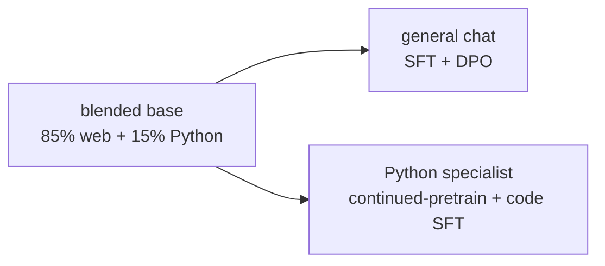

# aksharallm

**Build a language model from scratch — data, tokenizer, architecture, pretraining, and
post-training — on one RTX 3090.**

Every core piece is written by hand in PyTorch and commented to explain *why*, not just
what. Libraries are used only for plumbing (downloading datasets, the BPE trainer). If
you read this repo top to bottom you will know how an LLM actually works.

```
                    ┌──────────┐
  raw web text ───▶ │ TOKENIZE │ ───▶ 400M–10B integers on disk
                    └──────────┘
                          │
                          ▼
                    ┌──────────┐
                    │ PRETRAIN │ ───▶ base model: completes text, knows facts,
                    └──────────┘      cannot hold a conversation
                          │
                          ▼
                    ┌──────────┐
                    │   SFT    │ ───▶ chat model: follows instructions
                    └──────────┘
                          │
                          ▼
                    ┌──────────┐
                    │   DPO    │ ───▶ aligned model: prefers better answers
                    └──────────┘
```

---

## Does it work?

Phase 1 (a 13.8M-parameter model trained on TinyStories for ~25 minutes) writes this:

> *Once upon a time, there was a little girl named Lily. She loved to play outside in the
> sunshine. One day, she went for a walk with her mommy and saw a big hill.*
> *"Mommy, what's that?" she asked.*
> *"It's a mountain," her mommy replied.*

Nothing in that sentence was programmed. The model learned grammar, dialogue punctuation,
and narrative structure purely from predicting the next token.

---

## Quickstart

Requires: Linux, an NVIDIA GPU (24 GB recommended), Python 3.11+, and
[uv](https://github.com/astral-sh/uv).

```bash
git clone <this repo> && cd aksharallm
uv venv --python 3.12
uv pip install -e .

# 1. Download + tokenize ~400M tokens of TinyStories   (~90 seconds)
python -m aksharallm.data.prepare tinystories \
    --out-dir data/tinystories --vocab-size 8192 --max-train-tokens 400000000

# 2. Pretrain a 13.8M-param model                       (~25 minutes on a 3090)
python -m aksharallm.train.pretrain configs/tiny.yaml

# 3. Talk to it
python -m aksharallm.infer.cli checkpoints/tiny/ckpt_best.pt \
    --prompt "Once upon a time"
```

That's the entire loop, end to end. Everything after this is the same code with bigger
numbers.

---

## The documentation

Read these in order. They assume no prior knowledge of machine learning.

| # | Doc | What you'll learn |
|---|-----|-------------------|
| 0 | [What we're building](docs/00-overview.md) | What an LLM is, the four training stages, why each exists |
| 1 | [Data](docs/01-data.md) | Where text comes from, why quality beats quantity, the on-disk format |
| 2 | [Tokenizer](docs/02-tokenizer.md) | Why models read "tokens" not letters, how BPE works |
| 3 | [The model](docs/03-model.md) | Attention, RoPE, SwiGLU, residual streams — every line of the transformer |
| 4 | [Pretraining](docs/04-pretraining.md) | The training loop, mixed precision, LR schedules, reading the logs |
| 5 | [Post-training](docs/05-posttraining.md) | SFT and DPO — turning a text completer into an assistant |
| 6 | [Inference](docs/06-inference.md) | KV caches, sampling, temperature and top-p |
| 7 | [Scaling up](docs/07-scaling.md) | Phase 2: a 300M model on 10B tokens, and how to size your own |
| 8 | [Troubleshooting](docs/08-troubleshooting.md) | Loss spikes, NaNs, OOM, slow training |

---

## Repo layout

```
aksharallm/
├── configs/              YAML run configs — the only thing that changes between runs
│   ├── tiny.yaml         Phase 1: 13.8M params, TinyStories
│   ├── small.yaml        Phase 2 (pure): 300M params, FineWeb-Edu only
│   └── small-code.yaml   Phase 2 (blended): 300M, 85% FineWeb-Edu + 15% Python
├── aksharallm/
│   ├── config.py         dataclass config loading + CLI overrides
│   ├── tokenizer/        byte-level BPE training and the chat template
│   ├── data/
│   │   ├── prepare.py        pretraining corpus  -> uint16 token stream
│   │   ├── prepare_blend.py  several corpora     -> blended tokenizer + per-source bins
│   │   ├── prepare_sft.py    chat corpus         -> packed blocks + loss mask
│   │   ├── prepare_dpo.py    preference corpus   -> (chosen, rejected) pairs
│   │   └── loader.py         memmap batch sampling (TokenDataset, MixedTokenDataset)
│   ├── model/
│   │   └── transformer.py    the whole architecture, ~300 lines
│   ├── train/
│   │   ├── pretrain.py       next-token prediction (single- or blended-source)
│   │   ├── sft.py            instruction tuning
│   │   ├── dpo.py            preference tuning
│   │   └── schedule.py       learning-rate schedules
│   ├── eval/evaluate.py  perplexity, HellaSwag, sample generations
│   └── infer/
│       ├── generate.py   KV-cache sampling loop
│       └── cli.py        interactive chat / completion
├── skills/               task playbooks (prepare, pretrain, post-train, eval, scale, debug)
├── tests/                correctness tests (KV cache, causality, RoPE, mixing, DPO)
├── docs/                 the guide above
└── AGENTS.md             project brief: state, plan, gotchas
```

---

## The plan: one blended base → two models

**Phase 1 — `configs/tiny.yaml`.** 13.8M params, TinyStories, ~25 minutes. The point is
not the model; it's proving every stage of the pipeline works before you spend a week of
GPU time. Always start here after changing anything.

**Phase 2 — `configs/small-code.yaml`.** ~300M params, ~10B tokens of **85% FineWeb-Edu +
15% Python**, roughly 6 days on a 3090. Blending code into pretraining means one run yields
a base that both chats (after SFT/DPO) and codes (after Python continued-pretraining) — and
code also improves general reasoning. See [docs/07-scaling.md](docs/07-scaling.md) and
[skills/scale-and-specialize.md](skills/scale-and-specialize.md).
(`configs/small.yaml` is the pure-FineWeb-Edu fallback.)



Both use identical code. Only the config differs.

---

## Hardware notes

Measured on an RTX 3090 (24 GB):

| | Phase 1 (13.8M) | Phase 2 (~300M) |
|---|---|---|
| throughput | 460k tok/s | ~19k tok/s (est.) |
| MFU | 50% | ~45% (est.) |
| VRAM | 3.6 GB | ~20 GB |
| wall clock | 25 min | ~6 days |

`torch.compile` is worth 1.7× throughput *and* lowers memory — leave it on.

**Disk is usually the real constraint**, not VRAM. Tokenized data is 2 bytes/token:
10B tokens = 20 GB, and the raw download is larger. Check `df -h` before Phase 2.

---

## Running the tests

```bash
uv pip install pytest && python -m pytest tests/ -q
```

The KV-cache test is the one that matters: it asserts that token-by-token generation
reproduces a full-sequence forward pass exactly. A bug there gives you a model that
trains perfectly and generates garbage.

---

## Credits and further reading

This follows the path laid down by Karpathy's
[nanoGPT](https://github.com/karpathy/nanoGPT), with a modern Llama-style architecture.
Key papers: [Attention Is All You Need](https://arxiv.org/abs/1706.03762),
[RoFormer (RoPE)](https://arxiv.org/abs/2104.09864),
[GLU Variants (SwiGLU)](https://arxiv.org/abs/2002.05202),
[Chinchilla](https://arxiv.org/abs/2203.15556),
[DPO](https://arxiv.org/abs/2305.18290).
