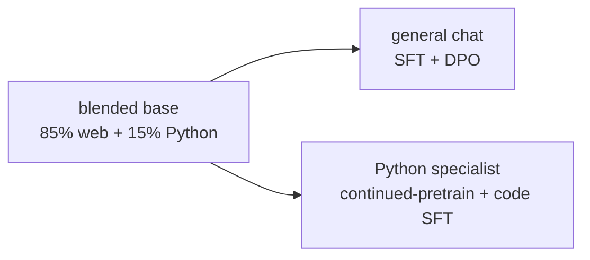
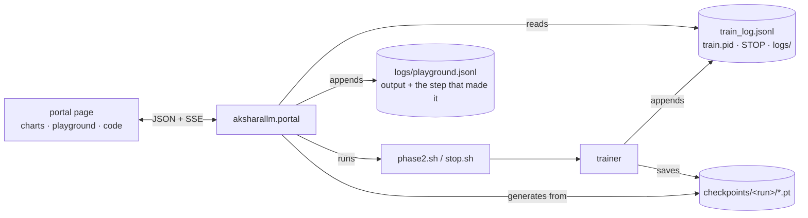

# aksharallm

> **akshara** (अक्षर), Sanskrit — a *letter*, *syllable*, or *character*: the smallest unit
> of written language. It also means *imperishable*. A fitting name for a model built up from
> the smallest pieces of text, one token at a time.

**Build a language model from scratch — data, tokenizer, architecture, pretraining, and
post-training — on one RTX 3090.**

Every core piece is written by hand in PyTorch and commented to explain *why*, not just
what. Libraries are used only for plumbing (downloading datasets, the BPE trainer). If
you read this repo top to bottom you will know how an LLM actually works.

```
                    ┌──────────┐
  raw web text ───▶ │ TOKENIZE │ ───▶ 400M–10B integers on disk
                    └──────────┘
                          │
                          ▼
                    ┌──────────┐
                    │ PRETRAIN │ ───▶ base model: completes text, knows facts,
                    └──────────┘      cannot hold a conversation
                          │
                          ▼
                    ┌──────────┐
                    │   SFT    │ ───▶ chat model: follows instructions
                    └──────────┘
                          │
                          ▼
                    ┌──────────┐
                    │   DPO    │ ───▶ aligned model: prefers better answers
                    └──────────┘
                          │
                          ▼
                    ┌──────────┐
                    │  GRPO    │ ───▶ specialist: RL on a reward you can *run*
                    └──────────┘      (code passes its tests)
```

---

## Does it work?

Phase 1 (a 13.8M-parameter model trained on TinyStories for ~25 minutes) writes this:

> *Once upon a time, there was a little girl named Lily. She loved to play outside in the
> sunshine. One day, she went for a walk with her mommy and saw a big hill.*
> *"Mommy, what's that?" she asked.*
> *"It's a mountain," her mommy replied.*

Nothing in that sentence was programmed. The model learned grammar, dialogue punctuation,
and narrative structure purely from predicting the next token.

---

## Quickstart

Requires: Linux, an NVIDIA GPU (24 GB recommended), Python 3.11+, and
[uv](https://github.com/astral-sh/uv).

```bash
git clone <this repo> && cd aksharallm
uv venv --python 3.12
uv pip install -e .

# 1. Download + tokenize ~400M tokens of TinyStories   (~90 seconds)
python -m aksharallm.data.prepare tinystories \
    --out-dir data/tinystories --vocab-size 8192 --max-train-tokens 400000000

# 2. Pretrain a 13.8M-param model                       (~25 minutes on a 3090)
python -m aksharallm.train.pretrain configs/tiny.yaml

# 3. Talk to it
python -m aksharallm.infer.cli tiny --prompt "Once upon a time"

# 4. See what it can and cannot do yet
python -m aksharallm.infer.cli tiny --probes
```

That's the entire loop, end to end. Everything after this is the same code with bigger
numbers.

---

## The documentation

Read these in order. They assume no prior knowledge of machine learning.

Every chapter ends with **"The code, in reading order"** — the `.py` files it explains,
listed in the order that makes them make sense, with what to look at inside each and the
test that pins it. It points the other way too: every module's docstring names the chapter
it belongs to (`Read with: docs/03-model.md`), so a file you land in from a traceback or a
grep is one line away from the prose. `tests/test_docs.py` fails if either pointer rots.

| # | Doc | What you'll learn |
|---|-----|-------------------|
| 0 | [What we're building](docs/00-overview.md) | What an LLM is, the four training stages, why each exists |
| 1 | [Data](docs/01-data.md) | Where text comes from, why quality beats quantity, the on-disk format |
| 2 | [Tokenizer](docs/02-tokenizer.md) | Why models read "tokens" not letters, how BPE works |
| 3 | [The model](docs/03-model.md) | Attention, RoPE, SwiGLU, residual streams — every line of the transformer |
| 4 | [Pretraining](docs/04-pretraining.md) | The training loop, mixed precision, LR schedules, reading the logs |
| 5 | [Post-training](docs/05-posttraining.md) | SFT, DPO, and **GRPO** (RL on a verifiable reward) — text completer → assistant → code/math specialist |
| 6 | [Inference](docs/06-inference.md) | KV caches, sampling, and how to tell whether a half-trained model is learning |
| 7 | [Scaling up](docs/07-scaling.md) | Phase 2: a 300M model on 10B tokens, and how to size your own |
| 8 | [Troubleshooting](docs/08-troubleshooting.md) | Loss spikes, NaNs, OOM, slow training |
| 9 | [Running & watching it](docs/09-running-and-watching.md) | The scripts, stop/resume, the gated post-training stages, and the **portal** — with diagrams |
| 10 | [Quantization](docs/10-quantization.md) | Storing weights in 4 bits: group scales, RTN/GPTQ/AWQ/QAT, **NF4**, a fused Triton kernel, and why smaller isn't faster |
| 11 | [LoRA & QLoRA](docs/11-lora.md) | Fine-tuning without training the model: low-rank adapters, a 4-bit frozen base, one base + many skills, and a free DPO reference model |
| 12 | [Evaluation](docs/12-eval.md) | Is the model actually any good? MMLU/ARC/HellaSwag/PIQA scored by log-likelihood, GSM8K, HumanEval executed for real, an LLM-judge — and why 25% on MMLU is not a failure |
| 15 | [The learning path](docs/15-learning-path.md) | The repo as a course: nineteen lessons that each end in breaking real code and watching a real test go red — and why a lesson only counts once the check has been red *and then* green |
| 14 | [Mixture of experts](docs/14-moe.md) | More parameters than you compute with: a router, N experts, top-k per token — the load-balancing loss, why upcycling is an identity at init, and the collapse that is invisible in the loss curve |
| 17 | [Looking inside](docs/17-interpretability.md) | Attention maps recomputed from the layer's own inputs, the logit lens (*when* did it decide?), activation patching (which activation actually carries the fact), and a sparse autoencoder that pulls apart superposition |
| 16 | [Serving](docs/16-serving.md) | Turning a checkpoint into something you use: a paged KV cache so memory is bounded by what is *used*, continuous batching so thirty conversations share one pass over the weights (50 → 272 tok/s), and an OpenAI-shaped API so existing clients work |
| 13 | [Synthetic data](docs/13-synthetic-data.md) | Making the training set with a local teacher instead of downloading it: a seed grid instead of a temperature, tests that are **executed twice**, near-duplicate detection, and why the rejection tally is the quality signal |
| 18 | [Long context](docs/18-long-context.md) | Reading further than the weights were trained for, without retraining anything: RoPE scaling (linear/NTK/YaRN), sliding windows and why they need attention sinks, and the two measurements — loss by position and needle-in-a-haystack — that disagree |
| 19 | [Diffusion](docs/19-diffusion.md) | The *other* way to build a language model: fill in blanks with attention running both ways, and generate by unmasking what you are surest about. Infilling, a compute dial, no KV cache — and the ELBO you must never compare with a cross-entropy |
| 20 | [Audio](docs/20-audio.md) | The same transformer, on sound: an RVQ-VAE codec that turns speech into fifty integers a second, the delay pattern that keeps eight codebooks honest in one stream, and TTS/ASR as one model with the sequence written in two orders — plus the bitrate ladder you judge with your ears |
| 21 | [Vision](docs/21-vision.md) | A picture into a model that has never seen one: patches instead of a codec, a two-layer projector that is the whole of LLaVA, and a corpus whose captions are known exactly so the answer can be *scored* rather than admired — plus the double shift that trained to a loss of 0.003 and captioned everything `'w green'` |

---

## Repo layout

```
aksharallm/
├── configs/              YAML run configs — the only thing that changes between runs
│   ├── tiny.yaml         Phase 1: 13.8M params, TinyStories
│   ├── small.yaml        Phase 2 (pure): 300M params, FineWeb-Edu only
│   ├── small-code.yaml   Phase 2 (blended): 300M, 85% FineWeb-Edu + 15% Python
│   ├── tiny-moe.yaml     the MoE experiment: tiny.yaml + 8 experts, matched active params
│   ├── codec-synth.yaml  the audio codec on synthetic babble — no download, ~4 minutes
│   ├── codec-lj.yaml     the audio codec on LJSpeech: 24 h of one reader
│   └── audiolm-synth.yaml  a language model over codec tokens
├── aksharallm/
│   ├── config.py         dataclass config loading + CLI overrides
│   ├── tokenizer/        byte-level BPE training and the chat template
│   ├── data/
│   │   ├── prepare.py        pretraining corpus  -> uint16 token stream
│   │   ├── prepare_blend.py  several corpora     -> blended tokenizer + per-source bins
│   │   ├── prepare_sft.py    chat corpus         -> packed blocks + loss mask
│   │   ├── prepare_dpo.py    preference corpus   -> (chosen, rejected) pairs
│   │   └── loader.py         memmap batch sampling (TokenDataset, MixedTokenDataset)
│   ├── model/
│   │   ├── transformer.py    the whole architecture, ~300 lines
│   │   ├── moe.py            mixture of experts: router, sorted dispatch, upcycling — docs/14
│   │   ├── flash.py          FlashAttention in Triton, fwd + bwd (model.attn_impl) — docs/03
│   │   └── rope.py           RoPE scaling: linear / NTK / YaRN / dynamic — docs/18
│   ├── longctx/          extend a context and measure it — see docs/18
│   ├── diffusion/        masked diffusion: the OTHER paradigm — see docs/19
│   │   ├── corrupt.py        the forward process and the 1/t-weighted ELBO
│   │   ├── generate.py       iterative unmasking, infilling, the denoising trace
│   │   ├── evaluate.py       the ELBO (an upper bound) and loss-by-mask-rate
│   │   └── objective.py      a drop-in for pretrain.py's objective — no second trainer
│   ├── audio/            a second MODALITY, on the same transformer — see docs/20
│   │   ├── io.py             WAV in/out and a windowed-sinc resampler, from scratch
│   │   ├── features.py       STFT, the mel filterbank, Griffin-Lim back to sound
│   │   ├── vq.py             vector quantization: straight-through, EMA, dead-code restart
│   │   ├── codec.py          the RVQ-VAE and its multi-scale spectral loss
│   │   ├── delay.py          the shift that turns 8 codebooks into one stream
│   │   ├── lm.py             the SAME Transformer, 8 embeddings in and 8 heads out
│   │   └── speech.py         TTS and ASR: one model, one flag apart
│   ├── vision/           a second modality that needs no codec — see docs/21
│   │   ├── image.py          a shapes corpus whose captions are known exactly
│   │   ├── encoder.py        patches, a small ViT, and the LLaVA projector
│   │   └── lm.py             a FROZEN language model with a picture on its input
│   ├── quant/            int8/int4/NF4 from scratch — see docs/10
│   ├── lora/             LoRA + QLoRA adapters from scratch — see docs/11
│   │   ├── qtensor.py        group scales, zero-points, 4-bit packing
│   │   ├── qlinear.py        QuantLinear: a drop-in for nn.Linear that stores bytes
│   │   ├── rtn.py            round-to-nearest baseline
│   │   ├── calib.py          forward hooks: Hessians and per-channel activation energy
│   │   ├── gptq.py           Hessian-guided error compensation
│   │   ├── awq.py            activation-aware scaling, folded into the preceding op
│   │   ├── qat.py            straight-through estimator + fine-tune loop
│   │   ├── kernels.py        fused dequantize-and-matmul, in Triton
│   │   └── convert.py        model surgery, save/load quantized checkpoints
│   ├── train/
│   │   ├── pretrain.py       next-token prediction (single- or blended-source)
│   │   ├── sft.py            instruction tuning
│   │   ├── dpo.py            preference tuning
│   │   ├── schedule.py       learning-rate schedules
│   │   ├── stopfile.py       the STOP contract: stop now / at step N / at a wall-clock time
│   │   │                     — shared by pretraining, SFT and QAT
│   │   ├── runlog.py         reads train_log.jsonl back (sessions, series) — shared by
│   │   │                     scripts/sessions.py and the portal
│   │   └── report.py         the report every trainer writes when it exits: how the run
│   │                         went, and what is worth knowing about how it went
│   ├── portal/           local web portal: start/stop a run, watch it, test it, read it
│   │   ├── runs.py           run state on disk; drives phase2.sh / stop.sh
│   │   ├── schedule.py       recurring start/stop windows + the clock loop
│   │   ├── gpu.py            nvidia-smi sampling, history, training-vs-idle summary
│   │   ├── cost.py           energy ledger + what each run cost in electricity
│   │   ├── explain.py        source browser + a local Ollama model that explains it
│   │   ├── evals.py          benchmark jobs; shells out to `python -m aksharallm.eval`
│   │   ├── synth.py          generation jobs; shells out to `python -m aksharallm.synth`
│   │   ├── learn.py          the Learn tab: lessons, gating, and running their checks
│   │   ├── server.py         stdlib http.server + a small JSON API
│   │   └── static/           the client: no build step, no framework, no dependencies
│   │       ├── index.html        the shell; server fills its <!--#include --> markers
│   │       ├── parts/<tab>.html  markup, one file per view
│   │       ├── js/<tab>.js       ES modules, one per view (+ core/state/router/charts)
│   │       └── css/<tab>.css     rules, one per view (+ base/chrome/controls/narrow)
│   ├── learn/            the learning path: lessons, gating, checks — see docs/15
│   │   ├── lessons.py        frontmatter, the prereq graph, and the anti-rot validation
│   │   ├── progress.py       learning/progress.json + the red-then-green completion rule
│   │   └── check.py          run one pytest node id, report what it said
│   ├── synth/            generating training data with a local teacher — see docs/13
│   │   ├── prompts.py        the seed grid: 480 / 1,296 structurally different prompts
│   │   ├── recipes.py        python / chat / preference: prompt, parser, export
│   │   ├── filters.py        validity checks + shingle-based near-duplicate detection
│   │   ├── verify.py         run the generated tests, then run them against a stub
│   │   ├── dataset.py        data/synth/<name>/: samples, rejects, provenance
│   │   └── run.py            the loop, its budgets, and the STOP file
│   ├── eval/             the benchmark harness — see docs/12
│   │   ├── sources.py        download benchmarks once into data/eval/, then work offline
│   │   ├── suites.py         what each benchmark asks, and how an answer is judged right
│   │   ├── scoring.py        batched log-likelihood, greedy decode-until, perplexity
│   │   ├── judge.py          twelve open prompts graded 1-5 by a local Ollama model
│   │   ├── runner.py         run suites against a checkpoint; one JSON per evaluation
│   │   └── report.py         every result ever, and the trend across training steps
│   ├── interp/           looking inside a trained model — docs/17
│   │   ├── capture.py        hooks for the residual stream; attention maps, recomputed
│   │   ├── lens.py           the logit lens: what each layer would have said
│   │   ├── patch.py          activation patching: which activation carries the fact
│   │   └── sae.py            a sparse autoencoder over the residual stream
│   ├── serve/            an HTTP server: paged KV cache, continuous batching — docs/16
│   │   ├── paged.py          blocks, block tables, reference-counted prefix sharing
│   │   ├── batch.py          the ragged step: prefill and decode together, admission control
│   │   └── server.py         OpenAI-shaped endpoints, SSE streaming, /health
│   └── infer/            talking to a checkpoint, and judging what comes back
│       ├── generate.py       KV-cache sampling loop (streaming + one-shot)
│       ├── speculative.py    guess several tokens, check them in one pass; same text,
│       │                     ~1.5-2x faster, and the draft need not be a model at all
│       ├── checkpoints.py    what has been trained: step, loss, stage, tokens seen
│       ├── engine.py         one model kept warm; CPU while a run has the GPU
│       ├── tasks.py          the fixed probes and the graded Python tasks
│       ├── sandbox.py        runs the Python the model wrote, under limits
│       ├── history.py        every generation + the training state that produced it
│       ├── playground.py     the four above in the order both front ends use
│       └── cli.py            completion / chat / code, probes, tasks, comparisons
├── docs/lessons/         the course: one markdown file per lesson, with frontmatter
├── scripts/
│   ├── phase1.sh         Phase 1 end to end (data -> pretrain -> generate), ~30 min
│   ├── phase2.sh         Phase 2: pre-flight, build data, smoke test, background launch
│   ├── stop.sh           stop a background run cleanly: now, after N steps, or at a time
│   ├── portal.sh         the web portal (progress, graphs, start/stop); --lan to share
│   ├── schedule.sh       recurring start/stop windows ("22:00-06:30, mon-fri")
│   ├── gpu.sh            GPU utilisation/memory/temp/power, now and over time
│   ├── sessions.py       per-session summary of a run trained over many evenings
│   └── postrain.sh       Phase 3: SFT then DPO
├── tests/                correctness tests (KV cache, causality, RoPE, mixing, DPO)
└── docs/                 the guide above
```

---

## The plan: one blended base → two models

**Phase 1 — `configs/tiny.yaml`.** 13.8M params, TinyStories, ~25 minutes. The point is
not the model; it's proving every stage of the pipeline works before you spend a week of
GPU time. Always start here after changing anything.

**Phase 2 — `configs/small-code.yaml`.** ~300M params, ~10B tokens of **85% FineWeb-Edu +
15% Python**, roughly 6 days on a 3090. Blending code into pretraining means one run yields
a base that both chats (after SFT/DPO) and codes (after Python continued-pretraining) — and
code also improves general reasoning. See [docs/07-scaling.md](docs/07-scaling.md).
(`configs/small.yaml` is the pure-FineWeb-Edu fallback.)



Both use identical code. Only the config differs.

Six days of compute needn't be six days of calendar. `scripts/phase2.sh` launches in the
background and records its pid; `scripts/stop.sh` stops it cleanly — now, after a set number
of steps, or at a time you name — and every stop saves at the exact current step, so
re-running resumes with no loss spike:

```bash
scripts/phase2.sh                       # launch (pid -> checkpoints/<run>/train.pid)
STOP_IN=3h scripts/phase2.sh            # ...for one evening, then save and exit
scripts/stop.sh small-code --status     # alive? at what step?
scripts/stop.sh small-code --after 500  # do 500 more steps, then save and exit
scripts/stop.sh small-code --in 20m     # stop twenty minutes from now
scripts/stop.sh small-code --by 06:30   # stop at half six (tomorrow, if it has passed)
scripts/stop.sh small-code              # stop now, gracefully
scripts/phase2.sh                       # resume where it left off
scripts/sessions.py small-code          # compare the sessions afterwards
```

A timed stop is a **deadline written into the run's STOP file**, which the trainer checks
every step — so it survives closing the terminal or restarting the portal, and stays true
if the run slows down. Nothing has to sit and watch the clock.

Each session gets its own `logs/<run>/train_<timestamp>.log` (never overwritten), and
`train_<run>.log` symlinks to the newest one.

### Making it smaller: quantization

A trained model is a few hundred million numbers stored in 16 bits each. Store them in 4
instead and the 300M model goes from **599 MB to 213 MB**. The trick is that weights come
in tightly clustered groups, so one shared scale per 64 weights lets each individual weight
be a 4-bit integer.

There are four ways to choose those integers, all written from scratch here — round to
nearest, [GPTQ](docs/10-quantization.md) (push each rounding error into the columns you
haven't done yet), AWQ (scale the channels that matter up before rounding), and
quantization-aware training (put the rounding inside the training loop). Measured on the
300M model, against a bf16 perplexity of 13.519:

| | size | perplexity |
|---|---|---|
| bf16 | 599 MB | 13.519 |
| int8 | 342 MB | 13.519 — **free** |
| int4, round-to-nearest | 213 MB | +0.253 |
| int4, GPTQ | 213 MB | **+0.163** |

There is also a hand-written Triton kernel that unpacks the 4-bit weights *inside* the
matmul, which makes decoding 1.6× faster than the naive quantized path. It still does not
beat plain bf16 — and the reason turned out to be the most interesting thing in the
chapter, so [it is written up honestly](docs/10-quantization.md#the-fused-kernel-and-an-honest-performance-story)
rather than quietly omitted.

A later addition, **NF4**: instead of spacing the 16 levels evenly, put them at the
quantiles of a normal distribution — which is what trained weights actually look like. It
is more accurate *and* smaller than int4 (no zero-point to store), and the levels are
derived from `erfinv` rather than pasted in from the paper.

### Changing it cheaply: LoRA and QLoRA

Fine-tuning a model normally costs far more than storing it, because Adam keeps two fp32
moments per trainable parameter. For the 300M model that is 4.8 GB — before activations,
and on a card that also has to hold the forward pass.

[LoRA](docs/11-lora.md) freezes the model and trains a small low-rank correction beside it
(`y = Wx + BAx`), so ~1% of the parameters train and the optimiser state shrinks with them.
**QLoRA** then holds the frozen base in 4-bit NF4 — safe precisely because it is frozen and
never receives a gradient. Measured on the 300M checkpoint:

| | to fine-tune | the artifact |
|---|---|---|
| full fine-tune | 4,791 MB | a whole new 1.2 GB checkpoint |
| LoRA r=8 | 1,253 MB | a 14 MB adapter |
| **QLoRA r=8** | **327 MB** | a 14 MB adapter |

And it costs almost nothing in quality: on the 13.8M model, identical data and schedule,
full fine-tuning reached val **1.2364**, LoRA **1.2425**, QLoRA **1.2433** — while training
2.5% of the parameters. (LoRA is *slower* in wall clock, though. It buys memory, not time,
and the chapter says so.)

Two consequences change how the project is shaped. A specialisation becomes a **file**, not
a model — one base plus a chat adapter and a Python adapter, swapped at inference, instead
of two 1.2 GB checkpoints. And DPO's frozen reference model becomes **free**: switch the
adapter off and the model you are already holding *is* the model you started from.

### What comes after that

In order, all written from scratch: **GRPO** ✅ (RL on a reward the code sandbox actually
verifies) → **quantization** ✅ → **LoRA/QLoRA** ✅ → a **real eval harness** ✅ (MMLU, ARC,
HellaSwag, PIQA, GSM8K, HumanEval and a model-judged suite — [docs/12](docs/12-eval.md)) →
**synthetic data** ✅ ([docs/13](docs/13-synthetic-data.md)) → **mixture of experts** ✅
([docs/14](docs/14-moe.md)) → **distillation** → **diffusion training** ✅
([docs/19](docs/19-diffusion.md)) → **audio** → export and serving ✅, with **speculative
decoding** ✅, an **interpretability tab** ✅, **FlashAttention written in Triton** ✅
([docs/03](docs/03-model.md)) and **long context** ✅ ([docs/18](docs/18-long-context.md)).

**Masked diffusion** is the one item on that list that is not an improvement to the model —
it is a second *paradigm*. Everything else here predicts token n+1 from tokens 1..n; a
diffusion model is trained to fill in blanks with attention running both ways, and generates
by unmasking the positions it is most confident about first. Watching a sentence resolve out
of a row of `▁` is the best thing in the repo to look at, and it makes the point that no
prose does: the model committed the comma and the full stop before it had decided what the
sentence was about. It costs 3–16x the compute of next-token prediction for equal quality,
so it runs at 13.8M as a controlled comparison and never as the main model. What it buys is
**infilling** — give it a prefix *and* a suffix and it writes the middle, which an
autoregressive model cannot do at all — and a **compute dial**: 48 tokens in 16 forward
passes, or in 4, at whatever quality that costs. Its validation loss is an ELBO **upper
bound** and must never be put in a table beside an autoregressive cross-entropy.

**Long context** turned out to be the cheapest big win in the whole list, because RoPE has
no parameters: extending a trained model's context is arithmetic, not training. Ask our 300M
about token 4,000 and it does not get vaguer, it falls off a cliff — position is encoded as a
rotation *angle*, and past the trained window it is being handed angles it has never seen.
Three one-line fixes exist, and we measured all of them on our own checkpoints. On the 300M,
**doubling the context with NTK-aware scaling cost nine thousandths of a nat** — in-window
loss 2.356 → 2.365 — while linear interpolation, the obvious approach, took it to 3.035 to
buy the same range. At 4x the methods separate: NTK grows a cliff of its own at 3,584 and
YaRN holds all the way out.

And it is not just perplexity. Extended 4x with YaRN, the 300M finds a fact hidden anywhere
in a 4,096-token haystack **92.5% of the time against a 25% chance line** — four times the
window its weights ever saw, with no fine-tune. The grid even reproduces the published shape:
a needle near the end is found every time, one at the very front of a long context drops to
33%.

The part worth keeping is the measurement, because the two halves disagree. Perplexity by
position says whether the model is still *fluent* out there; the needle test says whether it
can still *retrieve*. A sliding window scores the best perplexity of anything we tried and is
structurally blind past its window. And our 13.8M, extended identically, sits at chance on the
needle — same legible positions, no retrieval, because it never learned any. Scaling makes
distant positions legible; using them is a capability, and capabilities come from training.
Both numbers are published rather than only the good one.

The FlashAttention kernel is the one with the most surprising answer. Forward and backward,
in Triton, from the online-softmax rescale up — and it reaches **parity with PyTorch's SDPA
on the forward from T=2048** (1.02×) while staying ~20% behind on the backward, which is
what you should expect when the thing you are racing is FlashAttention-2 in hand-written
PTX. End to end on the 300M it costs 1.1 points of MFU, so the default stays `sdpa` and the
file exists to be read. The number worth keeping is the other column: at T=8192 it runs in
**422 MB where the naive `(T,S)`-matrix version cannot run at all**. That is the whole
point of the algorithm, and it survives being written by hand.

The mixture of experts is the first of those with a measured answer. Run at Phase 1 scale
against the dense baseline — same data, seed, batch, steps, and **the same FLOPs per token**,
because each expert is `d_ff/k` wide rather than a full copy — 8 experts at top-2 reached
val **1.4081** against the dense **1.4764**, a 4.6% improvement that *widened* throughout
training. It stores 35.0M parameters to compute with 7.1M of them: memory traded for quality
at fixed compute, which is the exact opposite of the trade [quantization](docs/10-quantization.md)
makes. The cost is MFU falling from ~57% to 52%, because a sort and eight small matmuls use
the card less well than one big one.

What makes it work is the part that has nothing to do with experts: a **load-balancing loss**
and a routing chart. Without them a few experts win early, take all the gradient, and the
rest never train — and the loss curve looks completely normal while it happens.

The harness came before the last four deliberately. Mixture of experts, synthetic data and
distillation are all changes to model *quality*, and validation loss either cannot see them
or reports them backwards — training on generated text is the easiest way to improve a loss
curve while making a model worse. You need the instrument before you run the experiment.

And the instrument itself gets checked. Two things every score above quietly assumed are now
measured. **Contamination**: if a question and its answer already sit in the ten billion
tokens the model trained on, a right answer means nothing — so every benchmark item is
checked for a shared run of 13 tokens against the whole corpus, counting the *question*
(public text, usually harmless) separately from the *question with its answer attached* (the
one that matters), with a `--against` flag that re-scores a result with the leaked items
dropped. **Per-domain loss**: the blended run reports one validation number over 85% prose
and 15% Python, and splitting it shows Python at perplexity **3.5** against prose's **16.0**
— the model's code ability was almost invisible in an average that is 85% prose. The two
halves blend back to 2.5425 against the run's own 2.5552, which is what says the split was
taken in the right place.

**Synthetic data**, built next, turned out to be mostly *filters*. A local teacher writing
exercises is four lines; the package around it exists because generated data is the easiest
way to make a model worse while its loss improves. So the Python recipe runs the tests the
teacher wrote — and then runs them again against a stubbed solution, because tests that pass
with the function's body removed prove nothing and look identical to real ones. Diversity
comes from a grid of 480 structurally different prompts rather than from a temperature, and
every dropped sample is counted by reason, because "30% survived" means three unrelated
problems depending on *which* filter took the rest. On this machine that loop paid for
itself immediately: reading the rejects showed a teacher writing correct solutions with
wrong expected values in the tests, one rule in the template fixed it, and the pass rate
went 25% → 58%.

Three of the others are worth explaining, because they are not the usual list.

**Diffusion training.** Everything above is autoregressive: predict the next token from the
ones before it. A masked diffusion language model throws that away — it corrupts a sequence
by masking tokens at random, learns to denoise it with *bidirectional* attention, and
generates by unmasking positions in any order until none are left. The whole training
objective is: mask each token with probability `t ~ U(0,1)`, run the model with the causal
mask off, and take cross-entropy on the masked positions weighted by `1/t`.

It will be trained at Phase 1 scale (13.8M params, TinyStories) against the autoregressive
baseline that is already there — same data, same size, same budget. Not because it will win:
masked diffusion needs several times the compute of autoregression to reach the same
quality. It is there because it can do two things autoregression structurally cannot —
**infilling** (given a prefix *and* a suffix, write the middle) and **parallel generation**
(watch a whole sequence resolve from all-masked to text in about 32 steps).

**Audio.** The transformer does not care what its tokens mean, and audio is the cheapest
honest way to prove it: no new architecture, just a new tokenizer. A small autoencoder learns
to squeeze a waveform down to 50 frames a second and quantize each frame against a learned
codebook — and once sound is a sequence of integers, the *existing* model, training loop, KV
cache, sampler, quantizer and LoRA work on it unchanged. Then it can be taught to speak (text
in, audio tokens out, reusing the same loss mask that makes SFT train on the assistant's turn
only) and to listen (audio in, text out), where word error rate on LibriSpeech gives a number
anyone can check.

The failure to watch for is one this repo has already met: **a few codebook entries win, the
rest are never used, and the reconstruction loss looks completely normal while it happens** —
which is [mixture of experts](docs/14-moe.md)' router collapse wearing a different hat, down
to reusing the same chart. The reward is something you can hear rather than read: the same
clip rebuilt from 1, 2, 4 and 8 codebooks, played side by side. That is the same trade
[quantization](docs/10-quantization.md) makes silently inside the weights, made audible.

**A learning path.** This repo is meant to be learned from, and right now the docs are a
reading order with nothing to do. The plan is a set of lessons that each pair a doc section
with an exercise and a check that has to go from red to green — usually *break this on
purpose and watch what fails.* The best material is already in the repo's own history: the
silent data-truncation bug, and the masking bug that trained perfectly and generated
nonsense. Lessons will reference files rather than line numbers, and each one's check is a
real test in the suite — so if a lesson goes stale, the test run says so.

### Watching it in a browser

```bash
scripts/portal.sh --bg --lan    # background, reachable from your phone; prints the address
scripts/portal.sh --status      # running? which pid, which address
scripts/portal.sh --restart     # stop and start again (never touches a training run)
```

A local page with the progress against the budget and an ETA, live loss / throughput /
gradient-norm / LR curves (drag sideways across one to zoom into that stretch of steps —
the y-axis refits to the window; double-click to go back), the per-session table, the tail
of the log, and buttons for start (with a budget for the session), stop now, and a **Stop
at…** dialog where you pick steps or time from presets — 1 / 5 / 10 / 30 min, 1 / 2 / 4 h —
or a logarithmic dial, and read what it means before committing: which step it lands on,
what time it finishes, how many checkpoints happen on the way. Five tabs, each with its own
address so a view can be bookmarked: **Dashboard** (the run), **Playground** (talk to the
checkpoint it is producing), **Code** (have the source explained to you), **Quantize**
(make it 4-bit and measure what that cost) and **Docs** (read this guide in the browser,
diagrams and all).

It is a **view over the same files**, and it presses the same buttons: it starts runs with
`scripts/phase2.sh` and stops them with `scripts/stop.sh`, so a run launched from a terminal
appears in the portal and vice versa — including while it is still in pre-flight — and
closing the portal never stops training. Standard library only: the server is `http.server`,
the charts are hand-written SVG.

### Testing the model while it is still training

A loss curve tells you the number is going down. It does not tell you whether the model can
finish a sentence. The portal's **Playground** tab — and the same thing from a terminal —
lets you ask it:

```bash
python -m aksharallm.infer.cli                    # what has been trained so far
python -m aksharallm.infer.cli small-code         # talk to it
python -m aksharallm.infer.cli small-code --probes   # the fixed prompt suite
python -m aksharallm.infer.cli small-code --tasks    # Python tasks, actually executed
python -m aksharallm.infer.cli --compare fluency     # that prompt, across every step
```

Three things make it useful rather than a toy:

**It will not cost you the run.** A Phase-2 run holds ~21 GB of a 24 GB card. The model
would fit in the gap, but a CUDA context is half a gigabyte before any weights land and the
failure mode is a six-day run dying overnight. So while a run is training, inference loads
on the **CPU**, automatically, and the tab says why. The card is used the moment it is free.

**It knows what the checkpoint can do.** A base model has never seen a chat turn, so chat is
disabled on one — with that sentence, rather than letting you conclude the model is broken.

**The record outlives the checkpoint.** `ckpt_last.pt` is overwritten every 500 steps.
Rather than archive 1.2 GB of weights forty times, every generation appends a line to
`logs/playground.jsonl` carrying the step, validation loss and tokens seen of the model that
produced it — so the same prompt at step 7,000 and step 30,000 sit side by side for about a
kilobyte. That comparison is what `--compare` and the tab's history panel show.

The Python tasks are graded by **executing** the generated function against asserts, in a
subprocess with CPU-time and memory limits, isolated from this project's code, in a
throwaway directory. It is not a container — see `aksharallm/infer/sandbox.py`, which is
honest about what the containment is and is not — and `infer.run_tests: false` turns it off.

### Reading the code with a local model

The portal's third tab is a source browser for this repo with an explainer attached: pick a
file, highlight a line or a block, and a model running on your own machine through
[Ollama](https://ollama.com) tells you what it does, why it is written that way, and what
would bite you if you changed it. Follow-up questions keep the thread; the answer streams in
as it is generated.

```bash
ollama serve && ollama pull gemma4:12b   # once
scripts/portal.sh --open                 # then click "Code"
```

The model gets the selection *and* the whole enclosing file *and* a primer on the project,
which is what lets it answer "why" rather than just paraphrasing syntax. Which model, where
Ollama lives and how much of the machine it may use are all in `configs/portal.yaml`.

One thing to know: the explainer shares your GPU with training. A 12B model is ~8 GB of VRAM
against a Phase-2 run's ~21 GB of a 24 GB card, so the tab warns you when a run is live, and
`num_gpu: 0` keeps the explainer on the CPU where it cannot touch it. Details and the other
sharp edges are in `docs/07-scaling.md`.

### Watching the GPU

```bash
scripts/gpu.sh                  # now + a 1-hour summary, split into training vs idle
scripts/gpu.sh watch            # one line a second
```

The portal samples `nvidia-smi` every five seconds into `logs/gpu.jsonl` and charts
utilisation, memory, temperature and power, banding the periods when a run was training.
Since each sample records whether a trainer was alive, the summary splits into *while
training* vs *idle* — which is how you notice that the GPU sat at 40% all night, or that
something else was resident on it.

### What it cost

```bash
python -m aksharallm.portal.cost            # per run, today, all time, per 1M tokens
python -m aksharallm.portal.cost backfill   # fold telemetry taken before the ledger existed
```

The same power readings, integrated: energy per run, folded as it arrives into permanent
ten-minute buckets in `logs/energy.jsonl` (the telemetry file itself is a rolling buffer, so
a total read back from it would quietly shrink as old samples were trimmed). Give it a rate
in `configs/portal.yaml` — `cost.per_kwh`, plus `host_watts`/`psu_efficiency` if you want the
number to match a plug meter rather than the card alone — and every run gains a price, a cost
per million tokens, and a **coverage** figure saying how much of the run was actually
recorded. With no rate set it shows kilowatt-hours and says so. Portal: the **Cost** panel.

### Looking inside it

```bash
python -m aksharallm.interp lens small-code --prompt "The capital of France is"
python -m aksharallm.interp patch small-code --clean "The capital of France is" \
    --corrupt "The capital of Italy is" --answer " Paris" --other " Rome"
```

Or the portal's **Interp** tab. Four tools, and the reason they live together is that they
check each other.

A pre-norm transformer never rewrites its state — every block *adds* to a running total — so
the output head can be pointed at that total halfway through and asked what the model would
have said if it had stopped there. On the 300M at step 36,000, `"The capital of France is"`
is `' not'` at block 7, `' usually'` at block 15, `' the'` at block 19, and only at **block 20
of 24** does it become `' Paris'`. It changed its top token eleven times on the way.

That is an observation, and observations about neural networks are how you fool yourself. So
patching *intervenes*: run the corrupted prompt (`"...Italy is"`), force one activation back
to its clean value, and see whether `Paris` returns. On this model the answer is unusually
crisp — the country information sits **on the country token** through blocks 10–19 and moves
to the last position at **block 20**, exactly where the lens said the answer appeared.
Attention carries the fact forward; the final blocks read it out. Two independent methods
agreeing is what makes it a finding rather than a story.

Attention maps are *recomputed*, because the fused kernel never stores them — and since that
is a claim, the test asserts the recomputed weights times V reproduce the layer's own output.
And a **sparse autoencoder** pulls apart superposition: 8,192 features over a 1,024-wide
stream, trained in minutes on the card. The sparsity penalty is the whole game — at α 0.003 it
explains 97.5% of the variance with 200 features firing per token (the soup you started with),
at 0.02 half the dictionary is dead, and at **0.008 it explains 94% with fourteen**.

### Hearing it: the same transformer, on sound

```bash
python -m aksharallm.audio corpus --out data/audio/synth --clips 400   # no download
scripts/audio.sh codec-synth                                           # ~4 minutes
python -m aksharallm.audio reconstruct checkpoints/codec-synth/ckpt_best.pt \
    data/audio/synth/wavs/synth-0399.wav --codebooks 1,2,4,8
```

Or the portal's **Audio** tab, which plays all four against the original.

Nothing in `model/transformer.py` knows about words. Open it: it knows about integers, their
order, and a vocabulary size. So if something can turn a waveform into integers, the whole
stack — pretraining, RoPE, the KV cache, the sampler, quantization, LoRA — works on sound
without being told. That something is a **codec**, and it is the only new machinery here.

```
waveform  →  conv encoder  →  128 floats,  →  nearest codebook  →  8 integers,  →  the SAME
16,000/s     320× down        50 times/s      entry, 8 times        50 times/s     transformer
```

The arithmetic decides everything. 16,000 samples a second downsampled by 320 is **50 frames
a second**; eight codebooks of 1,024 entries is 80 bits a frame, so **4 kbps** against
256 kbps of raw audio — a 64× compression. And 50 × 8 is the sequence length the transformer
pays: ten seconds of speech is 4,000 tokens.

Inside the codec is a gradient that does not exist. Replacing a vector with the nearest of
1,024 learned ones is an `argmin`, and an `argmin` differentiates to zero almost everywhere —
so the encoder would never learn. The **straight-through estimator** is a deliberate lie:
`z + (q - z).detach()` is numerically the codebook entry, and differentiates as the identity.
Forward, the quantizer; backward, as though it were not there.

Because each codebook quantizes what the last one got *wrong*, the **prefix of a code is a
valid code** — decode one codebook instead of eight and you get a coarser but listenable
reconstruction. So bitrate is a dial you turn at decode time rather than a property of the
checkpoint, and the trade becomes something you *hear*. It is the same trade quantization
makes silently in the weights.

Above the codec, the language model gets eight integers per position instead of one. Flatten
them and the sequence is eight times longer; predict them in parallel and you have assumed
they are independent, when each is defined as a correction to the last. The **delay pattern**
shifts codebook *k* right by *k* frames, so a whole column can be predicted at once and each
codebook still sees the one below it in its context — `T + 7` positions instead of `8T`.

The transformer needed two optional arguments for all of this and nothing else.

**What is honest about the numbers.** ASR has a real metric (word error rate). TTS does not —
mean opinion score needs people. So what gets reported is mel-cepstral distortion plus *our
own ASR model's error rate on our own TTS output*, labelled **intelligibility**, because that
is what it measures. A synthesiser with a flat robotic monotone can score perfectly on it.

### Showing it a picture

```bash
python -m aksharallm.vision corpus --out data/vision/shapes --images 8000
python -m aksharallm.vision.train configs/vision-shapes.yaml     # minutes
```

Audio needed a codec to turn a waveform into integers. An image needs nothing of the sort —
it is already a grid of numbers, so cutting it into 8×8 patches produces a sequence
directly. What is left is a **bridge**, and the bridge is two matrices.

That is LLaVA, and its contribution was not an architecture. It was noticing that a *frozen*
language model will accept vectors from a vision encoder if you train a small MLP to put them
in the right place — because the model's input space is not a code to be cracked, it is a
space the model has already learned to read. Here: **0.82M trainable parameters against
13.77M frozen ones**, and the run is minutes rather than hours.

The corpus is rendered from descriptions we chose, so the caption is known *exactly*
("three red circles"). That is what makes the result a score rather than an impression:

| step | count | colour | shape | all three | held-out combination |
|---|---|---|---|---|---|
| 400 | 78% | 100% | 59% | 47% | 0% |
| 1,200 | 100% | 100% | 97% | 97% | 38% |
| 1,600 | 100% | 100% | 100% | **100%** | 31% |

Colour is learned almost at once, shape takes longer, and counting — which needs attention to
aggregate across patches rather than read one — comes last. The final column is the
interesting one: one (colour, shape) pair is deliberately never shown during training, and the
model describes it correctly about a third of the time. Not solved, and not zero.

**And the bug is the reason the phase is worth reading.** The first version reached a training
loss of **0.0027** — essentially perfect — and captioned every image `'w green'`. Two shifts
had stacked: the model already shifts by slicing the text hidden states one position early,
and the batch builder shifted the targets again the ordinary way. It learned, perfectly, to
emit the token *after* next. Nothing in the loss curve could say so; what caught it was
scoring the actual captions every 400 steps.

### Serving it: many conversations at once

```bash
python -m aksharallm.serve small-code            # http://127.0.0.1:8770/v1
curl -s http://127.0.0.1:8770/v1/completions \
  -d '{"prompt": "def quicksort(arr):", "max_tokens": 64}'
```

A forward pass reads 600 MB of weights and does 0.6 GFLOPs with them — on a card that can do
71 TFLOPs, decoding spends 98% of its time waiting for memory. Run thirty sequences through
that same pass and the weights are read *once*. Measured on the 300M: **50 tok/s one at a
time, 134 batched 8, 236 batched 32, 272 batched 64.** No single reply gets faster; they all
fit in the time one used to take, which is the trade a server should make and a terminal
should not.

Holding thirty conversations needs the other half: keys and values live in **pages**. Blocks
of 16 tokens come from one pool and a sequence holds a list of block ids, so waste is bounded
by one block per sequence instead of by the context window, and two conversations that begin
with the same system prompt can *share* the blocks holding it, reference-counted. Requests
join the batch mid-flight and leave on the step they finish, so a short question behind a long
answer waits for a slot rather than for the answer.

The API is OpenAI-shaped — `/v1/models`, `/v1/completions`, `/v1/chat/completions`, with
streaming — so tools you did not write already speak it, plus `/health` for the device, the
queue and the KV pool. And the training run still owns the card: if a run is training the
server loads on the CPU and says so, the same policy the Playground uses.

Three traps, all of which produce fluent, plausible, *wrong* text rather than an error: RoPE
positions are per row once a batch is unrelated conversations; the mask has to stop a query
seeing both the future and past the end of its own row; and a padded row with an all-False
mask makes `softmax` return NaN, which then poisons every other sequence through the shared
weights. There was a fourth, and it is the best bug of the build — the pool was viewed with
`transpose().reshape()`, **which returns a copy**, so every write landed in a temporary and
the cache stayed full of zeros. The model attended to nothing but the token it had just been
given and repeated it forever, which reads exactly like an undertrained model.
[docs/16](docs/16-serving.md) has the whole thing.

### Making it faster: speculative decoding

```bash
python -m aksharallm.infer.speculative small-code --ngram 3 --compare \
    --prompt "def quicksort(arr):" --temperature 0
```

Generating a token reads all 300M parameters out of memory and does almost nothing with
them — the card spends its time waiting, not computing. Reading those weights once and
checking *several* candidate tokens costs barely more. So something cheap guesses the next
few tokens, the real model checks them all in one pass, and each guess is accepted with
probability `min(1, p/q)` — target over draft — with a rejection replaced by a draw from
`norm(max(p - q, 0))`. Those two paths sum to exactly the target's distribution, so **the
text is the text the model would have produced anyway**: greedy decoding matches token for
token, which `--compare` checks rather than claims. A bad draft costs time, never accuracy.

The draft does not have to be a model. This repo's plan assumed the trained 13.8M model
could draft for the 300M; it cannot, because they have different tokenizers and a token id
means different strings to each of them — a hard refusal, for the same reason cross-tokenizer
distillation is not a build. So the drafter that ships needs no weights at all: it looks up
where the last three tokens occurred earlier in the text and guesses what followed them then.
Code repeats itself, and where the text is novel the lookup finds nothing and the round costs
exactly one ordinary forward pass.

Measured on the 300M at step 36,000, greedy, output verified identical every time: **1.4x at
gamma 2, 1.6x at gamma 4, 2.0x at gamma 8** on a Python prompt (57-79% of guesses accepted),
and 1.8x on a prose one. In the portal it is the Playground's **draft** control, with the
acceptance rate in the status line.

Building it turned up a real bug that nothing else could have: feeding a *block* of tokens to
a warm KV cache — which is exactly how a draft is verified — was masked wrongly, because
`is_causal=True` aligns its triangle to the top-left when the query and key lengths differ.
Every other caller either prefills into an empty cache or decodes one token at a time, so it
had never been exercised. It trains fine and generates fluent nonsense; there is now a test
that feeds a block and the same tokens one at a time and demands identical logits.

### The report a run leaves behind

```bash
python -m aksharallm.train.report small-code            # write checkpoints/<run>/report.md
python -m aksharallm.train.report small-code --stdout   # or just print it
```

A run writes this once, when it finishes its budget — not after every session, because a base
model is trained over dozens of evenings and a report rewritten each night would permanently
read "stopped short". You can generate one for a run in any state at any time, which is what
the command above does. It is one page: steps and tokens against the budget, best validation loss and its
perplexity, a sparkline of the whole curve, every session with the reason it ended,
throughput, energy, benchmark scores, and the checkpoints on disk. Nothing in it is stored
anywhere else — it is recomputed from the log each time, which is why the portal's **Report**
panel builds it live rather than serving the file, and why deleting it loses nothing.

The section worth the module is *things worth knowing*: the reading you would otherwise have
to do yourself. A session with no end record (killed, or crashed — the loss curve just has a
step in it where work was retrained). Loss spikes, measured against the running average
rather than a constant, because at step 0 a loss of 10 is where a run *starts*. A gradient
norm that spent most of the run above the clip, so the effective learning rate was set by the
clip and not by the schedule. A best validation loss that landed a third of the way in, which
means the rest of the budget bought nothing and `ckpt_best.pt` is not the last checkpoint. A
dead expert. An energy figure covering only part of the run. Findings come as ⚠️ *look at
this*, • *worth knowing* and ✅ *checked, and fine* — the last one because a section that only
ever prints warnings gets skipped when it is empty, which is exactly when it should be
believed.

Run against this repo's own Phase-2 log, it found a session that had been killed with `-9`
eleven days earlier and never noticed.

### Training on a schedule

```bash
scripts/schedule.sh window small-code 22:00 06:30 --days mon-fri   # train overnight
scripts/schedule.sh window small-code 13:00 17:30 --days sat,sun   # and weekend afternoons
scripts/schedule.sh                                                # what's next
```

Or the portal's **Schedule** panel — pick a run, two times, click the days. Both edit the
same `schedule.json`, and the clock loop runs inside the portal (or as
`scripts/schedule.sh daemon`, or from cron via `scripts/schedule.sh check`). Firing a rule
calls the same `phase2.sh` / `stop.sh` the buttons do, so a scheduled start is
indistinguishable from one you typed. Starting when it is already training is a no-op, and
a fire missed while the machine slept stays missed rather than going off nine hours late.

Everything either side needs is on disk: the trainer writes `train.pid` into its own
checkpoint dir (so the 50-step smoke test, which shares its command line, can never be
mistaken for the run), `phase2.sh` publishes `launch.pid` + `launch.meta` while it
pre-flights, and a stop during pre-flight aborts the launch from either side. `--lan` serves
it to the rest of your network; there is no login, so keep that to networks you trust.



---

## Hardware notes

Measured on an RTX 3090 (24 GB):

| | Phase 1 (13.8M) | Phase 2 (~300M) |
|---|---|---|
| throughput | 460k tok/s | ~19k tok/s (est.) |
| MFU | 50% | ~45% (est.) |
| VRAM | 3.6 GB | ~20 GB |
| wall clock | 25 min | ~6 days |

`torch.compile` is worth 1.7× throughput *and* lowers memory — leave it on.

**Disk is usually the real constraint**, not VRAM. Tokenized data is 2 bytes/token:
10B tokens = 20 GB, and the raw download is larger. Check `df -h` before Phase 2.

---

## Running the tests

```bash
uv pip install pytest && python -m pytest tests/ -q
```

The KV-cache test is the one that matters: it asserts that token-by-token generation
reproduces a full-sequence forward pass exactly. A bug there gives you a model that
trains perfectly and generates garbage.

---

## Credits and further reading

This follows the path laid down by Karpathy's
[nanoGPT](https://github.com/karpathy/nanoGPT), with a modern Llama-style architecture.
Key papers: [Attention Is All You Need](https://arxiv.org/abs/1706.03762),
[RoFormer (RoPE)](https://arxiv.org/abs/2104.09864),
[GLU Variants (SwiGLU)](https://arxiv.org/abs/2002.05202),
[Chinchilla](https://arxiv.org/abs/2203.15556),
[DPO](https://arxiv.org/abs/2305.18290).
