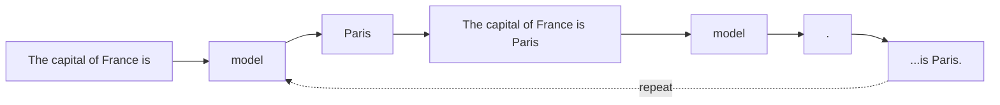
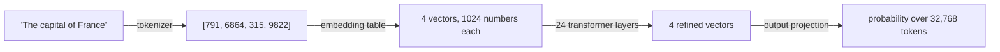
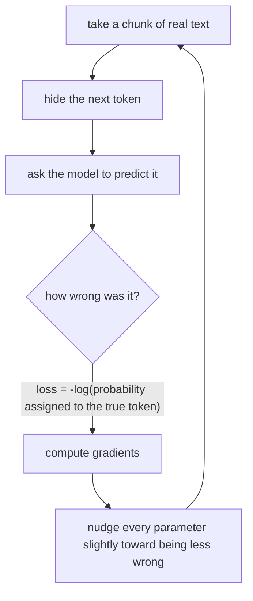
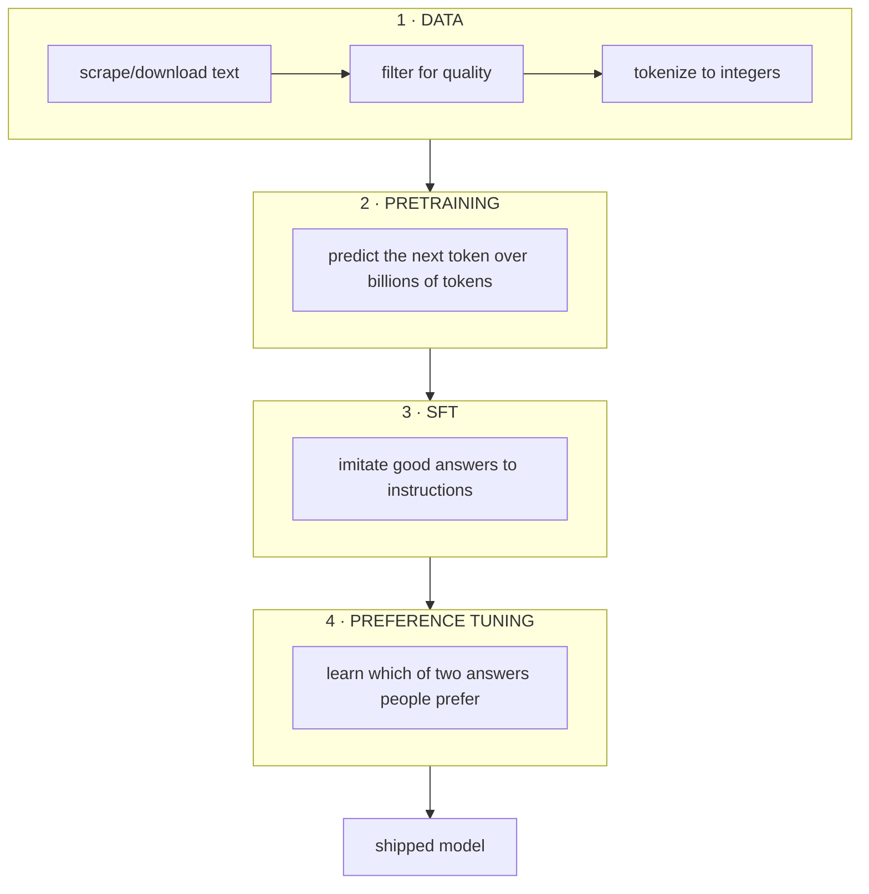

# 0. What we're building

> **The name.** *akshara* (अक्षर) is Sanskrit for a *letter*, *syllable*, or *character* —
> the smallest unit of written language (and, literally, *imperishable*). This project builds
> a language model up from exactly that: the smallest pieces of text, one token at a time.

## The one-sentence version

A language model is a function that takes some text and outputs a probability for every
possible next word. That's it. Everything else — chat, reasoning, code generation — is
that one capability, dressed up.

## The core trick

Suppose you have a machine that, given `"The capital of France is"`, tells you:

```
" Paris"   →  71%
" a"       →   6%
" located" →   4%
" the"     →   3%
... 32,000 more options, each tiny
```

You can now *generate* text: pick a word, append it, feed the whole thing back in, repeat.



That loop is called **autoregressive generation**, and it is the only thing an LLM does at
inference time.

The remarkable part is what the machine has to learn in order to be good at it. To predict
the next word of a murder mystery you need to track who is in the room. To predict the next
line of a Python function you need to know what the variable holds. Next-token prediction
sounds trivial, but doing it *well* over the entire internet forces the model to learn
grammar, facts, arithmetic, and a rough model of how the world works. That is the central
bet of the whole field, and it turned out to pay off.

---

## Where the numbers come from

The model doesn't see letters. It sees integers.



- A **tokenizer** maps text ⇄ integers. See [doc 2](02-tokenizer.md).
- An **embedding table** maps each integer to a learned vector. Similar words end up with
  similar vectors, because that's what makes prediction easier.
- The **transformer layers** repeatedly let each position look at earlier positions and
  update itself. This is where the actual thinking happens. See [doc 3](03-model.md).
- The **output projection** turns the final vector back into a score per token.

Every one of those learned numbers is a **parameter**. "A 300M model" means 300 million
of them. They all start as random noise and are nudged, billions of times, by training.

---

## How learning happens



**Loss** is the single number that measures wrongness. If the model gave the correct token
a probability of 1.0, loss is 0. If it gave it 0.0001, loss is large. Training minimises
the average loss over billions of tokens.

Two numbers you'll watch constantly:

- **Loss** — typically starts at `ln(vocab_size)` (pure guessing: 9.01 for a 8192-token
  vocab) and falls. Below ~3.0 on real web text is a functioning model.
- **Perplexity** = `e^loss`. Interpretable as "the model is as confused as if it were
  choosing uniformly among N options". Perplexity 20 ≈ narrowing 32,768 choices down to 20.

---

## The four stages, and why each exists



### 1. Data
Garbage in, garbage out — more literally than anywhere else in software. The single
biggest quality lever available to a hobbyist is *what text you train on*, not the
architecture. FineWeb-Edu (educational web pages, filtered by a classifier) beats raw
CommonCrawl by a wide margin at the same token count. → [doc 1](01-data.md)

Data can also be **written by a bigger model running on the same machine**, which is how you
get a dataset nobody published — Python exercises whose tests actually pass, for instance.
The catch is that generated data is the easiest way to make a model *worse* while its
training loss improves, so most of that work is checking rather than
generating. → [doc 13](13-synthetic-data.md)

### 2. Pretraining
99% of the compute. The model reads billions of tokens and learns language and world
knowledge. The result is a **base model**: it can *continue* text but has no idea it's
supposed to be helpful. Ask it "What is the capital of France?" and it may well reply
with "What is the capital of Germany? What is the capital of Spain?" — because on the
internet, questions are usually followed by more questions. → [doc 4](04-pretraining.md)

### 3. Supervised fine-tuning (SFT)
Show it maybe 100,000 examples of `(instruction, good response)` and train on the
*response* tokens only. This is a small nudge — hours, not days — but it completely
changes the model's behaviour. It now answers instead of continuing. → [doc 5](05-posttraining.md)

### 4. Preference tuning (DPO)
SFT can only say "imitate this". It can't express "answer A is better than answer B" when
both are valid. Preference data can. You show the model pairs — one response humans
preferred, one they didn't — and it learns the *direction* of better. This is where tone,
appropriate length, and refusal behaviour get shaped. → [doc 5](05-posttraining.md)

### 5. Reinforcement learning on a verifiable reward (GRPO)
For tasks where an answer can be *checked* — does the code pass its tests? is the math
right? — you don't need human-labelled data at all. Sample several answers, reward the ones
that pass, and push the model toward them. This is how small models get genuinely good at
code and math, and it reuses the same sandbox we built to *evaluate* the model as the
*training signal*. → [doc 5, Part 3](05-posttraining.md)

---

## Learning it by breaking it

Reading the chapters that follow is one way through this project. There is another, and it
is better: [doc 15](15-learning-path.md) turns the repo into thirteen lessons that each end
in *breaking real code* and watching a real test go red. Most of the exercises are bugs that
actually happened here — a causal mask applied during single-token decoding masks away the
entire KV cache, and the model trains perfectly while generating garbage.

```bash
python -m aksharallm.learn        # or the portal's Learn tab
```

A lesson only counts as done once its check has gone red **and then** green, because the
check passes on a clean checkout and breaking it is the exercise.

## What we're realistically going to get

Be honest about scale. Frontier models are trained on ~10²⁵ FLOPs across tens of thousands
of GPUs. One 3090 running for a week is about 10¹⁹ FLOPs — a factor of a million smaller.

| | our Phase 2 | GPT-2 (2019) | frontier (2025) |
|---|---|---|---|
| params | ~300M | 1.5B | ~1T |
| training tokens | 10B | 40B | ~10T+ |
| GPUs × time | 1 × 6 days | 256 × days | ~10⁵ × months |

So: **you will not build ChatGPT.** What you *will* build is a model that writes fluent,
grammatical English, knows a surprising amount of general knowledge, follows simple
instructions, and — crucially — that you understand completely, line by line. That's a
much more valuable thing to own than an API key.

Small models also genuinely win at narrow tasks. A 300M model fine-tuned on one specific
domain can beat a general 7B model on that domain, while running 20× faster.

---

## The code, in reading order

Every chapter ends with a section like this one: the files to open, in the order that makes
them make sense, and what to look at inside each. Prose about attention is not the same as
`Attention.forward`, and the point of this project is that the second one is short enough
to read.

This is the whole model, end to end, in eight files. A day, if you read them in this order:

| # | file | what to look for |
|---|---|---|
| 1 | [`aksharallm/tokenizer/tokenizer.py`](../aksharallm/tokenizer/tokenizer.py) | `Tokenizer.encode` / `decode` — text becomes the integers everything else works in |
| 2 | [`aksharallm/data/prepare.py`](../aksharallm/data/prepare.py) | `tokenize_to_bin` — a corpus becomes one flat file of `uint16` |
| 3 | [`aksharallm/data/loader.py`](../aksharallm/data/loader.py) | `TokenDataset.get_batch` — `x` and `y`, the same slice one position apart. 60 lines, and it *is* the training objective |
| 4 | [`aksharallm/model/transformer.py`](../aksharallm/model/transformer.py) | `Attention.forward` → `Block.forward` → `Transformer.forward`. The whole architecture, ~370 lines |
| 5 | [`aksharallm/train/pretrain.py`](../aksharallm/train/pretrain.py) | `main` — the four lines of the objective, and everything that keeps them alive for six days |
| 6 | [`aksharallm/infer/generate.py`](../aksharallm/infer/generate.py) | `stream_generate` — prefill, then one token at a time against a KV cache |
| 7 | [`aksharallm/train/sft.py`](../aksharallm/train/sft.py) | the loss mask: `y[m == 0] = -100`. That one line is what turns a text completer into an assistant |
| 8 | [`aksharallm/config.py`](../aksharallm/config.py) | `ModelConfig` / `TrainConfig` — every knob the six files above read, and nothing hardcoded |

Then `configs/tiny.yaml` is one run described in 40 lines, and `tests/` is what the repo
claims is true — `tests/test_model.py` is the best short summary of the architecture there
is.

Reading order for the *chapters* is just their numbers, with two branches: 10–11
(quantization, LoRA) are about making a finished model cheaper and can be read any time
after 3, and 12 (evaluation) is worth reading before 13–14 because it is the instrument
those two experiments are measured with.

---

Next: [1. Data →](01-data.md)
