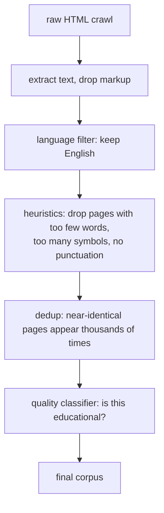
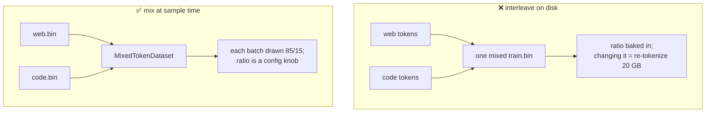

# 1. Data

> **The rule:** at fixed compute, better data beats a better architecture, every time.
> This is the stage where a hobbyist has the most leverage, and it's the stage most
> tutorials skip.

## Where text comes from

| Dataset | Size | What it is | Good for |
|---|---|---|---|
| **TinyStories** | 0.5B tok | Synthetic children's stories, ~1500-word vocabulary | Phase 1. Tiny models can actually master it. |
| **FineWeb-Edu** | 1.3T tok | CommonCrawl filtered by a classifier for "educational value" | Phase 2. The best open pretraining data per token. |
| FineWeb | 15T tok | CommonCrawl, deduplicated, lightly filtered | When you need volume over quality |
| The Stack v2 | 900B tok | Permissively-licensed source code | Code models |
| Wikipedia | 4B tok | Encyclopedia | Facts, but too small alone |

We use TinyStories then FineWeb-Edu. The recipes live in
[`aksharallm/data/prepare.py`](../aksharallm/data/prepare.py):

```python
RECIPES = {
    "tinystories":      ("roneneldan/TinyStories",   None,           "text"),
    "fineweb-edu-10bt": ("HuggingFaceFW/fineweb-edu", "sample-10BT", "text"),
}
```

Adding your own is one line — any HuggingFace dataset with a text column works.

### Why TinyStories first?

A 13.8M-parameter model does not have the capacity to learn all of English. Trained on
web text it produces plausible-looking gibberish. Trained on TinyStories — which
deliberately uses only words a 4-year-old knows — it produces genuinely coherent prose,
because the task is small enough to actually fit in the model.

This makes it perfect for validating a pipeline: if your code is correct, you *will* see
coherent output in 25 minutes. If you don't, something is broken, and you've learned that
cheaply instead of six days in.

---

## Quality filtering

Raw CommonCrawl is mostly SEO spam, boilerplate navigation, and adult content. The
standard pipeline:



**Deduplication matters more than people expect.** The same article syndicated across
5,000 sites means the model sees it 5,000 times, memorises it verbatim, and wastes
capacity. FineWeb-Edu has all of this done already, which is why we use it rather than
building our own crawl — that's a project in itself.

---

## The on-disk format

After tokenization, the entire corpus is **one flat file of unsigned 16-bit integers**:

```
train.bin:  [doc1 tokens] 0 [doc2 tokens] 0 [doc3 tokens] 0 ...
                              ↑
                    <|endoftext|> separator
```

No headers. No record boundaries. No JSON. Just numbers.

**Why `uint16`?** Our vocabulary is ≤ 65,536, so every token fits in 2 bytes. 10 billion
tokens = 20 GB. In `int32` it would be 40 GB, for zero benefit.

**Why one flat file?** Because training doesn't want documents, it wants *random windows*:

```python
i = random.randint(0, n_tokens - seq_len - 1)
x = data[i     : i + seq_len]        # what the model sees
y = data[i + 1 : i + seq_len + 1]    # what it must predict
```

`x` and `y` are the same slice, offset by one. That single-token shift **is** the
pretraining objective — position *t* sees `x[t]` and must produce `y[t] == x[t+1]`.

```
data:   [ 791, 6864,  315, 9822,  374, 12366 ]
             ↓     ↓     ↓     ↓     ↓
x:      [ 791, 6864,  315, 9822,  374 ]
y:      [ 6864, 315, 9822,  374, 12366 ]
```

A window will often straddle a document boundary. That's fine, and actually useful: it
teaches the model what `<|endoftext|>` means — "topic over, start something new".

**Why `np.memmap`?** The file stays on disk; the OS pages in only the bytes you touch and
caches them in free RAM. A 20 GB corpus works on a machine with 8 GB of RAM, with no
DataLoader, no worker processes, and no collate function. See
[`loader.py`](../aksharallm/data/loader.py) — it's 60 lines.

---

## Train/validation split

The validation set is carved from the *start* of the stream, and training skips those
documents:

```python
# doc 0 .. 50,000        -> validation
# doc 50,000 .. end      -> training
```

This matters. If a validation document also appears in training, the model has memorised
it and your val loss becomes a lie — it will keep dropping while the model gets no better.
That's **contamination**, and it's the most common way people fool themselves.

---

## Running it

```bash
python -m aksharallm.data.prepare tinystories \
    --out-dir data/tinystories \
    --vocab-size 8192 \
    --max-train-tokens 400000000
```

Output:
```
[1/3] training 8192-token BPE on 200,000 docs
[2/3] writing validation split (5,000,000 tokens)
[3/3] writing train split
done. train=400,000,000 tok  val=5,000,000 tok  (0.81 GB on disk)
```

Roughly 90 seconds on a 16-core machine — tokenization is CPU-parallel across processes.

### Options worth knowing

| Flag | Why you'd use it |
|---|---|
| `--max-train-tokens N` | Disk budget. Also makes the run terminate deterministically instead of draining a slow stream. |
| `--vocab-size N` | 8k for tiny models, 32k for Phase 2. See [doc 2](02-tokenizer.md). |
| `--tokenizer path` | Reuse an existing tokenizer instead of fitting a new one. **Required** if you're adding data to an existing model. |
| `--n-proc N` | Tokenizer processes. Defaults to cores − 2. |

> ⚠️ **Never change the tokenizer without re-tokenizing everything and retraining from
> scratch.** Token id 5051 means a different string under a different tokenizer, and the
> model's embedding table is indexed by id. Mixing them produces fluent nonsense.

---

## Disk budget

| Corpus | Tokens | `train.bin` |
|---|---|---|
| TinyStories | 400M | 0.8 GB |
| FineWeb-Edu `sample-10BT` | 10B | 20 GB |
| FineWeb-Edu `sample-100BT` | 100B | 200 GB |

Check `df -h` before starting Phase 2. Tokenization streams (raw text is never all held
at once) but the output still has to land somewhere.

---

## Blending several corpora

Real base models don't train on one source — they mix. Ours blends general web text with
code (**85% FineWeb-Edu + 15% Python**), so one pretraining run produces a base that both
chats and codes. There are two ways to combine sources, and we deliberately pick the second:



`prepare_blend.py` tokenizes each source into its **own** `.bin`, and
[`MixedTokenDataset`](../aksharallm/data/loader.py) draws each *batch* from them by weight —
an **exact** 85/15 split every step, not merely on average. Because the ratio lives in the
config (`data.train_sources`), not the files, you can retune it — or flip to a code-heavy
mix for the Python-specialist phase — without re-tokenizing anything.

```bash
python -m aksharallm.data.prepare_blend --out-dir data/blend --vocab-size 32768 \
    --source fineweb-edu-10bt:0.85 --source codeparrot-python:0.15 \
    --val-tokens 10000000 --max-train-tokens 10000000000
```

> The tokenizer is trained on the **mix**, not on prose alone. This matters: a prose-only
> BPE wastes tokens on Python's indentation, `camelCase`, and `__dunder__` names — see
> [docs/02-tokenizer.md](02-tokenizer.md).

Code datasets have their own gotcha: many on the Hub are **gated** (need a login) or ship a
deprecated loader *script* the current `datasets` library refuses. We use
`codeparrot/codeparrot-clean` (pure Python) and `bigcode/the-stack-smol-xl`
(multi-language), both of which stream ungated. Always test a new one with a 5-line
`load_dataset(..., streaming=True); next(iter(ds))` before wiring it in.

---

## An implementation detail that cost real debugging time

The tokenizer runs in a process pool. The obvious way to feed it is:

```python
for arr in pool.imap(tokenize, batches):   # ❌ silently truncates
```

But `imap` iterates `batches` on multiprocessing's internal task-handler **thread**, and
the HuggingFace streaming reader raises from a non-main thread. That exception is
swallowed — `imap` just ends early, and you get a **truncated or empty dataset with a
zero exit code**. We hit exactly this and wrote 0 tokens while the script reported success.

The fix is to keep stream iteration on the main thread and dispatch explicitly:

```python
for batch in batches:                       # ✅ errors propagate
    pending.append(pool.apply_async(tokenize, (batch,)))
    if len(pending) >= max_pending:
        write(pending.popleft().get())
```

Plus a hard check at the end: if 0 tokens were written, raise. **Always verify your data
files are the size you expect before starting a multi-day run.**

---

Next: [2. Tokenizer →](02-tokenizer.md)
