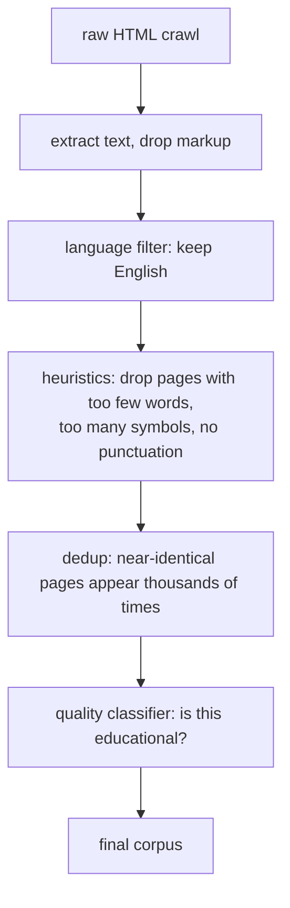
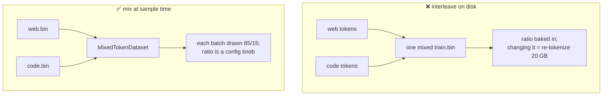
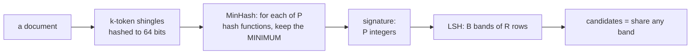

# 1. Data

> **The rule:** at fixed compute, better data beats a better architecture, every time.
> This is the stage where a hobbyist has the most leverage, and it's the stage most
> tutorials skip.

## Where text comes from

| Dataset | Size | What it is | Good for |
|---|---|---|---|
| **TinyStories** | 0.5B tok | Synthetic children's stories, ~1500-word vocabulary | Phase 1. Tiny models can actually master it. |
| **FineWeb-Edu** | 1.3T tok | CommonCrawl filtered by a classifier for "educational value" | Phase 2. The best open pretraining data per token. |
| FineWeb | 15T tok | CommonCrawl, deduplicated, lightly filtered | When you need volume over quality |
| The Stack v2 | 900B tok | Permissively-licensed source code | Code models |
| Wikipedia | 4B tok | Encyclopedia | Facts, but too small alone |

We use TinyStories then FineWeb-Edu. The recipes live in
[`aksharallm/data/prepare.py`](../aksharallm/data/prepare.py):

```python
RECIPES = {
    "tinystories":      ("roneneldan/TinyStories",   None,           "text"),
    "fineweb-edu-10bt": ("HuggingFaceFW/fineweb-edu", "sample-10BT", "text"),
}
```

Adding your own is one line — any HuggingFace dataset with a text column works.

There is a fourth source, which is not a download at all: **data written by a model already
on this machine**. That is worth a chapter of its own, because generating it is four lines
and *checking it is worth training on* is the entire job —
[doc 13](13-synthetic-data.md). It reaches the trainer through the tools on this page:
`prepare_sft` and `prepare_dpo` each grew one recipe, `jsonl`, and everything downstream —
packing, the assistant-only mask, the preference triples — is unchanged.

### Why TinyStories first?

A 13.8M-parameter model does not have the capacity to learn all of English. Trained on
web text it produces plausible-looking gibberish. Trained on TinyStories — which
deliberately uses only words a 4-year-old knows — it produces genuinely coherent prose,
because the task is small enough to actually fit in the model.

This makes it perfect for validating a pipeline: if your code is correct, you *will* see
coherent output in 25 minutes. If you don't, something is broken, and you've learned that
cheaply instead of six days in.

---

## Quality filtering

Raw CommonCrawl is mostly SEO spam, boilerplate navigation, and adult content. The
standard pipeline:



**Deduplication matters more than people expect.** The same article syndicated across
5,000 sites means the model sees it 5,000 times, memorises it verbatim, and wastes
capacity. FineWeb-Edu has all of this done already, which is why we use it rather than
building our own crawl — that's a project in itself.

---

## The on-disk format

After tokenization, the entire corpus is **one flat file of unsigned 16-bit integers**:

```
train.bin:  [doc1 tokens] 0 [doc2 tokens] 0 [doc3 tokens] 0 ...
                              ↑
                    <|endoftext|> separator
```

No headers. No record boundaries. No JSON. Just numbers.

**Why `uint16`?** Our vocabulary is ≤ 65,536, so every token fits in 2 bytes. 10 billion
tokens = 20 GB. In `int32` it would be 40 GB, for zero benefit.

**Why one flat file?** Because training doesn't want documents, it wants *random windows*:

```python
i = random.randint(0, n_tokens - seq_len - 1)
x = data[i     : i + seq_len]        # what the model sees
y = data[i + 1 : i + seq_len + 1]    # what it must predict
```

`x` and `y` are the same slice, offset by one. That single-token shift **is** the
pretraining objective — position *t* sees `x[t]` and must produce `y[t] == x[t+1]`.

```
data:   [ 791, 6864,  315, 9822,  374, 12366 ]
             ↓     ↓     ↓     ↓     ↓
x:      [ 791, 6864,  315, 9822,  374 ]
y:      [ 6864, 315, 9822,  374, 12366 ]
```

A window will often straddle a document boundary. That's fine, and actually useful: it
teaches the model what `<|endoftext|>` means — "topic over, start something new".

**Why `np.memmap`?** The file stays on disk; the OS pages in only the bytes you touch and
caches them in free RAM. A 20 GB corpus works on a machine with 8 GB of RAM, with no
DataLoader, no worker processes, and no collate function. See
[`loader.py`](../aksharallm/data/loader.py) — it's 60 lines.

---

## Train/validation split

The validation set is carved from the *start* of the stream, and training skips those
documents:

```python
# doc 0 .. 50,000        -> validation
# doc 50,000 .. end      -> training
```

This matters. If a validation document also appears in training, the model has memorised
it and your val loss becomes a lie — it will keep dropping while the model gets no better.
That's **contamination**, and it's the most common way people fool themselves.

---

## Running it

```bash
python -m aksharallm.data.prepare tinystories \
    --out-dir data/tinystories \
    --vocab-size 8192 \
    --max-train-tokens 400000000
```

Output:
```
[1/3] training 8192-token BPE on 200,000 docs
[2/3] writing validation split (5,000,000 tokens)
[3/3] writing train split
done. train=400,000,000 tok  val=5,000,000 tok  (0.81 GB on disk)
```

Roughly 90 seconds on a 16-core machine — tokenization is CPU-parallel across processes.

### Options worth knowing

| Flag | Why you'd use it |
|---|---|
| `--max-train-tokens N` | Disk budget. Also makes the run terminate deterministically instead of draining a slow stream. |
| `--vocab-size N` | 8k for tiny models, 32k for Phase 2. See [doc 2](02-tokenizer.md). |
| `--tokenizer path` | Reuse an existing tokenizer instead of fitting a new one. **Required** if you're adding data to an existing model. |
| `--n-proc N` | Tokenizer processes. Defaults to cores − 2. |

> ⚠️ **Never change the tokenizer without re-tokenizing everything and retraining from
> scratch.** Token id 5051 means a different string under a different tokenizer, and the
> model's embedding table is indexed by id. Mixing them produces fluent nonsense.

---

## Disk budget

| Corpus | Tokens | `train.bin` |
|---|---|---|
| TinyStories | 400M | 0.8 GB |
| FineWeb-Edu `sample-10BT` | 10B | 20 GB |
| FineWeb-Edu `sample-100BT` | 100B | 200 GB |

Check `df -h` before starting Phase 2. Tokenization streams (raw text is never all held
at once) but the output still has to land somewhere.

---

## Blending several corpora

Real base models don't train on one source — they mix. Ours blends general web text with
code (**85% FineWeb-Edu + 15% Python**), so one pretraining run produces a base that both
chats and codes. There are two ways to combine sources, and we deliberately pick the second:



`prepare_blend.py` tokenizes each source into its **own** `.bin`, and
[`MixedTokenDataset`](../aksharallm/data/loader.py) draws each *batch* from them by weight —
an **exact** 85/15 split every step, not merely on average. Because the ratio lives in the
config (`data.train_sources`), not the files, you can retune it — or flip to a code-heavy
mix for the Python-specialist phase — without re-tokenizing anything.

```bash
python -m aksharallm.data.prepare_blend --out-dir data/blend --vocab-size 32768 \
    --source fineweb-edu-10bt:0.85 --source codeparrot-python:0.15 \
    --val-tokens 10000000 --max-train-tokens 10000000000
```

> The tokenizer is trained on the **mix**, not on prose alone. This matters: a prose-only
> BPE wastes tokens on Python's indentation, `camelCase`, and `__dunder__` names — see
> [docs/02-tokenizer.md](02-tokenizer.md).

Code datasets have their own gotcha: many on the Hub are **gated** (need a login) or ship a
deprecated loader *script* the current `datasets` library refuses. We use
`codeparrot/codeparrot-clean` (pure Python) and `bigcode/the-stack-smol-xl`
(multi-language), both of which stream ungated. Always test a new one with a 5-line
`load_dataset(..., streaming=True); next(iter(ds))` before wiring it in.

---

## An implementation detail that cost real debugging time

The tokenizer runs in a process pool. The obvious way to feed it is:

```python
for arr in pool.imap(tokenize, batches):   # ❌ silently truncates
```

But `imap` iterates `batches` on multiprocessing's internal task-handler **thread**, and
the HuggingFace streaming reader raises from a non-main thread. That exception is
swallowed — `imap` just ends early, and you get a **truncated or empty dataset with a
zero exit code**. We hit exactly this and wrote 0 tokens while the script reported success.

The fix is to keep stream iteration on the main thread and dispatch explicitly:

```python
for batch in batches:                       # ✅ errors propagate
    pending.append(pool.apply_async(tokenize, (batch,)))
    if len(pending) >= max_pending:
        write(pending.popleft().get())
```

Plus a hard check at the end: if 0 tokens were written, raise. **Always verify your data
files are the size you expect before starting a multi-day run.**

---

## How much of it is the same thing twice?

A web crawl is full of duplicated text. Not byte-identical — that would be easy — but the
same article behind three templates, the same licence header on ten thousand files, the same
answer quoted in four blog posts. Each copy is a silent, unrequested extra epoch on whatever
happened to be popular.

Exact matching cannot see it, and comparing every pair cannot either: 8 million documents is
32 trillion pairs. Two ideas stacked make it tractable.



**MinHash.** Hash a document's shingles with one function and keep the minimum; repeat for P
functions. The probability two documents share a minimum *is* their Jaccard similarity, so
the fraction of the P positions that agree estimates it. Any document collapses to P
integers.

**LSH.** Split each signature into `B` bands of `R` rows; two documents are candidates if any
band matches exactly. The chance of that is `1 - (1 - t^R)^B` — an S-curve whose knee sits
near `(1/B)^(1/R)`. Choosing B and R is choosing where it turns.

```bash
.venv/bin/python -m aksharallm.data.dedup data/blend/codeparrot-python.bin --limit 60000
```

Every scan is **kept** — `logs/eval/dedup-<corpus>-<when>.json`, beside the evaluations, and
it is what the portal's duplicates card reads. That is not tidiness: a dedup number is a
number *at one offset*, and the only honest way to read one is beside another taken somewhere
else in the file, which is impossible if the first scrolled out of a terminal. `--out` picks a
different destination and `--no-write` turns it off; it used to be the other way round, so a
scan you did not explicitly ask to keep kept nothing and never reached the browser.

### What our own blend contains

**The two halves of the corpus are two hundred times apart.** Sampled twice at different
offsets, 60,000 documents each:

| source | duplicate documents | duplicate tokens | largest cluster |
|---|---|---|---|
| **fineweb-edu** (85%) | 0.017% / 0.025% | **0.014% / 0.036%** | 2 |
| **codeparrot-python** (15%) | 6.35% / 4.02% | **8.04% / 5.23%** | 151 / 175 |

FineWeb-Edu is essentially clean, and it should be — its published pipeline deduplicates
with exactly this technique, so what this measures is that the filter worked.
CodeParrot-clean is not, and that is unsurprising once said out loud: vendored dependencies,
generated files, forks of the same repository and boilerplate headers are all *legitimately*
near-identical code. A cluster of 175 documents is one file living in 175 places.

Weighted 85/15, roughly **1% of the blend's tokens are a repeat of another token in it**, and
almost all of that 1% is in the Python 15%.

> **Worth wondering about, and not yet worth claiming.** [Doc 12](12-eval.md) records that
> Python's held-out loss is **2.7696 → 1.2558**, more than twice as predictable as prose. Some
> of that is real — code is more repetitive than English. But an 8% duplication rate in the
> Python half means some of those held-out documents have near-copies in training, which
> would also lower the number. Separating the two would need a run on a deduplicated Python
> split, which has not been done. It is listed as an open question rather than an answer.

### Four ways this measurement lies, all reported

1. **MinHash estimates Jaccard; it does not compute it.** The standard error is
   `sqrt(t(1-t)/P)` — ±0.040 at P=128 near the threshold. The report prints it.
2. **LSH's misses are invisible.** A similar pair that shares no band is never compared, so
   it does not show up as a near-miss — it does not show up at all. The report prints the
   whole detection curve so the miss rate is a number rather than a hope:

   | true similarity | 0.5 | 0.7 | 0.8 | 0.9 |
   |---|---|---|---|---|
   | chance LSH sees it | 6% | 61% | 95% | 100% |

3. **A sample is a sample of however the file was ordered.** These numbers come from the
   front of each `.bin`, and a corpus written repository by repository is very much ordered
   — which is why `--start-token` exists and why the table above shows **two offsets**. The
   Python figure moves between 5.2% and 8.0%; the conclusion (two orders of magnitude apart
   from prose) does not.
4. **Ten copies are one cluster of ten, and nine removable documents.** One of them is the
   original and keeping it is the point.

**And the token share is the number that matters, not the document share.** Documents are
not equal: dropping 200,000 forty-token stubs changes almost nothing, while dropping 3,000
duplicated long files changes the corpus measurably.

## The code, in reading order

| # | file | what to look for |
|---|---|---|
| 1 | [`aksharallm/data/prepare.py`](../aksharallm/data/prepare.py) | `RECIPES` (which datasets exist), then `stream_texts` → `tokenize_to_bin`. The nested `drain_one` is the `apply_async` fix described above — read it beside the `imap` version it replaced |
| 2 | [`aksharallm/data/loader.py`](../aksharallm/data/loader.py) | `TokenDataset.get_batch` — six lines, and the one-position shift between `x` and `y` is the entire pretraining objective. `_data` is the `np.memmap` that makes a 20 GB corpus free to open |
| 3 | [`aksharallm/data/prepare_blend.py`](../aksharallm/data/prepare_blend.py) | `blended_corpus` — one tokenizer fitted on the *mix*, then one `.bin` per source |
| 4 | [`aksharallm/data/loader.py`](../aksharallm/data/loader.py) again | `MixedTokenDataset._counts` — where the 85/15 becomes an exact per-batch split rather than an average (largest-remainder, so the counts always sum to `batch_size`) |
| 5 | [`aksharallm/config.py`](../aksharallm/config.py) | `DataConfig` — `train_bin`, `train_sources`, `tokenizer`. The ratio lives here, which is why retuning it costs nothing |
| 6 | [`aksharallm/data/dedup.py`](../aksharallm/data/dedup.py) | `signature` (the one broadcast that makes it fast), then `LSHParams.detection_probability` — the S-curve is the whole design, and `report`'s token share is the number to quote |
| 7 | [`aksharallm/data/prepare_sft.py`](../aksharallm/data/prepare_sft.py) · [`prepare_dpo.py`](../aksharallm/data/prepare_dpo.py) | the post-training side of the same machinery — read after [doc 5](05-posttraining.md). The `jsonl` recipe in each is how generated data ([doc 13](13-synthetic-data.md)) gets in |

`tests/test_dedup.py` leads with a **planted duplicate**, for the reason
`tests/test_contamination.py` does: a deduplicator that finds nothing because it is
broken looks exactly like a clean corpus, and that is the comfortable answer.

What pins it: `tests/test_pipeline.py::test_loader_shift_and_bounds` (the shift) and
`::test_mixed_respects_weights_every_batch` (the exact blend). Break the first one on
purpose in [lesson 1](lessons/01-data.md).

---

Next: [2. Tokenizer →](02-tokenizer.md)
