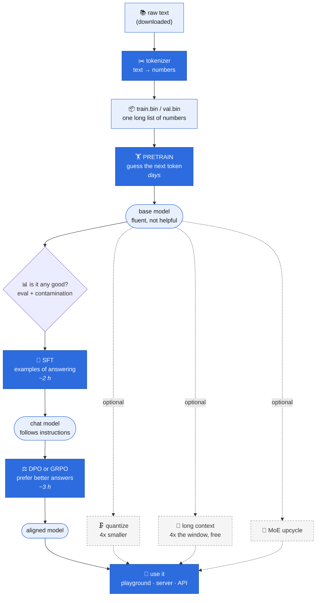
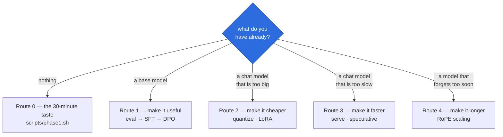
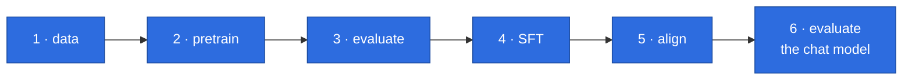
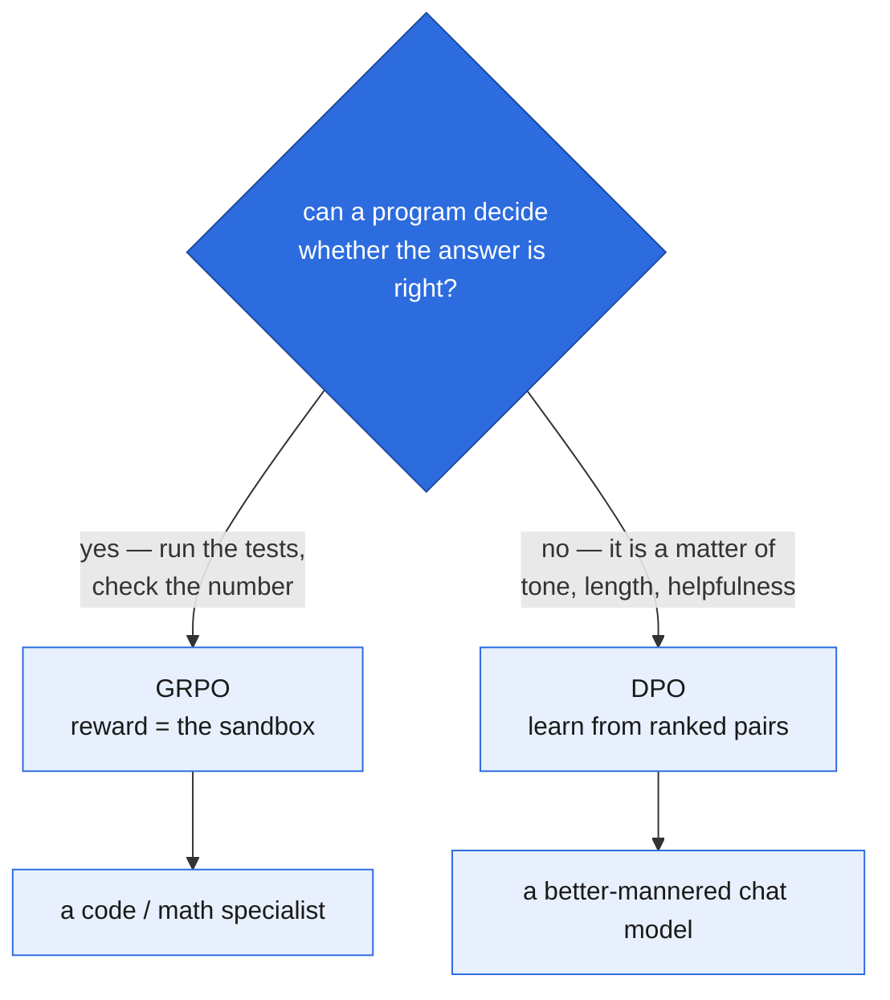
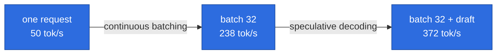
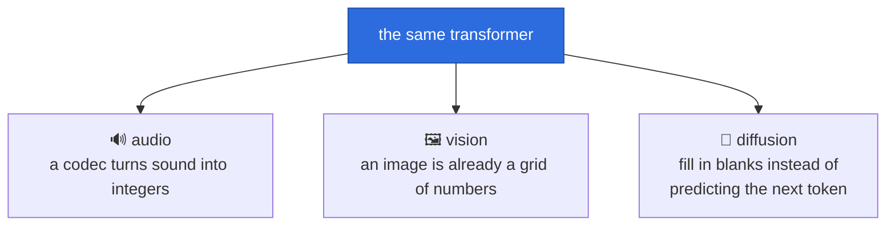
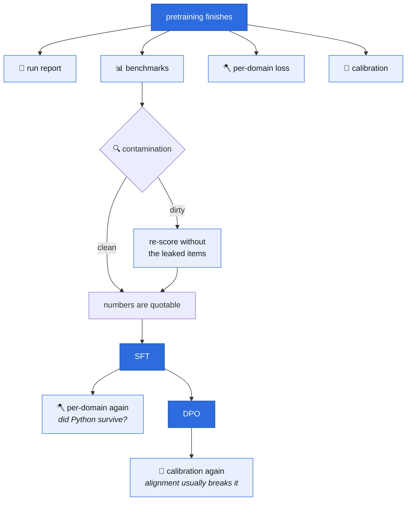

# 1. The whole journey, end to end

Every other chapter explains one piece. This one is the map: **what order to do things in,
what each step is actually for, and how to tell it worked** — written for someone who has
never trained a model and wants to get from an empty folder to something that answers
questions.

Nothing here is new code. Every command below is implemented and explained somewhere else,
and this chapter links to it. If you only read one page of these docs, read this one and
follow the links out.

> **The one-sentence version.** You feed a pile of text to a model that only knows how to
> guess the next word (*pretraining*), then you show it examples of answering questions
> (*post-training*), and then you make it small enough or fast enough to use (*inference*).
> Everything else on this page is a variation on those three moves.

---

## The map



Solid arrows are **the main line** — the route that ends in a model you can talk to. Dotted
arrows are **side routes**: each one takes a finished model and changes one property of it
(size, speed, context length, capacity) without going back to the beginning.

---

## Which route am I on?

Most questions about "what do I do next" are really one of these five.



There are also **Route 5** (make it *better* rather than cheaper — distillation, MoE,
scaling up) and **Route 6** (do something other than text — diffusion, audio, vision).

> **Where the portal views are.** Every "In the portal: the **X** view" below means the
> **☰ Menu** button at the top left of `scripts/portal.sh` — the menu is closed until you
> open it, and the button names whichever view you are in. Each view also has its own
> address, so `http://127.0.0.1:8765/#evals` goes straight there.

---

## Route 0 — the 30-minute taste

**Do this first, before anything else.** It runs the entire pipeline end to end on a toy
model, so if something in your setup is broken you find out in half an hour rather than on
day four of a six-day run.

```bash
scripts/phase1.sh
```

That downloads TinyStories, trains a tokenizer, tokenizes the corpus, pretrains a 13.8M
model to a validation loss around 1.47, and generates a sample story. About 30 minutes on a
3090. The chapters behind it are [data](02-data.md), [the tokenizer](03-tokenizer.md),
[the model](04-model.md) and [pretraining](05-pretraining.md).

If the story it prints is grammatical nonsense about a little girl and a ball, everything
works. That is what a 13.8M model sounds like and it is the correct result.

---

## Route 1 — the main line

This is the route that produces something you can actually talk to. Six stages, in order,
each gated on the one before.



**Evaluation appears twice on purpose.** Stage 3 records what the base model knew, and it is
the last moment that is measurable. Stage 6 asks a different question — not "what does it
know" but "did post-training change its behaviour without damaging what stage 3 recorded".
Neither one substitutes for the other, and § 6 below says which measurements belong to which.

### 1 · Data — turn text into numbers

A model cannot read. The tokenizer converts text into a vocabulary of integers, and the
corpus becomes one enormous array of them on disk.

```bash
# one source
python -m aksharallm.data.prepare fineweb-edu-10bt --out-dir data/fineweb

# or a blend — 85% prose, 15% Python, so one base model can do both
python -m aksharallm.data.prepare_blend --out-dir data/blend \
    --source fineweb-edu-10bt:0.85 --source codeparrot-python:0.15
```

**How you know it worked:** `data/blend/train.bin` exists and is tens of gigabytes, and
`val.manifest.json` says which source each part of the validation split came from. That
manifest is what makes the per-domain loss split in [chapter 13](13-eval.md) possible later.

**Worth doing once:** `python -m aksharallm.data.dedup data/blend/fineweb-edu-10bt.bin`
measures how much of the corpus is the same thing twice. On this project's blend, FineWeb-Edu was 0.014% duplicated and
CodeParrot-Python 8.04% — a two-hundred-fold difference that changes how you read the
Python-vs-prose loss gap.

📖 [chapter 2 — data](02-data.md) · [chapter 3 — the tokenizer](03-tokenizer.md)

### 2 · Pretrain — the long one

The model reads the corpus and learns to predict the next token. This is where essentially
all of the compute goes, and it is the only stage measured in days.

```bash
scripts/phase2.sh                    # the real base model: ~300M params, ~10B tokens, ~6 days
STOP_IN=90m scripts/phase2.sh        # ...but stop after 90 minutes
scripts/stop.sh small-code --in 30m  # ...or queue a stop on a run already going
```

In the portal: the **Dashboard** tab, Start button. Same script, same files — the browser
and the terminal never disagree because the browser shells out to the same launcher.

**How you know it worked:** validation loss falls and keeps falling. On this project the
300M model went 3.62 → 2.55 over 40,000 steps. There is no threshold that means "done";
you stop when the curve flattens or the budget runs out.

**It is safe to stop and resume.** Every session picks up from `ckpt_last.pt` with the data
order restored, so a six-day run is really forty evenings. Stopping is not damage.

📖 [chapter 5 — pretraining](05-pretraining.md) ·
[chapter 10 — running and watching](10-running-and-watching.md) ·
[chapter 9 — when it goes wrong](09-troubleshooting.md)

### 3 · Evaluate — find out what you have

Do this **before** post-training, because it is the only chance to record what the base
model could do on its own. Everything after this changes the model.

```bash
python -m aksharallm.eval suites                        # what can be measured, and why
python -m aksharallm.eval small-code                    # the default set, quick
python -m aksharallm.eval small-code --suite all --limit 0   # everything, full splits
python -m aksharallm.eval contaminate --config configs/small-code.yaml --verify
```

In the portal: the **Eval** tab. Pick a checkpoint, click a group chip (`fast`, `default`,
`all`), set the limit, press Evaluate.

**How you read the result:** a single score means nothing. 25.4% on MMLU is only meaningful
beside the 25% chance line, its own error bar, and what the same suite scored ten thousand
steps ago. The tab leads with the trend chart for exactly this reason.

**Do not skip the contamination check.** It measures how much of the benchmark was already
in the training data. A score you have not checked is not a measurement. It streams the whole
10B-token corpus and takes about half an hour; the portal offers a shorter scan (first 500M
or 2B tokens) for a quick look, and labels the result **"Partial scan — these are lower
bounds"**, because contamination you did not read is invisible rather than absent.

📖 [chapter 13 — evaluation](13-eval.md)

### 4 · SFT — teach it to answer

A base model has never been asked a question. It completes text. Supervised fine-tuning
shows it thousands of conversations and trains only on the assistant's half.

```bash
scripts/stage.sh sft small-code
```

In the portal: the **Post-training** panel, which refuses to start until a base checkpoint
exists and says so rather than failing later.

SFT trains every weight, so it needs as much memory per micro-batch as pretraining did.
The defaults suit the tiny models; on a bigger one, lower `BS` (and raise `ACCUM` to match)
— see [the stage knobs](10-running-and-watching.md#when-a-stage-dies-and-the-panel-says-ready).

Like a base run, it stops and resumes: `scripts/stop.sh small-code-sft` saves and exits,
and running the stage again continues from where it stopped. It is also a run in its own
right — pick `small-code-sft` in the run picker for its log, loss curve, sessions and cost.

**How you know it worked:** the Playground's Chat mode unlocks. It is hard-refused on a
base checkpoint on purpose — a base model has never seen a chat token, and letting it try
would look like a broken model rather than a wrong stage. If the stage dies instead, the
panel's card turns red and shows the last line the trainer printed — it will not quietly
return to "ready".

### 5 · Align — teach it which answer is better

SFT teaches the model to answer. Alignment teaches it which of two answers is preferable —
and there are two ways to say "preferable", which is the whole decision here.

#### Which one: DPO or GRPO?

They are **alternatives, not a sequence.** Both are gated on the same SFT checkpoint and
neither needs the other, so the ordinary case is: pick one, run it, compare it against the
SFT model. Chaining them (manners *first*, then correctness) is a real thing the method
allows — but `scripts/stage.sh grpo` hardwires `--init` to `sft_best.pt`, so it is not what
the launcher does. Chaining means calling the trainer yourself; see
[chapter 6 § where this sits](06-posttraining.md#where-this-sits).



That is the only question that matters. Everything else follows from it:

| | **DPO** | **GRPO** |
|---|---|---|
| learns from | pairs someone already ranked | a reward it computes itself |
| needs a dataset? | **yes** — and it is not on this machine yet | **no** — the sandbox tasks are built in |
| starts from | `checkpoints/small-code-sft/sft_best.pt` | the same file |
| writes | `checkpoints/small-code-dpo/dpo_best.pt` | `checkpoints/small-code-grpo/grpo_best.pt` |
| memory | ~2x SFT — a frozen reference model sits beside the policy | ~1x, plus sampling G completions per prompt |
| cost per step | one batch, four forward passes | sample 8 completions, **execute all of them**, then a step |
| good for | tone, length, hedging, refusal shape | Python, arithmetic — anything with a checkable answer |
| the number to watch | `acc`, 50% → 65–80% | `reward` and `solved%`, both climbing |

**For this project, GRPO is the interesting one**, because the base model is a 85/15
prose/Python blend and the sandbox reward is already built — `infer/sandbox.py` was written
to *evaluate* the model and GRPO reuses it as the training signal, so the expensive half was
free. DPO is the one that needs a download first.

#### GRPO — the one you can start right now

```bash
scripts/stage.sh grpo small-code
```

No data preparation: the prompts and their hidden tests are built in, and the reward is
whether the generated function passes them. It is the cheapest stage to *start* and the
slowest per step, because every step samples eight completions and runs all eight.

Useful knobs, all environment variables (`stage.sh` reads them; there are no flags):

```bash
STEPS=2000 GROUP=16 scripts/stage.sh grpo small-code    # longer, lower-variance advantage
LR=5e-7 scripts/stage.sh grpo small-code                # twitchier than DPO — go lower, not higher
```

**How you know it worked.** At step 0, `loss ≈ 0` and `KL = 0` — the policy still *is* the
reference, so every advantage is zero by construction. That is the sanity check, not a
problem. Then `reward` and `solved%` should climb while KL stays bounded.

**How you know it did not.** `reward` flat at zero means no completion ever passed, so there
is nothing to learn from — the task is beyond the model, not the trainer misconfigured. The
fix is a better SFT, not a bigger learning rate. Rising KL with flat reward is the other
failure: the model is drifting away from fluent language while gaining nothing. Raise `beta`.

#### DPO — and the download that happens first

```bash
scripts/stage.sh dpo small-code
```

**`data/dpo/` does not exist on this machine yet.** The first thing that command does is
download and tokenize UltraFeedback (~61k pairs) — minutes, before a single training step.
That is expected, and the portal names it: the stage's card reads **preparing data** with
the recipe on it, rather than sitting on "ready" as though the button had done nothing.

To use something else, or something already on disk:

```bash
DATA=orca-dpo scripts/stage.sh dpo small-code     # 12k pairs — a quicker first pass
BETA=0.2 scripts/stage.sh dpo small-code          # hold closer to the SFT model
```

`data/synth/pref-v1/` holds preference pairs this project generated itself, each with one
*named* flaw so the model learns one difference at a time — see
[chapter 14](14-synthetic-data.md). `data/dpo-synth/` is the already-tokenized smoke set.

**How you know it worked.** `acc` — the fraction of pairs the policy prefers *more than the
reference does* — starts near 50% by construction and should reach 65–80%. `loss` starts at
`ln 2 = 0.693` and falls.

**How you know it did not.** `acc` past 90% is overfitting the preference set, and the model
that comes out hedges endlessly or rambles. Stop early; that number is not a score to
maximise. And DPO's learning rate is **5e-7**, ten to fifty times below SFT's — that is not
a typo, and it is the most common way to ruin this stage.

#### Both of them

Both are runs in their own right: `small-code-dpo` and `small-code-grpo` appear in the run
picker with their own log, loss curve, sessions and cost, and both stop and resume exactly
like a base run (`scripts/stop.sh small-code-grpo`, then run the stage again). In the portal
they are the second and third cards of the **Post-training** panel, side by side, with the
choice above spelled out on them.

📖 [chapter 6 — post-training](06-posttraining.md)

### 6 · Evaluate the chat model — what post-training changed, and what it broke

Yes, evaluate again. **But not by re-running stage 3 and comparing**, which is the mistake
this section exists to prevent: stage 3 asked *what does this model know*, and SFT does not
teach it anything new. Stage 6 asks two different questions — **did the behaviour change**,
and **did the knowledge survive**.

```bash
python -m aksharallm.eval domains small-code-sft                     # did Python survive?
python -m aksharallm.eval small-code-sft --suite judge --label sft   # did the manners arrive?
python -m aksharallm.eval small-code-sft --suite fast --label sft    # did anything break?
python -m aksharallm.eval calibrate small-code-dpo                   # after aligning, only
```

| what to run | what it answers | what a good result looks like |
|---|---|---|
| `eval domains` | catastrophic forgetting | Python loss near the base's **1.2558**. SmolTalk is all prose, so this is the number SFT can quietly destroy |
| `--suite judge` | did the behaviour change | it should **move** — this is the only suite that asks a chat model *as* a chat model |
| `--suite fast` | did anything break | ARC-Easy and PIQA near the base's **46.7%** / **65.0%**. Unchanged is the *correct* result |
| `eval calibrate` | is its confidence still honest | run it after DPO, not after SFT — alignment is where calibration degrades |

Three things that make this stage easy to read wrong:

1. **SFT's val loss is not comparable with the base's.** The base finished at **2.5552** and
   the SFT run at **1.4218**, and that fall measures *nothing*: different data (SmolTalk, not
   the 10B blend) and a different loss (assistant tokens only, not every token). Two numbers
   in the same units, from the same trainer, that cannot be put on one axis.
2. **A benchmark that does not move is the expected outcome, not a failed run.** SFT changes
   the *shape* of an answer, and ARC-Easy and PIQA are scored by log-likelihood over fixed
   candidates, where shape does not help. A *fall* larger than the error bar is the finding —
   it means the learning rate erased pretraining.
3. **Only the judge suite speaks ChatML.** The multiple-choice suites, GSM8K and HumanEval
   are handed the raw prompt even on a chat checkpoint, deliberately, so a base-vs-SFT
   comparison is like-for-like rather than two different benchmarks. See
   [chapter 13 § evaluating a chat model](13-eval.md#evaluating-a-chat-model-what-changes-and-what-must-not).

Use `--label` on every one of these (`base`, `sft`, `dpo`): it is what lines the rows up in
the trend table afterwards, and stage is exactly what you will want to compare by.

📖 [chapter 13 — evaluation](13-eval.md)

### Then: use it

```bash
python -m aksharallm.infer.cli small-code --probes   # a terminal playground
scripts/serve.sh small-code --bg                     # an OpenAI-shaped HTTP API on :8770
```

In the portal: the **Playground** tab, and the **Serve** panel.

📖 [chapter 7 — inference](07-inference.md) · [chapter 17 — serving](17-serving.md)

---

## Route 2 — make it cheaper

Two different problems that sound the same.

| Problem | Route | What it buys |
|---|---|---|
| The model is too big to *store or load* | **quantize** | 4-bit weights, ~3x smaller |
| Fine-tuning it does not *fit in memory* | **LoRA / QLoRA** | 4,791 MB → 327 MB to train |

```bash
python -m aksharallm.quant small-code --bits 4 --group 64
python -m aksharallm.lora budget small-code       # what each option would cost, before spending
```

Both have portal tabs — **Quantize** and **Finetune** — and the Finetune tab deliberately
leads with the memory-budget table rather than the Run button, so you can see the whole
trade-off without spending any GPU time.

**The catch worth knowing:** LoRA is *slower* in wall-clock time than a full fine-tune. It
buys memory, not speed. And on this project the best 4-bit setting turned out to be
`gptq-nf4-g64`, which beat int4 at the same group size *and* was smaller.

📖 [chapter 11 — quantization](11-quantization.md) · [chapter 12 — LoRA](12-lora.md)

---

## Route 3 — make it faster



Those are measured numbers on this project's 300M model, greedy, with the output verified
identical at every step. **7.4x, and not one token changed** — which is the whole appeal:
speculative decoding is an exact method, not an approximation.

```bash
SPECULATE=4 scripts/serve.sh small-code --bg
```

Speculation depth is an environment variable, not a flag — `scripts/serve.sh` treats any
unrecognised `-*` argument as an error rather than ignoring it, so `--speculate 4` exits 2.

The trade is latency: batching raises total throughput and raises per-request latency at the
same time. That is why the Playground does not batch and the server does.

📖 [chapter 17 — serving](17-serving.md) · [chapter 4 § FlashAttention](04-model.md)

---

## Route 4 — make it remember more

The context window is how much the model can see at once. Extending it costs **no training
at all** — the position encoding has no parameters, so an extended checkpoint contains
byte-identical weights.

```bash
python -m aksharallm.longctx sweep small-code     # compare every scaling method
python -m aksharallm.longctx extend small-code --factor 4 --method yarn
python -m aksharallm.longctx needle small-code    # can it find a fact buried in the middle?
```

On this project, extended 4x, the 300M model found a needle at 4,096 tokens **92.5% of the
time** (chance is 25%) — while the 13.8M model sat at chance. Retrieval over a long context
is a capability that only appears with scale; you cannot get it by asking.

📖 [chapter 19 — long context](19-long-context.md)

---

## Route 5 — make it better

The expensive routes. Each one is a real research direction rather than a switch.

- **Distillation** — train a small model to copy a big one's *probabilities*, not just its
  answers. Needs a finished teacher. **Not built in this repo yet.**
- **MoE upcycling** — split the feed-forward layer of a trained model into several experts
  plus a router, so the model has more capacity at the same cost per token. Measured here at
  13.8M scale: **val 1.4081 against the dense 1.4764**.
- **Scale up** — a bigger model on more tokens. The honest answer to most quality problems,
  and the one that costs the most.

📖 [chapter 15 — mixture of experts](15-moe.md) · [chapter 8 — scaling](08-scaling.md) ·
[chapter 14 — synthetic data](14-synthetic-data.md)

---

## Route 6 — do something other than text

The same transformer, unchanged, pointed at a different kind of data.



The point of all three is how little had to change. Audio needed a codec and got TTS and ASR
as *one model in two orders*. Vision needed no codec at all — patches replace one — and
trains 0.82M new parameters against 13.77M frozen ones. Diffusion needed no second trainer:
the existing pretraining loop grew one seam for the objective.

```bash
scripts/audio.sh codec-lj                          # train the speech codec
python -m aksharallm.vision caption vision-shapes  # caption held-out images and score them
python -m aksharallm.diffusion tiny-diffusion-smoke infill \
    --prefix "Once upon a time" --suffix "and they all went home."
```

📖 [chapter 21 — audio](21-audio.md) · [chapter 22 — vision](22-vision.md) ·
[chapter 20 — diffusion](20-diffusion.md)

---

## Route 7 — know what you built

Not really a route: this is the thing you do at every milestone. There are seven
measurements, they answer different questions, and **none of them is a substitute for
another**. This section is what to run, when, and how to read the answer.

### When each one fires



### The seven, and how to read each

Every command takes a checkpoint; a run name resolves to that run's best.

| # | What it answers | Run it | Portal |
|---|---|---|---|
| 1 | What happened in that run? | `python -m aksharallm.train.report small-code` | **Report** |
| 2 | Is it any good? | `python -m aksharallm.eval small-code --suite all --limit 0 --label base` | **Eval** |
| 3 | Are those scores honest? | `python -m aksharallm.eval contaminate --config configs/small-code.yaml --verify` | **Eval** |
| 4 | Is prose or code harder for it? | `python -m aksharallm.eval domains small-code` | **Eval** |
| 5 | Is its confidence honest? | `python -m aksharallm.eval calibrate small-code` | **Eval** |
| 6 | How much of the corpus was repeats? | `python -m aksharallm.data.dedup data/blend/codeparrot-python.bin` | **Eval** |
| 7 | What is it doing internally? | `python -m aksharallm.interp lens small-code` | **Interp** |
| — | What did the electricity cost? | `python -m aksharallm.portal.cost report` | **Cost** |

**1 · The run report.** Written automatically when a run finishes its budget. Read the
**findings** section first — it is the part that is not just a restatement of the log. It
measures loss spikes against the EMA rather than against the previous step, and a throughput
regression against the median session rather than the fastest, because both of the naive
versions cry wolf constantly.

**2 · Benchmarks.** *A single score means nothing.* Read every number against three things:
the chance line, its own error bar, and what the same suite scored earlier. `eval suites`
prints what to **expect** from each one before you run it, which is what stops 25.8% on MMLU
reading as a failure — 25% is chance, and a 300M model sitting on it is the correct result.
Suites that move at this scale are PIQA, ARC-Easy and HellaSwag; MMLU, ARC-Challenge, GSM8K
and HumanEval are not expected to leave the floor until an order of magnitude more
parameters. **Worry if** a suite is *below* chance by more than its error bar — that is a
scoring bug, not a weak model.

**3 · Contamination.** How much of the benchmark was already in the training data. Two
columns, counted separately and read differently: **`question` leaking is normal and mostly
harmless** — benchmark questions are public web text — while **`answered`** is the question
*with its answer*, which is what a contaminated corpus memorises. Watch the **`too short`**
column: items under 13 tokens cannot be checked at all, so "0% dirty" on a suite of
one-line questions can mean "0% checked". Then re-score rather than eyeballing the rate:

```bash
python -m aksharallm.eval contaminate --report logs/eval/<report>.json \
    --against logs/eval/<result>.json
```

A suite that is 1% dirty and scores the same either way is fine. One that gains points on
exactly the dirty items is telling you something. **Worry if** the clean score moves by more
than the suite's error bar.

**4 · Per-domain loss.** A blended run reports one validation number over 85% prose and 15%
Python, so the average is 85% prose by construction and the model's Python ability is nearly
invisible in it. Split, they are not alike: **prose 2.7696 (ppl 15.95) vs Python 1.2558
(ppl 3.51)**. Run it after pretraining for the record, and **again after SFT** — SFT is all
prose, so if Python loss climbs while the blended total barely moves, that is catastrophic
forgetting and the total is precisely the number that will not show it. The check that the
split is honest is that the parts blend back to the run's own val loss.

**5 · Calibration.** Everything else asks whether the model is *right*. This asks whether,
when it says it is 80% sure, it is right 80% of the time. A model can be accurate and
overconfident, or weak and perfectly honest, and accuracy cannot tell those apart. Read
**ECE** — average gap between confidence and correctness — but always beside accuracy, never
instead of it: a model that always predicts the base rate with the base rate's confidence
has near-perfect ECE and is useless. **ECE moves with bin count** (10 / 15 / 30 are all
reported for that reason), so only compare like with like. A fitted **temperature near 1.0**
means there is nothing a single scalar can fix — the model is already honest. Run it again
**after DPO**: alignment is where calibration usually degrades, and the base-model number is
what makes that visible.

**6 · Duplicates.** How much of the corpus is the same thing twice. Quote it **per offset**
and take at least two — the first sample came from the front of the file, which is not
representative. Measured here: fineweb-edu **0.014%** of tokens against codeparrot-python
**8.04%**, two hundred times apart, because FineWeb's own pipeline already deduplicates and
CodeParrot is full of vendored files and forks (largest cluster: 175 copies of one file).

**7 · Interpretability.** The only one that is about mechanism rather than score, and the
only one you run out of curiosity rather than duty. Its rule: **a picture that is wrong is
still a picture**, so every tool here is pinned to something unarguable — the last logit-lens
row equals the model's real prediction, a final-layer patch restores exactly 100%. This
project's 300M model only settles on the answer to "The capital of France is" at **block 20
of 24**, after eleven changes of mind. Three independent methods agree on block 20, which is
the only reason to believe any of them.

### If you have just finished pretraining, in order

```bash
python -m aksharallm.train.report small-code                     # what the run did
python -m aksharallm.eval small-code --suite all --limit 0 --label base
python -m aksharallm.eval contaminate --config configs/small-code.yaml --verify
python -m aksharallm.eval domains small-code                     # prose vs Python
python -m aksharallm.eval calibrate small-code                   # honest confidence?
```

Do all of it **before** SFT. Every one of these describes the base model, and SFT is the
point after which you can no longer measure what the base model was.

📖 [chapter 13 — evaluation](13-eval.md) ·
[chapter 18 — interpretability](18-interpretability.md) ·
[chapter 10 — the run report](10-running-and-watching.md)

---

## Learning it rather than running it

Every stage above has a lesson that makes you *break* the code and watch a real test go red.

```bash
python -m aksharallm.learn list          # all 21, with what is unlocked
python -m aksharallm.learn show data     # lesson ids are names, not numbers
python -m aksharallm.learn check data    # run its real pytest node
```

In the portal: the **Learn** tab, with a run-the-check button and prerequisites gated the
same way post-training is.

📖 [chapter 16 — the learning path](16-learning-path.md)

---

## The rules that apply to every route

Four things this project learned the expensive way, which are true no matter which route
you are on.

1. **One number is not a measurement.** A benchmark score needs a chance line, an error bar
   and a previous value. A loss curve needs the EMA it is being compared against.
2. **Stopping is free; guessing is not.** Every trainer here can be stopped and resumed
   bit-for-bit. There is no reason to let a run you doubt keep going.
3. **A picture that is wrong is still a picture.** Every diagnostic in this repo is pinned to
   something unarguable — the last logit-lens row equals the model's real prediction, a
   final-layer patch restores exactly 100%. Without a pin, a plausible chart is worse than
   no chart.
4. **The browser and the terminal must never disagree.** The portal shells out to the same
   scripts and reads the same files. It is a view, not a second system — which is why
   killing the portal never stops training.

---

## The code, in reading order

This chapter is a map rather than an implementation, so its reading order is the launchers —
the scripts that actually sequence the stages above.

1. [scripts/phase1.sh](../scripts/phase1.sh) — the whole pipeline, small enough to read in
   one sitting. Start here.
2. [scripts/phase2.sh](../scripts/phase2.sh) — the real base model: pre-flight, smoke test,
   the pid/log contract every other launcher copies.
3. [scripts/stage.sh](../scripts/stage.sh) — SFT, DPO and GRPO, with the prerequisite gating
   enforced in the script rather than in the browser.
4. [scripts/experiment.sh](../scripts/experiment.sh) — the Phase-1-scale experiments (MoE,
   diffusion), which are a different shape from a six-day run.
5. [scripts/audio.sh](../scripts/audio.sh) — the same contract again, for a model that is not
   a transformer over text.
6. [scripts/serve.sh](../scripts/serve.sh) and [scripts/stop.sh](../scripts/stop.sh) — the
   two ends of a run's life.
7. [aksharallm/portal/runs.py](../aksharallm/portal/runs.py) — how the browser drives all of
   the above without becoming a second system.

---

Next: [2. Data →](02-data.md)
