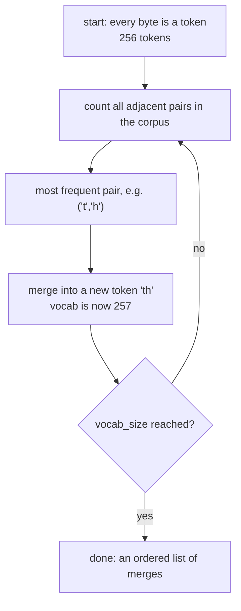

# 2. The tokenizer

## Why not just use letters?

You could feed the model one character at a time. 26 letters plus punctuation is a tiny
vocabulary. But `"international"` becomes 13 prediction steps instead of 1 or 2, so your
context window holds 5× less actual content and training costs 5× more for the same text.

You could go the other way and give every *word* its own id. But then "running" and "run"
are unrelated symbols, typos are unknown tokens, and a real vocabulary is millions of
words.

**Subword tokenization** splits the difference: common words get one token, rare words get
broken into pieces.

```
"The capital of France is Paris"
  ↓
["The", " capital", " of", " France", " is", " Paris"]     6 tokens

"antidisestablishmentarianism"
  ↓
["ant", "idis", "establish", "ment", "arian", "ism"]        6 tokens
```

Rule of thumb: **~4 characters per token** for English. 1,000 words ≈ 1,300 tokens.

Note the leading spaces — `" capital"` includes its space. That's deliberate; it means
detokenizing is pure concatenation with no guessing about where spaces go.

---

## How BPE learns the vocabulary

Byte-Pair Encoding starts with individual bytes and repeatedly merges the most frequent
adjacent pair.



Worked example on a toy corpus:

```
corpus:  "low low low lower lowest"

step 1:  'l'+'o' is the most common pair    →  add "lo"
         "lo w lo w lo w lo wer lo west"
step 2:  'lo'+'w' is now most common        →  add "low"
         "low low low low er low est"
step 3:  'e'+'r'                            →  add "er"
         "low low low low er low est"
```

After 8,000 merges you have a vocabulary where "the", " and", " because" are single
tokens, and anything unusual falls back to smaller pieces. Encoding new text just replays
the learned merges in order.

---

## Byte-level: no unknown tokens, ever

Our base alphabet is the 256 possible **byte** values, not characters. Any input —
emoji, Cyrillic, corrupted bytes, control codes — is representable, because all digital
text is bytes.

```python
s = "Once upon a time, Lily found a ball! 3.14 émoji 🎈"
tok.decode(tok.encode(s)) == s     # True, always
```

This is why you'll never see `<UNK>` in a modern model.

---

## Why we train our own instead of borrowing Llama's

The embedding table is `vocab_size × d_model` numbers, and (with weight tying) it's used
both to look up tokens and to produce output scores.

For our Phase 2 model, `d_model = 1024`:

| vocab | embedding params | share of a 300M model |
|---|---|---|
| 8,192 | 8.4M | 3% |
| **32,768** | **33.5M** | **11%** |
| 128,256 (Llama 3) | 131M | 44% ❌ |

Llama's 128k vocabulary is sized for a 70B model where 131M params is a rounding error.
Bolted onto a 300M model it would eat nearly half the parameter budget on tokens we'll
never see. A vocabulary fitted to *our* corpus at 32k both compresses our text better and
leaves the parameters where they do work.

**Guidance:**

| model size | vocab |
|---|---|
| < 50M | 8k |
| 50M – 1B | 32k |
| > 1B | 32k – 64k |

---

## The pre-tokenizer regex

Before BPE runs, text is split into chunks that merges are *not allowed* to cross. Ours
is GPT-4's pattern ([`tokenizer.py`](../aksharallm/tokenizer/tokenizer.py)):

```
'(?i:[sdmt]|ll|ve|re)      contractions: 's 'd 'm 't 'll 've 're
| [^\r\n\p{L}\p{N}]?+\p{L}++   a word, with at most one leading non-letter (the space)
| \p{N}{1,3}               numbers, at most 3 digits at a time
| ?[^\s\p{L}\p{N}]++[\r\n]* punctuation runs
| \s*[\r\n] | \s+(?!\S) | \s+   whitespace
```

Two of these are load-bearing:

- **`\p{N}{1,3}`** caps numeric tokens at 3 digits. Without it, BPE memorises thousands of
  specific numbers ("2019", "1000") as atomic units, and the model's arithmetic gets worse
  because "1234" and "1235" become unrelated symbols. Capping at 3 forces consistent
  digit-group structure.
- **Splitting on whitespace boundaries** prevents merges spanning `"end. Start"`, which
  would create tokens that only appear in one sentence context.

---

## Special tokens

Reserved at fixed ids so code can rely on them:

| id | token | purpose |
|---|---|---|
| 0 | `<\|endoftext\|>` | document boundary; also serves as BOS and EOS |
| 1 | `<\|pad\|>` | padding — never contributes to loss |
| 2 | `<\|im_start\|>` | begins a chat role block |
| 3 | `<\|im_end\|>` | ends a chat role block |

They're at the front so they stay stable across vocabulary sizes.

---

## The chat template

Post-training needs conversation structure. We use ChatML:

```
<|im_start|>user
What is 2+2?<|im_end|>
<|im_start|>assistant
Four.<|im_end|>
```

`render_chat()` builds this **token by token**, not by formatting a string, because SFT
needs to know exactly which indices belong to the assistant:

```python
ids, mask = tok.render_chat([
    {"role": "user",      "content": "What is 2+2?"},
    {"role": "assistant", "content": "Four."},
])
# mask is 1 only on the assistant's tokens — the ones we train on
```

If you built the string first and tried to find the boundary afterwards, you'd be
searching for substrings in text that may contain the delimiter itself. Token-level
construction makes it exact. More in [doc 5](05-posttraining.md).

---

## Inspecting a tokenizer

```python
from aksharallm.tokenizer.tokenizer import Tokenizer
tok = Tokenizer("data/tinystories/tokenizer.json")

ids = tok.encode("Once upon a time")
print(ids)                                    # [7454, 2402, 264, 892]
print([tok.decode([i]) for i in ids])         # ['Once', ' upon', ' a', ' time']
print(len("Once upon a time") / len(ids))     # chars per token — want ~4
```

**Chars-per-token is your quality metric.** If it's below 3, your vocabulary is too small
or mismatched to your corpus, and you're wasting context and compute on every single
sequence.

---

## The code, in reading order

One file, and it is 142 lines — read it top to bottom in this order:

| # | file | what to look for |
|---|---|---|
| 1 | [`aksharallm/tokenizer/tokenizer.py`](../aksharallm/tokenizer/tokenizer.py) | `SPLIT_PATTERN` and `SPECIAL_TOKENS` at the top — the regex above and the four fixed ids |
| 2 | same file | `train_bpe` — merges learned from a corpus, and the byte-level alphabet that makes `<UNK>` impossible |
| 3 | same file | `Tokenizer.encode` / `decode` / `encode_batch` — the replay of those merges, and the batch path the data prep uses across processes |
| 4 | same file | `render_chat` — ChatML built **token by token**, returning `(ids, mask)`. The mask is what [doc 5](05-posttraining.md) trains on; nothing downstream searches for delimiters in a string |
| 5 | [`aksharallm/data/prepare.py`](../aksharallm/data/prepare.py) | `main` — where the tokenizer is fitted before anything is tokenized, and `_init_worker`, which loads one per process |

What pins it: `tests/test_pipeline.py::test_roundtrip_including_unicode`,
`::test_special_token_ids_are_stable` and `::test_chat_mask_covers_only_assistant_content`.
Break the round trip on purpose in [lesson 2](lessons/02-tokenizer.md).

---

Next: [3. The model →](03-model.md)
