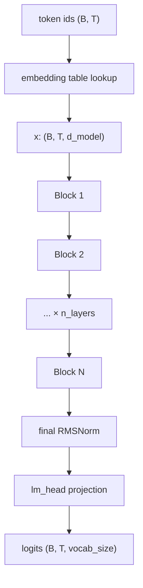
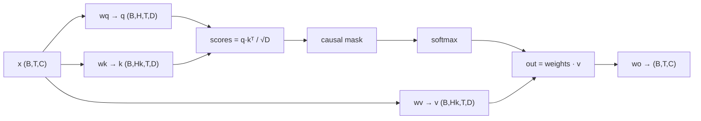
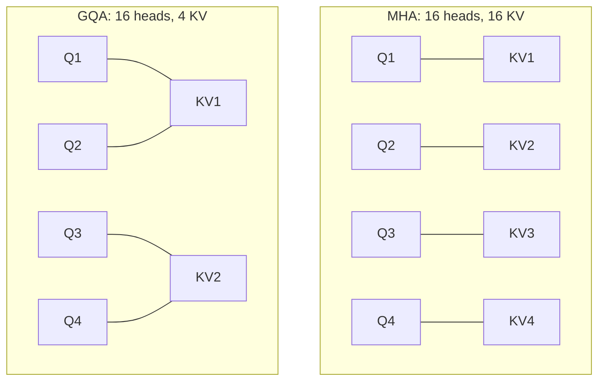
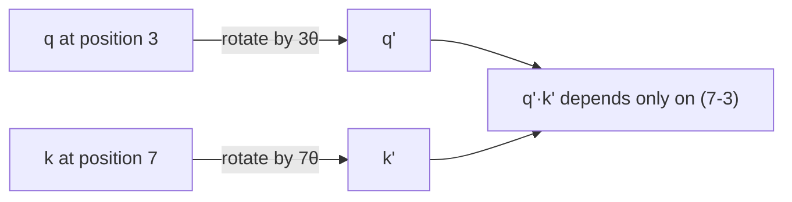

# 3. The model

All of it is in [`aksharallm/model/transformer.py`](../aksharallm/model/transformer.py), about
300 lines. This doc walks through it.

## The shape of the thing



Notation used everywhere in the code:

| | meaning | Phase 2 value |
|---|---|---|
| `B` | batch size | 12 |
| `T` | sequence length | 1024 |
| `C` / `d_model` | width of the residual stream | 1024 |
| `H` | attention heads | 16 |
| `Hk` | key/value heads (GQA) | 4 |
| `D` | dimension per head = `C/H` | 64 |

---

## The residual stream

This is the mental model that makes everything else click.

Think of `x` — shape `(B, T, d_model)` — as a **conveyor belt of information**, one slot
per token position. Every layer *reads* from the belt, computes something, and *adds* its
result back. Nothing ever overwrites the belt.

```python
x = x + self.attn(self.attn_norm(x), ...)   # attention adds its update
x = x + self.ffn(self.ffn_norm(x))          # the MLP adds its update
```

Two consequences:

1. **Gradients flow freely.** The `+` means the gradient reaches layer 0 unattenuated, no
   matter how deep the network is. This is what made training deep networks possible at
   all.
2. **Layers can specialise.** Early layers add syntactic information, later layers add
   semantic information, and each can read whatever earlier layers wrote.

Note we normalise a *copy* (`attn_norm(x)`) and never the belt itself. That's **pre-norm**,
and it's why modern transformers train stably where the 2017 original needed careful
warmup tricks.

---

## Attention

The one mechanism that makes transformers work. Each position asks a question, every
earlier position offers an answer, and the position takes a weighted average.

Each token produces three vectors:

- **Query** (`q`) — "what am I looking for?"
- **Key** (`k`) — "what do I offer?"
- **Value** (`v`) — "what do I actually contribute?"



In one line:

```
attention(q,k,v) = softmax( q·kᵀ / √D  +  causal_mask ) · v
```

- `q·kᵀ` — how well does each query match each key? High dot product = high relevance.
- `/ √D` — without this, dot products in high dimensions grow large, softmax saturates,
  and gradients vanish.
- **causal mask** — position *t* may only attend to positions ≤ *t*. Without it the model
  sees the answer it's predicting, gets ~0 loss, and is useless at generation.
- `softmax` — turns scores into weights summing to 1.
- `· v` — the weighted average.

**Multiple heads** run this in parallel with different projections, so one head can track
syntax while another tracks long-range references.

### In our code

```python
out = F.scaled_dot_product_attention(q, k, v, is_causal=is_causal, enable_gqa=...)
```

We call PyTorch's fused kernel rather than writing the softmax by hand. It dispatches to
**FlashAttention**, which never materialises the `(T, T)` attention matrix — at `T=1024`
that matrix would be 4 MB *per head per batch item*, and it's the main reason naive
implementations run out of memory. Same math, dramatically less memory traffic.

One subtlety in the code worth reading twice:

```python
is_causal = cache is None or T > 1
```

During incremental generation we feed exactly one token with a warm KV cache. That single
query sits at the *end* of the sequence and legitimately attends to everything cached.
Passing `is_causal=True` there would mask almost all of it — a classic bug that produces
a model that trains fine and generates garbage.

---

## Grouped-Query Attention (GQA)

Standard attention gives every head its own keys and values. GQA lets several query heads
**share** one key/value head.



Why bother? **The KV cache.** At generation time you store keys and values for every
position, every layer:

```
cache size = 2 × n_layers × n_kv_heads × seq_len × head_dim × 2 bytes
```

For our Phase 2 model at 1024 context:
- MHA (16 KV heads): 100 MB
- GQA (4 KV heads): **25 MB**

Quality loss is small; memory saving is 4×. Every modern model uses it. We keep plain MHA
in Phase 1 because at 13.8M params there's nothing to save.

---

## RoPE — how the model knows word order

Attention is a weighted average, and averages don't care about order. Without positional
information, "dog bites man" and "man bites dog" are identical to the model.

The old fix was adding a learned "position 5" vector to each embedding. **Rotary Position
Embedding** is better: it *rotates* the query and key vectors by an angle proportional to
their position.



The magic: when you take the dot product of two rotated vectors, the absolute angles
cancel and only the **difference** survives. So attention automatically sees *relative*
distance — "4 tokens back" — which is what actually matters linguistically, and which
generalises to positions never seen in training.

Channel pairs rotate at geometrically decreasing frequencies, so early channels spin fast
(encoding fine local position) and late channels spin slowly (encoding coarse global
position) — much like the binary digits of a counter.

We verify both properties in [`tests/test_model.py`](../tests/test_model.py): rotation
preserves vector norms, and the dot product for positions (5,10) equals that for (20,25).

---

## RMSNorm

```python
x = x / sqrt(mean(x²) + eps) * weight
```

Keeps activations at a consistent scale so nothing explodes over 24 layers. It's LayerNorm
minus the mean-subtraction and the bias — those turn out not to matter, and dropping them
is measurably faster.

We upcast to fp32 for the mean-of-squares. Computing that statistic in bf16 (which has
only 8 bits of mantissa) loses real precision, and it's cheap enough not to care.

---

## SwiGLU — the feed-forward network

```python
FFN(x) = W2( silu(W1 x) * W3 x )
```

The elementwise `*` is a **gate**: the `W1` branch decides, per channel, how much of the
`W3` branch gets through. It's a learned, content-dependent filter, and it consistently
beats a plain `W2(gelu(W1 x))` at equal parameter count.

Three matrices instead of two means we shrink the hidden dimension to keep the budget
even — `d_ff ≈ (8/3) × d_model` instead of the classic `4 × d_model`.

If attention is where tokens *communicate*, the FFN is where each token *thinks* on its
own. It's also where most of the parameters live (~⅔ of the model).

That last sentence is why this is the one part of the architecture worth replacing. A
**mixture of experts** swaps this single FFN for N of them plus a router, and sends each
token to only the top-k — more parameters, the same compute per token. It changes exactly
one line of `Block.__init__` and nothing else about attention, RoPE, the norms or the
residual path. See [doc 14](14-moe.md).

---

## Weight tying

```python
self.lm_head.weight = self.tok_emb.weight
```

The input embedding (id → vector) and the output projection (vector → scores) are the same
matrix. It saves `vocab × d_model` parameters — 33.5M in Phase 2 — and helps quality at
small scale. The intuition: both directions encode the same "what does this token mean"
relationship.

---

## Initialisation

Two things matter:

```python
nn.init.normal_(module.weight, mean=0.0, std=0.02)          # everything
# then, for projections that write into the residual stream:
std = 0.02 / math.sqrt(2 * n_layers)                        # wo and w2
```

Every layer *adds* to the residual stream, so after `n_layers` additions the variance has
grown by a factor of `n_layers`. Scaling down the two output projections (`wo` in
attention, `w2` in the FFN) compensates. Skip this and deep models diverge in the first
few hundred steps.

**Sanity check:** a correctly initialised model has loss ≈ `ln(vocab_size)` on step 0 —
it's guessing uniformly. For our 8192 vocab that's 9.01, and our run logged **9.06**. If
your step-0 loss is far off, something is wrong before you've trained at all.

---

## Sizing a model

Parameter count for a Llama-style model:

```
embedding   = vocab × d_model                      (shared with output, tied)
per layer   = 4 × d_model²          (attention, if MHA)
            + 3 × d_model × d_ff    (SwiGLU)
total       = embedding + n_layers × per_layer
```

Conventions that hold up in practice:

- `d_ff ≈ (8/3) × d_model`, rounded to a multiple of 64 (tensor-core friendly)
- `head_dim = 64` — so `n_heads = d_model / 64`
- **width/depth ratio**: `d_model ≈ 64 × n_layers` is a reasonable balance. Too deep and
  narrow trains slowly; too wide and shallow underperforms per parameter.

| target | d_model | layers | heads | KV | params |
|---|---|---|---|---|---|
| tiny | 384 | 6 | 6 | 6 | 13.8M |
| small | 768 | 12 | 12 | 4 | 125M |
| **Phase 2** | **1024** | **24** | **16** | **4** | **~300M** |
| large | 1536 | 24 | 24 | 8 | ~700M |

---

## Verifying it

```bash
python -m pytest tests/ -q
```

The tests worth understanding:

| test | what it protects against |
|---|---|
| `test_init_loss_is_uniform` | broken initialisation |
| `test_causality` | the model peeking at future tokens |
| `test_rope_preserves_norm_and_relative_position` | a broken RoPE implementation |
| **`test_kv_cache_matches_full_forward`** | **the highest-value test in the repo** |
| `test_optimizer_param_grouping` | weight decay applied to norm gains |

That KV-cache test asserts that generating token-by-token with a cache produces *bit-for-
bit* the same logits as one full forward pass. A cache bug doesn't show up in training
loss at all — the model trains beautifully and then generates nonsense, and you have no
idea which of the two is broken.

---

Next: [4. Pretraining →](04-pretraining.md)
