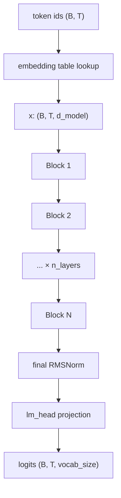
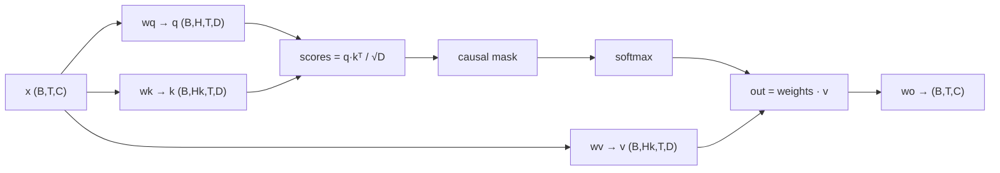
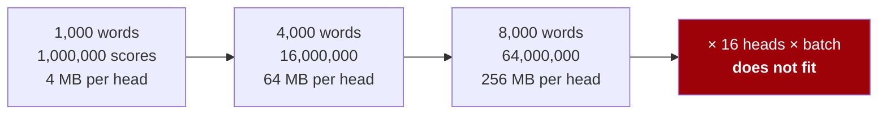
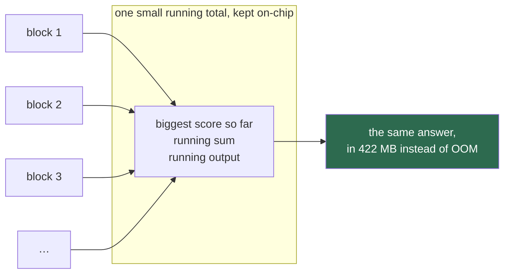
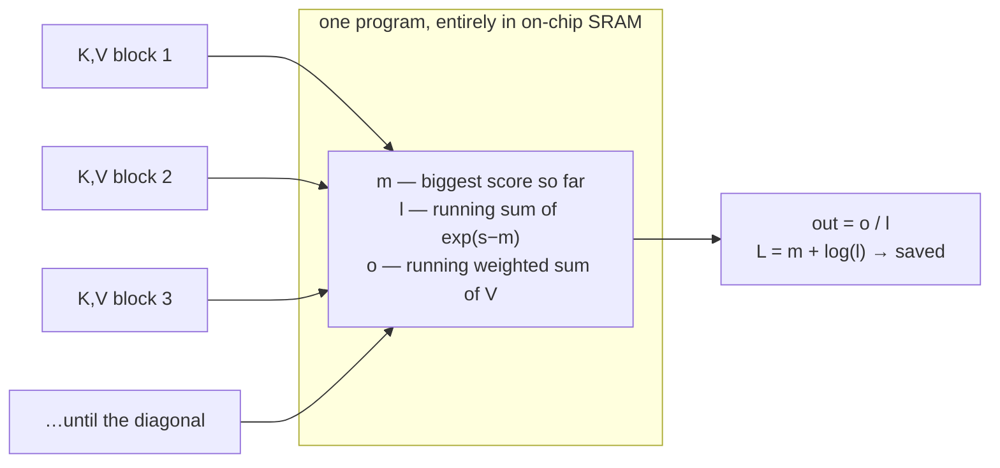
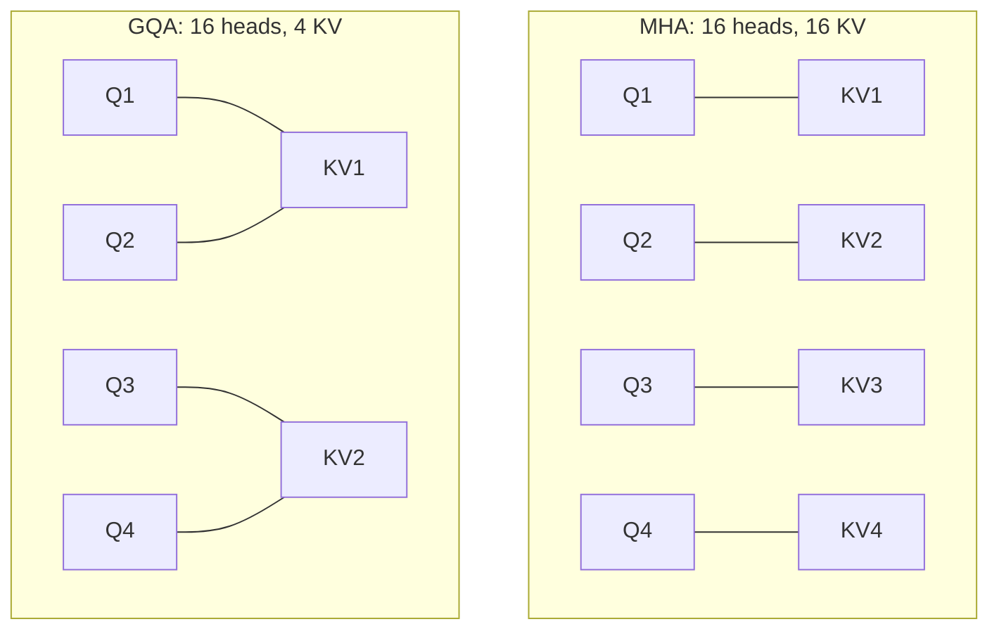
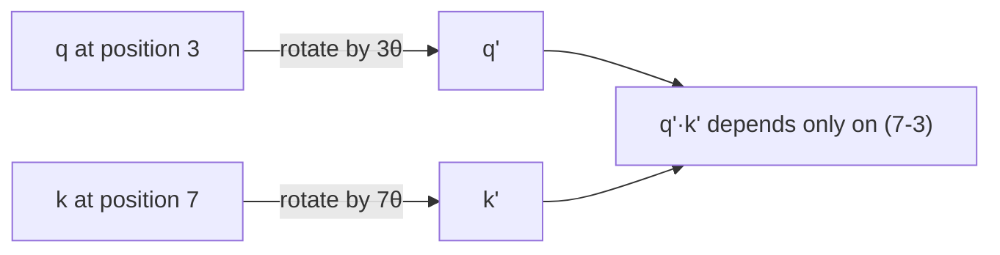

# 4. The model

All of it is in [`aksharallm/model/transformer.py`](../aksharallm/model/transformer.py), about
300 lines. This doc walks through it.

## The shape of the thing



Notation used everywhere in the code:

| | meaning | Phase 2 value |
|---|---|---|
| `B` | batch size | 12 |
| `T` | sequence length | 1024 |
| `C` / `d_model` | width of the residual stream | 1024 |
| `H` | attention heads | 16 |
| `Hk` | key/value heads (GQA) | 4 |
| `D` | dimension per head = `C/H` | 64 |

---

## The residual stream

This is the mental model that makes everything else click.

Think of `x` — shape `(B, T, d_model)` — as a **conveyor belt of information**, one slot
per token position. Every layer *reads* from the belt, computes something, and *adds* its
result back. Nothing ever overwrites the belt.

```python
x = x + self.attn(self.attn_norm(x), ...)   # attention adds its update
x = x + self.ffn(self.ffn_norm(x))          # the MLP adds its update
```

Two consequences:

1. **Gradients flow freely.** The `+` means the gradient reaches layer 0 unattenuated, no
   matter how deep the network is. This is what made training deep networks possible at
   all.
2. **Layers can specialise.** Early layers add syntactic information, later layers add
   semantic information, and each can read whatever earlier layers wrote.

Note we normalise a *copy* (`attn_norm(x)`) and never the belt itself. That's **pre-norm**,
and it's why modern transformers train stably where the 2017 original needed careful
warmup tricks.

---

## Attention

The one mechanism that makes transformers work. Each position asks a question, every
earlier position offers an answer, and the position takes a weighted average.

Each token produces three vectors:

- **Query** (`q`) — "what am I looking for?"
- **Key** (`k`) — "what do I offer?"
- **Value** (`v`) — "what do I actually contribute?"



In one line:

```
attention(q,k,v) = softmax( q·kᵀ / √D  +  causal_mask ) · v
```

- `q·kᵀ` — how well does each query match each key? High dot product = high relevance.
- `/ √D` — without this, dot products in high dimensions grow large, softmax saturates,
  and gradients vanish.
- **causal mask** — position *t* may only attend to positions ≤ *t*. Without it the model
  sees the answer it's predicting, gets ~0 loss, and is useless at generation.
- `softmax` — turns scores into weights summing to 1.
- `· v` — the weighted average.

**Multiple heads** run this in parallel with different projections, so one head can track
syntax while another tracks long-range references.

### In our code

```python
out = F.scaled_dot_product_attention(q, k, v, is_causal=is_causal, enable_gqa=...)
```

We call PyTorch's fused kernel rather than writing the softmax by hand. It dispatches to
**FlashAttention**, which never materialises the `(T, T)` attention matrix — at `T=1024`
that matrix would be 4 MB *per head per batch item*, and it's the main reason naive
implementations run out of memory. Same math, dramatically less memory traffic.

One subtlety in the code worth reading twice:

```python
is_causal = attn_mask is None and T > 1
```

During incremental generation we feed exactly one token with a warm KV cache. That single
query sits at the *end* of the sequence and legitimately attends to everything cached.
Passing `is_causal=True` there would mask almost all of it — a classic bug that produces
a model that trains fine and generates garbage.

---

## FlashAttention, written from scratch

### First, in plain terms

To choose its next word, the model scores **every word against every earlier word**. That is
a grid. A thousand words is a million scores; eight thousand words is sixty-four million.



Written the obvious way, that grid is *built in memory* — and it is the reason long contexts
run out of memory rather than merely running slowly. Multiply by sixteen heads and a batch
and a 24 GB card is gone.

**FlashAttention's trick is to never build it.** It walks the text in blocks, keeps a small
running total per row, and rescales that total whenever a block turns out to contain a bigger
score than anything seen so far. The answer is *exactly* the same — not an approximation —
and the memory stops growing with length:



Calling somebody else's kernel is the right thing for a run and the wrong thing for a repo
whose claim is that every core piece is hand-written. So there is a second implementation,
ours, in [`model/flash.py`](../aksharallm/model/flash.py) — the same algorithm in Triton,
forward *and* backward. Turn it on with one config line:

```yaml
model:
  attn_impl: flash      # default is "sdpa"
```

The portal's **Context** tab has a panel for this — the explanation above, the measured
numbers, and a button that reproduces the benchmark on your own card. It sits there rather
than on a tab of its own because it is the other half of the same question:
[doc 19](19-long-context.md) is about how far the model can read, and this is what reading
that far costs.

### The one idea: online softmax

Naive attention computes the whole `(T, S)` score matrix, softmaxes it, then multiplies by
`V`. The matrix is the problem: it is written to memory and read back twice, and it grows
as `T²`.

FlashAttention never builds it. It walks the keys in **blocks**, keeping three small
running values per query row — and the accumulated output is *rescaled* whenever a block
turns out to contain a bigger score than anything seen so far:



The rescale is one line of algebra:

```
exp(s − m_new) = exp(s − m_old) · exp(m_old − m_new)
```

which makes softmax **associative** — and therefore computable in a single streaming pass.
The result is not an approximation and not a windowed attention. It is the same number, on
a different memory schedule.

### The backward pass, and the one float that makes it possible

The gradient needs `P = softmax(S)` — precisely the matrix the forward pass refused to
keep. The way out is to *recompute* it, and to recompute a softmax you only need its
denominator. So the forward saves **one float per query row**, the log-sum-exp
`L = m + log(l)`, and the backward rebuilds `P = exp(S − L)` block by block:

| what is stored for the backward | shape | at our 300M's training shape |
|---|---|---|
| the score matrix (naive) | `(B, H, T, T)` | **3.0 GB** |
| the log-sum-exp (flash) | `(B, H, T)` | **0.8 MB** |

Then the chain rule, with one term that is not obvious:

```
dV = Pᵀ dO
dP = dO Vᵀ
dS = P ⊙ (dP − rowsum(dO ⊙ O))     ← the softmax Jacobian, collapsed to one number per row
dQ = dS K · scale        dK = dSᵀ Q · scale
```

`rowsum(dO ⊙ O)` is what is left of the Jacobian `diag(p) − p pᵀ` once you notice that
`pᵀ dP` equals `dO · O` for that row.

### The trap: the diagonal is bottom-right

Query `m` of `T` may see key `n` of `S` iff **`n ≤ m + (S − T)`**. That offset is the same
bug already documented above for `is_causal`, and it is why one integer `DIAG = S - T`
covers all three cases the model actually produces:

| case | T | S | DIAG | what falls out |
|---|---|---|---|---|
| training / prefill | 1024 | 1024 | 0 | the ordinary triangle |
| one decode step | 1 | 512 | 511 | every cached key is visible |
| a speculative draft block | 4 | 512 | 508 | each guess sees the prefix plus the guesses before it |

Aligned top-left instead, a draft block sees keys `0..j` — most of the prompt vanishes, the
model trains fine, and it generates fluent nonsense.
`tests/test_flash.py::test_causal_is_bottom_right_aligned` is the whole defence.

### What it is worth (measured, RTX 3090, B=4 H=16 Hk=4 D=64 bf16 causal)

| T | ours fwd | SDPA fwd | | ours fwd+bwd | SDPA fwd+bwd | | peak MB: ours | SDPA | naive `(T,S)` |
|---|---|---|---|---|---|---|---|---|---|
| 512 | 0.119 ms | 0.087 | 0.73× | 0.517 ms | 0.376 | 0.73× | 263 | 263 | 418 |
| 1024 | 0.225 | 0.206 | 0.91× | 0.994 | 0.816 | 0.82× | 273 | 273 | 852 |
| 2048 | 0.614 | 0.624 | **1.02×** | 2.908 | 2.408 | 0.83× | 294 | 294 | 2,525 |
| 4096 | 2.094 | 2.128 | **1.02×** | 9.625 | 7.827 | 0.81× | 337 | 337 | 9,094 |
| 8192 | 7.950 | 7.925 | 1.00× | 35.673 | 28.818 | 0.81× | **422** | 422 | **OOM** |

Read that honestly. SDPA *is* FlashAttention-2, hand-written in PTX with years of tuning
behind it, so the ambition was parity and not victory. The forward reaches it from T=2048
up. The backward stays ~20% behind, and the reason is structural rather than a missing
trick: ours recomputes the scores **twice** (once in the dK/dV kernel, once in the dQ
kernel) because that is what keeps each program the sole writer of its output and avoids
atomics.

End to end on the real 300M config, one training step at B=4 × 1024:

| | ms/step | tok/s | MFU |
|---|---|---|---|
| `attn_impl: sdpa` | 212.0 | 19,318 | **51.6%** |
| `attn_impl: flash` | 216.9 | 18,888 | 50.5% |

**2.3%**, which also tells you something useful about the model: at `T=1024` attention is
only about a tenth of a step, and the other nine tenths are the FFN and the vocabulary
projection. Attention's share grows as `T²`, so the same 20% would cost ~6% at 4k and the
kernel is worth returning to when [long context](../PLAN.md) lands.

So the default stays `sdpa`. This file exists to be read, benchmarked and broken —
`python -m aksharallm.model.flash` reproduces every number above on your own card — and it
falls back to SDPA for any shape it does not handle (a mask, dropout, a single decode row,
an unsupported head dimension), so `attn_impl: flash` is never a correctness risk.

Two things the sweep taught that were not obvious:

- **`num_warps` mattered 1.7×, block size barely mattered at all.** Eight warps on a 64×64
  backward tile took 4.85 ms where four warps took 2.90. More warps than a tile has work
  for is not free parallelism — it slices the tile thinner and spends the difference on
  cross-warp reduction.
- **The budget is SRAM, and fp32 is two bytes more of it.** The block sizes that fit in bf16
  do not fit in fp32, and the failure is a hard `OutOfResources` at launch rather than
  anything subtle — which is the one nice thing about it. `_blocks()` takes `itemsize` for
  exactly that reason.

**Sliding windows compose with it.** `attn_window` and `attn_sinks` reach the kernel as two
integers rather than as a mask, which is the concrete payoff for owning it: the equivalent
bool tensor is 64 MB at T=8192, and long context is exactly where that matters. The kernel
still *walks* the skipped key blocks and masks them rather than never loading them, so today
a window costs no memory and saves no time — see [doc 19](19-long-context.md).

---

## Grouped-Query Attention (GQA)

Standard attention gives every head its own keys and values. GQA lets several query heads
**share** one key/value head.



Why bother? **The KV cache.** At generation time you store keys and values for every
position, every layer:

```
cache size = 2 × n_layers × n_kv_heads × seq_len × head_dim × 2 bytes
```

For our Phase 2 model at 1024 context:
- MHA (16 KV heads): 100 MB
- GQA (4 KV heads): **25 MB**

Quality loss is small; memory saving is 4×. Every modern model uses it. We keep plain MHA
in Phase 1 because at 13.8M params there's nothing to save.

---

## RoPE — how the model knows word order

Attention is a weighted average, and averages don't care about order. Without positional
information, "dog bites man" and "man bites dog" are identical to the model.

The old fix was adding a learned "position 5" vector to each embedding. **Rotary Position
Embedding** is better: it *rotates* the query and key vectors by an angle proportional to
their position.



The magic: when you take the dot product of two rotated vectors, the absolute angles
cancel and only the **difference** survives. So attention automatically sees *relative*
distance — "4 tokens back" — which is what actually matters linguistically, and which
generalises to positions never seen in training.

Channel pairs rotate at geometrically decreasing frequencies, so early channels spin fast
(encoding fine local position) and late channels spin slowly (encoding coarse global
position) — much like the binary digits of a counter.

We verify both properties in [`tests/test_model.py`](../tests/test_model.py): rotation
preserves vector norms, and the dot product for positions (5,10) equals that for (20,25).

---

## RMSNorm

```python
x = x / sqrt(mean(x²) + eps) * weight
```

Keeps activations at a consistent scale so nothing explodes over 24 layers. It's LayerNorm
minus the mean-subtraction and the bias — those turn out not to matter, and dropping them
is measurably faster.

We upcast to fp32 for the mean-of-squares. Computing that statistic in bf16 (which has
only 8 bits of mantissa) loses real precision, and it's cheap enough not to care.

---

## SwiGLU — the feed-forward network

```python
FFN(x) = W2( silu(W1 x) * W3 x )
```

The elementwise `*` is a **gate**: the `W1` branch decides, per channel, how much of the
`W3` branch gets through. It's a learned, content-dependent filter, and it consistently
beats a plain `W2(gelu(W1 x))` at equal parameter count.

Three matrices instead of two means we shrink the hidden dimension to keep the budget
even — `d_ff ≈ (8/3) × d_model` instead of the classic `4 × d_model`.

If attention is where tokens *communicate*, the FFN is where each token *thinks* on its
own. It's also where most of the parameters live (~⅔ of the model).

That last sentence is why this is the one part of the architecture worth replacing. A
**mixture of experts** swaps this single FFN for N of them plus a router, and sends each
token to only the top-k — more parameters, the same compute per token. It changes exactly
one line of `Block.__init__` and nothing else about attention, RoPE, the norms or the
residual path. See [doc 15](15-moe.md).

---

## Weight tying

```python
self.lm_head.weight = self.tok_emb.weight
```

The input embedding (id → vector) and the output projection (vector → scores) are the same
matrix. It saves `vocab × d_model` parameters — 33.5M in Phase 2 — and helps quality at
small scale. The intuition: both directions encode the same "what does this token mean"
relationship.

---

## Initialisation

Two things matter:

```python
nn.init.normal_(module.weight, mean=0.0, std=0.02)          # everything
# then, for projections that write into the residual stream:
std = 0.02 / math.sqrt(2 * n_layers)                        # wo and w2
```

Every layer *adds* to the residual stream, so after `n_layers` additions the variance has
grown by a factor of `n_layers`. Scaling down the two output projections (`wo` in
attention, `w2` in the FFN) compensates. Skip this and deep models diverge in the first
few hundred steps.

**Sanity check:** a correctly initialised model has loss ≈ `ln(vocab_size)` on step 0 —
it's guessing uniformly. For our 8192 vocab that's 9.01, and our run logged **9.06**. If
your step-0 loss is far off, something is wrong before you've trained at all.

---

## Sizing a model

Parameter count for a Llama-style model:

```
embedding   = vocab × d_model                      (shared with output, tied)
per layer   = 4 × d_model²          (attention, if MHA)
            + 3 × d_model × d_ff    (SwiGLU)
total       = embedding + n_layers × per_layer
```

Conventions that hold up in practice:

- `d_ff ≈ (8/3) × d_model`, rounded to a multiple of 64 (tensor-core friendly)
- `head_dim = 64` — so `n_heads = d_model / 64`
- **width/depth ratio**: `d_model ≈ 64 × n_layers` is a reasonable balance. Too deep and
  narrow trains slowly; too wide and shallow underperforms per parameter.

| target | d_model | layers | heads | KV | params |
|---|---|---|---|---|---|
| tiny | 384 | 6 | 6 | 6 | 13.8M |
| small | 768 | 12 | 12 | 4 | 125M |
| **Phase 2** | **1024** | **24** | **16** | **4** | **~300M** |
| large | 1536 | 24 | 24 | 8 | ~700M |

---

## Verifying it

```bash
python -m pytest tests/ -q
```

The tests worth understanding:

| test | what it protects against |
|---|---|
| `test_init_loss_is_uniform` | broken initialisation |
| `test_causality` | the model peeking at future tokens |
| `test_rope_preserves_norm_and_relative_position` | a broken RoPE implementation |
| **`test_kv_cache_matches_full_forward`** | **the highest-value test in the repo** |
| `test_optimizer_param_grouping` | weight decay applied to norm gains |

That KV-cache test asserts that generating token-by-token with a cache produces *bit-for-
bit* the same logits as one full forward pass. A cache bug doesn't show up in training
loss at all — the model trains beautifully and then generates nonsense, and you have no
idea which of the two is broken.

---

## The code, in reading order

Almost all of it is one file. Read it in **this** order rather than top to bottom — it is
laid out for the machine (leaves before the things that use them), and this order is the
data flow:

| # | file | what to look for |
|---|---|---|
| 1 | [`aksharallm/config.py`](../aksharallm/config.py) | `ModelConfig` — every dimension in the table above, plus `__post_init__`, where `d_ff` gets rounded and `head_dim` is derived |
| 2 | [`transformer.py`](../aksharallm/model/transformer.py) → `Transformer.forward` | **start here.** Embedding → blocks → final norm → `lm_head`, and the `if targets is None` branch that projects only the last position. Fifteen lines that name everything below |
| 3 | `Block.forward` | the residual stream in two lines: `x = x + attn(norm(x))`, `x = x + ffn(norm(x))`. Pre-norm — the belt itself is never normalised |
| 4 | `Attention.forward` | q/k/v projections, `apply_rope`, the cache update, then `F.scaled_dot_product_attention` — or our own kernel, if `attn_impl` says so. The line to read twice is `is_causal = self.causal and attn_mask is None and T > 1`; `self.causal` is False only for the masked diffusion model of [doc 20](20-diffusion.md), and it is the entire architectural difference between the two paradigms |
| 5 | `build_rope_cache` + `apply_rope` + `_rotate_half` | the geometric frequencies, and the rotation whose dot product depends only on the *distance* |
| 6 | `RMSNorm.forward` · `SwiGLU.forward` | four lines each. Note the fp32 upcast for the mean-of-squares, and the gate `silu(w1 x) * (w3 x)` |
| 7 | `KVCache` | preallocated, `update` appends and returns the live prefix. Read it again with [doc 7](07-inference.md) |
| 8 | `Transformer._init_weights` · `configure_optimizers` · `num_params` · `estimate_mfu` | the `0.02/√(2·n_layers)` scaling for residual writers, the decay/no-decay split, and where the MFU number in the logs comes from |
| 9 | [`aksharallm/model/moe.py`](../aksharallm/model/moe.py) | optional — the one component that replaces step 6's FFN. [doc 15](15-moe.md) |
| 10 | [`aksharallm/model/flash.py`](../aksharallm/model/flash.py) | optional — step 4's attention, written out in Triton instead of called. Read the module docstring first (it is the derivation), then `_fwd_kernel`'s four-line online-softmax rescale, then `_bwd_kv_kernel` / `_bwd_q_kernel` and why there are two of them |
| 11 | [`aksharallm/model/rope.py`](../aksharallm/model/rope.py) | optional — step 5's frequency ladder, and the four ways of stretching it past the trained window. [doc 19](19-long-context.md) |

What pins it: `tests/test_model.py` is the shortest honest summary of this chapter —
`test_causality`, `test_rope_preserves_norm_and_relative_position`, `test_weight_tying`,
`test_init_loss_is_uniform`, and above all `test_kv_cache_matches_full_forward`. Break the
mask on purpose in [lesson 3](lessons/03-attention.md), the cache in
[lesson 4](lessons/04-kv-cache.md). `tests/test_flash.py` does the same job for the kernel,
against the `(T, S)`-matrix definition written out in fp32 — nine of ten deliberate mutants
were caught, and the tenth (deleting the diagonal block-skip) turned out not to be a
correctness mutant at all, only a slower kernel.

---

Next: [5. Pretraining →](05-pretraining.md)
