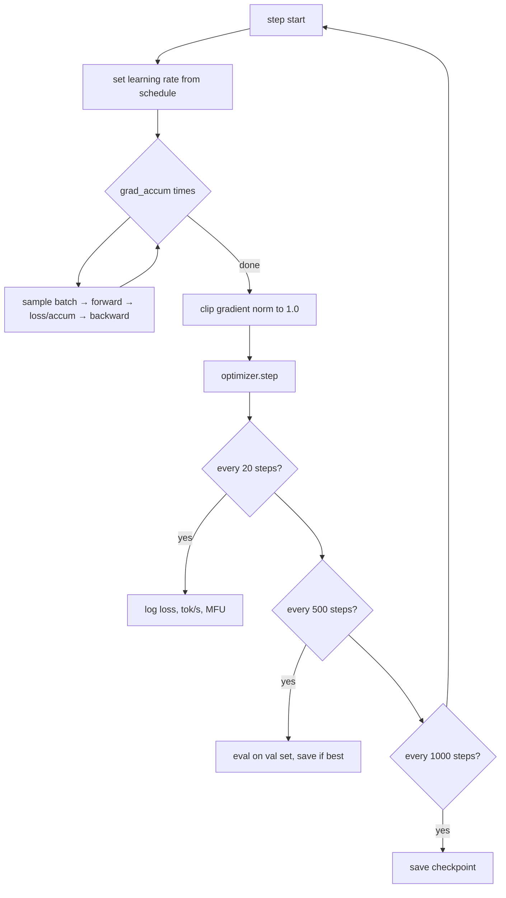
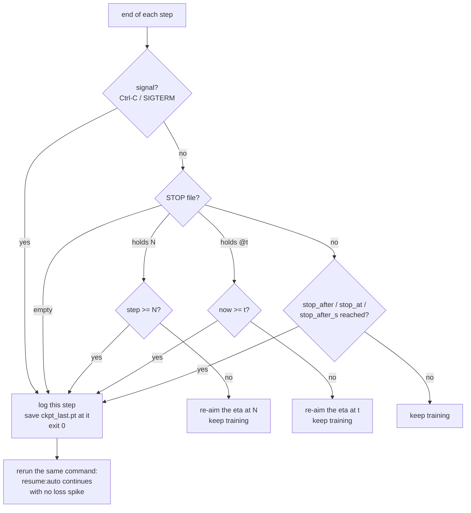

# 4. Pretraining

This is 99% of the compute and where the model learns essentially everything it knows.

## The entire objective

```python
x, y = data[i : i+T], data[i+1 : i+1+T]     # y is x shifted by one
logits, loss = model(x, targets=y)
loss.backward()
optimizer.step()
```

Four lines. Everything else in
[`train/pretrain.py`](../aksharallm/train/pretrain.py) exists to make those four lines
survive days of wall-clock without wasting your GPU or losing your progress.



---

## Batch size and gradient accumulation

A gradient computed from 16 sequences is a noisy estimate of the true gradient. Bigger
batches are less noisy and let you use a higher learning rate. But 24 GB of VRAM won't
hold a large batch.

**Gradient accumulation** decouples the two: run several micro-batches, summing gradients,
then step once.

```python
optimizer.zero_grad()
for _ in range(grad_accum):
    x, y = get_batch(batch_size)
    _, loss = model(x, targets=y)
    loss = loss / grad_accum        # ← critical
    loss.backward()                 # gradients accumulate
optimizer.step()
```

> The `/ grad_accum` makes the accumulated gradient a **mean** rather than a sum. Forget it
> and your effective learning rate silently scales with `grad_accum` — a common and
> confusing bug.

```
tokens per step = batch_size × grad_accum × seq_len
                = 48 × 2 × 512 = 49,152        (Phase 1)
```

**Tuning it:** raise `batch_size` until you hit OOM, back off ~10%, then set `grad_accum`
to reach your target tokens/step. Typical targets: ~50k tokens/step for a small model,
~250k–500k for a few hundred million params.

---

## Mixed precision

```python
with torch.autocast("cuda", dtype=torch.bfloat16):
    logits, loss = model(x, targets=y)
```

Matmuls and activations run in **bf16** (16 bits); master weights and optimizer state stay
in **fp32**. Roughly 2× the speed and half the activation memory.

**Why bf16 and not fp16?** bf16 has the same exponent range as fp32 — it trades mantissa
bits for range. fp16's narrow range means gradients underflow to zero, which is why fp16
training needs a "gradient scaler" that multiplies the loss by a large factor and adjusts
it dynamically. With bf16 there is nothing to overflow and no scaler needed. Your 3090
(Ampere) supports bf16 natively; anything Turing or older does not.

We also enable TF32 for the fp32 matmuls that autocast leaves alone:

```python
torch.backends.cuda.matmul.allow_tf32 = True
```

---

## Learning rate schedule

The LR matters more than almost any other hyperparameter.

```
lr
 ^        ___________
 |       /           \____
 |      /                 \______
 |     /                         \____
 +----/-------------------------------\---> step
   warmup         cosine decay        floor
```

- **Warmup** (~200 steps, or 1–2% of training). At init, gradients are large and
  uninformative; a full-size step there can permanently damage the embedding table. Ramp
  up from near zero.
- **Cosine decay** to a floor of `0.1 × lr`. Big steps early to explore, small steps late
  to settle into a minimum.
- **Never decay to exactly 0** — the final steps still do useful work.

Also available: `schedule: wsd` (Warmup-Stable-Decay) holds the LR flat and only decays
over the last 20%. Useful when you don't know `max_steps` in advance, since you can stop
any time by running the decay phase — a cosine locks you into its endpoint.

**Picking the base LR:** smaller models want higher LRs.

| params | typical peak LR |
|---|---|
| ~10M | 1e-3 |
| ~100M | 6e-4 |
| ~300M | 3e-4 |
| ~1B | 2e-4 |

---

## Gradient clipping

```python
grad_norm = torch.nn.utils.clip_grad_norm_(model.parameters(), 1.0)
```

If the global gradient norm exceeds 1.0, scale the whole gradient down. This is the single
most effective protection against one pathological batch destroying a six-day run.

**`grad_norm` is also your best health indicator.** Watch it in the logs:

| pattern | meaning |
|---|---|
| starts ~5, settles to 0.2–0.5, stable | healthy ✅ |
| repeated spikes to 10+ | bad data, or LR too high |
| growing steadily | diverging — stop and lower the LR |
| exactly 0.0 | no gradient is reaching the parameters — a bug |

---

## Weight decay, applied selectively

```python
decay, no_decay = [], []
for _, p in model.named_parameters():
    (decay if p.dim() >= 2 else no_decay).append(p)
```

Weight decay pulls parameters toward zero, a regulariser. It belongs on matmul weights
(2-D and up). It does **not** belong on 1-D parameters — RMSNorm gains, and biases if you
had them. Those have no redundancy to regularise and decaying them actively hurts.

---

## `torch.compile`

```python
model = torch.compile(model)
```

Traces the model and generates fused CUDA kernels. Measured on this repo:

| | eager | compiled |
|---|---|---|
| throughput | 260k tok/s | **460k tok/s** |
| MFU | 28% | **50%** |
| VRAM | 6.3 GB | **3.6 GB** |

1.7× faster *and* less memory, because fusion removes intermediate tensors. The first step
takes ~60 seconds while it compiles. Leave it on; disable only when debugging, since it
obscures tracebacks.

---

## Checkpointing

```python
tmp = path.with_suffix(".tmp")
torch.save(payload, tmp)
tmp.replace(path)          # atomic rename
```

Write to a temp file and rename. `rename` is atomic on POSIX, so a crash mid-save can
never leave you with a corrupt checkpoint — you still have the previous one.

Resume with `resume: auto` in the config; it picks up `ckpt_last.pt` if present, restoring
model weights, optimizer state (Adam's momentum — losing it causes a visible loss spike),
and the step counter.

Two checkpoints are kept: `ckpt_last.pt` (for resuming) and `ckpt_best.pt` (lowest val
loss, for using).

### Stopping and resuming a long run

A multi-day run needs to be interruptible. Every clean stop saves a checkpoint at the
*exact* current step before exiting — zero lost work:

```bash
# 1. Ctrl-C in the terminal running it
# 2. a backgrounded run, by pid file (written by scripts/phase2.sh):
scripts/stop.sh small-code        # graceful; waits for the save to finish
kill $(cat checkpoints/small-code/train.pid)   # the same thing, by hand
# 3. no terminal handy? drop a stop-file; it stops at the next step:
touch checkpoints/small-code/STOP
```

You'll see:

```
[stop] signal 15 received -- will save and exit after this step
[stop] signal -- saving ckpt_last.pt at step 8421 and exiting
[stop] ran 3600 steps in 2d04h, finished 2026-07-25 09:15:05
[stop] resume with the same command (resume:auto picks up step 8422).
```

Then **rerun the identical command** to continue. Because the LR schedule is a pure
function of the step number, and the optimizer state is restored, the resumed run is
mathematically identical to one that never stopped — the loss curve continues smoothly
with no spike. Verified: stop at step 22, resume, and step 30's loss lands exactly where an
uninterrupted run would put it.

A second Ctrl-C forces an immediate exit (you lose only the current step). Pulling the plug
— power loss, `kill -9` — costs you at most the steps since the last periodic
`ckpt_every` save (default every 500 steps ≈ 20 minutes at Phase 2 throughput).

### Stopping after N more steps — or after twenty minutes

Waiting up to babysit a `kill` is the wrong way to train in chunks. Every way to say "do
this much, then put yourself away" lands in the same save-and-exit path:

| you want | how |
|---|---|
| this launch does N steps | `train.stop_after: N` (or `STOP_AFTER=N scripts/phase2.sh`) |
| this launch trains for 30 minutes | `train.stop_after_s: 1800` (or `STOP_IN=30m scripts/phase2.sh`) |
| finish absolute step N, then stop | `train.stop_at: N` |
| tell a run **already going** to finish at step N | `echo N > checkpoints/<run>/STOP` |
| tell a run **already going** to stop in 20 minutes | `scripts/stop.sh <run> --in 20m` |
| …or to stop at 06:30 | `scripts/stop.sh <run> --by 06:30` |

The step bounds are **inclusive**: the step you name is trained, gets its log line, and is
what lands in `ckpt_last.pt`; the resume starts at N+1. That is deliberately *not*
`max_steps` semantics (`max_steps: N` makes the last step N-1) — if you asked to stop at 700
you want to see step 700, not 699.

The final step is logged **whatever `log_every` is**. Stopping at 699 with `log_every: 50`
would otherwise print no loss, throughput or gradient norm for the step you stopped on, and
leave the JSONL's last data record 49 steps behind the checkpoint — the numbers you stopped
to look at, missing.

`train.stop_after_s` is counted from the **first training step**, not from launch: pre-flight
and `torch.compile` can eat ten minutes before step one, and "train for half an hour" does
not mean "spend half an hour, twenty minutes of it compiling".

#### The STOP file holds three things, not two

The mid-run ones are the useful ones, and they are why the STOP file is *read* rather than
just tested for existence (`aksharallm/train/stopfile.py` is the whole contract, shared by
pretraining, SFT and QAT):

```
(empty)       stop after the current step
20000         stop on reaching step 20000
@1753985400   stop on the first step at or after this epoch time
```

`scripts/stop.sh <run> --at N / --after N / --in 30m / --by 06:30` write these for you
(`--after` reads the current step out of `train_log.jsonl` and adds N; `--in` and `--by`
convert to an epoch). Anything unreadable is treated as "stop now" — an ambiguous stop
request should stop, not be ignored.

The deadline lives **in the file** rather than in a timer somewhere, and that is the whole
design. A timer in your shell dies when you close the terminal; a timer in the portal dies
when the portal restarts; a duration converted to a step count when you press the button is
wrong the moment throughput changes — an eval pass, a thermal throttle, another process on
the card. A deadline the trainer reads every step is true in all of those cases.



The eta counts to whichever finish line comes first, and a deadline is compared in seconds
rather than converted to steps — it is already the answer the eta is estimating.

The file is never copied into the trainer's own bound, which is what makes
`scripts/stop.sh --cancel` (it just removes the file) genuinely put the run back on the
budget it launched with.

Because a deferred stop exits through the *same* path as Ctrl-C, nothing about resume
changes: a chunked run is still mathematically one continuous run.

---

## Reading the logs

Everything below can also be read as curves in a browser — `scripts/portal.sh` plots exactly
these fields out of `train_log.jsonl` (see `docs/07-scaling.md`). The text log stays the
source of truth; the portal never writes to it.

```
[09:15:05] step   3120 | loss 1.6728 (ema 1.6767) | ppl   5.3 | lr 7.23e-04 |
           gnorm 0.29 | 463.8k tok/s | mfu 50.9% | 3.6GB | 0.53s/step |
           up 2d04h | eta 18h30m
```

| field | what to check |
|---|---|
| `[09:15:05]` | wall-clock time of the line. Answers "when did it stall?" days later. |
| `loss` | should fall fast then slowly. Flat from step 0 = LR too low or a bug. |
| `ema` | smoothed loss — the real trend |
| `ppl` | `e^loss` |
| `gnorm` | see the table above |
| `tok/s` | should be *constant*. A drop means thermal throttling or another process. |
| `mfu` | Model FLOPs Utilisation — see below |
| `s/step` | seconds per step over this window — the raw number behind `tok/s` |
| `up` | wall-clock time *this invocation* has been running (resets on resume) |
| `eta` | time to `max_steps`, or to a bounded stop if one is set |

Timestamps and durations are the difference between "the run got slower at some point" and
"throughput halved at 03:12, which is when the nightly backup starts". The header prints
`started <date time>`; the run's last line prints `ran N steps in <duration>, finished
<date time>`; eval and checkpoint-save lines carry their own cost in parentheses, so you
can see what fraction of a long run goes to something other than training:

```
  >> val loss 1.6512  ppl 5.21  * best  (48.3s)
  >> saved ckpt_last.pt at step 3500  (31.7s)
```

Structured logs also go to `checkpoints/<run>/train_log.jsonl`, one JSON object per line,
for plotting later — each record carries `time` (unix seconds), `s_per_step`, `elapsed` and
`eta_s` alongside the losses, so throughput-over-time is plottable after the fact. Set
`wandb_project` in the config for live charts.

That file is **append-only across sessions**: a run trained over ten evenings is ten
processes writing to one log. Each launch brackets its records with `session_start` and
`session_end` (with the reason it ended), which is the only reliable way to tell a resume
from a slowdown when reading it back later. `scripts/sessions.py <run>` prints one row per
session — steps covered, loss moved, mean tok/s, wall-clock, how it ended. The plain-text
console log is kept per session too; see
[docs/07-scaling.md](07-scaling.md) → "One log per session".

### MFU

What fraction of your GPU's theoretical peak FLOPs you're actually using.

```
flops_per_token ≈ 6 × n_params + 12 × n_layers × seq_len × d_model
MFU = flops_per_token × tokens_per_sec / peak_flops
```

(The `6N` is forward + backward through the matmuls; the second term is attention's score
computation, which grows with sequence length.)

| MFU | verdict |
|---|---|
| < 20% | something is wrong — check `compile`, batch size, dtype |
| 30–50% | healthy for a single consumer GPU |
| > 55% | excellent |
| > 100% | impossible — the throughput *window* is being mis-measured, not the GPU |

That last row is worth dwelling on, because it happened here. `tok/s` is
`tokens_per_step × steps_in_window / elapsed`, and the code used to assume every window was
`log_every` steps long. On a **resumed** run the first window isn't: resume at step 620 with
`log_every: 50` and the first log line lands at 650 after only 31 steps, so throughput was
reported 50/31 = 1.6× too high — hence `mfu 112%`. The fix is to measure the window
(`step - prev_log_step`) rather than assume it. If you ever see MFU above 100%, suspect your
instrumentation before you believe your hardware.

We hit **50%** on the 3090. If yours is much lower, the usual causes are: `compile` off,
batch size too small (GPU starved), or fp32 instead of bf16.

---

## What a healthy run looks like

Our Phase 1 run, 13.8M params on TinyStories:

| step | val loss | perplexity |
|---|---|---|
| 500 | 2.179 | 8.8 |
| 1000 | 1.908 | 6.7 |
| 2000 | 1.740 | 5.7 |
| 3000 | 1.653 | 5.2 |
| 4000 | 1.594 | 4.9 |

Loss falls steeply then flattens into a long slow grind — that's the expected shape. It's
roughly a power law in compute, which is *why* frontier labs spend so much: each increment
of quality costs exponentially more.

Generated samples over the same run:

- **step 50** — `'Once upon a time, "I a time, for a lot we to the bear to the park.'`
  → word-shaped noise
- **step 2000** — `'Once upon a time, there was a little girl named Lily. She loved to play outside in the sunshine.'`
  → grammatical, coherent
- **step 4000** — `'...Suddenly, her mom appeared. "What\'s wrong, sweetheart?" she asked.'`
  → dialogue punctuation, narrative structure, emotional continuity

Nobody programmed any of that.

---

## Running it

```bash
# full run
python -m aksharallm.train.pretrain configs/tiny.yaml

# override anything from the CLI
python -m aksharallm.train.pretrain configs/tiny.yaml \
    -o train.batch_size=32 -o optim.lr=5e-4

# quick smoke test before committing to a long run
python -m aksharallm.train.pretrain configs/tiny.yaml \
    -o train.max_steps=50 -o train.compile=false
```

**Always run the 50-step smoke test after changing anything.** It catches shape errors,
OOM, and bad configs in 30 seconds instead of six days.

---

## The code, in reading order

| # | file | what to look for |
|---|---|---|
| 1 | [`configs/tiny.yaml`](../configs/tiny.yaml) | a whole run in 40 lines. Read it first — every file below is reading *this* |
| 2 | [`aksharallm/config.py`](../aksharallm/config.py) | `TrainConfig` / `OptimConfig`, then `load_config` — the YAML plus `-o key=value` overrides, and nothing else configures a run |
| 3 | [`aksharallm/train/schedule.py`](../aksharallm/train/schedule.py) | `get_lr` — 25 lines, warmup + cosine/wsd. A pure function of the step, which is *why* a resumed run is mathematically identical to an uninterrupted one |
| 4 | [`aksharallm/train/pretrain.py`](../aksharallm/train/pretrain.py) → `main`, the step loop | the four lines of the objective inside the `grad_accum` loop (note `loss / grad_accum`), then `clip_grad_norm_`, then `optimizer.step()`. Everything else in the loop is logging, evaluating or stopping |
| 4b | same file → `ARObjective`, `objective_for` | the seam. Everything in this chapter is machinery for surviving days of wall-clock and knows nothing about *what* the loss is — which is why the masked diffusion model in [doc 19](19-diffusion.md) reuses this whole loop and adds no trainer of its own |
| 5 | same file | `save_checkpoint` / `load_checkpoint` — write-to-`.tmp`-then-`replace`, and what `resume: auto` restores (weights, Adam state, step) |
| 6 | same file | `evaluate`, and the logging block — where `tok/s` measures the *actual* window rather than assuming `log_every`, which is the MFU > 100% bug |
| 7 | [`aksharallm/train/stopfile.py`](../aksharallm/train/stopfile.py) | `parse` → `reached` — the three things a STOP file can hold. The whole stop contract, shared by pretraining, SFT and QAT |
| 8 | same file + `pretrain.py` | `claim_pid_file`, `resolve_stop_step`, `_request_stop` — the signal handler, the pid file, and the single save-and-exit path every kind of stop goes through |
| 9 | [`aksharallm/train/runlog.py`](../aksharallm/train/runlog.py) | `split_sessions` / `summarise_session` — how `train_log.jsonl` is read back, by both `scripts/sessions.py` and the portal |

What pins it: `tests/test_pipeline.py::test_warmup_is_linear_and_peaks_at_base_lr`,
`::test_cosine_decays_to_the_floor_and_never_below`, and the stop-file group
(`test_empty_stop_file_means_stop_now`, `::test_a_deadline_stop_file_fires_on_time_not_on_a_step`).
Break the warmup on purpose in [lesson 5](lessons/05-training-loop.md), the stop contract in
[lesson 6](lessons/06-stop-resume.md).

---

Next: [5. Post-training →](05-posttraining.md)
