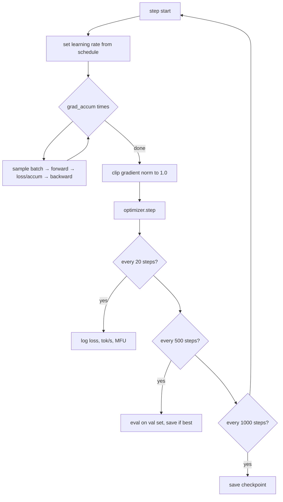

# 4. Pretraining

This is 99% of the compute and where the model learns essentially everything it knows.

## The entire objective

```python
x, y = data[i : i+T], data[i+1 : i+1+T]     # y is x shifted by one
logits, loss = model(x, targets=y)
loss.backward()
optimizer.step()
```

Four lines. Everything else in
[`train/pretrain.py`](../aksharallm/train/pretrain.py) exists to make those four lines
survive days of wall-clock without wasting your GPU or losing your progress.



---

## Batch size and gradient accumulation

A gradient computed from 16 sequences is a noisy estimate of the true gradient. Bigger
batches are less noisy and let you use a higher learning rate. But 24 GB of VRAM won't
hold a large batch.

**Gradient accumulation** decouples the two: run several micro-batches, summing gradients,
then step once.

```python
optimizer.zero_grad()
for _ in range(grad_accum):
    x, y = get_batch(batch_size)
    _, loss = model(x, targets=y)
    loss = loss / grad_accum        # ← critical
    loss.backward()                 # gradients accumulate
optimizer.step()
```

> The `/ grad_accum` makes the accumulated gradient a **mean** rather than a sum. Forget it
> and your effective learning rate silently scales with `grad_accum` — a common and
> confusing bug.

```
tokens per step = batch_size × grad_accum × seq_len
                = 48 × 2 × 512 = 49,152        (Phase 1)
```

**Tuning it:** raise `batch_size` until you hit OOM, back off ~10%, then set `grad_accum`
to reach your target tokens/step. Typical targets: ~50k tokens/step for a small model,
~250k–500k for a few hundred million params.

---

## Mixed precision

```python
with torch.autocast("cuda", dtype=torch.bfloat16):
    logits, loss = model(x, targets=y)
```

Matmuls and activations run in **bf16** (16 bits); master weights and optimizer state stay
in **fp32**. Roughly 2× the speed and half the activation memory.

**Why bf16 and not fp16?** bf16 has the same exponent range as fp32 — it trades mantissa
bits for range. fp16's narrow range means gradients underflow to zero, which is why fp16
training needs a "gradient scaler" that multiplies the loss by a large factor and adjusts
it dynamically. With bf16 there is nothing to overflow and no scaler needed. Your 3090
(Ampere) supports bf16 natively; anything Turing or older does not.

We also enable TF32 for the fp32 matmuls that autocast leaves alone:

```python
torch.backends.cuda.matmul.allow_tf32 = True
```

---

## Learning rate schedule

The LR matters more than almost any other hyperparameter.

```
lr
 ^        ___________
 |       /           \____
 |      /                 \______
 |     /                         \____
 +----/-------------------------------\---> step
   warmup         cosine decay        floor
```

- **Warmup** (~200 steps, or 1–2% of training). At init, gradients are large and
  uninformative; a full-size step there can permanently damage the embedding table. Ramp
  up from near zero.
- **Cosine decay** to a floor of `0.1 × lr`. Big steps early to explore, small steps late
  to settle into a minimum.
- **Never decay to exactly 0** — the final steps still do useful work.

Also available: `schedule: wsd` (Warmup-Stable-Decay) holds the LR flat and only decays
over the last 20%. Useful when you don't know `max_steps` in advance, since you can stop
any time by running the decay phase — a cosine locks you into its endpoint.

**Picking the base LR:** smaller models want higher LRs.

| params | typical peak LR |
|---|---|
| ~10M | 1e-3 |
| ~100M | 6e-4 |
| ~300M | 3e-4 |
| ~1B | 2e-4 |

---

## Gradient clipping

```python
grad_norm = torch.nn.utils.clip_grad_norm_(model.parameters(), 1.0)
```

If the global gradient norm exceeds 1.0, scale the whole gradient down. This is the single
most effective protection against one pathological batch destroying a six-day run.

**`grad_norm` is also your best health indicator.** Watch it in the logs:

| pattern | meaning |
|---|---|
| starts ~5, settles to 0.2–0.5, stable | healthy ✅ |
| repeated spikes to 10+ | bad data, or LR too high |
| growing steadily | diverging — stop and lower the LR |
| exactly 0.0 | no gradient is reaching the parameters — a bug |

---

## Weight decay, applied selectively

```python
decay, no_decay = [], []
for _, p in model.named_parameters():
    (decay if p.dim() >= 2 else no_decay).append(p)
```

Weight decay pulls parameters toward zero, a regulariser. It belongs on matmul weights
(2-D and up). It does **not** belong on 1-D parameters — RMSNorm gains, and biases if you
had them. Those have no redundancy to regularise and decaying them actively hurts.

---

## `torch.compile`

```python
model = torch.compile(model)
```

Traces the model and generates fused CUDA kernels. Measured on this repo:

| | eager | compiled |
|---|---|---|
| throughput | 260k tok/s | **460k tok/s** |
| MFU | 28% | **50%** |
| VRAM | 6.3 GB | **3.6 GB** |

1.7× faster *and* less memory, because fusion removes intermediate tensors. The first step
takes ~60 seconds while it compiles. Leave it on; disable only when debugging, since it
obscures tracebacks.

---

## Checkpointing

```python
tmp = path.with_suffix(".tmp")
torch.save(payload, tmp)
tmp.replace(path)          # atomic rename
```

Write to a temp file and rename. `rename` is atomic on POSIX, so a crash mid-save can
never leave you with a corrupt checkpoint — you still have the previous one.

Resume with `resume: auto` in the config; it picks up `ckpt_last.pt` if present, restoring
model weights, optimizer state (Adam's momentum — losing it causes a visible loss spike),
and the step counter.

Two checkpoints are kept: `ckpt_last.pt` (for resuming) and `ckpt_best.pt` (lowest val
loss, for using).

### Stopping and resuming a long run

A multi-day run needs to be interruptible. There are three clean ways to stop, and all of
them save a checkpoint at the *exact* current step before exiting — zero lost work:

```bash
# 1. Ctrl-C in the terminal running it
# 2. kill a backgrounded run:
kill <pid>
# 3. no terminal handy? drop a stop-file; it stops at the next step:
touch checkpoints/small/STOP
```

You'll see:

```
[stop] signal 15 received -- will save and exit after this step
[stop] saving ckpt_last.pt at step 8421 and exiting
[stop] done. resume with the same command (resume:auto picks up step 8422).
```

Then **rerun the identical command** to continue. Because the LR schedule is a pure
function of the step number, and the optimizer state is restored, the resumed run is
mathematically identical to one that never stopped — the loss curve continues smoothly
with no spike. Verified: stop at step 22, resume, and step 30's loss lands exactly where an
uninterrupted run would put it.

A second Ctrl-C forces an immediate exit (you lose only the current step). Pulling the plug
— power loss, `kill -9` — costs you at most the steps since the last periodic
`ckpt_every` save (default every 500 steps ≈ 20 minutes at Phase 2 throughput).

---

## Reading the logs

```
step   3120 | loss 1.6728 (ema 1.6767) | ppl   5.3 | lr 7.23e-04 |
             gnorm 0.29 | 463.8k tok/s | mfu 50.9% | 3.6GB | eta 0.3h
```

| field | what to check |
|---|---|
| `loss` | should fall fast then slowly. Flat from step 0 = LR too low or a bug. |
| `ema` | smoothed loss — the real trend |
| `ppl` | `e^loss` |
| `gnorm` | see the table above |
| `tok/s` | should be *constant*. A drop means thermal throttling or another process. |
| `mfu` | Model FLOPs Utilisation — see below |
| `eta` | hours remaining |

Structured logs also go to `checkpoints/<run>/train_log.jsonl`, one JSON object per line,
for plotting later. Set `wandb_project` in the config for live charts.

### MFU

What fraction of your GPU's theoretical peak FLOPs you're actually using.

```
flops_per_token ≈ 6 × n_params + 12 × n_layers × seq_len × d_model
MFU = flops_per_token × tokens_per_sec / peak_flops
```

(The `6N` is forward + backward through the matmuls; the second term is attention's score
computation, which grows with sequence length.)

| MFU | verdict |
|---|---|
| < 20% | something is wrong — check `compile`, batch size, dtype |
| 30–50% | healthy for a single consumer GPU |
| > 55% | excellent |

We hit **50%** on the 3090. If yours is much lower, the usual causes are: `compile` off,
batch size too small (GPU starved), or fp32 instead of bf16.

---

## What a healthy run looks like

Our Phase 1 run, 13.8M params on TinyStories:

| step | val loss | perplexity |
|---|---|---|
| 500 | 2.179 | 8.8 |
| 1000 | 1.908 | 6.7 |
| 2000 | 1.740 | 5.7 |
| 3000 | 1.653 | 5.2 |
| 4000 | 1.594 | 4.9 |

Loss falls steeply then flattens into a long slow grind — that's the expected shape. It's
roughly a power law in compute, which is *why* frontier labs spend so much: each increment
of quality costs exponentially more.

Generated samples over the same run:

- **step 50** — `'Once upon a time, "I a time, for a lot we to the bear to the park.'`
  → word-shaped noise
- **step 2000** — `'Once upon a time, there was a little girl named Lily. She loved to play outside in the sunshine.'`
  → grammatical, coherent
- **step 4000** — `'...Suddenly, her mom appeared. "What\'s wrong, sweetheart?" she asked.'`
  → dialogue punctuation, narrative structure, emotional continuity

Nobody programmed any of that.

---

## Running it

```bash
# full run
python -m aksharallm.train.pretrain configs/tiny.yaml

# override anything from the CLI
python -m aksharallm.train.pretrain configs/tiny.yaml \
    -o train.batch_size=32 -o optim.lr=5e-4

# quick smoke test before committing to a long run
python -m aksharallm.train.pretrain configs/tiny.yaml \
    -o train.max_steps=50 -o train.compile=false
```

**Always run the 50-step smoke test after changing anything.** It catches shape errors,
OOM, and bad configs in 30 seconds instead of six days.

---

Next: [5. Post-training →](05-posttraining.md)
