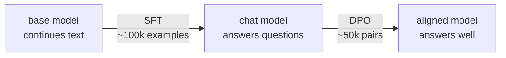
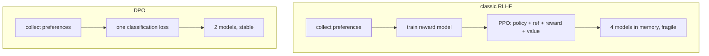

# 5. Post-training: SFT and DPO

## The problem with a base model

After pretraining you have something that continues text. Ask it a question and you get:

```
> What is the capital of France?

What is the capital of Germany? What is the capital of Spain?
What is the largest city in Europe? ...
```

It isn't broken. It's doing exactly what it was trained to do — on the internet, a
question is usually followed by more questions. It has no concept of being *asked*
something.

Post-training fixes that. It's cheap (hours, not days) and uses a fraction of the data.



---

# Part 1 — Supervised Fine-Tuning

## The single idea: loss masking

SFT is pretraining with one change — **only the assistant's tokens count towards the
loss.**

```
tokens  <|im_start|>user \n What is 2+2? <|im_end|> <|im_start|>assistant \n Four <|im_end|>
mask         0        0   0   0  0   0  0     0           0            0    0    1     1
             └──────────── context: no loss ─────────────────────────────┘   └─ trained ─┘
```

The model must *condition* on the user's question but must never be rewarded for
predicting it. Train on everything and you get a model that invents its own questions —
which is what you were trying to fix.

In code ([`train/sft.py`](../aksharallm/train/sft.py)):

```python
m = torch.from_numpy(msk[:, 1:])   # mask aligned to the target position
y[m == 0] = -100                   # -100 is cross_entropy's ignore_index
```

> Note the `[:, 1:]`. Position *i* predicts token *i+1*, so the mask must be shifted to
> line up with the **targets**, not the inputs. Getting this off by one trains the model
> on the wrong half of the conversation and is very hard to spot afterwards.

## Packing vs padding

Conversations vary from 20 to 2000 tokens. Two options:

- **Padding** — pad each example to `seq_len`. Simple, but a 60-token exchange in a
  1024-token window wastes 94% of the compute.
- **Packing** — concatenate examples end to end and slice into fixed blocks. Zero waste.

```
padded:  [conv A .............][PAD PAD PAD PAD PAD PAD PAD]
         [conv B ...][PAD PAD PAD PAD PAD PAD PAD PAD PAD PAD]

packed:  [conv A .............][conv B ...][conv C ........]
         └──────────────── one block ────────────────┘
```

We pack. A block can contain the tail of one conversation and the head of the next, which
the model sees as `<|im_end|>` followed by a fresh `<|im_start|>` — the boundary it needs
to learn anyway.

Conversations longer than the window are **dropped, not truncated**: a truncated example
ends mid-sentence and teaches the model to stop early.

## Hyperparameters — and why they differ from pretraining

| | pretrain | SFT | why |
|---|---|---|---|
| LR | 6e-4 | **1e-5** | The model already knows language. A pretrain-sized LR erases it. |
| epochs | ~1 | **2** | SFT sets are small; 3+ epochs overfits badly. |
| dropout | 0.0 | **0.05** | Now we're overfitting-limited, not data-limited. |
| weight decay | 0.1 | **0.0** | Not needed for a short run. |
| loss on | all tokens | **assistant only** | The whole point. |

**The most common mistake is too high an LR.** Symptom: the model becomes fluent and
confident but forgets facts it knew before. That's *catastrophic forgetting* — you've
overwritten pretraining. If in doubt, go lower.

## Datasets

| name | size | notes |
|---|---|---|
| **SmolTalk** | 1M | Curated mix; the best default |
| OpenHermes-2.5 | 1M | Strong general instruction following |
| UltraChat-200k | 200k | Multi-turn dialogue |

## Running it

```bash
python -m aksharallm.data.prepare_sft smoltalk \
    --tokenizer data/fineweb/tokenizer.json \
    --out-dir data/sft --seq-len 1024

python -m aksharallm.train.sft \
    --base checkpoints/small/ckpt_best.pt \
    --data-dir data/sft \
    --tokenizer data/fineweb/tokenizer.json \
    --out-dir checkpoints/small-sft \
    --epochs 2 --lr 1e-5

python -m aksharallm.infer.cli checkpoints/small-sft/sft_best.pt --mode chat
```

The prep step reports what fraction of tokens are actually trained on — expect 30–50%.
Much lower means your conversations are mostly user text; much higher suggests the mask is
wrong.

---

# Part 2 — Direct Preference Optimization

## Why SFT isn't enough

SFT can only say *"imitate this answer."* It has no way to express *"answer A is better
than answer B"* when both are perfectly valid:

> **Prompt:** Explain gravity to a six-year-old.
>
> **A:** *Imagine the Earth is giving everything a big invisible hug, pulling it close.*
>
> **B:** *Gravity is a fundamental interaction described by the Einstein field equations.*

Neither is wrong. B might even be more accurate. But A is what was asked for. Preference
data captures exactly this, and it's how tone, length, hedging, and refusal behaviour get
shaped.

## Where DPO came from

The original approach (RLHF) was: train a separate reward model on human preferences, then
use reinforcement learning (PPO) to maximise that reward. It works, but needs four models
in memory and is famously fragile to tune.

**DPO's insight:** for the KL-regularised objective RLHF optimises, the optimal policy has
a closed form. Rearrange it and the reward model **cancels out entirely**. What's left is
an ordinary classification loss on preference pairs — no RL, no reward model, no sampling
loop.



## The loss

```python
pi_logratio  = pi_chosen  - pi_rejected      # what our model thinks
ref_logratio = ref_chosen - ref_rejected     # what the frozen SFT model thought
logits = beta * (pi_logratio - ref_logratio)
loss = -F.logsigmoid(logits).mean()
```

In words: **increase the probability of the chosen response relative to the rejected one —
but measure both relative to where the frozen reference model started.**

That reference term is the entire safety mechanism. Without it, the model could raise the
chosen response's probability by wrecking its general language ability (everything gets
less likely, but the rejected one gets *more* less likely). The reference anchors it:
drifting far from the SFT model is penalised.

- **`beta`** controls how hard the anchor pulls. 0.1 is standard. Higher = stay closer to
  the reference, less movement. Lower = more aggressive, more risk of degeneration.
- The **reference model** is a frozen copy of the SFT checkpoint. It never trains. Both
  models are in memory at once, so DPO needs roughly 2× the weights of SFT.

## Hyperparameters

| | value | why |
|---|---|---|
| lr | **5e-7** | 10–50× *below* SFT. DPO is extremely sensitive; this is not a typo. |
| beta | 0.1 | standard |
| epochs | 1 | more than one reliably degrades quality |
| batch | small | each step processes 4 forward passes (chosen/rejected × policy/ref) |

## Reading DPO logs

```
epoch 0 step   120/500 | loss 0.6412 | acc 63.2% | lr 4.8e-07 | gnorm 0.83
```

- **`acc`** — the fraction of pairs where the policy prefers the chosen response *more
  than the reference does*. Starts at ~50% by construction and should climb to 65–80%.
- **`loss`** — starts at `ln(2) = 0.693` (chance) and falls.

If accuracy shoots past 90%, you're overfitting the preference set and the model will
start producing degenerate output (endless hedging, or very long rambling answers). Stop
early.

## Datasets

| name | size | notes |
|---|---|---|
| **UltraFeedback (binarized)** | 61k | The standard default |
| HelpSteer2 | 20k | Fine-grained human ratings |
| Orca DPO pairs | 12k | Smaller, good for a quick test |

## Running it

```bash
python -m aksharallm.data.prepare_dpo ultrafeedback \
    --tokenizer data/fineweb/tokenizer.json \
    --out-dir data/dpo --seq-len 1024

python -m aksharallm.train.dpo \
    --sft checkpoints/small-sft/sft_best.pt \
    --data-dir data/dpo \
    --tokenizer data/fineweb/tokenizer.json \
    --out-dir checkpoints/small-dpo \
    --beta 0.1 --lr 5e-7
```

---

## Expectations at our scale

Be realistic: **post-training a 300M model produces a model that follows instructions, not
one that's smart.** It will answer in the right *shape* — addressing your question,
appropriate length, stopping when done — while being frequently wrong about facts.

That's still the right thing to build. The behavioural transformation from base → SFT is
the most striking single change you'll see in this whole project, and it costs a couple of
hours.

---

Next: [6. Inference →](06-inference.md)
