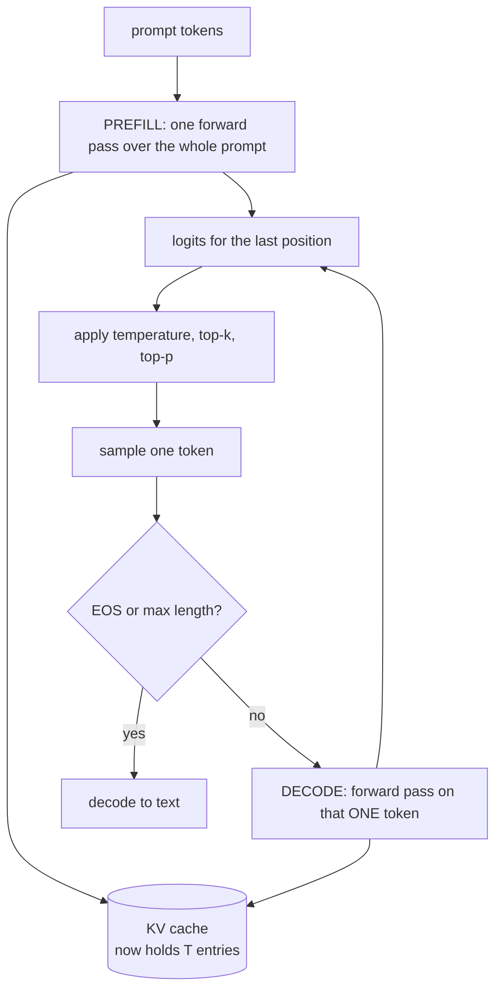

# 6. Inference

## The generation loop



Two distinct phases with very different performance characteristics:

- **Prefill** — the whole prompt at once. Compute-bound, parallel across positions, fast.
- **Decode** — one token at a time. Memory-bandwidth-bound. This is where the time goes,
  and it's inherently sequential: you can't predict token 5 without token 4.

---

## The KV cache

Without a cache, generating token *n* means re-running the model over all *n−1* previous
tokens. Generating 500 tokens does the work of ~125,000 forward positions.

But notice: for a given token position, its **keys and values never change**. They depend
only on that position's input, which is already fixed. So cache them.

```
step 1:  [The]                       compute K,V for 1 position  → cache
step 2:  [The][capital]              compute K,V for 1 position  → append
step 3:  [The][capital][of]          compute K,V for 1 position  → append
                                     ↑ each step is O(1) work, not O(n)
```

```python
class KVCache:
    def __init__(self, batch, n_kv_heads, max_seq_len, head_dim, dtype, device):
        self.k = torch.zeros(batch, n_kv_heads, max_seq_len, head_dim, ...)
        self.v = torch.zeros(...)
        self.pos = 0

    def update(self, k, v):
        self.k[:, :, self.pos:self.pos+t] = k
        self.pos += t
        return self.k[:, :, :self.pos], self.v[:, :, :self.pos]
```

Preallocated to full size so generation does no allocation in the hot loop.

**Effect:** roughly 2 tok/s → 200 tok/s. It is the single most important inference
optimisation, and it's why GQA (fewer KV heads → smaller cache) matters.

### The bug to know about

```python
is_causal = cache is None or T > 1
```

During decode we feed exactly one token. That query sits at the **end** of the sequence and
should attend to everything cached. `is_causal=True` builds a triangular mask assuming the
query starts at position 0 — masking away nearly the entire context.

The model still trains perfectly. It just generates garbage, and you have no idea whether
the problem is training or inference. This is why
`tests/test_model.py::test_kv_cache_matches_full_forward` asserts that cached decoding
reproduces a full forward pass exactly.

### One more efficiency detail

```python
if targets is None:
    return self.lm_head(x[:, -1:, :]), None    # only the last position
```

At inference we only need logits for the final position. Projecting all `T` positions to
`vocab_size` would be the single largest allocation in generation — at `T=1024`,
`vocab=32768`, that's 134 MB of logits we'd throw away.

---

## Sampling

The model gives a probability for all 32,768 tokens. How you choose among them changes the
output character completely.

### Temperature

```python
probs = softmax(logits / temperature)
```

Divides the logits before softmax.

| temperature | effect |
|---|---|
| 0.0 | greedy — always the top token. Deterministic, repetitive, often loops. |
| 0.7–0.8 | **the useful default.** Coherent with variety. |
| 1.0 | the model's raw distribution |
| > 1.2 | increasingly incoherent |

Low temperature sharpens the distribution (rich get richer); high temperature flattens it.

### Top-k

Keep only the `k` most likely tokens, renormalise, sample. `k=50` is standard.

Motivation: the long tail of ~32,000 near-zero-probability tokens *collectively* holds
enough mass that you'll eventually sample one. And because generation is autoregressive,
one garbage token derails everything after it.

### Top-p (nucleus)

Keep the smallest set of tokens whose probabilities sum to `p`. `p=0.95` is standard.

```
After "The capital of France is":
    Paris 0.71  ← nucleus stops here at p=0.9 (only 1 token; model is confident)

After "She opened the door and saw":
    a 0.12, the 0.09, her 0.07, ...  ← nucleus includes ~30 tokens (genuinely open-ended)
```

Top-p **adapts** to the model's confidence in a way top-k can't. Using both together is
common and is what our defaults do.

### Repetition penalty

Divides the logits of already-used tokens. Note the sign handling:

```python
if logits[0, t] > 0: logits[0, t] /= penalty
else:                logits[0, t] *= penalty
```

Dividing a *negative* logit would make it larger. Getting this wrong makes repetition
worse — a genuinely common bug.

Use sparingly (1.0–1.15). Aggressive values stop the model from using necessary words like
"the".

---

## Using the CLI

```bash
# base model — text completion
python -m aksharallm.infer.cli checkpoints/tiny/ckpt_best.pt \
    --prompt "Once upon a time"

# interactive
python -m aksharallm.infer.cli checkpoints/tiny/ckpt_best.pt

# chat (needs an SFT'd model)
python -m aksharallm.infer.cli checkpoints/small-sft/sft_best.pt --mode chat

# deterministic, for debugging
python -m aksharallm.infer.cli ckpt.pt --prompt "Hello" --temperature 0
```

| flag | default | |
|---|---|---|
| `--temperature` | 0.8 | 0 = greedy |
| `--top-k` | 50 | |
| `--top-p` | 0.95 | |
| `--repetition-penalty` | 1.0 | try 1.1 if it loops |
| `--max-new-tokens` | 256 | |
| `--mode` | complete | `complete` or `chat` |

---

## A detail in the streaming output

Tokens are printed as they're generated, but we decode the **whole sequence** each time and
print only the delta:

```python
text = tok.decode(buf)
sys.stdout.write(text[len(printed):])
printed = text
```

Because a single BPE token is often *half a UTF-8 character* (emoji and accented letters
span multiple tokens), decoding tokens individually prints `�` mid-word. Decoding
cumulatively and diffing avoids that.

---

## Evaluation

```bash
python -m aksharallm.eval.evaluate checkpoints/tiny/ckpt_best.pt \
    --tasks perplexity,samples
```

**Perplexity** — `e^loss` on held-out text. Cheap and smooth, great for tracking a run.
Useless for comparing models with *different tokenizers*, since it's per-token and tokens
differ.

**HellaSwag** — pick the sensible continuation out of 4. Comparable across tokenizers.
Scored by computing each ending's total log-probability given the context, normalised by
token count so long endings aren't penalised.

> ⚠️ HellaSwag is **noisy below ~1B params**. A 300M model scores near the 25% random
> baseline. Don't panic — it becomes informative as you scale. At our size, val perplexity
> plus reading actual generations tells you more.

**Reading samples is underrated.** A loss curve won't tell you the model has started
repeating itself or lost punctuation. Look at the text.

---

Next: [7. Scaling up →](07-scaling.md)
