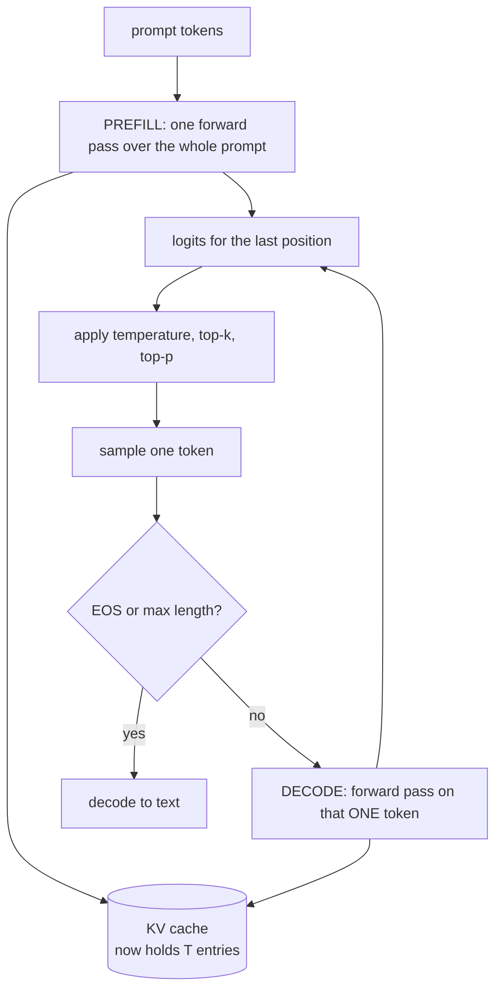
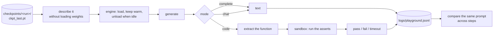

# 6. Inference

## The generation loop



Two distinct phases with very different performance characteristics:

- **Prefill** — the whole prompt at once. Compute-bound, parallel across positions, fast.
- **Decode** — one token at a time. Memory-bandwidth-bound. This is where the time goes,
  and it's inherently sequential: you can't predict token 5 without token 4.

---

## The KV cache

Without a cache, generating token *n* means re-running the model over all *n−1* previous
tokens. Generating 500 tokens does the work of ~125,000 forward positions.

But notice: for a given token position, its **keys and values never change**. They depend
only on that position's input, which is already fixed. So cache them.

```
step 1:  [The]                       compute K,V for 1 position  → cache
step 2:  [The][capital]              compute K,V for 1 position  → append
step 3:  [The][capital][of]          compute K,V for 1 position  → append
                                     ↑ each step is O(1) work, not O(n)
```

```python
class KVCache:
    def __init__(self, batch, n_kv_heads, max_seq_len, head_dim, dtype, device):
        self.k = torch.zeros(batch, n_kv_heads, max_seq_len, head_dim, ...)
        self.v = torch.zeros(...)
        self.pos = 0

    def update(self, k, v):
        self.k[:, :, self.pos:self.pos+t] = k
        self.pos += t
        return self.k[:, :, :self.pos], self.v[:, :, :self.pos]
```

Preallocated to full size so generation does no allocation in the hot loop.

**Effect:** roughly 2 tok/s → 200 tok/s. It is the single most important inference
optimisation, and it's why GQA (fewer KV heads → smaller cache) matters.

### The bug to know about

```python
is_causal = cache is None or T > 1
```

During decode we feed exactly one token. That query sits at the **end** of the sequence and
should attend to everything cached. `is_causal=True` builds a triangular mask assuming the
query starts at position 0 — masking away nearly the entire context.

The model still trains perfectly. It just generates garbage, and you have no idea whether
the problem is training or inference. This is why
`tests/test_model.py::test_kv_cache_matches_full_forward` asserts that cached decoding
reproduces a full forward pass exactly.

### One more efficiency detail

```python
if targets is None:
    return self.lm_head(x[:, -1:, :]), None    # only the last position
```

At inference we only need logits for the final position. Projecting all `T` positions to
`vocab_size` would be the single largest allocation in generation — at `T=1024`,
`vocab=32768`, that's 134 MB of logits we'd throw away.

---

## Sampling

The model gives a probability for all 32,768 tokens. How you choose among them changes the
output character completely.

### Temperature

```python
probs = softmax(logits / temperature)
```

Divides the logits before softmax.

| temperature | effect |
|---|---|
| 0.0 | greedy — always the top token. Deterministic, repetitive, often loops. |
| 0.7–0.8 | **the useful default.** Coherent with variety. |
| 1.0 | the model's raw distribution |
| > 1.2 | increasingly incoherent |

Low temperature sharpens the distribution (rich get richer); high temperature flattens it.

### Top-k

Keep only the `k` most likely tokens, renormalise, sample. `k=50` is standard.

Motivation: the long tail of ~32,000 near-zero-probability tokens *collectively* holds
enough mass that you'll eventually sample one. And because generation is autoregressive,
one garbage token derails everything after it.

### Top-p (nucleus)

Keep the smallest set of tokens whose probabilities sum to `p`. `p=0.95` is standard.

```
After "The capital of France is":
    Paris 0.71  ← nucleus stops here at p=0.9 (only 1 token; model is confident)

After "She opened the door and saw":
    a 0.12, the 0.09, her 0.07, ...  ← nucleus includes ~30 tokens (genuinely open-ended)
```

Top-p **adapts** to the model's confidence in a way top-k can't. Using both together is
common and is what our defaults do.

### Repetition penalty

Divides the logits of already-used tokens. Note the sign handling:

```python
if logits[0, t] > 0: logits[0, t] /= penalty
else:                logits[0, t] *= penalty
```

Dividing a *negative* logit would make it larger. Getting this wrong makes repetition
worse — a genuinely common bug.

Use sparingly (1.0–1.15). Aggressive values stop the model from using necessary words like
"the".

---

## Using the CLI

```bash
# what has been trained so far — step, loss, stage, tokens seen
python -m aksharallm.infer.cli

# a bare run name takes its best checkpoint
python -m aksharallm.infer.cli small-code --prompt "Once upon a time"

# interactive
python -m aksharallm.infer.cli small-code

# chat (needs an SFT'd model; refused on a base one, with the reason)
python -m aksharallm.infer.cli checkpoints/small-sft/sft_best.pt --mode chat

# deterministic, for comparing two checkpoints on one prompt
python -m aksharallm.infer.cli small-code --prompt "Hello" --temperature 0
```

| flag | default | |
|---|---|---|
| `--temperature` | 0.8 | 0 = greedy |
| `--top-k` | 50 | |
| `--top-p` | 0.95 | |
| `--repetition-penalty` | 1.0 | try 1.1 if it loops — but see the `repetition` probe below |
| `--max-new-tokens` | 256 | |
| `--seed` | random | fixes sampling, so two checkpoints are comparable |
| `--mode` | complete | `complete`, `chat` or `code` |
| `--device` | auto | the GPU, unless a run is training — then the CPU |

The checkpoint argument accepts three shapes: a run name (`small-code`), an id
(`small-code/ckpt_best.pt`), or a path (what tab completion gives you).

---

## Testing a model while it is still training

A loss curve tells you the number is going down. It does not tell you whether the model has
learnt to finish a sentence. For that you have to read what it writes — and the useful
question is never *"what did it say"* but *"is that better than last week"*.



Three ideas make this work.

### 1. A checkpoint is described, not loaded

`torch.load(..., mmap=True)` maps the file rather than reading it, and tensor shapes are
metadata — so the step, the validation loss, the parameter count and the tokenizer path all
come out of a 1.2 GB file in milliseconds. That is what lets the portal list six checkpoints
on every poll.

Reading a checkpoint a live trainer is writing is safe, and by design: `save_checkpoint`
writes `ckpt_last.tmp` and then `Path.replace()`s it, which is atomic. You see the whole old
file or the whole new one, never half of each.

The **filename** carries the training stage — `ckpt_*` is a base model, `sft_*` has been
instruction-tuned, `dpo_*` has been preference-aligned. This matters more than it sounds:

> A base model has never seen a single ChatML token. Talking to it in chat format returns
> noise. That is not a bug to debug, it is Phase 3 not having run yet — so chat is
> **disabled** on a base checkpoint, with that sentence, rather than letting you conclude
> the model is broken.

### 2. Where it runs is not your problem

The card has 24 GB and a Phase-2 run holds about 21. The model itself is small — 300M
parameters in bf16 is 0.6 GB, and grouped-query attention makes the KV cache nearly free
(25 MB for a 1024-token context) — so it *would* fit in the gap. It is still not worth it: a
CUDA context is half a gigabyte before a single weight lands, and the failure mode is not "a
slow tab", it is "the run died at step 22,000 overnight".

So the default is: **if a run is training, load on the CPU and say so.** When the card is
free you get it at full speed, automatically.

```
device: auto   a run is training      -> CPU, with the reason shown before you press Generate
               < 2 GB VRAM free       -> CPU (catches an Ollama model the Code tab left resident)
               otherwise              -> GPU
device: cuda   always the GPU         (deliberate; the warning still appears)
device: cpu    never the GPU
```

The model then **stays resident** and an idle timer unloads it, the same bargain
`keep_alive` strikes for the Code tab's Ollama model.

### 3. The record outlives the checkpoint

`ckpt_last.pt` is overwritten every 500 steps. Keeping a copy every few thousand steps would
let you re-run an old model and would cost 1.2 GB a time — forty of them for a full run.

But the question people actually ask is not "can I re-run step 5,000", it is *"is this
getting better?"*, and that is answered by two pieces of text side by side, each labelled
with the step and loss of the model that wrote it. **That costs about a kilobyte.**

So every generation appends one JSON line to `logs/playground.jsonl`:

```jsonc
{"iso": "2026-07-28T14:35", "mode": "complete", "probe": "fluency",
 "prompt": "The city of Venice is built on a lagoon, and",
 "output": "is located at the mouth of the Rhone River…",
 "run": "small-code", "checkpoint": "ckpt_best.pt", "step": 7000,
 "best_val": 2.8926, "train_loss": 2.9180, "tokens_seen": 1720565760}
```

Same conventions as `train_log.jsonl` — one object per line, appended, never rewritten,
unparseable lines skipped — so `tail -f` and `jq` work on both.

```bash
python -m aksharallm.infer.cli --compare fluency   # that probe, every step, oldest first
python -m aksharallm.infer.cli --history           # everything, newest first
```

---

## The fixed prompts

Typing whatever comes to mind is a bad way to notice progress: you change the prompt every
time, so you cannot tell an improving model from a lucky sample. `aksharallm/infer/tasks.py`
is the fixed set — and each one records what *good* looks like at this scale, because a 300M
model is not going to know who wrote *Hamlet* and being disappointed by that is a
misunderstanding rather than a bug.

| probe | tests | at 300M, expect |
|---|---|---|
| `fluency` | grammar, staying on topic | works early; the last thing to break |
| `facts` | simple world knowledge | vague-but-plausible; specifics confidently wrong |
| `definition` | explanatory register | FineWeb-Edu should teach this |
| `list` | counting, structure | losing count is the classic undertrained failure |
| `arithmetic` | reasoning | wrong — the tokenizer splits numbers at 3 digits on purpose |
| `code-switch` | is the 15% code reaching the model? | syntactically valid Python |
| `repetition` | degenerate looping | it should move on, not loop |

Run them all with `--probes`. Each one is recorded under its id, which is what makes
`--compare` possible later.

### Python, actually executed

The code tasks are a function signature and a docstring in, a function body out — the shape
a *base* model can answer, because it is text continuation rather than an instruction. Then
the asserts are run:

```bash
python -m aksharallm.infer.cli small-code --tasks --show-code
```

Getting from a generation to a verdict takes one non-obvious step. A base model continues
the *file*, not the function — it writes the body and then, invariably, a second function or
a paragraph of prose. So everything from the first line at column zero onwards is dropped
(this is the standard HumanEval post-processing, and it is not cheating: the model was asked
to continue a file, and a file does not stop). A chat model instead answers in prose with a
fenced block, so the fence wins if there is one.

> **This executes code a language model wrote, on your machine.** It runs in a subprocess in
> `-I` isolated mode (no `PYTHONPATH`, no site-packages, nothing of this project importable),
> under `RLIMIT_CPU` — which a `while True:` cannot escape the way it escapes a wall-clock
> timeout — plus an address-space limit, no new processes, no core dumps, and a throwaway
> working directory. It is **not** a container and not a security boundary. Fine for a 300M
> model's attempt at `is_palindrome`; not what you would run a stranger's code in. Set
> `infer.run_tests: false` to generate the code and never run it.

Expect **0/10 at step 7,000**. The failure *types* are the signal: `SyntaxError` means the
model has not learnt Python's shape yet, `NameError` means it has the shape but invents
variables, `AssertionError` means it writes runnable code that is simply wrong — which is
real progress.

---

## A detail in the streaming output

Tokens are printed as they're generated, but we decode the **whole sequence** each time and
print only the delta:

```python
text = tok.decode(buf)
sys.stdout.write(text[len(printed):])
printed = text
```

Because a single BPE token is often *half a UTF-8 character* (emoji and accented letters
span multiple tokens), decoding tokens individually prints `�` mid-word. Decoding
cumulatively and diffing avoids that.

---

## Evaluation

```bash
python -m aksharallm.eval.evaluate checkpoints/tiny/ckpt_best.pt \
    --tasks perplexity,samples
```

**Perplexity** — `e^loss` on held-out text. Cheap and smooth, great for tracking a run.
Useless for comparing models with *different tokenizers*, since it's per-token and tokens
differ.

**HellaSwag** — pick the sensible continuation out of 4. Comparable across tokenizers.
Scored by computing each ending's total log-probability given the context, normalised by
token count so long endings aren't penalised.

> ⚠️ HellaSwag is **noisy below ~1B params**. A 300M model scores near the 25% random
> baseline. Don't panic — it becomes informative as you scale. At our size, val perplexity
> plus reading actual generations tells you more.

**Reading samples is underrated.** A loss curve won't tell you the model has started
repeating itself or lost punctuation. Look at the text — that is what the Playground tab and
`--probes` exist for, and why every generation is kept with the step that produced it.

### Which tool for which question

| question | tool |
|---|---|
| is the loss going down? | the Dashboard, `train_log.jsonl` |
| can it finish a sentence? | `--probes`, or the Playground tab |
| is it better than last week? | `--compare <probe>` |
| can it write working Python? | `--tasks` (executes the code) |
| how does it score against a benchmark? | `aksharallm.eval.evaluate` |

The last row is the difference worth keeping straight: `eval` produces a *number* to compare
against other people's models, on a fixed benchmark, with the model loaded once for the
duration. The playground produces *text you read*, from a model kept warm and swappable, on
a machine that may be training at the same time. They are different jobs, which is why
`infer/engine.py` and `infer/cli.load_model` are two different ways to load the same file.

---

Next: [7. Scaling up →](07-scaling.md)
