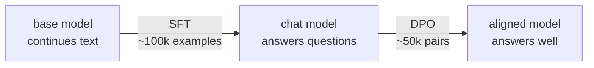
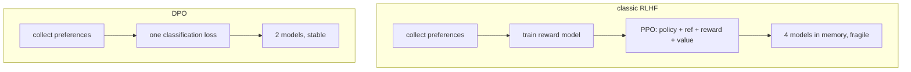
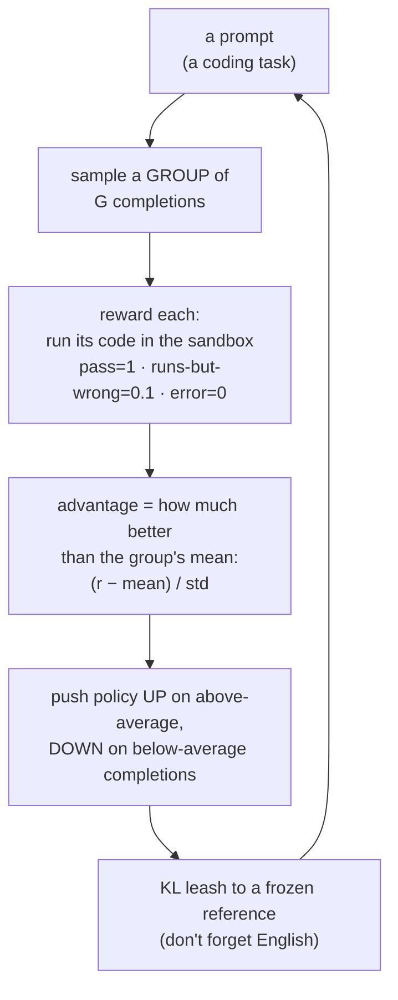
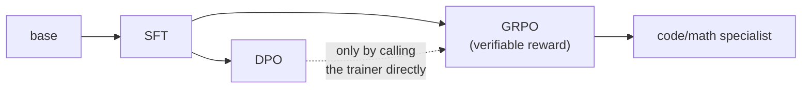
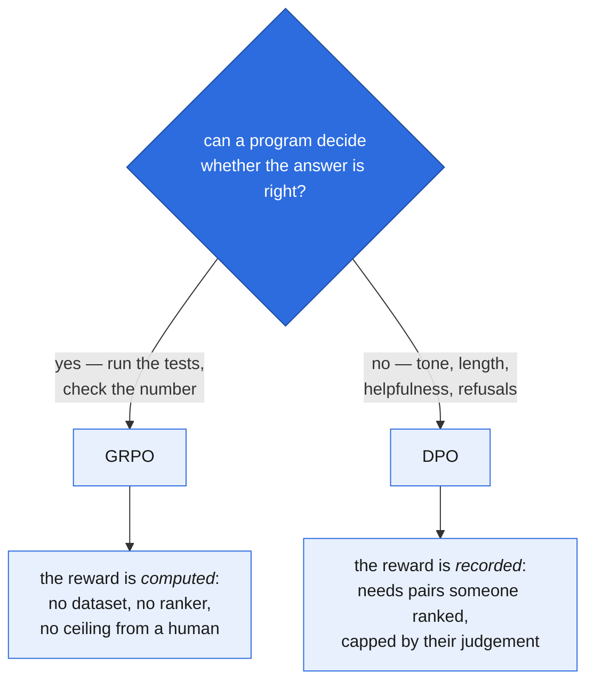

# 6. Post-training: SFT, DPO and GRPO

## The problem with a base model

After pretraining you have something that continues text. Ask it a question and you get:

```
> What is the capital of France?

What is the capital of Germany? What is the capital of Spain?
What is the largest city in Europe? ...
```

It isn't broken. It's doing exactly what it was trained to do — on the internet, a
question is usually followed by more questions. It has no concept of being *asked*
something.

Post-training fixes that. It's cheap (hours, not days) and uses a fraction of the data.



---

# Part 1 — Supervised Fine-Tuning

## The single idea: loss masking

SFT is pretraining with one change — **only the assistant's tokens count towards the
loss.**

```
tokens  <|im_start|>user \n What is 2+2? <|im_end|> <|im_start|>assistant \n Four <|im_end|>
mask         0        0   0   0  0   0  0     0           0            0    0    1     1
             └──────────── context: no loss ─────────────────────────────┘   └─ trained ─┘
```

The model must *condition* on the user's question but must never be rewarded for
predicting it. Train on everything and you get a model that invents its own questions —
which is what you were trying to fix.

In code ([`train/sft.py`](../aksharallm/train/sft.py)):

```python
m = torch.from_numpy(msk[:, 1:])   # mask aligned to the target position
y[m == 0] = -100                   # -100 is cross_entropy's ignore_index
```

> Note the `[:, 1:]`. Position *i* predicts token *i+1*, so the mask must be shifted to
> line up with the **targets**, not the inputs. Getting this off by one trains the model
> on the wrong half of the conversation and is very hard to spot afterwards.

## Packing vs padding

Conversations vary from 20 to 2000 tokens. Two options:

- **Padding** — pad each example to `seq_len`. Simple, but a 60-token exchange in a
  1024-token window wastes 94% of the compute.
- **Packing** — concatenate examples end to end and slice into fixed blocks. Zero waste.

```
padded:  [conv A .............][PAD PAD PAD PAD PAD PAD PAD]
         [conv B ...][PAD PAD PAD PAD PAD PAD PAD PAD PAD PAD]

packed:  [conv A .............][conv B ...][conv C ........]
         └──────────────── one block ────────────────┘
```

We pack. A block can contain the tail of one conversation and the head of the next, which
the model sees as `<|im_end|>` followed by a fresh `<|im_start|>` — the boundary it needs
to learn anyway.

Conversations longer than the window are **dropped, not truncated**: a truncated example
ends mid-sentence and teaches the model to stop early.

## Doing this with adapters instead

Everything in this part — the loss mask, the schedule, the evaluation — is identical
whether you train every weight or only a low-rank correction. `--lora` (or `--qlora` for a
4-bit frozen base) changes what is *saved*: a few-MB `sft_best.lora.pt` beside the base
instead of a full checkpoint, and the learning rate default moves from 1e-5 to 2e-4.

That matters here more than anywhere else in the project, because the plan is one base
model yielding **both** a chat model and a Python specialist. As adapters that is one set
of weights and two small files, not two 1.2 GB checkpoints. See [12-lora.md](12-lora.md).

## Hyperparameters — and why they differ from pretraining

| | pretrain | SFT | why |
|---|---|---|---|
| LR | 6e-4 | **1e-5** | The model already knows language. A pretrain-sized LR erases it. |
| epochs | ~1 | **2** | SFT sets are small; 3+ epochs overfits badly. |
| dropout | 0.0 | **0.05** | Now we're overfitting-limited, not data-limited. |
| weight decay | 0.1 | **0.0** | Not needed for a short run. |
| loss on | all tokens | **assistant only** | The whole point. |
| micro-batch | tuned per model | **the same limit applies** | Identical weights, identical AdamW states, identical activations. SFT is not cheaper than pretraining. |

**The most common mistake is too high an LR.** Symptom: the model becomes fluent and
confident but forgets facts it knew before. That's *catastrophic forgetting* — you've
overwritten pretraining. If in doubt, go lower.

**The second most common is assuming SFT is the small job.** It trains every weight, so it
needs the same memory per micro-batch as pretraining did — but its defaults live in
`sft.py` (`16 × 4`) rather than in the model's YAML, so nothing carries your tuned
`batch_size` across. On the 300M model that mismatch is an instant OOM in the first forward
pass: pretraining had been tuned to `batch_size: 12`, SFT asked for 16, and 16 × 1024 of
activations do not fit in 24 GB. `scripts/stage.sh` now passes `BS=8 ACCUM=8` (the same
65,536 tokens/step, ~21 GB peak), and you override `BS` for a different card. Keep
`BS × ACCUM` fixed and you have changed only the memory, not the optimisation.

## Datasets

| name | size | notes |
|---|---|---|
| **SmolTalk** | 1M | Curated mix; the best default |
| OpenHermes-2.5 | 1M | Strong general instruction following |
| UltraChat-200k | 200k | Multi-turn dialogue |

## Running it

```bash
python -m aksharallm.data.prepare_sft smoltalk \
    --tokenizer data/fineweb/tokenizer.json \
    --out-dir data/sft --seq-len 1024

python -m aksharallm.train.sft \
    --base checkpoints/small/ckpt_best.pt \
    --data-dir data/sft \
    --tokenizer data/fineweb/tokenizer.json \
    --out-dir checkpoints/small-sft \
    --epochs 2 --lr 1e-5

python -m aksharallm.infer.cli checkpoints/small-sft/sft_best.pt --mode chat
```

The prep step reports what fraction of tokens are actually trained on — expect 30–50%.
Much lower means your conversations are mostly user text; much higher suggests the mask is
wrong.

### Stopping and resuming a fine-tune

An SFT is hours, not days, but it is interrupted for the same reasons a pretraining run is,
and it obeys the same `STOP` file ([doc 10](10-running-and-watching.md)). Stopping evaluates
and saves first, so you always keep a usable model:

```bash
scripts/stop.sh small-code-sft         # after the current step
scripts/stage.sh sft small-code        # run again -> resumes from sft_last.pt
```

Resuming restores the weights, the optimizer, the epoch **and the position inside that
epoch's shuffle**. That last part is the one worth understanding, because getting it wrong
is silent. Pretraining samples random windows from a stream; restarting the sampler costs
you only exactness. SFT iterates a *shuffled epoch*, so a resume that re-shuffled would show
the model some conversations twice within one epoch and others not at all — which is exactly
the overfitting SFT is most exposed to, and the loss curve would look perfectly normal while
it happened. The checkpoint therefore stores the rng state as of the start of the current
epoch, plus how many micro-batches of that epoch were consumed; the resume replays the same
permutation and skips forward to the batch the uninterrupted run would have drawn next.

`--resume` is refused with `--lora`. An adapter file has no optimizer state and no epoch
position, so a "resume" from one would silently be a restart with warm weights.

---

# Part 2 — Direct Preference Optimization

## Why SFT isn't enough

SFT can only say *"imitate this answer."* It has no way to express *"answer A is better
than answer B"* when both are perfectly valid:

> **Prompt:** Explain gravity to a six-year-old.
>
> **A:** *Imagine the Earth is giving everything a big invisible hug, pulling it close.*
>
> **B:** *Gravity is a fundamental interaction described by the Einstein field equations.*

Neither is wrong. B might even be more accurate. But A is what was asked for. Preference
data captures exactly this, and it's how tone, length, hedging, and refusal behaviour get
shaped.

## Where DPO came from

The original approach (RLHF) was: train a separate reward model on human preferences, then
use reinforcement learning (PPO) to maximise that reward. It works, but needs four models
in memory and is famously fragile to tune.

**DPO's insight:** for the KL-regularised objective RLHF optimises, the optimal policy has
a closed form. Rearrange it and the reward model **cancels out entirely**. What's left is
an ordinary classification loss on preference pairs — no RL, no reward model, no sampling
loop.



## The loss

```python
pi_logratio  = pi_chosen  - pi_rejected      # what our model thinks
ref_logratio = ref_chosen - ref_rejected     # what the frozen SFT model thought
logits = beta * (pi_logratio - ref_logratio)
loss = -F.logsigmoid(logits).mean()
```

In words: **increase the probability of the chosen response relative to the rejected one —
but measure both relative to where the frozen reference model started.**

That reference term is the entire safety mechanism. Without it, the model could raise the
chosen response's probability by wrecking its general language ability (everything gets
less likely, but the rejected one gets *more* less likely). The reference anchors it:
drifting far from the SFT model is penalised.

- **`beta`** controls how hard the anchor pulls. 0.1 is standard. Higher = stay closer to
  the reference, less movement. Lower = more aggressive, more risk of degeneration.
- The **reference model** is a frozen copy of the SFT checkpoint. It never trains. Both
  models are in memory at once, so DPO needs roughly 2× the weights of SFT.

## Hyperparameters

| | value | why |
|---|---|---|
| lr | **5e-7** | 10–50× *below* SFT. DPO is extremely sensitive; this is not a typo. |
| beta | 0.1 | standard |
| epochs | 1 | more than one reliably degrades quality |
| batch | small | each step processes 4 forward passes (chosen/rejected × policy/ref) |

With `--lora` the learning rate default changes to **5e-5** — a hundred times higher, for
the same reason it changes for SFT: the adapter starts at exactly zero and has ~1% of the
parameters, so a full-fine-tuning rate barely moves it. See
[12-lora.md](12-lora.md#the-learning-rate-is-different-and-it-matters).

## The reference model is free under LoRA

That second frozen copy of the weights is 1.2 GB held for the whole run purely to answer
"where did you start?".

With `--lora` it costs nothing. The policy *is* the base plus an adapter, so switching the
adapter off turns the model you are already holding into the model you started from:

```python
with disable_adapters(policy):
    ref_chosen = sequence_logprob(policy, ...)   # the frozen base, exactly
```

`as_reference()` yields either a second model or the policy with its adapters off, so
nothing in the DPO maths above changed by a line. One subtlety it handles: adapter dropout
is forced to 0 here, because it would perturb the policy pass but not the reference pass —
adding noise to exactly the comparison DPO is made of.

## Reading DPO logs

```
epoch 0 step   120/500 | loss 0.6412 | acc 63.2% | lr 4.8e-07 | gnorm 0.83
```

- **`acc`** — the fraction of pairs where the policy prefers the chosen response *more
  than the reference does*. Starts at ~50% by construction and should climb to 65–80%.
- **`loss`** — starts at `ln(2) = 0.693` (chance) and falls.

If accuracy shoots past 90%, you're overfitting the preference set and the model will
start producing degenerate output (endless hedging, or very long rambling answers). Stop
early.

## Datasets

| name | size | notes |
|---|---|---|
| **UltraFeedback (binarized)** | 61k | The standard default |
| HelpSteer2 | 20k | Fine-grained human ratings |
| Orca DPO pairs | 12k | Smaller, good for a quick test |

## Running it

```bash
python -m aksharallm.data.prepare_dpo ultrafeedback \
    --tokenizer data/fineweb/tokenizer.json \
    --out-dir data/dpo --seq-len 1024

python -m aksharallm.train.dpo \
    --sft checkpoints/small-sft/sft_best.pt \
    --data-dir data/dpo \
    --tokenizer data/fineweb/tokenizer.json \
    --out-dir checkpoints/small-dpo \
    --beta 0.1 --lr 5e-7

# ...or with adapters: no second reference model, and a few-MB output
python -m aksharallm.train.dpo ... --lora --lora-r 8
```

---

## Expectations at our scale

Be realistic: **post-training a 300M model produces a model that follows instructions, not
one that's smart.** It will answer in the right *shape* — addressing your question,
appropriate length, stopping when done — while being frequently wrong about facts.

That's still the right thing to build. The behavioural transformation from base → SFT is
the most striking single change you'll see in this whole project, and it costs a couple of
hours.

---

# Part 3 — GRPO: learning from a reward you can *run*

SFT needs a dataset of good answers. DPO needs pairs a human ranked. Both are limited by
someone having judged the answers first. But for some tasks there's a better teacher than a
human's opinion — **the answer can be checked automatically.** Does the code pass its tests?
Is the math answer correct? That yes/no is a *reward*, and reinforcement learning turns it
into a gradient. This is how small models get genuinely good at code and math.

GRPO (Group Relative Policy Optimization) is the simplest RL method that works well here,
and it's what we implement in [`train/grpo.py`](../aksharallm/train/grpo.py).

## The loop



## The one clever idea: the group is its own baseline

Plain policy gradient (REINFORCE) has a problem: a reward of 0.6 — is that good? You only
know relative to what you *expected*, and classic methods train a whole second network (a
"value model") just to predict that expected reward.

GRPO's trick: **sample G completions of the same prompt and use their mean as the baseline.**
They're all answers to the same question, so they're directly comparable — the group mean
*is* the expected reward, for free. An answer's advantage is simply how far above or below
its group-mates it landed:

```
A_i = (r_i − mean(r_group)) / std(r_group)
```

Two consequences fall out of this:

- **No value network.** One model instead of two — which is exactly why GRPO fits on a 3090.
- **A group where every answer scored the same gives zero advantage** — nothing to learn.
  So GRPO automatically spends its gradient on the prompts *at the edge* of what the policy
  can do (some samples pass, some fail). The ones it always gets right, or always wrong,
  contribute nothing. That's the right place to spend compute.

## The loss

```
L = − 1/Σm · Σ_t m_t [ min(ρ_t·A, clip(ρ_t, 1±ε)·A) − β·KL_t ]

    ρ_t  = π(o_t) / π_old(o_t)      the policy ratio (=1 on the first update)
    KL_t = exp(r_t−p_t) − (r_t−p_t) − 1     distance from the reference (always ≥ 0)
    m_t  = 1 on completion tokens only (never train on the prompt)
```

Reading it: raise the logprob of every token in an above-average completion (`A > 0`), lower
it for below-average ones — the same advantage applied to all of that completion's tokens.
Two guards:

- **The clip** (from PPO) stops a single update from chasing one lucky sample arbitrarily
  far when the policy's probability has already run well above where it sampled.
- **The KL term** is the leash: drift too far from the frozen reference (the model you
  started from) and it forgets how to write fluent language while gaming the reward. `β`
  sets the leash length.

The KL uses the **k3 estimator** (`exp(Δ) − Δ − 1`) rather than the naive `p − r`, because
the naive one is negative on about half of samples — you'd occasionally *reward* divergence.
k3 is unbiased and always ≥ 0.

## The reward is the whole point — and we already built it

For code, the reward is [`sandbox.py`](../aksharallm/infer/sandbox.py) run on the model's
output: write the function, execute the asserts, `pass` → 1.0. The sandbox already existed
to *evaluate* the model; GRPO reuses it as the *training signal*. That's the highest-leverage
thing in this whole stage — the reward machinery was free.

We shape it slightly so a small model isn't stuck at zero: code that runs but asserts wrong
earns 0.1 (it produced a real function), vs 0.0 for a syntax error or crash. A little
gradient early beats a flat zero.

The reward is pluggable (`RewardFn`). Besides `CodeReward`, there's a toy `SubstringReward`
("does the output contain this word?") — useless for a real model, but it let us **prove the
loop optimises anything** before the code model existed: point GRPO at the 13.8M TinyStories
model with a reward for the word "friend", and its rate of saying "friend" climbs while KL
stays bounded. If the machinery is right, that number goes up; it does.

## The memory: the logits, not the weights

GRPO holds a policy, a frozen reference, and AdamW's states — about 5 GB at 300M, which is
not the problem. The problem is what sits between the model and the answer.

`token_logprobs` scores the whole group at once, and the tensor it needs is
`(B, L-1, vocab)`. With the defaults that is **32 completions × ~294 tokens × 32,768** —
1.15 GiB in fp32, and `log_softmax` allocates another of the same shape, for each of the
three passes (old, reference, new). Plus the activations the backward pass keeps alive. On
a 24 GB card at 300M this OOMs, in `log_softmax`, on the very first update:

```
torch.OutOfMemoryError: CUDA out of memory. Tried to allocate 1.15 GiB.
```

`--micro-batch` (default **8**, `MICRO=` through `scripts/stage.sh`) scores the group a few
completions at a time. **It changes memory and nothing else**, and that is worth being
precise about, because a group is not divisible in the way a pretraining batch is:
advantages are normalised *within* the group, so splitting the group would change the
algorithm. What is split is only *when the activations exist*.

The trick is the denominator. The loss is a masked **sum** over a token count:

```
loss = (per_tok * mask).sum() / denom
```

Compute `denom` across the entire group first and hand it to every chunk, and each chunk
contributes its own share of the same fraction — so the chunk losses add up to the
undivided loss, and their gradients accumulate into one identical optimizer step. A test
asserts the gradients are equal, and a second test asserts the *naive* version is not:
letting each chunk use its own denominator is a mean of means, and completions stop at
different lengths, so on an uneven split it is wrong by over 20%.

This is the same bargain `scripts/stage.sh` strikes for SFT with `BS × ACCUM`: hold the
product fixed and you have changed only the memory, not the optimisation.

> **Watch what else is on the card.** A local Ollama model (the Code tab, the judge, a synth
> teacher) holds several GB for as long as it is loaded — 4.8 GB is typical — and GRPO will
> not get it back. Lower `MICRO` rather than wondering why the same command fit yesterday.

**Measured on the 300M SFT checkpoint, defaults (G=8 × 4 prompts = 32 completions,
`MICRO=8`), on a 3090:** peak **16.6 GB of 24**, against an OOM at 23.5 GB before the split.
**171–173 s/step.** At the default 500 steps that is **~24 hours**, and essentially all of it
is sampling: `sample_group` generates the 32 completions **one at a time**, and the 300M
model decodes at ~50 tok/s on its own against 236 tok/s at batch 32 ([chapter 17](17-serving.md)).
Batching the group would be roughly a 4–5x cut on the whole run; it is the obvious next
optimisation and is not done.

The first two steps also show what a healthy start looks like: reward **0.056 → 0.216** and
solved **0% → 19%**. Reward leaving zero at all is the thing to check in the first hundred
steps — flat zero means no completion ever passes, and that is a signal to improve SFT
rather than to touch the learning rate.

## Hyperparameters

| knob | typical | why |
|---|---|---|
| `group-size` G | 8 | more = lower-variance advantage, linearly more sampling cost |
| `micro-batch` | 8 | completions scored at once. **Memory only** — never changes the step |
| `lr` | 1e-6 | RL is even twitchier than DPO — very low |
| `beta` (KL) | 0.04 | the leash; raise it if the model starts to babble |
| `temperature` | ≥ 0.7 | RL *needs* exploration; greedy sampling learns nothing |
| `clip-eps` | 0.2 | standard PPO clip |

Sanity check: **step-0 loss ≈ 0 and KL = 0** (policy still equals the reference; advantages
are zero-mean within each group). Then watch `reward` and `solved%` climb. If reward is flat
at zero, your completions never pass — the task is too hard for the current model (train the
base + SFT more first), or the reward is miswired.

## Running it

```bash
# real: RL on code, sandbox reward (needs a base+SFT model that can already sometimes pass)
python -m aksharallm.train.grpo \
    --init checkpoints/small-sft/sft_best.pt --tokenizer data/blend/tokenizer.json \
    --out-dir checkpoints/grpo --reward code --group-size 8 --lr 1e-6

# machinery check on any model (toy reward), proves the loop increases reward
python -m aksharallm.train.grpo \
    --init checkpoints/tiny/ckpt_best.pt --tokenizer data/tinystories/tokenizer.json \
    --out-dir /tmp/grpo_smoke --reward substring --needle " friend" --lr 2e-5
```

## Where this sits



GRPO comes *after* SFT (the model must already produce runnable-looking functions
sometimes, or every reward is zero). It can run instead of, or after, DPO. For our Python
specialist it's the finisher: SFT teaches the *format*, GRPO optimises *correctness* against
the tests.

The dotted arrow is dotted for a concrete reason: **`scripts/stage.sh grpo` hardwires
`--init` to `sft_best.pt`**, because that is the prerequisite it gates on. Chaining DPO into
GRPO is legitimate, but the launcher will not do it — you pass the DPO checkpoint yourself:

```bash
python -m aksharallm.train.grpo --init checkpoints/small-code-dpo/dpo_best.pt \
    --tokenizer data/blend/tokenizer.json --out-dir checkpoints/small-code-dpo-grpo \
    --reward code --group-size 8 --lr 1e-6
```

That run is outside the launcher's world: no pid file in the shape `stop.sh` expects, no
card in the portal's panel. It is a deliberate escape hatch, not the main line.

---

## Choosing between them: DPO or GRPO?

The two parts above explain each method. This section is the decision, because in practice
you run one of them and the choice is not a matter of taste.

**Ask one question: can a program decide whether the answer is right?**



| | **DPO** | **GRPO** |
|---|---|---|
| what supplies the signal | a dataset of ranked pairs | `infer/sandbox.py`, executing the output |
| dataset needed | UltraFeedback / HelpSteer2 / Orca — a download | **none**; the tasks are built in |
| prerequisite | `sft_best.pt` | `sft_best.pt` |
| memory | ~2x SFT (frozen reference beside the policy) | ~1x, plus G completions in flight |
| cost per step | 4 forward passes | sample G completions, **execute all G**, then a step |
| learning rate | 5e-7 | 1e-6 |
| headline metric | `acc`, 50% → 65–80% | `reward`, `solved%` |
| the failure to watch for | `acc` > 90% — overfit, degenerate output | `reward` flat at 0 — nothing ever passed |
| what it cannot do | teach correctness it was not shown | improve anything unverifiable |

**The asymmetry worth internalising:** DPO's quality ceiling is whoever ranked the pairs.
GRPO's ceiling is whether the model can *ever* stumble onto a passing answer — because a
group where every completion scores the same produces zero advantage and no gradient. So
DPO fails by being mediocre and GRPO fails by being silent, and those look nothing alike in
the log. A DPO run that is going nowhere still shows a falling loss; a GRPO run that is
going nowhere shows a flat zero.

**For this project GRPO is the better first move.** The base model is an 85/15 prose/Python
blend, the reward machinery already exists, and there is nothing to download. DPO's data is
not on this machine yet.

---

## What the SFT loss does and does not tell you

`small-code` finished pretraining at val **2.5552**. `small-code-sft` finished at val
**1.4218**. The second number is not an improvement on the first — it is not on the same
axis at all, and putting them in one table is the easiest mistake in this chapter:

| | base run | SFT run |
|---|---|---|
| data | the 10B blend (85% prose / 15% Python) | SmolTalk conversations |
| loss over | every token | **assistant tokens only** (the mask, above) |
| what it measures | how well it predicts the internet | how well it predicts a helpful reply |

Same trainer, same units, two different quantities. An SFT loss can only be compared with
*another SFT loss on the same data* — across sessions of one run, or between two
hyperparameter choices.

So what *does* say whether SFT worked? Behaviour and damage, measured separately:

```bash
python -m aksharallm.eval domains small-code-sft                     # did Python survive?
python -m aksharallm.eval small-code-sft --suite judge --label sft   # did the manners arrive?
python -m aksharallm.eval small-code-sft --suite fast --label sft    # did anything break?
```

The first is the one people skip and the one that catches the real disaster: SmolTalk is
entirely prose, so a too-high learning rate eats the Python ability while the blended
average — 85% prose by construction — barely moves. The base model's split was prose
**2.7696** / Python **1.2558**; that Python number is the one to watch.

See [chapter 13 § evaluating a chat model](13-eval.md#evaluating-a-chat-model-what-changes-and-what-must-not)
for how to read the rest, including why a benchmark that *does not move* is the correct
result rather than a wasted run.

---

## The code, in reading order

Three stages, three trainers, and they share the pretraining loop's shape — read
[doc 5](05-pretraining.md)'s files first and only the differences below will be new.

**Part 1 — SFT**

| # | file | what to look for |
|---|---|---|
| 1 | [`aksharallm/tokenizer/tokenizer.py`](../aksharallm/tokenizer/tokenizer.py) | `render_chat` — where the mask is *born*, one token at a time |
| 2 | [`aksharallm/data/prepare_sft.py`](../aksharallm/data/prepare_sft.py) | the dataset adapters (`_smoltalk`, `_openhermes`, `jsonl_rows`), `is_valid`, then `main` — packing into fixed blocks, dropping over-long conversations, and the "% trainable tokens" number it prints |
| 3 | [`aksharallm/train/sft.py`](../aksharallm/train/sft.py) | `SFTDataset.batch` — `m = msk[:, 1:]`, `y[m == 0] = -100`. That is the whole chapter. Then `main` for the different LR/epochs/dropout defaults and the LoRA branch |
| 4 | [`aksharallm/train/resume.py`](../aksharallm/train/resume.py) | the contract all three stages share, and the three things that make a resume *correct*: the optimizer, the position in the shuffled epoch, and the reference model that must **not** move. Read the module docstring before the functions — the failure modes are the point |

**Part 2 — DPO**

| # | file | what to look for |
|---|---|---|
| 4 | [`aksharallm/data/prepare_dpo.py`](../aksharallm/data/prepare_dpo.py) | `encode_pair` — a prompt and two responses become the chosen/rejected triples on disk |
| 5 | [`aksharallm/train/dpo.py`](../aksharallm/train/dpo.py) | `dpo_loss` (six lines, exactly the maths above), then `sequence_logprob`, then `as_reference` — the context manager that makes the frozen reference free under LoRA |

**Part 3 — GRPO**

| # | file | what to look for |
|---|---|---|
| 6 | [`aksharallm/train/grpo.py`](../aksharallm/train/grpo.py) | `group_advantages` first (the group is its own baseline), then `grpo_loss` — the PPO clip and the k3 KL estimator |
| 7 | same file | `CodeReward` / `SubstringReward` behind the `RewardFn` protocol, then `sample_group` → `build_batch` → `main` |
| 8 | [`aksharallm/infer/sandbox.py`](../aksharallm/infer/sandbox.py) | `run_program` — the reward itself. Read its docstring on what the isolation is and is not |
| 9 | [`scripts/stage.sh`](../scripts/stage.sh) | the gate: which checkpoint each stage requires before it will start ([doc 10](10-running-and-watching.md)) |

What pins it: `tests/test_pipeline.py::test_sft_mask_alignment_matches_targets` and the
`test_dpo_*` group (`test_dpo_loss_is_ln2_when_policy_equals_reference` is the one to read
first); `tests/test_grpo.py` for the advantages and the loss. Break the mask on purpose in
[lesson 8](lessons/08-sft-mask.md).

---

Next: [7. Inference →](07-inference.md)
