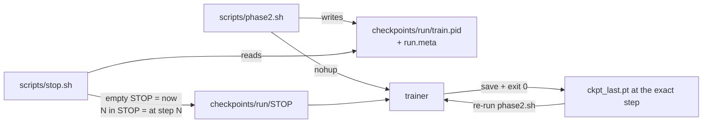
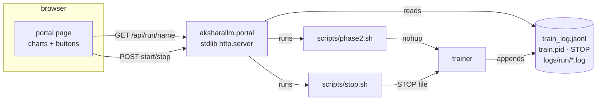
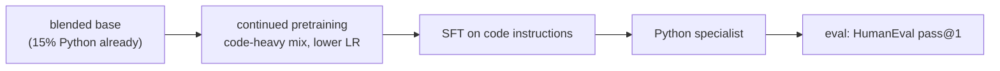

# 7. Scaling up — Phase 2 and beyond

Phase 1 proved the pipeline. Now build something real.

## The Phase 2 target

`configs/small-code.yaml` — **~300M parameters, ~10B tokens of a blended corpus
(85% FineWeb-Edu + 15% Python), ~6 days on a 3090.**

| | value |
|---|---|
| d_model / layers / heads | 1024 / 24 / 16 (4 KV) |
| context | 1024 |
| vocab | 32,768 (trained on the blend) |
| data mix | 85% FineWeb-Edu / 15% Python |
| tokens/step | 245,760 |
| steps | 40,000 |
| est. throughput | ~19k tok/s |
| est. VRAM | ~20 GB |

Why blended? One expensive run then yields **two** models — a general chat model (after
SFT/DPO) and a Python specialist (after code-heavy continued pretraining) — and code in
pretraining also improves general reasoning. `configs/small.yaml` (pure FineWeb-Edu) is the
non-blended fallback. Full rationale and the mixing mechanics are in the sections below.

---

## How to pick a size: the compute budget

Everything follows from one equation:

```
FLOPs ≈ 6 × N × D        N = parameters, D = training tokens
```

Your 3090 delivers ~71 TFLOP/s peak in bf16; at 45% MFU that's ~32 TFLOP/s real.

```
one week = 604,800 s × 32e12 = 1.9e19 FLOPs
```

So `6 × N × D ≈ 1.9e19`, meaning `N × D ≈ 3.2e18`. That's your entire budget for a week.
Spend it on a big model trained briefly, or a small model trained thoroughly.

### Chinchilla, and why we ignore it slightly

The [Chinchilla](https://arxiv.org/abs/2203.15556) result says that for a *fixed training
budget*, the optimal split is **D ≈ 20 × N** — about 20 tokens per parameter.

For our budget that gives N ≈ 400M, D ≈ 8B.

But Chinchilla optimises **training** cost and ignores **inference** cost. If you're going
to actually use the model, a smaller model trained on more tokens is better: it's cheaper
to run forever, and quality keeps improving well past 20×. Llama 3 8B was trained at ~1800
tokens/param.

So we use **~300M params on 10B tokens (33×)** — deliberately "over-trained", which is the
right call when you plan to run the thing.

### Reference points

| params | tokens | ratio | 3090 time |
|---|---|---|---|
| 125M | 5B | 40× | ~2 days |
| **300M** | **10B** | **33×** | **~6 days** |
| 500M | 10B | 20× | ~9 days |
| 1B | 10B | 10× | ~18 days ⚠️ |

---

## Running Phase 2

### 1. Check disk

```bash
df -h .
```

You need **~25 GB free**. 10B tokens × 2 bytes = 20 GB, plus the tokenizer and headroom.
This is usually the binding constraint, not VRAM.

### 2. Prepare the blended data (~2–4 hours, network-bound)

`prepare_blend` trains one tokenizer on the mix, tokenizes each source to its own `.bin`,
writes a combined `val.bin`, and prints the config block to paste:

```bash
python -m aksharallm.data.prepare_blend \
    --out-dir data/blend --vocab-size 32768 \
    --source fineweb-edu-10bt:0.85 --source codeparrot-python:0.15 \
    --val-tokens 10000000 --max-train-tokens 10000000000
```

Paste the printed `train_sources:` block into `configs/small-code.yaml` (the default paths
already match). Verify before proceeding:

```bash
ls -la data/blend/     # fineweb-edu-10bt.bin ~17 GB, codeparrot-python.bin ~3 GB
```

> A truncated data file is the worst possible failure here — you'd train for six days on
> a repeating slice. Check the sizes. (For a **pure** FineWeb-Edu base, use
> `python -m aksharallm.data.prepare fineweb-edu-10bt --out-dir data/fineweb …` with
> `configs/small.yaml` instead.)

### 3. Tune the batch size

Raise `batch_size` until you OOM, then back off ~10%:

```bash
python -m aksharallm.train.pretrain configs/small-code.yaml \
    -o train.max_steps=30 -o train.batch_size=16
```

Then set `grad_accum` so `batch_size × grad_accum × 1024 ≈ 250,000`.

### 4. Smoke test

Isolate it to a throwaway dir with `resume=null`, so the 50-step smoke checkpoint doesn't
land in `checkpoints/small-code/` and get picked up by the real run's `resume: auto`:

```bash
python -m aksharallm.train.pretrain configs/small-code.yaml \
    -o train.max_steps=50 -o train.out_dir=/tmp/aksharallm_smoke -o train.resume=null
```

Check: step-0 loss ≈ `ln(32768) = 10.4`, MFU > 35%, memory stable, `grad_norm` falling.
The header should print `blended training: MixedTokenDataset([… :0.85, … :0.15], …)`.

### 5. Launch

```bash
mkdir -p logs/small-code
LOG=logs/small-code/train_$(date '+%Y%m%d-%H%M%S').log     # one log per session, never reused
nohup python -m aksharallm.train.pretrain configs/small-code.yaml > "$LOG" 2>&1 &
echo $! > checkpoints/small-code/train.pid   # so any later shell can find this run
ln -sfn "$LOG" train_small-code.log          # stable path to tail
tail -f train_small-code.log
```

`resume: auto` means you can stop it and restart with the identical command at any time.
Two habits that matter more than they look:

- **Record the pid in a file.** You will want to stop this run from a different shell, days
  later, when the launching terminal and its `$!` are long gone.
- **Never reuse one log path.** `> train.log` on the second launch erases the first
  session's log — the only record of how that session behaved.

`scripts/phase2.sh` does both for you; the rest of this section is what it automates.

### 6. Watch it

```bash
tail -f train.log
python -c "
import json
for l in open('checkpoints/small-code/train_log.jsonl'):
    d = json.loads(l)
    if 'val_loss' in d: print(d['step'], round(d['val_loss'], 4))
"
```

Or run the portal (`scripts/portal.sh`) and watch the curves in a browser — same numbers,
same files, no `wandb` account. See "Driving it from a browser" below. Setting
`wandb_project` in the config remains an option if you want the runs hosted.

### The one-command wrapper

`scripts/phase2.sh` does all six steps above — pre-flight (disk + tests), build the blended
data, validate the bin sizes, isolated smoke test, then background launch. Run it *once*
after Phase 1 works:

```bash
scripts/phase2.sh                    # blended base (prepare_blend + configs/small-code.yaml)
PURE=1 scripts/phase2.sh             # non-blended FineWeb-Edu-only fallback (configs/small.yaml)
STOP_AFTER=2000 scripts/phase2.sh    # train 2000 steps tonight, then save and exit
```

It records the pid in `checkpoints/<run>/train.pid` and a human-readable
`checkpoints/<run>/run.meta` (pid, start time, config, log path, exact command), waits 5s to
catch an immediate crash, and refuses to start if that run is already training — two
trainers sharing one GPU and one checkpoint dir corrupt both.

### One log per session

A run trained over many evenings is many processes. Redirecting each launch to the same
`train.log` with `>` **destroys the previous session's log** — exactly the record you need to
answer "was last night slower than the night before?". So `phase2.sh` writes a timestamped
log per session and points a stable symlink at the newest:

```
logs/small-code/train_20260725-083556.log     session 1 (kept)
logs/small-code/train_20260726-211447.log     session 2 (kept)
train_small-code.log -> logs/small-code/train_20260726-211447.log   (newest; tail -f this)
```

`checkpoints/<run>/sessions.log` appends one line per launch (time, pid, log path), and
`checkpoints/<run>/train_log.jsonl` stays append-only across every session, now bracketed by
`session_start` / `session_end` records — which is what makes sessions separable when you
read it back:

```bash
scripts/sessions.py small-code           # one row per session
scripts/sessions.py small-code --steps   # plus every step line, grouped by session
```

```
#  started              steps       loss (ema)       best val  tok/s  wall   ended
1  2026-07-25 08:35:56  0 -> 619    10.609 -> 4.186  -         26.9k  46m12s signal
2  2026-07-26 21:14:47  620 -> 2100 4.186 -> 3.402   3.3901    27.0k  8h02m  reached stop step 2100
```

Session logs are plain text and tiny (a few hundred KB per day at `log_every: 50`). Keep
them all; `logs/` is gitignored.

### Stopping it

```bash
scripts/stop.sh                      # graceful stop of the default run; waits for the save
scripts/stop.sh small-code --status  # is it alive, and at what step? changes nothing
scripts/stop.sh small-code --after 500   # queue: 500 more steps, then save and exit
scripts/stop.sh small-code --at 20000    # queue: finish step 20000, then save and exit
scripts/stop.sh small-code --cancel      # withdraw a queued stop; the run carries on
FORCE=1 scripts/stop.sh small-code   # SIGKILL if the graceful stop hasn't landed in WAIT=300s
```



`--at N` and `--after N` are inclusive — step N is trained, logged and checkpointed, and the
resume starts at N+1.

With no pid file (a run launched by hand, or started before this existed) `stop.sh` finds
the process by its command line and adopts the pid into the file. A graceful stop removes
the STOP file itself; `stop.sh` also clears a stale one, since a leftover STOP would end the
*next* launch at step 0.

### Driving it from a browser

Everything above works from a terminal, which is the right interface for a machine you are
sitting at. It is the wrong interface for "is it still going?" from a phone on the sofa. So
there is a small local portal:

```bash
scripts/portal.sh              # http://127.0.0.1:8765
scripts/portal.sh --open       # ...and open a browser at it
scripts/portal.sh --port 9000
```

It shows, for whichever run you pick: the current step against the budget with an ETA, the
latest loss / throughput / MFU, the loss curve (per-step, EMA and validation), throughput,
gradient norm and the LR schedule, the per-session table, the tail of the live log, and the
config the trainer actually read. Start, stop, "stop after N more steps", "stop at step N"
and "cancel that" are buttons.

**The portal is a view, not a second system.** It starts runs by running `scripts/phase2.sh`
and stops them by running `scripts/stop.sh` — the same scripts, with the same pre-flight and
the same graceful save. It stores nothing of its own: every number on the page is read back
out of `checkpoints/<run>/train_log.jsonl`, `train.pid`, `STOP` and `logs/<run>/*.log`.



Consequences of it being only a view, all of them good:

- Closing the portal, or killing it, does **not** stop training. The trainer is detached.
- A run you launched from a terminal shows up in the portal, and vice versa. Both find the
  process the same way `stop.sh` does — pid file first, command line as the fallback.
- You can run it on the training box and read it from another machine on the LAN, but the
  API starts and stops processes and has **no login**, so a non-loopback bind must be asked
  for explicitly: `scripts/portal.sh --host 0.0.0.0 --allow-remote`.

Two things worth knowing before pressing **Start**:

| | |
|---|---|
| **Start takes minutes to become "training"** | It runs the full pre-flight: tests, disk check, data check, then a 50-step smoke test. The page shows `pre-flight` and streams that log until the trainer appears. |
| **`skip smoke test`** | Sets `SKIP_SMOKE=1`, which `phase2.sh` honours **only** when `ckpt_last.pt` exists — i.e. when you are resuming a config that has already trained for real. On a first launch it runs the smoke test anyway and says so. |

The whole thing is the standard library plus hand-written SVG: `aksharallm/portal/` is
~600 lines (`runs.py` = what a run is, `server.py` = routes, `static/` = the page), and
`aksharallm/train/runlog.py` is the shared reader that `scripts/sessions.py` uses too, so the
table in the terminal and the chart in the browser cannot disagree.

### Re-running (what happens if you run it again)

Re-running is the intended resume workflow — nothing is lost or duplicated:

| you re-run… | what happens |
|---|---|
| `scripts/phase2.sh` | Sees `data/blend/*.bin` already exist → **skips** the 2–4h rebuild; smoke runs in `/tmp` (harmless); the real run **resumes** from `checkpoints/small-code/ckpt_last.pt`. Errors out instead if that run is still training. |
| `python -m aksharallm.train.pretrain configs/small-code.yaml` | **Resumes** from the last checkpoint (`resume: auto`) — restores weights, optimizer state, and step. The loss curve continues with no spike. |
| `python -m aksharallm.data.prepare_blend …` (manual) | Does **not** skip — re-tokenizes every source from scratch (~2–4h) and overwrites the bins. Safe but wasteful. The tokenizer is reused if it already exists. |

To deliberately **start over** instead of resuming, delete the run's checkpoint dir first:
`rm -rf checkpoints/small-code/`.

---

## What to expect

| step | tokens | val loss | what it can do |
|---|---|---|---|
| 1,000 | 0.25B | ~5.0 | words, some grammar |
| 5,000 | 1.2B | ~3.8 | fluent sentences |
| 15,000 | 3.7B | ~3.3 | coherent paragraphs, some facts |
| 40,000 | 9.8B | ~2.9 | solid base model |

Below ~3.0 on FineWeb-Edu is a genuinely useful base model at this scale.

---

## Then post-train it

```bash
# SFT (~2 hours) -- use the base's own (blended) tokenizer for all post-training
python -m aksharallm.data.prepare_sft smoltalk \
    --tokenizer data/blend/tokenizer.json --out-dir data/sft --seq-len 1024
python -m aksharallm.train.sft \
    --base checkpoints/small-code/ckpt_best.pt --data-dir data/sft \
    --tokenizer data/blend/tokenizer.json --out-dir checkpoints/small-sft

# DPO (~3 hours)
python -m aksharallm.data.prepare_dpo ultrafeedback \
    --tokenizer data/blend/tokenizer.json --out-dir data/dpo --seq-len 1024
python -m aksharallm.train.dpo \
    --sft checkpoints/small-sft/sft_best.pt --data-dir data/dpo \
    --tokenizer data/blend/tokenizer.json --out-dir checkpoints/small-dpo
```

---

## Specialising: the Python model (Stage C)

The chosen target is a **Python specialist**. Because the base is already blended (15%
Python), it starts with real code fluency — specialising is then cheap, and this is where a
small model genuinely competes.



**Continued pretraining** — keep doing next-token prediction, but on a **code-heavy** mix
(e.g. 70% Python / 30% general, to avoid forgetting), at a *lower* LR (~10% of the base
run's), for a few hundred million to ~1B tokens. Reuse `MixedTokenDataset` — just flip the
weights toward code — starting from the base's `ckpt_best.pt`.

**Then SFT** on Python instruction data (function-writing, bug-fixing, explaining).

**Why it's worth it:** a 300M model specialised on Python routinely beats a general 7B
model *on Python*, while running ~20× faster — and unlike most targets, the eval is
**objective**: HumanEval/MBPP run the generated code against unit tests. That objective
score is the realistic "genuinely useful" outcome for this repo.

(For a *different* domain later, the same recipe applies — swap the corpus. For a small
personal corpus, prefer RAG over pretraining; see below.)

---

## Phase 3 — pushing to ~1B on one GPU

You flagged this as a future TODO. The techniques, in the order you'd reach for them:

| technique | saves | costs |
|---|---|---|
| **Gradient checkpointing** | ~60% of activation memory | ~30% slower |
| **8-bit AdamW** (`bitsandbytes`) | 75% of optimizer state (~8 GB at 1B params) | negligible |
| **Smaller micro-batch + more accum** | activation memory | slightly lower MFU |
| **CPU optimizer offload** | all optimizer state | much slower; last resort |

Memory at 1B params, bf16 + fp32 master weights:

```
weights (fp32)           4 GB
gradients (fp32)         4 GB
Adam m, v (fp32)         8 GB   ← 8-bit Adam cuts this to 2 GB
activations              varies with batch
                       ------
                        16 GB before activations — tight in 24 GB
```

Honest advice: **a well-trained 300M model is more useful than a badly-trained 1B model.**
Compute per parameter is what matters, and at 1B on one GPU you can't afford enough tokens
to make the extra parameters pay. Do Phase 2 properly first.

---

## Things that would improve quality, roughly by value

1. **Better data.** Always first. Deduplication and quality filtering beat every
   architectural change on this list.
2. **More tokens.** Just keep training; loss keeps falling.
3. **Longer context** (2048). Cheap to do, helps coherence. Costs memory quadratically in
   attention.
4. **Learning-rate tuning.** A 2× error here costs more than any architecture tweak.
5. **Architecture.** Diminishing returns; the Llama recipe we use is already close to
   optimal at this scale.

---

Next: [8. Troubleshooting →](08-troubleshooting.md)
