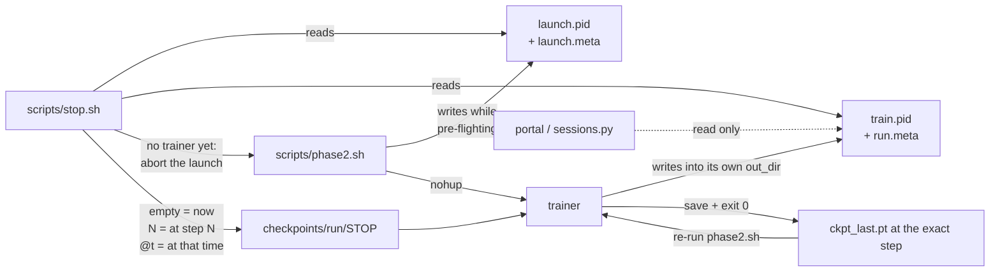
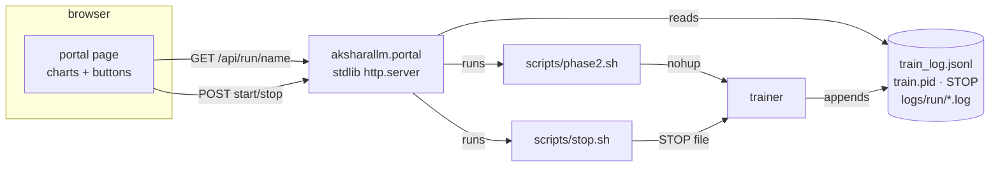
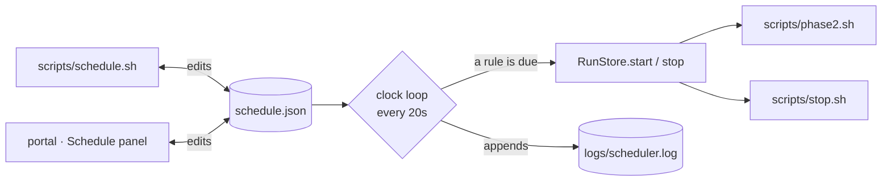
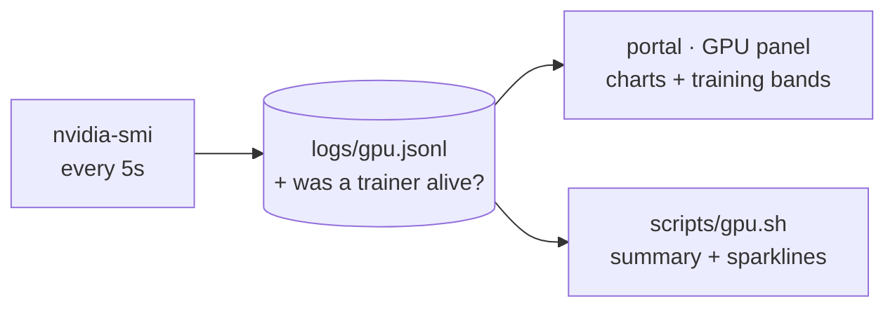
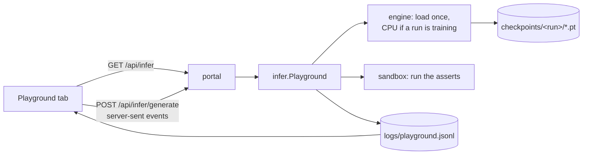
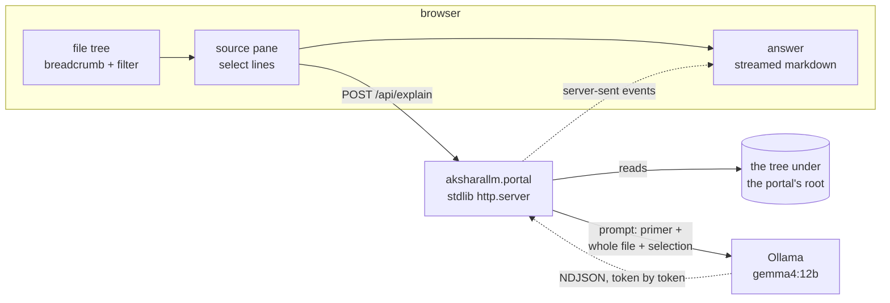
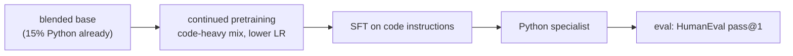

# 7. Scaling up — Phase 2 and beyond

Phase 1 proved the pipeline. Now build something real.

## The Phase 2 target

`configs/small-code.yaml` — **~300M parameters, ~10B tokens of a blended corpus
(85% FineWeb-Edu + 15% Python), ~6 days on a 3090.**

| | value |
|---|---|
| d_model / layers / heads | 1024 / 24 / 16 (4 KV) |
| context | 1024 |
| vocab | 32,768 (trained on the blend) |
| data mix | 85% FineWeb-Edu / 15% Python |
| tokens/step | 245,760 |
| steps | 40,000 |
| est. throughput | ~19k tok/s |
| est. VRAM | ~20 GB |

Why blended? One expensive run then yields **two** models — a general chat model (after
SFT/DPO) and a Python specialist (after code-heavy continued pretraining) — and code in
pretraining also improves general reasoning. `configs/small.yaml` (pure FineWeb-Edu) is the
non-blended fallback. Full rationale and the mixing mechanics are in the sections below.

---

## How to pick a size: the compute budget

Everything follows from one equation:

```
FLOPs ≈ 6 × N × D        N = parameters, D = training tokens
```

Your 3090 delivers ~71 TFLOP/s peak in bf16; at 45% MFU that's ~32 TFLOP/s real.

```
one week = 604,800 s × 32e12 = 1.9e19 FLOPs
```

So `6 × N × D ≈ 1.9e19`, meaning `N × D ≈ 3.2e18`. That's your entire budget for a week.
Spend it on a big model trained briefly, or a small model trained thoroughly.

### Chinchilla, and why we ignore it slightly

The [Chinchilla](https://arxiv.org/abs/2203.15556) result says that for a *fixed training
budget*, the optimal split is **D ≈ 20 × N** — about 20 tokens per parameter.

For our budget that gives N ≈ 400M, D ≈ 8B.

But Chinchilla optimises **training** cost and ignores **inference** cost. If you're going
to actually use the model, a smaller model trained on more tokens is better: it's cheaper
to run forever, and quality keeps improving well past 20×. Llama 3 8B was trained at ~1800
tokens/param.

So we use **~300M params on 10B tokens (33×)** — deliberately "over-trained", which is the
right call when you plan to run the thing.

### Reference points

| params | tokens | ratio | 3090 time |
|---|---|---|---|
| 125M | 5B | 40× | ~2 days |
| **300M** | **10B** | **33×** | **~6 days** |
| 500M | 10B | 20× | ~9 days |
| 1B | 10B | 10× | ~18 days ⚠️ |

---

## Running Phase 2

### 1. Check disk

```bash
df -h .
```

You need **~25 GB free**. 10B tokens × 2 bytes = 20 GB, plus the tokenizer and headroom.
This is usually the binding constraint, not VRAM.

### 2. Prepare the blended data (~2–4 hours, network-bound)

`prepare_blend` trains one tokenizer on the mix, tokenizes each source to its own `.bin`,
writes a combined `val.bin`, and prints the config block to paste:

```bash
python -m aksharallm.data.prepare_blend \
    --out-dir data/blend --vocab-size 32768 \
    --source fineweb-edu-10bt:0.85 --source codeparrot-python:0.15 \
    --val-tokens 10000000 --max-train-tokens 10000000000
```

Paste the printed `train_sources:` block into `configs/small-code.yaml` (the default paths
already match). Verify before proceeding:

```bash
ls -la data/blend/     # fineweb-edu-10bt.bin ~17 GB, codeparrot-python.bin ~3 GB
```

> A truncated data file is the worst possible failure here — you'd train for six days on
> a repeating slice. Check the sizes. (For a **pure** FineWeb-Edu base, use
> `python -m aksharallm.data.prepare fineweb-edu-10bt --out-dir data/fineweb …` with
> `configs/small.yaml` instead.)

### 3. Tune the batch size

Raise `batch_size` until you OOM, then back off ~10%:

```bash
python -m aksharallm.train.pretrain configs/small-code.yaml \
    -o train.max_steps=30 -o train.batch_size=16
```

Then set `grad_accum` so `batch_size × grad_accum × 1024 ≈ 250,000`.

### 4. Smoke test

Isolate it to a throwaway dir with `resume=null`, so the 50-step smoke checkpoint doesn't
land in `checkpoints/small-code/` and get picked up by the real run's `resume: auto`:

```bash
python -m aksharallm.train.pretrain configs/small-code.yaml \
    -o train.max_steps=50 -o train.out_dir=/tmp/aksharallm_smoke -o train.resume=null
```

Check: step-0 loss ≈ `ln(32768) = 10.4`, MFU > 35%, memory stable, `grad_norm` falling.
The header should print `blended training: MixedTokenDataset([… :0.85, … :0.15], …)`.

### 5. Launch

```bash
mkdir -p logs/small-code
LOG=logs/small-code/train_$(date '+%Y%m%d-%H%M%S').log     # one log per session, never reused
nohup python -m aksharallm.train.pretrain configs/small-code.yaml > "$LOG" 2>&1 &
echo $! > checkpoints/small-code/train.pid   # so any later shell can find this run
ln -sfn "$LOG" train_small-code.log          # stable path to tail
tail -f train_small-code.log
```

`resume: auto` means you can stop it and restart with the identical command at any time.
Two habits that matter more than they look:

- **Record the pid in a file.** You will want to stop this run from a different shell, days
  later, when the launching terminal and its `$!` are long gone.
- **Never reuse one log path.** `> train.log` on the second launch erases the first
  session's log — the only record of how that session behaved.

`scripts/phase2.sh` does both for you; the rest of this section is what it automates.

### 6. Watch it

```bash
tail -f train.log
python -c "
import json
for l in open('checkpoints/small-code/train_log.jsonl'):
    d = json.loads(l)
    if 'val_loss' in d: print(d['step'], round(d['val_loss'], 4))
"
```

Or run the portal (`scripts/portal.sh`) and watch the curves in a browser — same numbers,
same files, no `wandb` account. See "Driving it from a browser" below. Setting
`wandb_project` in the config remains an option if you want the runs hosted.

### The one-command wrapper

`scripts/phase2.sh` does all six steps above — pre-flight (disk + tests), build the blended
data, validate the bin sizes, isolated smoke test, then background launch. Run it *once*
after Phase 1 works:

```bash
scripts/phase2.sh                    # blended base (prepare_blend + configs/small-code.yaml)
PURE=1 scripts/phase2.sh             # non-blended FineWeb-Edu-only fallback (configs/small.yaml)
STOP_AFTER=2000 scripts/phase2.sh    # train 2000 steps tonight, then save and exit
```

It records the pid in `checkpoints/<run>/train.pid` and a human-readable
`checkpoints/<run>/run.meta` (pid, start time, config, log path, exact command), waits 5s to
catch an immediate crash, and refuses to start if that run is already training — two
trainers sharing one GPU and one checkpoint dir corrupt both. It also publishes *itself*
while it pre-flights (`launch.pid` + `launch.meta`, with the stage it has reached), so a
second launch is refused too, and both `stop.sh` and the portal can see a launch that has no
trainer yet. The trainer additionally writes its own `train.pid` into its `out_dir`, which is
what makes the 50-step smoke test impossible to confuse with the run.

### One log per session

A run trained over many evenings is many processes. Redirecting each launch to the same
`train.log` with `>` **destroys the previous session's log** — exactly the record you need to
answer "was last night slower than the night before?". So `phase2.sh` writes a timestamped
log per session and points a stable symlink at the newest:

```
logs/small-code/train_20260725-083556.log     session 1 (kept)
logs/small-code/train_20260726-211447.log     session 2 (kept)
train_small-code.log -> logs/small-code/train_20260726-211447.log   (newest; tail -f this)
```

`checkpoints/<run>/sessions.log` appends one line per launch (time, pid, log path), and
`checkpoints/<run>/train_log.jsonl` stays append-only across every session, now bracketed by
`session_start` / `session_end` records — which is what makes sessions separable when you
read it back:

```bash
scripts/sessions.py small-code           # one row per session
scripts/sessions.py small-code --steps   # plus every step line, grouped by session
```

```
#  started              steps       loss (ema)       best val  tok/s  wall   ended
1  2026-07-25 08:35:56  0 -> 619    10.609 -> 4.186  -         26.9k  46m12s signal
2  2026-07-26 21:14:47  620 -> 2100 4.186 -> 3.402   3.3901    27.0k  8h02m  reached stop step 2100
```

Session logs are plain text and tiny (a few hundred KB per day at `log_every: 50`). Keep
them all; `logs/` is gitignored.

### Stopping it

```bash
scripts/stop.sh                      # graceful stop of the default run; waits for the save
scripts/stop.sh small-code --status  # is it alive, and at what step? changes nothing
scripts/stop.sh small-code --after 500   # queue: 500 more steps, then save and exit
scripts/stop.sh small-code --at 20000    # queue: finish step 20000, then save and exit
scripts/stop.sh small-code --in 30m      # queue: 30 more minutes, then save and exit
scripts/stop.sh small-code --by 06:30    # queue: train until half six, then save and exit
scripts/stop.sh small-code --cancel      # withdraw a queued stop; the run carries on
FORCE=1 scripts/stop.sh small-code   # SIGKILL if the graceful stop hasn't landed in WAIT=300s
```



`--at N` and `--after N` are inclusive — step N is trained, logged and checkpointed, and the
resume starts at N+1. `--in` and `--by` take durations (`30m`, `90s`, `2h`, `1h30m`, or a
bare number of minutes) and clock times, and put an `@<epoch>` deadline in the STOP file for
the trainer itself to honour — nothing has to stay alive to make the stop happen, which is
why closing the terminal, or restarting the portal, does not lose it.

With no pid file (a run launched by hand, or started before this existed) `stop.sh` finds
the process by its command line and adopts the pid into the file. A graceful stop removes
the STOP file itself; `stop.sh` also clears a stale one, since a leftover STOP would end the
*next* launch at step 0.

### Driving it from a browser

Everything above works from a terminal, which is the right interface for a machine you are
sitting at. It is the wrong interface for "is it still going?" from a phone on the sofa. So
there is a small local portal:

```bash
scripts/portal.sh              # http://127.0.0.1:8765
scripts/portal.sh --open       # ...and open a browser at it
scripts/portal.sh --lan        # reachable from your phone/laptop; prints the address
scripts/portal.sh --port 9000
```

It shows, for whichever run you pick: the current step against the budget with an ETA, the
latest loss / throughput / MFU, the loss curve (per-step, EMA and validation), throughput,
gradient norm and the LR schedule, the per-session table, the tail of the live log, and the
config the trainer actually read. Start, stop, "stop after N more steps", "stop at step N"
and "cancel that" are buttons.

There are three tabs, and each has its own address (`#dashboard`, `#play`, `#code`) so a
view can be bookmarked or linked to:

| tab | what it is for |
|---|---|
| **Dashboard** | everything above — the run |
| **Playground** | talk to the checkpoint the run is producing; see "Testing the model while it trains" |
| **Code** | a source browser that explains the project back to you with a local model |

**The portal is a view, not a second system.** It starts runs by running `scripts/phase2.sh`
and stops them by running `scripts/stop.sh` — the same scripts, with the same pre-flight and
the same graceful save. It stores nothing of its own: every number on the page is read back
out of `checkpoints/<run>/train_log.jsonl`, `train.pid`, `STOP` and `logs/<run>/*.log`.



Consequences of it being only a view, all of them good:

- Closing the portal, or killing it, does **not** stop training. The trainer is detached.
- A run you launched from a terminal shows up in the portal, and vice versa. Both find the
  process the same way `stop.sh` does — pid file first, command line as the fallback.
- A run you start in the browser can be stopped from a terminal, and a run you start in a
  terminal can be stopped from the browser — *including while it is still in pre-flight*
  (see below).
- `--lan` serves on every interface and prints the address to type elsewhere
  (`http://192.168.x.x:8765/`). It is one flag rather than the default because the API
  starts and stops training and has **no login**: fine on a home network, never on the open
  internet. `--host`/`--allow-remote` remain for explicit control.

#### One record of a launch, read by both sides

Pre-flight is minutes long and has no trainer in it yet, which used to make it invisible:
`stop.sh --status` said "not running", a second launch sailed past the "already training?"
check, and — worse — a stop aimed at whatever `pgrep` found, which during those minutes is
the **50-step smoke test** (same command line, throwaway `out_dir`). You got a confident
"queued: pid NNN will finish step N" for a process that never reads that STOP file.

Two rules fix it, and both scripts and the portal follow them:

| file | written by | means |
|---|---|---|
| `checkpoints/<run>/train.pid` | the **trainer itself** (`pretrain.py`), into its own `out_dir` | who is training *into this directory* — so the smoke test's pid lands in `/tmp/aksharallm_smoke/`, not here |
| `checkpoints/<run>/launch.pid` + `launch.meta` | `phase2.sh`, from its first second | a launch is in pre-flight, and which stage (`preflight` / `data` / `smoke` / `launching`) |

So: `phase2.sh` refuses to start over another launch as well as over a live trainer; the
portal shows `pre-flight · smoke` instead of a fictitious "training"; and `stop.sh --status`
reports the launch. The command-line fallback that adopts a hand-launched run is now
anchored (`…configs/small-code.yaml$`), so it can never match the smoke test's
override-laden command line.

#### Stopping a launch

Pressing **Stop** (or `scripts/stop.sh <run>`) during pre-flight **aborts the launch** —
nothing has trained, so nothing is lost. It signals the launcher *and* the child it is
waiting on (bash would otherwise sit on the signal until the smoke test finished eight
minutes later), never a process group. Two deliberate refusals:

- at stage `launching` it declines — the trainer is seconds old and still the launcher's
  child, so signalling could take the real run with it. Wait, then stop the run.
- "stop after N" / "stop at N" are disabled during pre-flight: there is no step to count
  from yet.

Aborting during the `data` stage prints a warning to check the `.bin` sizes before
relaunching — a half-written token file is not obvious, and `phase2.sh` skips the rebuild
whenever the files merely exist.

Two things worth knowing before pressing **Start**:

| | |
|---|---|
| **Start takes minutes to become "training"** | It runs the full pre-flight: tests, disk check, data check, then a 50-step smoke test. The page shows `pre-flight` and streams that log until the trainer appears. |
| **`skip smoke test`** | Sets `SKIP_SMOKE=1`, which `phase2.sh` honours **only** when `ckpt_last.pt` exists — i.e. when you are resuming a config that has already trained for real. On a first launch it runs the smoke test anyway and says so. |

The whole thing is the standard library plus hand-written SVG: `aksharallm/portal/` is
~600 lines (`runs.py` = what a run is, `server.py` = routes, `static/` = the page), and
`aksharallm/train/runlog.py` is the shared reader that `scripts/sessions.py` uses too, so the
table in the terminal and the chart in the browser cannot disagree.

#### "Stop it in twenty minutes" — the picker

Every "how long?" in the portal is one dialog: the **this session** button beside Start, and
**Stop at…** on the dashboard, the Finetune tab and a running QAT job. Pick the unit — steps
or time — take a preset (1 / 5 / 10 / 30 min, 1 / 2 / 4 h; 10 / 50 / 100 / 500 / 1k / 5k
steps), or turn the dial for anything between, and read the sentence underneath: what step
it lands on, what time it finishes, how many checkpoints happen on the way.

The dial is **logarithmic**. On a linear track from one minute to twelve hours, every stop
anyone actually wants lives in the first 4% of it; log spacing gives the short end the room
it earns. The exact field beside it is always there for a number you already know.

Two details worth stating, because they are the difference between a control you trust and
one you check afterwards:

- A **time** stop is a deadline in the STOP file, not a step count computed when you pressed
  the button. If the run halves in speed, "30 minutes" is still 30 minutes.
- The finish line on the progress meter is therefore *projected* for a timed stop — drawn
  dotted, and labelled "about step N", because the exact step is not knowable in advance.

This is the one-off. For anything that repeats, the next section is what you want.

### Scheduling it: "train overnight, hand the GPU back at breakfast"

Six days of compute over evenings is a lot of remembering to press things. So starts and
stops can be put on a clock — several windows a day, per weekday — from either side:

```bash
scripts/schedule.sh window small-code 22:00 06:30 --days mon-fri
scripts/schedule.sh window small-code 13:00 17:30 --days sat,sun --steps 2000
scripts/schedule.sh                       # the rules, and when each next fires
scripts/schedule.sh pause 3f9a2b1c        # keep a rule, don't fire it
scripts/schedule.sh off                   # master switch: nothing fires at all
scripts/schedule.sh log                   # what it actually did, and why
```

…or in the portal's **Schedule** panel: pick a run, a start and stop time, click the days,
press Add. Both edit the same `schedule.json` in the repo root, so a window added in the
browser is `scripts/schedule.sh`'s to pause, and vice versa.

A schedule is for something that **repeats**. Writing a rule to stop a run once, tonight, is
the wrong tool — it needs something watching the clock, and you have to remember to remove
it. Use `--in`/`--by` or the Stop at… dialog for that: the deadline goes to the trainer,
which honours it whether or not anything else is still running, and it is gone once it
fires.

A window is stored as the two rules it really is, and the stop's days are shifted when it
crosses midnight — `22:00 → 06:30, mon-fri` means starts Mon–Fri and stops **Tue–Sat**.
Getting that wrong silently leaves the GPU running all Saturday, so it is done for you.



**Something has to watch the clock.** Any one of these, and they take the same
one-per-machine lock so they never double-fire:

| | |
|---|---|
| `scripts/portal.sh` | runs the scheduler by default — this is the usual answer, since the portal is the thing you leave running |
| `scripts/schedule.sh daemon` | a foreground clock loop with no web server |
| `* * * * * cd <repo> && scripts/schedule.sh check` | let cron do the ticking; `check` fires anything due and exits |

The portal says plainly when nothing is watching, because a schedule you have stopped
checking on is worse than no schedule at all.

Two properties make an unattended schedule safe to leave armed:

- **Firing is idempotent.** A start when the run is already training is a no-op; so is a
  stop when nothing is running. Overlapping rules cannot compound into two trainers — the
  log records `skipped — 'small-code' is already training as pid …`.
- **A missed fire stays missed.** If the machine was asleep at 22:00, that start does not go
  off at 07:00 when you open the lid; the grace window is 15 minutes. Waking to find a run
  that began nine hours late, mid-workday, is worse than one that didn't begin.

Scheduled starts default to **skipping the smoke test** (`SKIP_SMOKE=1`), because a
scheduled start is nearly always a resume — and `phase2.sh` ignores the skip anyway when
there is no `ckpt_last.pt` to resume from. Tick "run the smoke test" (or drop `--smoke`'s
absence on the CLI) if you would rather have the eight minutes of insurance every night.

### Watching the GPU itself

Loss curves say whether the model is learning. They say nothing about whether the *card* is
healthy — and on a machine you also use, the interesting question is often "is something
else on my GPU?". So the portal samples `nvidia-smi` every five seconds into
`logs/gpu.jsonl` and charts utilisation, memory, temperature and power over time:

```bash
scripts/gpu.sh                    # now, plus a 1-hour summary split training vs idle
scripts/gpu.sh --window 6h        # 15m | 1h | 6h | 24h | all
scripts/gpu.sh watch              # one line a second, like `nvidia-smi -l 1`
scripts/gpu.sh daemon             # record samples without running the portal
```

Every sample records **whether a trainer was alive at that moment**, which is what makes
the comparison possible. The charts band the training periods in grey, and both the panel
and the CLI split every average in two:

```
last 6h (4,320 samples)
                  time     util  memory   temp  peak temp  power
while training    5h12m    98%   19.1 GB  71°C  74°C       309 W
idle              48m00s   3%    0.4 GB   43°C  46°C       26 W
```

That table answers questions the loss curve cannot:

| reading | what it means |
|---|---|
| util well under ~95% while training | the GPU is waiting on something — data loading, a too-small batch, or another process |
| memory used ≫ the trainer's own | something else is resident. An inference server left running is the usual culprit |
| temperature flat at a ceiling | thermal throttling; expect `tok/s` to have dropped with it |
| power far below the limit under load | the card is not being fed work |



The sampler runs inside the portal by default (`--no-gpu` to skip it, `scripts/gpu.sh
daemon` to run it alone), takes the same one-per-machine lock as the scheduler, and trims
`logs/gpu.jsonl` to a rolling ~8 MB — roughly a week. GPU telemetry is a rolling picture;
`train_log.jsonl` is the record that has to survive.

Two honest limitations worth knowing: **history only exists while something is sampling**,
so a gap in the chart means nobody was watching, not that the GPU was idle (spans break
across gaps rather than drawing one continuous band); and during pre-flight the *smoke
test* occupies the GPU without a trainer being alive, so you will see load with no training
band — which is correct, and a useful thing to be able to see.

### Testing the model while it trains

The Dashboard answers "is the loss going down". It cannot answer "has it learnt to finish a
sentence", and at some point in a six-day run that becomes the only question you care about.
The **Playground** tab is that: pick a checkpoint, type something, read what comes back.

Three columns, left to right in the order you use them.

**Left — which model.** Every `.pt` under `checkpoints/*/`, each labelled with the step it
stopped at, its validation loss, its smoothed training loss at that step, and how many
tokens it has seen. `ckpt_last.pt` is re-read whenever it changes, so re-selecting it during
a run picks up the newer weights — testing *during* a run is the point.

Underneath is the sentence that matters most on this tab:

> **CPU** — small-code is training on this card, so inference runs on the CPU to keep the
> run safe. It will be slow — a few tokens a second. The GPU is used automatically once the
> run stops.

The trade is spelled out in `configs/portal.yaml` and in
[6. Inference](06-inference.md#testing-a-model-while-it-is-still-training): a 300M model
would fit in the ~3 GB a Phase-2 run leaves free, and it is still not worth risking six days
of training on the allocator. The card is used the moment it is free, and the model unloads
after five idle minutes either way.

**Middle — the conversation.** Three modes, and the tab only offers what the checkpoint can
actually do. `Chat` is greyed out on a base model with the reason attached (it has never seen
a ChatML token; that arrives with SFT in Phase 3). `Python` gives you the graded tasks — the
model writes a function body and the asserts are **executed**, with the verdict and the exact
program that ran shown underneath.

**Right — the history.** Every generation, with the step and loss of the model that produced
it. Pick a probe from the dropdown and you get that one prompt across every checkpoint you
have ever run it against, oldest step first. This is the feature that replaces archiving
checkpoints: a text record of what the model said at step 7,000 is a kilobyte and permanent;
a copy of the weights is 1.2 GB and would be one of forty.

The **Run all probes** button generates the whole fixed suite in one go, which is the thing
to do at the end of a session — it puts a row at this step into every probe's comparison.

Everything here is the same code the terminal uses (`python -m aksharallm.infer.cli`), the
same `logs/playground.jsonl`, and the same device policy — so a result you get in the browser
and one you get in a terminal mean the same thing. Two API routes are worth knowing:
`GET /api/infer` describes everything, `POST /api/infer/generate` streams server-sent events
in the same shape as `/api/explain`.



### Reading the code with a local model

The dashboard answers *what is the run doing?*. The portal's second tab — **Code** — answers
the other question you have in front of a from-scratch LLM: *what is this code doing, and
why is it written this way?* Pick a file, highlight some lines, and a model running on your
own machine explains them.

It needs [Ollama](https://ollama.com) and one model, once:

```bash
ollama serve            # or the desktop app
ollama pull gemma4:12b  # ~7.6 GB
```

Then open the portal and click **Code**. The file browser is rooted where the portal is
running (the repo root, or `--root`), and you walk up and down it with the breadcrumb and
the folder rows; the filter box searches the whole tree at once. Select in the pane by
dragging over the source, clicking a line number, or shift-clicking to extend — part of a
line works too, and the model is told exactly which characters you meant. Five preset
questions sit above the answer (*what is this doing · why like this · gotchas · line by
line · the maths*), and you can keep asking follow-ups about the same selection.



**What the model is actually given.** The selection alone cannot explain *why*, so every
request carries three things: a short primer on what this project is and how it is laid out,
the **whole enclosing file** with line numbers (windowed around your selection if it is over
`max_file_chars`, and explicitly told when it has been), and the selected lines. It is also
told which of `docs/00`–`08` covers that area — the path only, so it can point you at the
human-written version rather than paraphrase a doc it has not read. Follow-ups re-send the
file from disk each time, so an answer twenty minutes later quotes the file as it is now.

**Everything is in `configs/portal.yaml`**, under `explain:` — host, model, temperature,
context size, how long Ollama keeps the model resident. The file is re-read when it changes,
so editing it does not mean restarting the portal. `AKSHARALLM_OLLAMA_HOST` and
`AKSHARALLM_EXPLAIN_MODEL` override it for one session (a model on another box, say), and
the tab's model picker overrides it again per question.

Three things are worth knowing before you use it during a run:

| | |
|---|---|
| **It shares your GPU with training.** | A 12B model is ~8 GB of VRAM and a Phase-2 run already holds ~21 GB of a 24 GB card. Asking a question mid-run can push the trainer into an OOM death days in. The tab warns you when a run is training. Set `num_gpu: 0` (or `AKSHARALLM_EXPLAIN_NUM_GPU=0`) to keep the explainer entirely on the CPU — but expect *minutes* to the first word for a 12B, so pair it with a small model like `starcoder2:3b` if you want to read while training. |
| **Thinking models need `think: false`.** | A reasoning model spends `num_predict` on its reasoning *before* it answers, so with thinking on and a budget of 800 you get a complete train of thought and an empty answer — which looks exactly like a broken portal. It is off by default; models that don't know the setting have the request retried without it. When a model does think, the transcript is folded away under the answer, never mixed into it. |
| **Switching `num_gpu` reloads the model.** | Ollama has to tear down the old runner first, and a 12B loaded on CPU takes a while to let go. If a request seems to hang after you change it, `ollama ps` will show the old runner still `Stopping...`. |

The reading boundary is the tree the portal was started in: paths are resolved (symlinks and
all) before they are checked, so `..`, an absolute path, or a symlink pointing outside all
get refused, and only text files under 400 kB are listed. That boundary is the whole
protection — the portal is loopback-only for a reason, and `--lan` means anyone on your
network can read your source as well as stop your training.

The explainer writes nothing, and it is stdlib-only like the rest of the portal:
`aksharallm/portal/explain.py` is the file browser, the prompt and a ~40-line streaming
Ollama client; the tab renders its own markdown and highlights its own syntax.

### Restarting the portal

```bash
scripts/portal.sh --status         # running? which pid, which address
scripts/portal.sh --stop
scripts/portal.sh --restart --lan  # stop, then start again in the background
scripts/portal.sh --bg --lan       # start in the background (log: logs/portal.log)
```

`scripts/portal.sh --help` lists these alongside the server's own options — the wrapper
handles `--status/--stop/--restart/--bg` itself, and passing `--help` straight through to the
server used to print a list that mentioned none of them.

It works off `logs/portal.pid`, falling back to finding a portal by process (confined to
this checkout) when that file is missing or has been taken over. **A portal on a second port
will not touch the first one's pid file** — it says whose it is at startup and leaves it
alone. It used to claim the file and then, being well behaved, delete it on exit, after
which `--status`, `--stop` and `--restart` all reported "portal is not running" about a
portal that was still serving pages and still running the scheduler. Both halves of that
(don't steal it; find a portal without it) are covered by
`test_a_second_portal_does_not_steal_the_pid_file`.

Stopping uses SIGTERM, which the portal routes through its
Ctrl-C path so the scheduler releases its lock on the way out (a `kill -9` leaves
`logs/scheduler.pid` behind and the next portal declines to run the clock). Restarting
never touches a training run. It does pause the scheduler for those two seconds, and a rule
due in that gap is missed rather than fired late.

### Re-running (what happens if you run it again)

Re-running is the intended resume workflow — nothing is lost or duplicated:

| you re-run… | what happens |
|---|---|
| `scripts/phase2.sh` | Sees `data/blend/*.bin` already exist → **skips** the 2–4h rebuild; smoke runs in `/tmp` (harmless); the real run **resumes** from `checkpoints/small-code/ckpt_last.pt`. Errors out instead if that run is still training. |
| `python -m aksharallm.train.pretrain configs/small-code.yaml` | **Resumes** from the last checkpoint (`resume: auto`) — restores weights, optimizer state, and step. The loss curve continues with no spike. |
| `python -m aksharallm.data.prepare_blend …` (manual) | Does **not** skip — re-tokenizes every source from scratch (~2–4h) and overwrites the bins. Safe but wasteful. The tokenizer is reused if it already exists. |

To deliberately **start over** instead of resuming, delete the run's checkpoint dir first:
`rm -rf checkpoints/small-code/`.

---

## What to expect

| step | tokens | val loss | what it can do |
|---|---|---|---|
| 1,000 | 0.25B | ~5.0 | words, some grammar |
| 5,000 | 1.2B | ~3.8 | fluent sentences |
| 15,000 | 3.7B | ~3.3 | coherent paragraphs, some facts |
| 40,000 | 9.8B | ~2.9 | solid base model |

Below ~3.0 on FineWeb-Edu is a genuinely useful base model at this scale.

---

## Then post-train it

```bash
# SFT (~2 hours) -- use the base's own (blended) tokenizer for all post-training
python -m aksharallm.data.prepare_sft smoltalk \
    --tokenizer data/blend/tokenizer.json --out-dir data/sft --seq-len 1024
python -m aksharallm.train.sft \
    --base checkpoints/small-code/ckpt_best.pt --data-dir data/sft \
    --tokenizer data/blend/tokenizer.json --out-dir checkpoints/small-sft

# DPO (~3 hours)
python -m aksharallm.data.prepare_dpo ultrafeedback \
    --tokenizer data/blend/tokenizer.json --out-dir data/dpo --seq-len 1024
python -m aksharallm.train.dpo \
    --sft checkpoints/small-sft/sft_best.pt --data-dir data/dpo \
    --tokenizer data/blend/tokenizer.json --out-dir checkpoints/small-dpo
```

---

## Specialising: the Python model (Stage C)

The chosen target is a **Python specialist**. Because the base is already blended (15%
Python), it starts with real code fluency — specialising is then cheap, and this is where a
small model genuinely competes.



**Continued pretraining** — keep doing next-token prediction, but on a **code-heavy** mix
(e.g. 70% Python / 30% general, to avoid forgetting), at a *lower* LR (~10% of the base
run's), for a few hundred million to ~1B tokens. Reuse `MixedTokenDataset` — just flip the
weights toward code — starting from the base's `ckpt_best.pt`.

**Then SFT** on Python instruction data (function-writing, bug-fixing, explaining).

**Why it's worth it:** a 300M model specialised on Python routinely beats a general 7B
model *on Python*, while running ~20× faster — and unlike most targets, the eval is
**objective**: HumanEval/MBPP run the generated code against unit tests. That objective
score is the realistic "genuinely useful" outcome for this repo.

(For a *different* domain later, the same recipe applies — swap the corpus. For a small
personal corpus, prefer RAG over pretraining; see below.)

---

## Phase 3 — pushing to ~1B on one GPU

You flagged this as a future TODO. The techniques, in the order you'd reach for them:

| technique | saves | costs |
|---|---|---|
| **Gradient checkpointing** | ~60% of activation memory | ~30% slower |
| **8-bit AdamW** (`bitsandbytes`) | 75% of optimizer state (~8 GB at 1B params) | negligible |
| **Smaller micro-batch + more accum** | activation memory | slightly lower MFU |
| **CPU optimizer offload** | all optimizer state | much slower; last resort |

Memory at 1B params, bf16 + fp32 master weights:

```
weights (fp32)           4 GB
gradients (fp32)         4 GB
Adam m, v (fp32)         8 GB   ← 8-bit Adam cuts this to 2 GB
activations              varies with batch
                       ------
                        16 GB before activations — tight in 24 GB
```

Honest advice: **a well-trained 300M model is more useful than a badly-trained 1B model.**
Compute per parameter is what matters, and at 1B on one GPU you can't afford enough tokens
to make the extra parameters pay. Do Phase 2 properly first.

---

## Things that would improve quality, roughly by value

1. **Better data.** Always first. Deduplication and quality filtering beat every
   architectural change on this list.
2. **More tokens.** Just keep training; loss keeps falling.
3. **Longer context** (2048). Cheap to do, helps coherence. Costs memory quadratically in
   attention.
4. **Learning-rate tuning.** A 2× error here costs more than any architecture tweak.
5. **Architecture.** Diminishing returns; the Llama recipe we use is already close to
   optimal at this scale.

---

## The code, in reading order

Nothing here is a new algorithm — it is [doc 4](04-pretraining.md)'s trainer, run bigger and
for longer. What is new is the machinery around it, and it is mostly shell:

| # | file | what to look for |
|---|---|---|
| 1 | [`configs/small-code.yaml`](../configs/small-code.yaml) | the Phase 2 run itself. Diff it against `configs/tiny.yaml` — the differences *are* this chapter |
| 2 | [`aksharallm/data/prepare_blend.py`](../aksharallm/data/prepare_blend.py) | `blended_corpus` and `parse_source` (`name:weight`), then the `train_sources:` block it prints for you to paste |
| 3 | [`aksharallm/data/loader.py`](../aksharallm/data/loader.py) | `MixedTokenDataset` — the 85/15 applied to *every* batch, so the ratio stays a config knob |
| 4 | [`scripts/phase2.sh`](../scripts/phase2.sh) | the six manual steps above, automated: pre-flight, data, bin-size check, isolated smoke test, `nohup` launch, `launch.pid` / `train.pid` / `run.meta`, one log per session |
| 5 | [`scripts/stop.sh`](../scripts/stop.sh) | `--at` / `--after` / `--in` / `--by` / `--cancel` / `--status`, all of which write one STOP file for the trainer to honour |
| 6 | [`aksharallm/train/runlog.py`](../aksharallm/train/runlog.py) · [`scripts/sessions.py`](../scripts/sessions.py) | `split_sessions` → `summarise_sessions` → the table. The *same* reader the portal charts from, which is why they cannot disagree |
| 7 | [`aksharallm/portal/runs.py`](../aksharallm/portal/runs.py) | `RunStore` and `launcher_for` — what a run *is* to the portal, and why it can only ever shell out to 4 and 5 |
| 8 | [`aksharallm/portal/gpu.py`](../aksharallm/portal/gpu.py) | `Sampler` and `summarise` — `nvidia-smi` every 5s, each sample tagged with whether a trainer was alive |
| 9 | [`aksharallm/portal/schedule.py`](../aksharallm/portal/schedule.py) | `Rule` → `Schedule` → `Scheduler` — windows stored as the two rules they really are, the midnight-crossing day shift, and the 15-minute grace window |
| 10 | [`aksharallm/portal/explain.py`](../aksharallm/portal/explain.py) | `SourceTree.resolve` (the reading boundary), `PRIMER` and `build_messages` — what the Code tab actually sends a local model |

The portal itself is [doc 9](09-running-and-watching.md); the Python-specialist stage (Stage C)
reuses 2 and 3 with the weights flipped toward code.

---

Next: [8. Troubleshooting →](08-troubleshooting.md)
