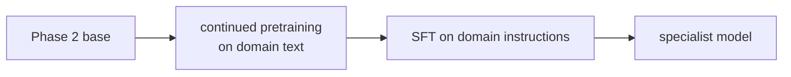

# 7. Scaling up — Phase 2 and beyond

Phase 1 proved the pipeline. Now build something real.

## The Phase 2 target

`configs/small.yaml` — **~300M parameters, 10B tokens of FineWeb-Edu, ~6 days on a 3090.**

| | value |
|---|---|
| d_model / layers / heads | 1024 / 24 / 16 (4 KV) |
| context | 1024 |
| vocab | 32,768 |
| tokens/step | 245,760 |
| steps | 40,000 |
| est. throughput | ~19k tok/s |
| est. VRAM | ~20 GB |

---

## How to pick a size: the compute budget

Everything follows from one equation:

```
FLOPs ≈ 6 × N × D        N = parameters, D = training tokens
```

Your 3090 delivers ~71 TFLOP/s peak in bf16; at 45% MFU that's ~32 TFLOP/s real.

```
one week = 604,800 s × 32e12 = 1.9e19 FLOPs
```

So `6 × N × D ≈ 1.9e19`, meaning `N × D ≈ 3.2e18`. That's your entire budget for a week.
Spend it on a big model trained briefly, or a small model trained thoroughly.

### Chinchilla, and why we ignore it slightly

The [Chinchilla](https://arxiv.org/abs/2203.15556) result says that for a *fixed training
budget*, the optimal split is **D ≈ 20 × N** — about 20 tokens per parameter.

For our budget that gives N ≈ 400M, D ≈ 8B.

But Chinchilla optimises **training** cost and ignores **inference** cost. If you're going
to actually use the model, a smaller model trained on more tokens is better: it's cheaper
to run forever, and quality keeps improving well past 20×. Llama 3 8B was trained at ~1800
tokens/param.

So we use **~300M params on 10B tokens (33×)** — deliberately "over-trained", which is the
right call when you plan to run the thing.

### Reference points

| params | tokens | ratio | 3090 time |
|---|---|---|---|
| 125M | 5B | 40× | ~2 days |
| **300M** | **10B** | **33×** | **~6 days** |
| 500M | 10B | 20× | ~9 days |
| 1B | 10B | 10× | ~18 days ⚠️ |

---

## Running Phase 2

### 1. Check disk

```bash
df -h .
```

You need **~25 GB free**. 10B tokens × 2 bytes = 20 GB, plus the tokenizer and headroom.
This is usually the binding constraint, not VRAM.

### 2. Prepare the data (~2–4 hours, network-bound)

```bash
python -m aksharallm.data.prepare fineweb-edu-10bt \
    --out-dir data/fineweb \
    --vocab-size 32768 \
    --val-tokens 10000000 \
    --max-train-tokens 10000000000
```

Verify before proceeding:

```bash
ls -la data/fineweb/          # train.bin should be ~20 GB
```

> A truncated data file is the worst possible failure here — you'd train for six days on
> a repeating 200 MB slice. Check the size.

### 3. Tune the batch size

Raise `batch_size` until you OOM, then back off ~10%:

```bash
python -m aksharallm.train.pretrain configs/small.yaml \
    -o train.max_steps=30 -o train.batch_size=16
```

Then set `grad_accum` so `batch_size × grad_accum × 1024 ≈ 250,000`.

### 4. Smoke test

```bash
python -m aksharallm.train.pretrain configs/small.yaml -o train.max_steps=50
```

Check: step-0 loss ≈ `ln(32768) = 10.4`, MFU > 35%, memory stable, `grad_norm` falling.

### 5. Launch

```bash
nohup python -m aksharallm.train.pretrain configs/small.yaml > train.log 2>&1 &
tail -f train.log
```

`resume: auto` means you can kill it and restart with the identical command at any time.

### 6. Watch it

```bash
tail -f train.log
python -c "
import json
for l in open('checkpoints/small/train_log.jsonl'):
    d = json.loads(l)
    if 'val_loss' in d: print(d['step'], round(d['val_loss'], 4))
"
```

Set `wandb_project` in the config for live charts instead.

---

## What to expect

| step | tokens | val loss | what it can do |
|---|---|---|---|
| 1,000 | 0.25B | ~5.0 | words, some grammar |
| 5,000 | 1.2B | ~3.8 | fluent sentences |
| 15,000 | 3.7B | ~3.3 | coherent paragraphs, some facts |
| 40,000 | 9.8B | ~2.9 | solid base model |

Below ~3.0 on FineWeb-Edu is a genuinely useful base model at this scale.

---

## Then post-train it

```bash
# SFT (~2 hours)
python -m aksharallm.data.prepare_sft smoltalk \
    --tokenizer data/fineweb/tokenizer.json --out-dir data/sft --seq-len 1024
python -m aksharallm.train.sft \
    --base checkpoints/small/ckpt_best.pt --data-dir data/sft \
    --tokenizer data/fineweb/tokenizer.json --out-dir checkpoints/small-sft

# DPO (~3 hours)
python -m aksharallm.data.prepare_dpo ultrafeedback \
    --tokenizer data/fineweb/tokenizer.json --out-dir data/dpo --seq-len 1024
python -m aksharallm.train.dpo \
    --sft checkpoints/small-sft/sft_best.pt --data-dir data/dpo \
    --tokenizer data/fineweb/tokenizer.json --out-dir checkpoints/small-dpo
```

---

## Specialising for a task

You said the domain is open. Once Phase 2 exists, specialising is cheap — and this is
where a small model genuinely competes.



**Continued pretraining** — keep doing next-token prediction, but on your domain corpus
(your documents, papers, codebase), at a *lower* LR (~10% of the original). A few hundred
million domain tokens is plenty. Mix in ~10% general data to avoid forgetting everything
else.

**Then SFT** on instructions written in that domain.

A 300M model specialised on one domain routinely beats a general 7B model *on that
domain*, while running ~20× faster. This is the realistic path to something genuinely
useful from this repo.

---

## Phase 3 — pushing to ~1B on one GPU

You flagged this as a future TODO. The techniques, in the order you'd reach for them:

| technique | saves | costs |
|---|---|---|
| **Gradient checkpointing** | ~60% of activation memory | ~30% slower |
| **8-bit AdamW** (`bitsandbytes`) | 75% of optimizer state (~8 GB at 1B params) | negligible |
| **Smaller micro-batch + more accum** | activation memory | slightly lower MFU |
| **CPU optimizer offload** | all optimizer state | much slower; last resort |

Memory at 1B params, bf16 + fp32 master weights:

```
weights (fp32)           4 GB
gradients (fp32)         4 GB
Adam m, v (fp32)         8 GB   ← 8-bit Adam cuts this to 2 GB
activations              varies with batch
                       ------
                        16 GB before activations — tight in 24 GB
```

Honest advice: **a well-trained 300M model is more useful than a badly-trained 1B model.**
Compute per parameter is what matters, and at 1B on one GPU you can't afford enough tokens
to make the extra parameters pay. Do Phase 2 properly first.

---

## Things that would improve quality, roughly by value

1. **Better data.** Always first. Deduplication and quality filtering beat every
   architectural change on this list.
2. **More tokens.** Just keep training; loss keeps falling.
3. **Longer context** (2048). Cheap to do, helps coherence. Costs memory quadratically in
   attention.
4. **Learning-rate tuning.** A 2× error here costs more than any architecture tweak.
5. **Architecture.** Diminishing returns; the Llama recipe we use is already close to
   optimal at this scale.

---

Next: [8. Troubleshooting →](08-troubleshooting.md)
