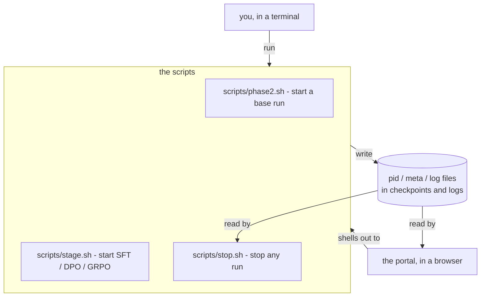
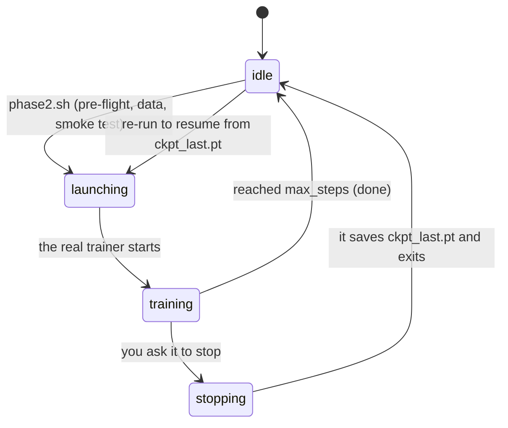
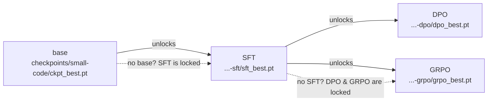
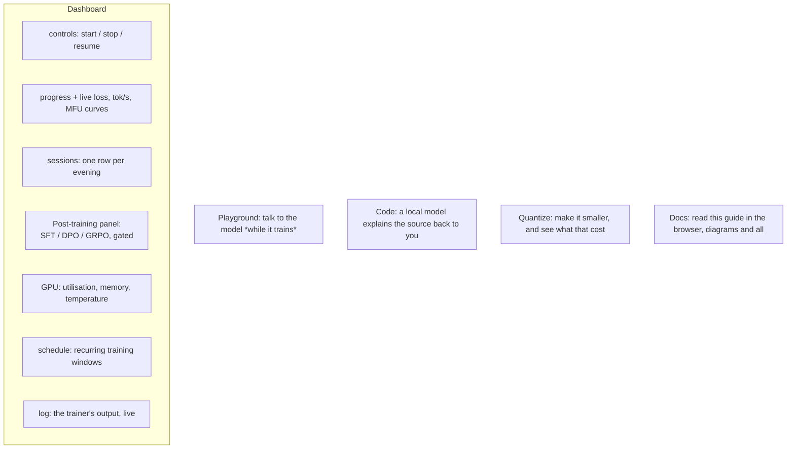

# 9. Running and watching it — the scripts and the portal

Everything so far has been about *what* the model learns. This chapter is about *operating*
the thing: how you start a six-day run, stop it for the night, resume it, chain the
post-training stages in the right order, and watch it all in a browser. No new ML here —
just the machinery that makes a multi-week project on one desk actually livable.

## The one principle: everything is a script

There is exactly one way to start or stop anything, and it's a shell script. The web portal
does not contain a second copy of that logic — it **shells out to the same scripts you'd run
by hand**, and it *reads files* to show you what's happening. Nothing is hidden in a UI.



Why this matters: the portal can never do something you can't, a run started in a terminal
shows up in the browser and vice-versa, and if the portal is closed the training doesn't
care — it was never its child. One source of truth (the files on disk), two ways to look at
it.

---

## The life of a run

A training run moves through a small set of states. The portal shows the current one as a
badge; the scripts move it along.



- **idle** — nothing running. A checkpoint may exist, ready to resume.
- **launching** — `phase2.sh` is in pre-flight: running the tests, checking the data, doing
  the 50-step smoke test. Minutes, before any real trainer exists.
- **training** — the real run, writing a checkpoint every so often.
- **stopping** — you asked it to stop; it finishes the current step, saves, and exits.

### Start, stop, resume

```bash
scripts/phase2.sh                 # start (or resume) the base run
scripts/stop.sh small-code        # stop after the current step (saves first)
scripts/stop.sh small-code --at 20000   # stop when it reaches step 20,000
scripts/phase2.sh                 # run again -> resumes from ckpt_last.pt, no loss spike
```

Three ways to stop, all safe (they save at the current step): Ctrl-C, `scripts/stop.sh
<run>`, or `touch checkpoints/<run>/STOP`. A hard kill or power cut costs you at most the
steps since the last periodic save (~20 min). Full detail: [doc 4](04-pretraining.md) and
[doc 7](07-scaling.md).

### Training over evenings

Because resuming is free and lossless, you don't need a six-day block of time. Run it
tonight, stop it when you need the GPU, resume tomorrow. Six days of *compute*, spread over
as many *evenings* as you like. Each launch is one "session"; the portal's Sessions panel
lists them so you can compare.

---

## Post-training: the right order, enforced

After the base model, three more stages can run — and they have an order you can't skip.
You can't fine-tune a model you haven't pretrained, and you can't reinforcement-tune one you
haven't fine-tuned. That dependency is a **gate**, and it's enforced in the script itself
(so it holds whether you launch from a terminal or the portal):



One command per stage, each prepares its own data if missing and refuses to start without
its prerequisite:

```bash
scripts/stage.sh sft   small-code   # base -> chat model
scripts/stage.sh dpo   small-code   # sharpen with preferences   (needs the SFT model)
scripts/stage.sh grpo  small-code   # RL on the code sandbox      (needs the SFT model)
scripts/stop.sh small-code-grpo     # stop any of them, same as a base run
```

If you ask for a stage whose prerequisite is missing, it tells you exactly what to run
first. (The stages themselves — what SFT, DPO and GRPO actually *do* — are
[doc 5](05-posttraining.md).)

---

## The portal: the whole project in a browser

```bash
scripts/portal.sh          # then open http://127.0.0.1:8765
```

A local web page (localhost only — it's your machine, your GPU, your model). It never trains
anything itself; it starts/stops by calling the scripts, and everything else it shows is
read from the files on disk.



The panels, in plain terms:

- **Controls / Progress** — Start, Stop, or Resume the base run, and watch loss fall in
  real time.
- **The curves** — loss, throughput, gradient norm, learning rate. Hover for a crosshair
  readout across every series at that step. **Drag sideways across a chart to zoom into
  that stretch of steps**: the y-axis refits to what is inside the window, which is the only
  way to see anything once a converged run has flattened at the bottom of a 0–10 axis. The
  window sticks through the five-second refresh, so you can watch one region live.
  Double-click the chart — or the range button in its corner — to go back to the whole run.
  Each chart zooms on its own, the GPU charts included; the `table` twin always lists every
  reading, zoomed or not.
- **Sessions** — every launch as a row, so a run trained over ten evenings is ten
  comparable lines. Newest first, and the panel keeps a fixed height: past about ten rows
  the table scrolls inside itself (header row pinned) rather than stretching the page.
- **Post-training** — the three stages as cards. Each **Start** button is live only when its
  prerequisite checkpoint exists; otherwise it's greyed out with the reason as a tooltip
  ("needs …-sft/sft_best.pt — run SFT first"). This is the gate above, made visible.
- **GPU** — what the card is doing, during a run and between runs.
- **Schedule** — recurring start/stop windows (e.g. "train 8pm–7am"), from the browser or
  the shell.
- **Playground** — send the current checkpoint a prompt *while it is still training*, so you
  can watch it get better week over week (for a code model, it runs the generated function
  in the sandbox and shows pass/fail). See [doc 6](06-inference.md).
- **Code** — a local model reads a source file and explains it back to you.
- **Quantize** — turn a checkpoint into a 4-bit or 8-bit one and measure what it cost:
  size, perplexity against the bf16 baseline, tokens per second. **Compare all** runs every
  method (RTN / AWQ / GPTQ) on the same evaluation batches, which is the only honest way to
  read these numbers. Like every other button it shells out — here to
  `python -m aksharallm.quant` — and it drops to the CPU while a run is training, because a
  GPTQ job can allocate more than the card has left. See [doc 10](10-quantization.md).
- **Docs** — this guide, read right in the browser: the sidebar lists every chapter, and the
  reader renders the same `docs/*.md` files **with their diagrams** (the mermaid library is
  vendored locally and loaded only when you open this tab). Same files, no duplication.

Everything a button does, you can do from a terminal — the button just runs the script.

---

## What runs where — a cheat sheet

| you want to… | command | portal |
|---|---|---|
| start / resume the base run | `scripts/phase2.sh` | Dashboard → Start |
| stop it (saving first) | `scripts/stop.sh small-code` | Dashboard → Stop |
| SFT the base | `scripts/stage.sh sft small-code` | Post-training → SFT → Start |
| DPO / GRPO (after SFT) | `scripts/stage.sh dpo\|grpo small-code` | Post-training → Start |
| watch it | `tail -f train_small-code.log` | Dashboard (live) |
| talk to it mid-training | `python -m aksharallm.infer.cli small-code` | Playground |
| make it 4-bit and measure it | `python -m aksharallm.quant small-code/ckpt_best.pt --compare` | Quantize → Compare all |

---

You now have the whole arc: [data](01-data.md) →
[tokenizer](02-tokenizer.md) → [model](03-model.md) → [pretraining](04-pretraining.md) →
[post-training](05-posttraining.md) → [inference](06-inference.md) →
[scaling](07-scaling.md), with [troubleshooting](08-troubleshooting.md) and this operations
guide alongside. Then [quantization](10-quantization.md) makes the finished model four
times smaller. Everything is hand-written, tested, and yours to change.
