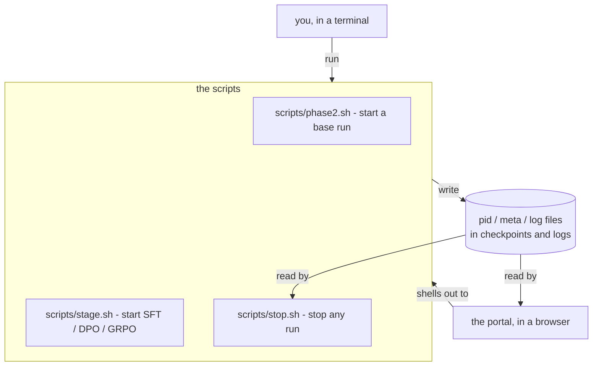
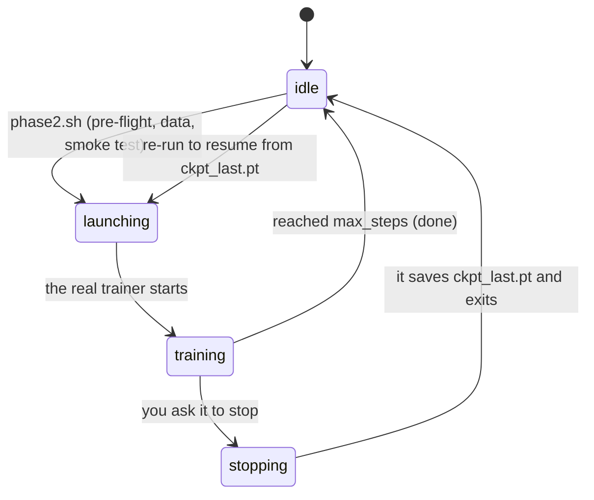
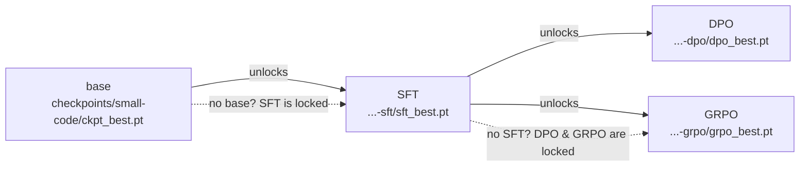
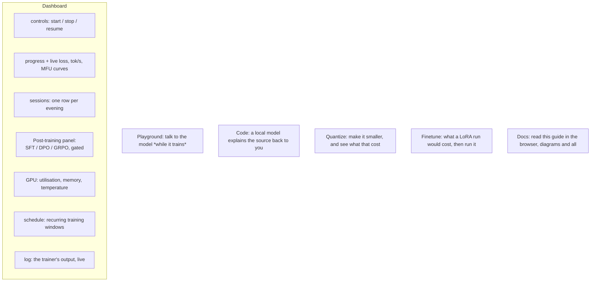
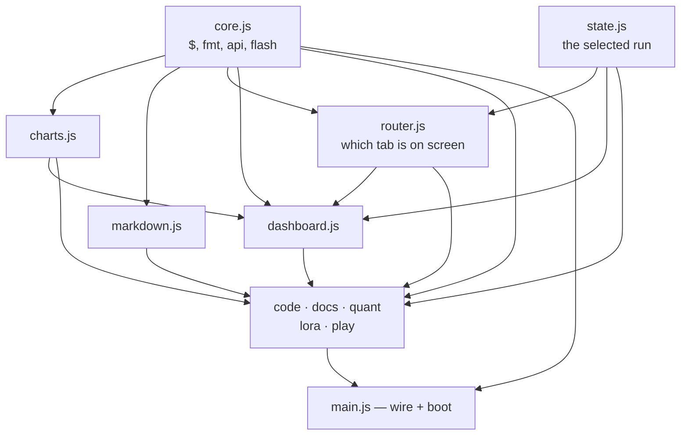

# 9. Running and watching it — the scripts and the portal

Everything so far has been about *what* the model learns. This chapter is about *operating*
the thing: how you start a six-day run, stop it for the night, resume it, chain the
post-training stages in the right order, and watch it all in a browser. No new ML here —
just the machinery that makes a multi-week project on one desk actually livable.

## The one principle: everything is a script

There is exactly one way to start or stop anything, and it's a shell script. The web portal
does not contain a second copy of that logic — it **shells out to the same scripts you'd run
by hand**, and it *reads files* to show you what's happening. Nothing is hidden in a UI.



Why this matters: the portal can never do something you can't, a run started in a terminal
shows up in the browser and vice-versa, and if the portal is closed the training doesn't
care — it was never its child. One source of truth (the files on disk), two ways to look at
it.

---

## The life of a run

A training run moves through a small set of states. The portal shows the current one as a
badge; the scripts move it along.



- **idle** — nothing running. A checkpoint may exist, ready to resume.
- **launching** — `phase2.sh` is in pre-flight: running the tests, checking the data, doing
  the 50-step smoke test. Minutes, before any real trainer exists.
- **training** — the real run, writing a checkpoint every so often.
- **stopping** — you asked it to stop; it finishes the current step, saves, and exits.

### Start, stop, resume

```bash
scripts/phase2.sh                 # start (or resume) the base run
STOP_IN=30m scripts/phase2.sh     # ...for half an hour, then save and exit
scripts/stop.sh small-code        # stop after the current step (saves first)
scripts/stop.sh small-code --at 20000   # stop when it reaches step 20,000
scripts/stop.sh small-code --in 20m     # stop twenty minutes from now
scripts/stop.sh small-code --by 06:30   # stop at half six (tomorrow, if it has passed)
scripts/phase2.sh                 # run again -> resumes from ckpt_last.pt, no loss spike
```

Three ways to stop, all safe (they save at the current step): Ctrl-C, `scripts/stop.sh
<run>`, or `touch checkpoints/<run>/STOP`. A hard kill or power cut costs you at most the
steps since the last periodic save (~20 min). Full detail: [doc 4](04-pretraining.md) and
[doc 7](07-scaling.md).

**Stopping in twenty minutes is not a schedule.** `--in`/`--by` (and the portal's *Stop at…*
dialog) queue one deadline for the run that is going right now; the Schedule panel is for
rules that repeat, night after night. Reach for a schedule when you would otherwise have to
remember something tomorrow.

### Training over evenings

Because resuming is free and lossless, you don't need a six-day block of time. Run it
tonight, stop it when you need the GPU, resume tomorrow. Six days of *compute*, spread over
as many *evenings* as you like. Each launch is one "session"; the portal's Sessions panel
lists them so you can compare.

---

## Post-training: the right order, enforced

After the base model, three more stages can run — and they have an order you can't skip.
You can't fine-tune a model you haven't pretrained, and you can't reinforcement-tune one you
haven't fine-tuned. That dependency is a **gate**, and it's enforced in the script itself
(so it holds whether you launch from a terminal or the portal):



One command per stage, each prepares its own data if missing and refuses to start without
its prerequisite:

```bash
scripts/stage.sh sft   small-code   # base -> chat model
scripts/stage.sh dpo   small-code   # sharpen with preferences   (needs the SFT model)
scripts/stage.sh grpo  small-code   # RL on the code sandbox      (needs the SFT model)
scripts/stop.sh small-code-grpo     # stop any of them, same as a base run
```

If you ask for a stage whose prerequisite is missing, it tells you exactly what to run
first. (The stages themselves — what SFT, DPO and GRPO actually *do* — are
[doc 5](05-posttraining.md).)

---

## The portal: the whole project in a browser

```bash
scripts/portal.sh          # then open http://127.0.0.1:8765
```

A local web page (localhost only — it's your machine, your GPU, your model). It never trains
anything itself; it starts/stops by calling the scripts, and everything else it shows is
read from the files on disk.



The panels, in plain terms:

- **Controls / Progress** — Start, Stop, or Resume the base run, and watch loss fall in
  real time.
- **The curves** — loss, throughput, gradient norm, learning rate. Hover for a crosshair
  readout across every series at that step. **Drag sideways across a chart to zoom into
  that stretch of steps**: the y-axis refits to what is inside the window, which is the only
  way to see anything once a converged run has flattened at the bottom of a 0–10 axis. The
  window sticks through the five-second refresh, so you can watch one region live.
  Double-click the chart — or the range button in its corner — to go back to the whole run.
  Each chart zooms on its own, the GPU charts included; the `table` twin always lists every
  reading, zoomed or not.
- **Sessions** — every launch as a row, so a run trained over ten evenings is ten
  comparable lines. Newest first, and the panel keeps a fixed height: past about ten rows
  the table scrolls inside itself (header row pinned) rather than stretching the page.
- **Post-training** — the three stages as cards. Each **Start** button is live only when its
  prerequisite checkpoint exists; otherwise it's greyed out with the reason as a tooltip
  ("needs …-sft/sft_best.pt — run SFT first"). This is the gate above, made visible.
- **GPU** — what the card is doing, during a run and between runs.
- **Schedule** — recurring start/stop windows (e.g. "train 8pm–7am"), from the browser or
  the shell.
- **Playground** — send the current checkpoint a prompt *while it is still training*, so you
  can watch it get better week over week (for a code model, it runs the generated function
  in the sandbox and shows pass/fail). See [doc 6](06-inference.md).
- **Code** — a local model reads a source file and explains it back to you.
- **Quantize** — turn a checkpoint into a 4-bit or 8-bit one and measure what it cost:
  size, perplexity against the bf16 baseline, tokens per second. **Compare all** runs every
  method (RTN / AWQ / GPTQ) on the same evaluation batches, which is the only honest way to
  read these numbers. Like every other button it shells out — here to
  `python -m aksharallm.quant` — and it drops to the CPU while a run is training, because a
  GPTQ job can allocate more than the card has left. See [doc 10](10-quantization.md).
- **Docs** — this guide, read right in the browser: the sidebar lists every chapter, and the
  reader renders the same `docs/*.md` files **with their diagrams** (the mermaid library is
  vendored locally and loaded only when you open this tab). Same files, no duplication.

Everything a button does, you can do from a terminal — the button just runs the script.

### How the client is put together

There is no build step, no bundler and no framework — the browser loads the source as
written, which is the point: you can read the running code. What there *is* is one file per
thing. Each tab is three files with the same name — the markup, the code that drives it, and
the rules that style it:

```
portal/static/
  index.html          the shell: head, top bar, footer, dialog, and six include markers
  parts/<tab>.html    the markup for one view
  js/<tab>.js         the code for one view
  css/<tab>.css       the rules for one view
```

`index.html` is assembled per request: `server.py` fills each `<!--#include name.html -->`
from `parts/`. Assembling on the server rather than at build time is what keeps the "no
build step" promise — the cost is a handful of small reads on a local server.

The JavaScript is ES modules, so the dependency graph is written down rather than implied by
a load order. It is a DAG, and it points one way — shared kernel at the bottom, tabs above
it, wiring at the top:



The router is the piece worth knowing about. It holds the list of views and the
hash/`localStorage` plumbing, but it knows nothing about what any tab *is*: each tab module
calls `registerTab('quant', { open, leave })` when it is imported. `open` runs when the tab
is shown, `leave` when the reader goes elsewhere — which is where a tab stops its own
polling, so a dashboard left up overnight is not also polling five other panels. Adding a
tab is a `registerTab` call in that tab's module; there is nothing to edit in the router.

Two consequences worth stating, because they are the reason for the shape:

- **A tab is inert until you open it.** Nothing in `quant.js` or `code.js` runs on load. The
  docs tab does not fetch the 3 MB mermaid library until you look at a diagram.
- **The stylesheets load in cascade order** — `base.css` (the palette and the theme) first,
  `narrow.css` (the small-screen overrides) last. They are separate `<link>`s rather than
  `@import` so the browser fetches them in parallel.

### On a phone

Checking a run from bed is half of what this page is for, so it has to survive a 390px
screen. The layout is fluid rather than fixed — panels stack, the stat tiles go two-up, the
tab strip swipes sideways with the current tab scrolled into view — and the page itself
**never scrolls horizontally**, from 320px up.

The top bar is sticky, which means its height is spent *permanently*: whatever it takes is
gone from every screenful you scroll through. Left to wrap on its own it took three rows and
171px on a phone — a fifth of the screen, and enough to hide the entire control band behind
it the moment you scrolled, so the Start/Stop rectangle looked like it was behaving
differently from everything else on the page. Below 1100px the tab strip therefore takes a
row of its own, giving a bar that no longer re-wraps every time a tab is added: **83px** on a
desktop, 133px on a tablet, and 100–130px on a phone depending on how wide the selected
run's name makes the run picker.

Anything else that sticks has to clear it, and the number is not knowable in CSS — it
depends on how the bar wrapped. `trackTopbarHeight()` in `js/main.js` measures the bar with a
`ResizeObserver` and publishes it as `--topbar-h`; the Docs sidebar sticks at
`calc(var(--topbar-h) + var(--gap))`.

### One column

Every view sits in the same content column — `--page-max` wide, centred, with `--page-pad`
either side — so switching tabs never shifts where the page starts. Two things used to break
that, and both are the same mistake seen from different sides:

- The Docs tab had no frame at all: no padding, no max width. It was the one tab that hugged
  the top edge.
- The bands that run edge to edge — the top bar, the control row, the flash message — are
  full-bleed *by design*: their background should reach the window edge. But padding them by
  `--page-pad` alone lines their contents up with the window, not with the column, so on a
  1920px monitor the **Start button sat 210px to the left of the panels it controls**. They
  use `--page-gutter` instead, which is the same padding *plus* however far in the centred
  column starts:

  ```css
  --page-gutter: calc(var(--page-pad) + max(0px, (100% - var(--page-max)) / 2));
  ```

  Below `--page-max` the `max()` is zero and it degrades to plain padding, so there is no
  breakpoint to maintain.

Those bands finish in a curve (`--sheet-radius`) rather than a hard edge, so the chrome
reads as a sheet the page scrolls under. Only the bottom corners — it is anchored to the top
of the window. The dashboard is the one view that stacks a second band under the bar, and
two curves at that seam would notch the page background in between them, so
`.topbar:has(+ .view:not([hidden]) > .controls)` drops the bar's curve and lets the control
band carry it for both.

The column is one width for the whole portal. It used to be 1500px for the dashboard and
1800px for the working tabs, which meant the shared top bar could not align with both.

That last property is easy to lose by accident, because CSS has three ways to set a floor
under a page that are invisible on a desktop — and the third is invisible on an *empty* page
too, which is worse:

- **A grid item's automatic minimum size is the min-content width of its contents.** Wrapping
  a wide table in `<div class="scroll-x">` is not enough: the `.panel` around that scroller
  is the grid item, it is not itself a scroll container, so it inherits the table's full
  width as a floor. The track grows, the page grows, and the `.scroll-x` never scrolls —
  because the page scrolls first. The sessions table alone held the document at 859px on a
  390px screen. Every grid that holds panels therefore sets `min-width: 0` on its children,
  which hands the scrolling back to the element built to do it.

  This one only appears with **real data**. A portal served without its API renders every
  table empty and measures perfectly clean, so check it against a running portal with a real
  run selected, not against the static files.

- `grid-template-columns: repeat(auto-fit, minmax(420px, 1fr))` never lets a track shrink
  below 420px. Narrower than that and the track — and every panel beside it — hangs off the
  screen. Write the floor as `minmax(min(420px, 100%), 1fr)`: identical above 420px, and it
  collapses instead of overflowing below it.
- A flex item will not shrink past its own content. The tab strip is six tabs and ~558px
  wide, so it dragged the whole page out to 558px until it was given `min-width: 0` and its
  own `overflow-x: auto` — now it scrolls in place instead of scrolling the page.

The check, when touching this stylesheet: point a browser at a **running portal with a real
run selected**, at a 390px viewport, and `document.body.scrollWidth` must equal
`document.documentElement.clientWidth`. If it is larger, find the floor by hiding each
section in turn and re-measuring — the section whose removal shrinks the document is the one
holding it open. (`width: min-content` is a tempting way to measure this and it lies about
scroll containers, reporting their contents' width rather than zero.)

Note that Chrome's `--window-size` will not go below about 485px and so cannot trigger a
`max-width: 640px` media query at all. A real phone viewport needs
`Emulation.setDeviceMetricsOverride` over the DevTools protocol.

---

## What runs where — a cheat sheet

| you want to… | command | portal |
|---|---|---|
| start / resume the base run | `scripts/phase2.sh` | Dashboard → Start |
| …for one evening only | `STOP_IN=3h scripts/phase2.sh` | Dashboard → *this session* → Time |
| stop it (saving first) | `scripts/stop.sh small-code` | Dashboard → Stop now |
| stop it in 20 minutes | `scripts/stop.sh small-code --in 20m` | Dashboard → Stop at… |
| SFT the base | `scripts/stage.sh sft small-code` | Post-training → SFT → Start |
| DPO / GRPO (after SFT) | `scripts/stage.sh dpo\|grpo small-code` | Post-training → Start |
| watch it | `tail -f train_small-code.log` | Dashboard (live) |
| talk to it mid-training | `python -m aksharallm.infer.cli small-code` | Playground |
| make it 4-bit and measure it | `python -m aksharallm.quant small-code/ckpt_best.pt --compare` | Quantize → Compare all |

---

You now have the whole arc: [data](01-data.md) →
[tokenizer](02-tokenizer.md) → [model](03-model.md) → [pretraining](04-pretraining.md) →
[post-training](05-posttraining.md) → [inference](06-inference.md) →
[scaling](07-scaling.md), with [troubleshooting](08-troubleshooting.md) and this operations
guide alongside. Then [quantization](10-quantization.md) makes the finished model four
times smaller. Everything is hand-written, tested, and yours to change.
