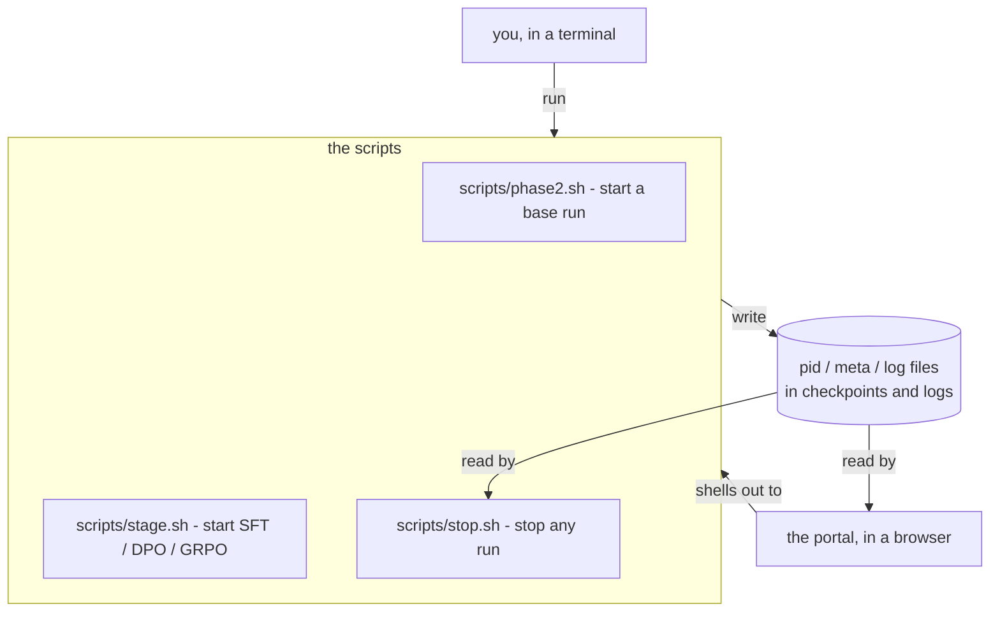
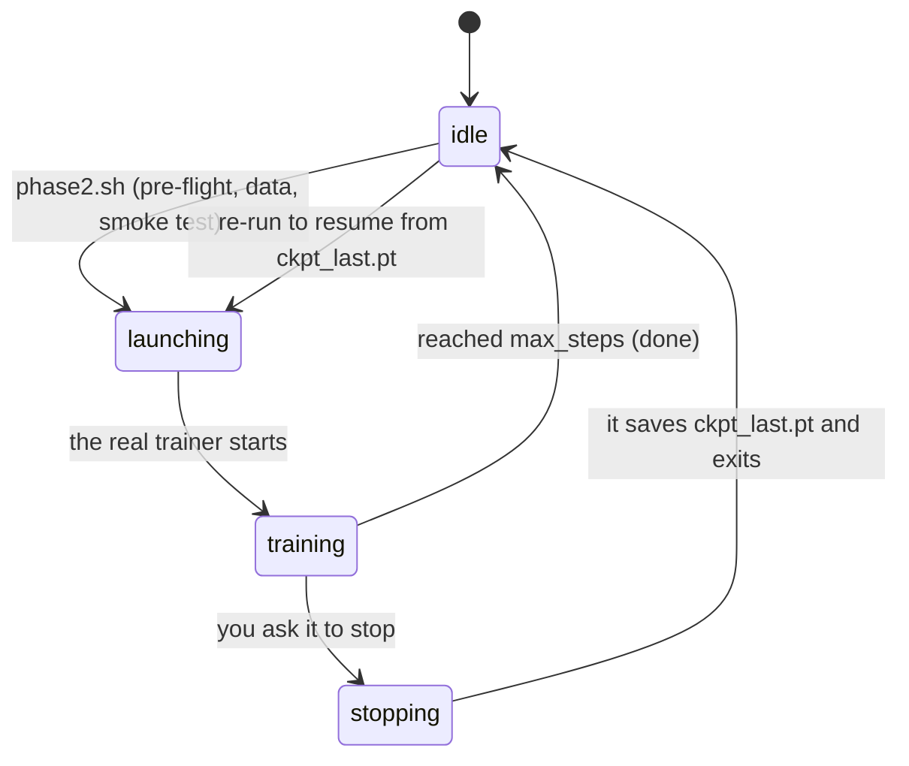
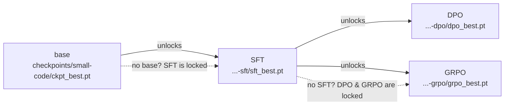
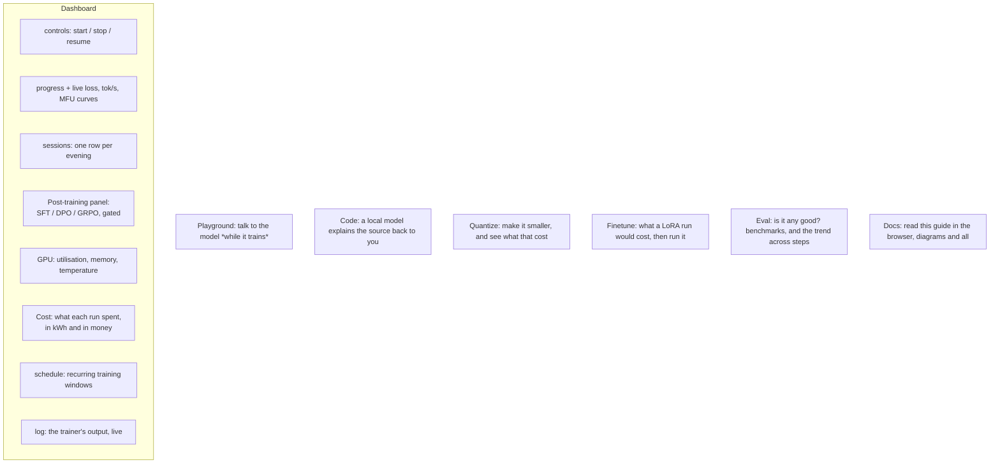
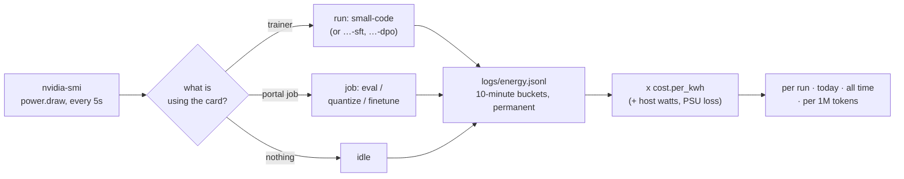
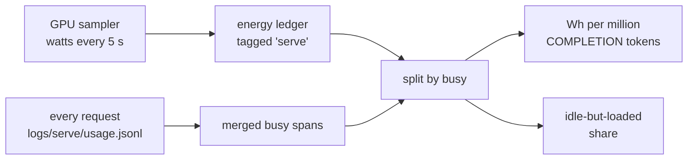
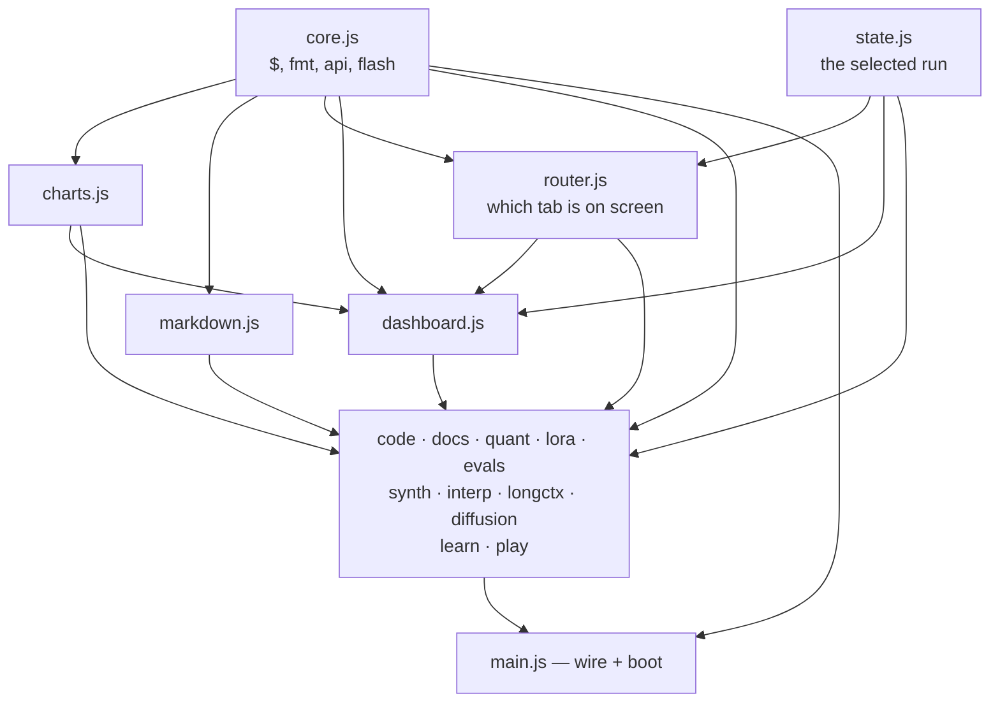
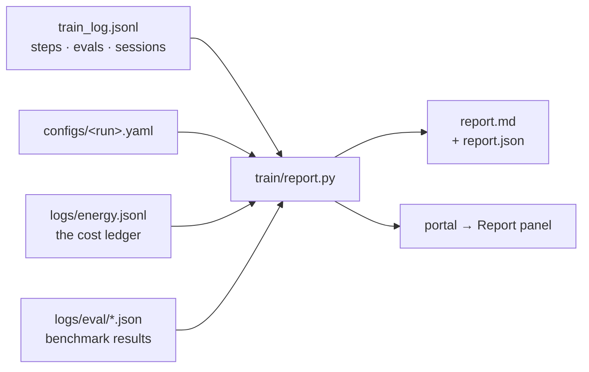

# 9. Running and watching it — the scripts and the portal

Everything so far has been about *what* the model learns. This chapter is about *operating*
the thing: how you start a six-day run, stop it for the night, resume it, chain the
post-training stages in the right order, and watch it all in a browser. No new ML here —
just the machinery that makes a multi-week project on one desk actually livable.

## The one principle: everything is a script

There is exactly one way to start or stop anything, and it's a shell script. The web portal
does not contain a second copy of that logic — it **shells out to the same scripts you'd run
by hand**, and it *reads files* to show you what's happening. Nothing is hidden in a UI.



Why this matters: the portal can never do something you can't, a run started in a terminal
shows up in the browser and vice-versa, and if the portal is closed the training doesn't
care — it was never its child. One source of truth (the files on disk), two ways to look at
it.

---

## The life of a run

A training run moves through a small set of states. The portal shows the current one as a
badge; the scripts move it along.



- **idle** — nothing running. A checkpoint may exist, ready to resume.
- **launching** — `phase2.sh` is in pre-flight: running the tests, checking the data, doing
  the 50-step smoke test. Minutes, before any real trainer exists.
- **training** — the real run, writing a checkpoint every so often.
- **stopping** — you asked it to stop; it finishes the current step, saves, and exits.

### The pre-flight gate, and why it says so much

Every launcher runs the whole test suite before it will start a trainer. That gate is not
negotiable — a six-day run should not begin on code that fails its own tests, and it has
caught real breakage — but it was *displayed* badly, and that turned out to matter as much.

`pytest -q` prints one dot per test. With 1,250 tests that is 1,250 bare dots over ninety
silent seconds: no file names, no counts, no sense of progress. It reads exactly like a
hang, and the reasonable response to a hang is to cancel it. Which is what happened here,
twice in one evening, to a launch that was working perfectly.

So `scripts/preflight_tests.py` runs the same suite and prints **one line per file**:

```
=== tests (38 files) ===
    tests/test_audio.py                         29 passed             [  2%]
    tests/test_audiolm.py                       29 passed             [  5%]
    tests/test_codec.py                         41 passed             [  8%]
    ...
    1,247 passed
```

Quiet when green, and **loud when red**: on any failure the raw pytest output is replayed
in full, tracebacks and all, followed by the list of failing node ids. The summarising
exists to make a *passing* run legible; a failing one is the case where you want everything.

There is an escape, and it is guarded the same way `SKIP_SMOKE` is:

```bash
SKIP_TESTS=1 scripts/phase2.sh        # only honoured when ckpt_last.pt exists
```

Only honoured when there is something to resume — on a first launch it prints that it is
ignoring you and runs the suite anyway. Skipping the gate is defensible when you are
resuming a config that has already trained for real and you changed nothing; it is not
defensible on a config that has never run.

> **The general lesson, which is not about pytest.** A gate that looks like a hang gets
> cancelled, and then it is not a gate. Any check that holds a user for more than a few
> seconds has to show that it is moving — otherwise the check trains people to work around
> it, which is strictly worse than not having it.

### Start, stop, resume

```bash
scripts/phase2.sh                 # start (or resume) the base run
STOP_IN=30m scripts/phase2.sh     # ...for half an hour, then save and exit
scripts/stop.sh small-code        # stop after the current step (saves first)
scripts/stop.sh small-code --at 20000   # stop when it reaches step 20,000
scripts/stop.sh small-code --in 20m     # stop twenty minutes from now
scripts/stop.sh small-code --by 06:30   # stop at half six (tomorrow, if it has passed)
scripts/phase2.sh                 # run again -> resumes from ckpt_last.pt, no loss spike
```

Three ways to stop, all safe (they save at the current step): Ctrl-C, `scripts/stop.sh
<run>`, or `touch checkpoints/<run>/STOP`. A hard kill or power cut costs you at most the
steps since the last periodic save (~20 min). Full detail: [doc 4](04-pretraining.md) and
[doc 7](07-scaling.md).

**Stopping in twenty minutes is not a schedule.** `--in`/`--by` (and the portal's *Stop at…*
dialog) queue one deadline for the run that is going right now; the Schedule panel is for
rules that repeat, night after night. Reach for a schedule when you would otherwise have to
remember something tomorrow.

### Stopping is not supposed to change the run

This chapter says a run is trained "over evenings using stop/resume", and every controlled
experiment in the repo rests on two runs seeing **the same data in the same order**. Neither
was true until it was tested.

```python
self.rng = np.random.default_rng()        # loader.py, before
```

`torch.manual_seed(cfg.train.seed)` seeded torch, so the initial weights and the dropout
were reproducible and a run *looked* seeded. The **data order** came from OS entropy. Two
runs of one config saw different batches, and a resume drew from a fresh stream rather than
continuing the old one — so a stopped-and-resumed run trained on some data twice and skipped
some entirely. Nothing about the loss curve would say so, and every "same seed, same data"
comparison in these docs was comparing runs that saw different batches.

Two changes, both small:

- the loaders take a `seed`, and `pretrain.py` passes `cfg.train.seed`;
- `ckpt_last.pt` carries the generator's **state**, not just the seed, so a resume continues
  the stream where it stopped. Saving the seed alone would restart it, and the run would
  re-see the batches it had just trained on.

`tests/test_determinism.py` asserts the whole claim end to end: train 8 steps; then train 4,
stop, and train 4 more; the two final checkpoints must be **bit-for-bit identical**. With the
restore removed, the embedding table diverges by 2.5e-3 — which is small enough to look like
noise, and is exactly why this needed a test rather than an inspection.

`ckpt_best.pt` deliberately does **not** carry the data position. It is for evaluation, not
for resuming, and a checkpoint that can be resumed from two different places is a checkpoint
nobody can reason about.

> A resumed run that is slightly worse than an uninterrupted one is indistinguishable from
> noise, so it never gets investigated. That is the shape of failure worth building a test
> for: not the one that breaks, the one that quietly costs a little every time.

### Training over evenings

Because resuming is free and lossless, you don't need a six-day block of time. Run it
tonight, stop it when you need the GPU, resume tomorrow. Six days of *compute*, spread over
as many *evenings* as you like. Each launch is one "session"; the portal's Sessions panel
lists them so you can compare.

---

## Post-training: the right order, enforced

After the base model, three more stages can run — and they have an order you can't skip.
You can't fine-tune a model you haven't pretrained, and you can't reinforcement-tune one you
haven't fine-tuned. That dependency is a **gate**, and it's enforced in the script itself
(so it holds whether you launch from a terminal or the portal):



One command per stage, each prepares its own data if missing and refuses to start without
its prerequisite:

```bash
scripts/stage.sh sft   small-code   # base -> chat model
scripts/stage.sh dpo   small-code   # sharpen with preferences   (needs the SFT model)
scripts/stage.sh grpo  small-code   # RL on the code sandbox      (needs the SFT model)
scripts/stop.sh small-code-grpo     # stop any of them, same as a base run
```

If you ask for a stage whose prerequisite is missing, it tells you exactly what to run
first. (The stages themselves — what SFT, DPO and GRPO actually *do* — are
[doc 5](05-posttraining.md).)

---

## The portal: the whole project in a browser

```bash
scripts/portal.sh          # then open http://127.0.0.1:8765
```

A local web page (localhost only — it's your machine, your GPU, your model). It never trains
anything itself; it starts/stops by calling the scripts, and everything else it shows is
read from the files on disk.



The panels, in plain terms:

- **Controls / Progress** — Start, Stop, or Resume a run, and watch loss fall in real time.
  The Start button works for any run a launcher knows: `scripts/phase2.sh` builds the base
  models (`small-code`, `small`) and `scripts/experiment.sh` starts the Phase-1-scale
  experiments (`tiny`, `tiny-moe`) on data that already exists. A config the portal cannot
  start is still fully visible; it just says so instead of offering a button.
- **The curves** — loss, throughput, gradient norm, learning rate. Hover for a crosshair
  readout across every series at that step. **Drag sideways across a chart to zoom into
  that stretch of steps**: the y-axis refits to what is inside the window, which is the only
  way to see anything once a converged run has flattened at the bottom of a 0–10 axis. The
  window sticks through the five-second refresh, so you can watch one region live.
  Double-click the chart — or the range button in its corner — to go back to the whole run.
  Each chart zooms on its own, the GPU charts included; the `table` twin always lists every
  reading, zoomed or not.
- **Expert routing** — for a mixture-of-experts run only, one line per expert showing the
  share of tokens it received, with a rule at the even share. It is the only chart on the
  page that shows a failure the loss curve cannot: if one line climbs while the others sink,
  the router has collapsed and the model is quietly becoming a smaller dense one. See
  [doc 14](14-moe.md).
- **Sessions** — every launch as a row, so a run trained over ten evenings is ten
  comparable lines. Newest first, and the panel keeps a fixed height: past about ten rows
  the table scrolls inside itself (header row pinned) rather than stretching the page.
- **Post-training** — the three stages as cards. Each **Start** button is live only when its
  prerequisite checkpoint exists; otherwise it's greyed out with the reason as a tooltip
  ("needs …-sft/sft_best.pt — run SFT first"). This is the gate above, made visible.
- **GPU** — what the card is doing, during a run and between runs.
- **Cost** — what that cost, per run and in total. See [below](#what-a-run-cost).
- **Schedule** — recurring start/stop windows (e.g. "train 8pm–7am"), from the browser or
  the shell.
- **Playground** — send the current checkpoint a prompt *while it is still training*, so you
  can watch it get better week over week (for a code model, it runs the generated function
  in the sandbox and shows pass/fail). See [doc 6](06-inference.md).
- **Code** — a local model reads a source file and explains it back to you.
- **Quantize** — turn a checkpoint into a 4-bit or 8-bit one and measure what it cost:
  size, perplexity against the bf16 baseline, tokens per second. **Compare all** runs every
  method (RTN / AWQ / GPTQ) on the same evaluation batches, which is the only honest way to
  read these numbers. Like every other button it shells out — here to
  `python -m aksharallm.quant` — and it drops to the CPU while a run is training, because a
  GPTQ job can allocate more than the card has left. See [doc 10](10-quantization.md).
- **Eval** — run real benchmarks against a checkpoint (MMLU, ARC, HellaSwag, PIQA, GSM8K,
  HumanEval, an LLM-judge) and see the answer *in context*. The tab leads with the **trend
  chart** — one suite across every checkpoint ever measured, with the chance line drawn as
  a rule — rather than with the Run button, for the same reason the Finetune tab leads with
  the memory budget: a single benchmark score is close to meaningless. A score is only
  coloured when it clears chance by more than its own error bar. Each suite carries the
  sentence saying what to expect at this size, because the commonest way to misread the
  panel is to see 25% on MMLU and conclude the model is broken. Shells out to
  `python -m aksharallm.eval`. See [doc 12](12-eval.md).
- **Synth** — make training data with a local teacher, and see what was thrown away. The
  tab leads with the **funnel** rather than the sample count, because "400 samples at 20%
  survival" is three different problems depending on which filter took the rest: wrong
  exercises (`tests_failed`), the teacher repeating itself (`near_duplicate`), or an ignored
  output format (`unparseable`). Kept samples and rejected ones sit in the same viewer, one
  click apart. This is the one panel that **cannot** quietly fall back to the CPU — the
  teacher is loaded by Ollama in another process — so it reports the contention and leaves
  the choice to you. Shells out to `python -m aksharallm.synth`. See
  [doc 13](13-synthetic-data.md).
- **Learn** — the repo as a course ([doc 15](15-learning-path.md)). Thirteen lessons, each
  one *read the doc → open the file → break it → watch a real pytest node go red*. Lessons
  unlock as their prerequisites are finished, a locked one says what is missing, and a lesson
  completes only once its check has been **red and then green** — the check passes on clean
  code, so breaking it is the exercise. Three buttons hand off to the rest of the portal: the
  doc, the file (in the Code tab), and the probe (in the Playground). Same lessons and the
  same progress file as `python -m aksharallm.learn`.
- **Docs** — this guide, read right in the browser: the sidebar lists every chapter, and the
  reader renders the same `docs/*.md` files **with their diagrams** (the mermaid library is
  vendored locally and loaded only when you open this tab). Same files, no duplication.

Everything a button does, you can do from a terminal — the button just runs the script.

### What a run cost

A model trained on your own machine is not free; it is just billed later, by the electricity
company.
The GPU sampler already records the one quantity that answers it — `power.draw`, every five
seconds, tagged with whatever was running — so the cost of a run is that curve integrated
over the run's hours, times whatever a kilowatt-hour costs you.



Set the rate in `configs/portal.yaml`; until you do, the panel shows kilowatt-hours and says
so rather than inventing a price:

```yaml
cost:
  currency: "₹"
  per_kwh: 8.0        # your electricity bill
  per_hour: 1.20      # optional: what an hour of this would cost rented, for comparison
  host_watts: 100     # the rest of the machine, which nvidia-smi cannot see
  psu_efficiency: 0.9 # ~10% is lost as heat before the card sees it
```

From a terminal, which is how you read it over ssh while the run it is billing is still
going:

```bash
python -m aksharallm.portal.cost              # totals, per run, cost per million tokens
python -m aksharallm.portal.cost backfill     # fold existing logs/gpu.jsonl into the ledger
```

Four decisions in here are worth more than the feature:

- **The ledger is separate from the telemetry.** `logs/gpu.jsonl` is a *rolling* buffer — 8 MB,
  oldest half dropped — which is right for charts and catastrophic for a total: a three-week
  run would quietly get *cheaper* as its early samples were deleted. So every sample is
  folded, as it is written, into ten-minute buckets in `logs/energy.jsonl`, which is
  append-only and never trimmed. About 15 KB a day.
- **A gap is not bridged.** The sampler only runs while the portal does. If it was down for
  an hour, that hour has no reading, and the report says so — as `uncovered`, and as a
  **coverage** percentage per run. A run recorded at 51% has really cost about twice what the
  measured column says, which is why "whole run (est.)" is a separate, differently-labelled
  column rather than quietly folded into the headline.
- **Cost per million tokens uses the tokens of the *measured* part.** Half a run's energy
  divided by all of its tokens halves the answer, and it looks precise while being wrong by
  exactly the fraction nobody was watching.
- **The card is not the machine.** `nvidia-smi` measures the GPU; the CPU, drives and fans
  draw their own 60–120 W and the PSU wastes ~10% before any of it arrives. With
  `host_watts`/`psu_efficiency` unset the report says *GPU card only — the wall socket draws
  more*, which is honest and roughly 30% under what the meter charges.

The tagging is also why an SFT run stopped being invisible: post-training stages have no
`configs/<name>.yaml` and write `sft_log.jsonl`, so `RunStore` has never heard of them — the
sampler now looks for any live `checkpoints/*/train.pid`, and the portal's own detached jobs
(eval, quantize, fine-tune) are tagged `job` rather than `run`, so they are billed without
being drawn as training bands on the charts.

#### And what a served token cost

Training divides energy by **steps**. Serving has to divide it by **tokens**, and doing that
honestly needs three separations that a single "cost per token" figure loses:



1. **Prompt tokens are not completion tokens.** Prefill runs the whole prompt through in one
   batched pass; decode runs the model once per token produced. They differ by orders of
   magnitude per token and their mix changes with every request. The headline is per million
   **completion** tokens — the number comparable to a price list, and the one that moves when
   the decode path improves.
2. **Generating is not waiting.** A server holding the weights at idle still draws power, and
   "should I leave this up?" is usually the real question. Busy spans are **merged, not
   summed** — thirty concurrent requests over ten seconds are ten seconds of card time, and
   summing would make a busy server look like it ran longer than the day contains.
3. **Measured is not total**, exactly as above.

Measured here on the 13.8M model, 318 requests at batch 8:

```
serving: 318 requests, 54,586 completion tokens (1,626 prompt), 2m44s generating
         $0.0377 per million COMPLETION tokens
         14 Wh generating, 3 Wh idle-but-loaded (33% of the server's energy produced nothing)
         331.3 tok/s of card time (batched — not per-request throughput)
```

Two things that had to be fixed to get that:

- **the server was not tagged at all**, so every watt it drew landed in the *idle* column.
  Same class of mistake as the SFT stages, which had the same fix;
- **a bucket's `start` is a ten-minute boundary and its `seconds` is coverage scattered
  inside it**, not a contiguous span. Reading `[start, start + seconds)` as the window
  reported **zero** busy energy for a server that had been flat out — and the tests passed,
  because they built ledger rows by hand instead of folding real samples through the real
  `Ledger`. They now do the latter, which is the only reason the bug was findable.

### How the client is put together

There is no build step, no bundler and no framework — the browser loads the source as
written, which is the point: you can read the running code. What there *is* is one file per
thing. Each tab is three files with the same name — the markup, the code that drives it, and
the rules that style it:

```
portal/static/
  index.html          the shell: head, top bar, footer, dialog, and the include markers
  parts/<tab>.html    the markup for one view
  js/<tab>.js         the code for one view
  css/<tab>.css       the rules for one view
```

One exception to the naming, and it is worth knowing about: the Quantize tab's files are
`quantize.*`, not `quant.*`. Ad-blocker filter lists carry a path rule for `quant.js` —
that is the filename Quantcast's tracker uses — so Brave and uBlock block it **on any
site, silently**: no console error, no failed-request warning, just a tab that never
loads. Splitting one big `app.js` into per-view files is exactly what exposes you to this,
because suddenly the filenames are visible to a blocker. The view key, the element ids and
the `#quant` hash are unaffected; only the fetched filename had to change.

`index.html` is assembled per request: `server.py` fills each `<!--#include name.html -->`
from `parts/`. Assembling on the server rather than at build time is what keeps the "no
build step" promise — the cost is a handful of small reads on a local server.

The JavaScript is ES modules, so the dependency graph is written down rather than implied by
a load order. It is a DAG, and it points one way — shared kernel at the bottom, tabs above
it, wiring at the top:



The router is the piece worth knowing about. It holds the list of views and the
hash/`localStorage` plumbing, but it knows nothing about what any tab *is*: each tab module
calls `registerTab('quant', { open, leave })` when it is imported. `open` runs when the tab
is shown, `leave` when the reader goes elsewhere — which is where a tab stops its own
polling, so a dashboard left up overnight is not also polling five other panels. Adding a
tab is a `registerTab` call in that tab's module; there is nothing to edit in the router.

Two consequences worth stating, because they are the reason for the shape:

- **A tab is inert until you open it.** Nothing in `quantize.js` or `code.js` runs on load. The
  docs tab does not fetch the 3 MB mermaid library until you look at a diagram.
- **The stylesheets load in cascade order** — `base.css` (the palette and the theme) first,
  `narrow.css` (the small-screen overrides) last. They are separate `<link>`s rather than
  `@import` so the browser fetches them in parallel.

### On a phone

Checking a run from bed is half of what this page is for, so it has to survive a 390px
screen. The layout is fluid rather than fixed — panels stack, the stat tiles go two-up, the
tab strip swipes sideways with the current tab scrolled into view — and the page itself
**never scrolls horizontally**, from 320px up.

The top bar is sticky, which means its height is spent *permanently*: whatever it takes is
gone from every screenful you scroll through. Left to wrap on its own it took three rows and
171px on a phone — a fifth of the screen, and enough to hide the entire control band behind
it the moment you scrolled, so the Start/Stop rectangle looked like it was behaving
differently from everything else on the page. Below 1100px the tab strip therefore takes a
row of its own, giving a bar that no longer re-wraps every time a tab is added: **83px** on a
desktop, 133px on a tablet, and 100–130px on a phone depending on how wide the selected
run's name makes the run picker.

Anything else that sticks has to clear it, and the number is not knowable in CSS — it
depends on how the bar wrapped. `trackTopbarHeight()` in `js/main.js` measures the bar with a
`ResizeObserver` and publishes it as `--topbar-h`; the Docs sidebar sticks at
`calc(var(--topbar-h) + var(--gap))`.

### One column

Every view sits in the same content column — `--page-max` wide, centred, with `--page-pad`
either side — so switching tabs never shifts where the page starts. Two things used to break
that, and both are the same mistake seen from different sides:

- The Docs tab had no frame at all: no padding, no max width. It was the one tab that hugged
  the top edge.
- The bands that run edge to edge — the top bar, the control row, the flash message — are
  full-bleed *by design*: their background should reach the window edge. But padding them by
  `--page-pad` alone lines their contents up with the window, not with the column, so on a
  1920px monitor the **Start button sat 210px to the left of the panels it controls**. They
  use `--page-gutter` instead, which is the same padding *plus* however far in the centred
  column starts:

  ```css
  --page-gutter: calc(var(--page-pad) + max(0px, (100% - var(--page-max)) / 2));
  ```

  Below `--page-max` the `max()` is zero and it degrades to plain padding, so there is no
  breakpoint to maintain.

Those bands finish in a curve (`--sheet-radius`) rather than a hard edge, so the chrome
reads as a sheet the page scrolls under. Only the bottom corners — it is anchored to the top
of the window. The dashboard is the one view that stacks a second band under the bar, and
two curves at that seam would notch the page background in between them, so
`.topbar:has(+ .view:not([hidden]) > .controls)` drops the bar's curve and lets the control
band carry it for both.

The column is one width for the whole portal. It used to be 1500px for the dashboard and
1800px for the working tabs, which meant the shared top bar could not align with both.

That last property is easy to lose by accident, because CSS has three ways to set a floor
under a page that are invisible on a desktop — and the third is invisible on an *empty* page
too, which is worse:

- **A grid item's automatic minimum size is the min-content width of its contents.** Wrapping
  a wide table in `<div class="scroll-x">` is not enough: the `.panel` around that scroller
  is the grid item, it is not itself a scroll container, so it inherits the table's full
  width as a floor. The track grows, the page grows, and the `.scroll-x` never scrolls —
  because the page scrolls first. The sessions table alone held the document at 859px on a
  390px screen. Every grid that holds panels therefore sets `min-width: 0` on its children,
  which hands the scrolling back to the element built to do it.

  This one only appears with **real data**. A portal served without its API renders every
  table empty and measures perfectly clean, so check it against a running portal with a real
  run selected, not against the static files.

- `grid-template-columns: repeat(auto-fit, minmax(420px, 1fr))` never lets a track shrink
  below 420px. Narrower than that and the track — and every panel beside it — hangs off the
  screen. Write the floor as `minmax(min(420px, 100%), 1fr)`: identical above 420px, and it
  collapses instead of overflowing below it.
- A flex item will not shrink past its own content. The tab strip is eight tabs and ~700px
  wide, so it dragged the whole page out to 558px until it was given `min-width: 0` and its
  own `overflow-x: auto` — now it scrolls in place instead of scrolling the page.
- **A form control can have a fixed width in a global rule.** `input[type="number"]` is
  `width: 120px` in `controls.css`; two of them in a `1fr 1fr` grid row pushed the Synth tab
  23px past a 320px phone, because a grid item's automatic minimum is its content's
  min-content width and the content here is a fixed 120px. `min-width: 0` on the item is
  half the fix — the control also needs `width: 100%`.

The check, when touching this stylesheet: point a browser at a **running portal with a real
run selected**, at a 390px viewport, and `document.body.scrollWidth` must equal
`document.documentElement.clientWidth`. If it is larger, find the floor by hiding each
section in turn and re-measuring — the section whose removal shrinks the document is the one
holding it open. (`width: min-content` is a tempting way to measure this and it lies about
scroll containers, reporting their contents' width rather than zero.)

Note that Chrome's `--window-size` will not go below about 485px and so cannot trigger a
`max-width: 640px` media query at all. A real phone viewport needs
`Emulation.setDeviceMetricsOverride` over the DevTools protocol.

---

### "It stopped 20 steps early" — it didn't

A run of 8,000 steps with `log_every: 20` writes its last line at step **7,980**, and steps
are 0-indexed, so the final step is 7,999. Nineteen steps are trained after that last line.
The trainer's `session_end` record carries the true number (`last_step`), and the dashboard
reads *that* to decide whether a run is finished — otherwise a completed run reads as 20
steps short of its budget forever.

Since 2026-08-01 the final step also gets a log line of its own, the way a bounded stop
always has, so new runs end their logs where they end.

### Running an experiment again, and throwing one away

A finished run is not a dead end — running an experiment a second time is what you do with an
experiment. The Start button on one reads **"Start fresh…"**, and pressing it:

1. **archives** the finished run under a timestamped name — `tiny-moe` becomes
   `tiny-moe.20260801-105843`, a rename rather than a copy, so a 3 GB run is set aside
   instantly and nothing is duplicated;
2. launches a new run into the now-empty directory, from step 0.

The archive stays in the run picker, labelled *archived*, and opening it shows everything it
showed while it was training: the curves, the sessions, the config it ran with, its
checkpoints, its expert routing if it had any. It is read-only for a structural reason rather
than a flag — the launcher table is keyed on config names, and an archive has no config.

To carry on training the *same* run instead of starting a new one, raise `train.max_steps` in
its config; it resumes from `ckpt_last.pt` with no loss spike.

**Delete run…** removes `checkpoints/<run>/` and `logs/<run>/` and nothing else — the config
is kept, because it is source and is committed while the artifacts are reproducible output.
It asks twice: the browser shows what goes, what stays and how big it is, and the API itself
requires the run's name repeated back, so a request that never went through that dialog
cannot delete anything either. A live run cannot be deleted at all; stop it first.

```bash
python -m aksharallm.portal.runs list              # every run and archive, with sizes
python -m aksharallm.portal.runs archive tiny-moe  # set it aside, keep everything
python -m aksharallm.portal.runs delete  tiny-moe  # prompts for the name before removing
```

## The report a run leaves behind

A finished run has told you a great deal and summarised none of it: forty thousand step
lines, a dozen session markers, an energy ledger and a folder of benchmark JSON. Reading
that is a skill, and a run should not require one. So **a run that finishes its budget writes
`checkpoints/<run>/report.md`** — SFT, DPO and GRPO too, each at the end of its own run.

**Once, at the end — not after every session.** A base model is trained over dozens of
evenings, and a report rewritten each night would permanently read "stopped short" and
describe one session instead of the run. Stopping for the night prints the command instead,
because a report is available for a run in *any* state, at any time:



Nothing in it is stored anywhere else: it is **derived, and regenerated on demand**, which is
why overwriting the previous one is safe and why the portal builds it live rather than
serving the file — that panel is usually opened *during* a run, and a snapshot from the last
exit would be the most confidently wrong thing on the page.

```bash
python -m aksharallm.train.report small-code            # write checkpoints/small-code/report.md
python -m aksharallm.train.report small-code --stdout   # print it instead (ssh)
python -m aksharallm.train.report tiny-moe --json       # the same numbers, unrendered
```

Six sections, in the order a person asks for them: **at a glance** (steps, tokens,
parameters, best val, wall clock, throughput, energy), **what it learned** (a sparkline plus
the loss at six points along the run), **sessions**, **expert routing** if it is a mixture of
experts, **benchmarks** if any were run, and **files**.

### The section that is worth the module: *things worth knowing*

The rest of the report is arithmetic over a log. This part is the reading you would have had
to do yourself, and every check in it is something this project has actually been bitten by:

| finding | why it is invisible otherwise |
|---|---|
| a session with no `session_end` record | a `kill -9` leaves no trace in the *numbers* — the loss curve just has a step in it where work was retrained |
| loss spikes, measured against the EMA | a constant threshold cries wolf at step 0, where a loss of 10 is where a run starts, and misses a real spike at step 30,000 |
| the gradient norm sitting above the clip | the effective learning rate was then set by the clip, not by the schedule you are reading off the LR chart |
| the best validation loss landing early | the remaining budget bought nothing, and `ckpt_best.pt` is *not* the last checkpoint — the two are different models |
| a session slower than the best one | something else had the card; the loss curve cannot show you that |
| a dead expert | [router collapse](14-moe.md), which looks exactly like a healthy loss curve |
| energy coverage below 80% | the sampler only runs while the portal is up, so a cost figure can be real and cover a third of the run |

Findings come at three levels: ⚠️ *look at this*, • *worth knowing*, ✅ *checked, and fine*.
The last one is not decoration — a section that only ever prints warnings teaches the reader
to skip it when it is empty, which is precisely when it should be trusted.

Two rules the module is built on. **A gap is a gap**: anything unknowable prints `–`, never
zero, the same reason the cost panel shows `coverage`. And **it can never take a run down** —
the trainers call `write_quietly`, which swallows everything, because summarising a six-day
run is not worth risking its clean exit.

## What runs where — a cheat sheet

| you want to… | command | portal |
|---|---|---|
| start / resume the base run | `scripts/phase2.sh` | Dashboard → Start |
| run a Phase-1-scale experiment | `scripts/experiment.sh tiny-moe` | Dashboard → pick the run → Start |
| run a finished experiment again | `python -m aksharallm.portal.runs archive tiny-moe`, then start it | Dashboard → **Start fresh…** |
| throw a run away | `python -m aksharallm.portal.runs delete <run>` | Dashboard → **Delete run…** |
| learn how any of this works | `python -m aksharallm.learn` | **Learn** tab |
| …for one evening only | `STOP_IN=3h scripts/phase2.sh` | Dashboard → *this session* → Time |
| stop it (saving first) | `scripts/stop.sh small-code` | Dashboard → Stop now |
| stop it in 20 minutes | `scripts/stop.sh small-code --in 20m` | Dashboard → Stop at… |
| SFT the base | `scripts/stage.sh sft small-code` | Post-training → SFT → Start |
| DPO / GRPO (after SFT) | `scripts/stage.sh dpo\|grpo small-code` | Post-training → Start |
| watch it | `tail -f train_small-code.log` | Dashboard (live) |
| talk to it mid-training | `python -m aksharallm.infer.cli small-code` | Playground |
| generate training data with a teacher | `python -m aksharallm.synth gen python --name py-v1 --n 200` | Synth → Generate |
| make it 4-bit and measure it | `python -m aksharallm.quant small-code/ckpt_best.pt --compare` | Quantize → Compare all |
| is it any good yet? | `python -m aksharallm.eval small-code --suite fast` | Eval → Evaluate |
| has it improved since last week? | `python -m aksharallm.eval report --suite arc-easy` | Eval → the trend chart |
| serve it over HTTP | `scripts/serve.sh small-code --bg` | Dashboard → Serve |
| look inside the model | `python -m aksharallm.interp lens small-code` | **Interp** tab |
| read how a run went | `python -m aksharallm.train.report small-code` | Dashboard → Report |
| what has this cost me? | `python -m aksharallm.portal.cost` | Dashboard → Cost |
| …including telemetry from before | `python -m aksharallm.portal.cost backfill` | (one-off, from the shell) |

---

## The code, in reading order

Start with the shell — it is the contract everything else obeys — then the server, then the
page.

| # | file | what to look for |
|---|---|---|
| 1 | [`scripts/phase2.sh`](../scripts/phase2.sh) | pre-flight → data → smoke → `nohup`, and the files it publishes (`launch.pid`, `launch.meta`) so a launch with no trainer yet is still visible |
| 2 | [`scripts/stop.sh`](../scripts/stop.sh) | every way to stop, all of them ending in one STOP file |
| 3 | [`scripts/stage.sh`](../scripts/stage.sh) | the post-training gate — the prerequisite check is *here*, not in the UI, which is why it holds from both sides |
| 4 | [`aksharallm/portal/runs.py`](../aksharallm/portal/runs.py) | `RunStore` — what a run is: config, checkpoints, pid, phase, sessions. Then `launcher_for` (which runs can be started at all), `archive` and `delete` |
| 5 | [`aksharallm/portal/server.py`](../aksharallm/portal/server.py) | `Handler` — the routes, one per panel, and `serve`. Stdlib `http.server`, no framework; `index.html` is assembled per request from `parts/` |
| 6 | [`aksharallm/train/runlog.py`](../aksharallm/train/runlog.py) | `series` and `summarise_sessions` — every chart on the dashboard is this file reading `train_log.jsonl` |
| 7 | [`aksharallm/train/report.py`](../aksharallm/train/report.py) | `checks` first — the findings are the module; then `build` (where each number comes from) and `render`. `write_quietly` is the last line of every trainer |
| 8 | [`aksharallm/portal/gpu.py`](../aksharallm/portal/gpu.py) | `Sampler` → `snapshot` — the 5-second `nvidia-smi` sample, tagged with whether a trainer was alive |
| 9 | [`aksharallm/portal/cost.py`](../aksharallm/portal/cost.py) | `integrate` (power curve → watt-hours), `Ledger` (the append-only ten-minute buckets), `report` (coverage, and why "whole run (est.)" is its own column) |
| 10 | [`aksharallm/portal/schedule.py`](../aksharallm/portal/schedule.py) | `Rule.due` (the 15-minute grace window — a missed fire stays missed) → `Scheduler.check` → `Scheduler.fire`, which is idempotent, and the one-per-machine `lock` |
| 11 | [`aksharallm/portal/pipeline.py`](../aksharallm/portal/pipeline.py) | `Pipeline` — the post-training panel. A small parallel reader to `RunStore`, because SFT/DPO/GRPO have no `configs/<run>.yaml` and do have prerequisites |
| 12 | [`evals.py`](../aksharallm/portal/evals.py) · [`quantize.py`](../aksharallm/portal/quantize.py) · [`finetune.py`](../aksharallm/portal/finetune.py) · [`synth.py`](../aksharallm/portal/synth.py) | one job runner per tab. Read any *one* of them — they are the same shape: start a subprocess of the CLI, stream its output, write a JSON result. [`learn.py`](../aksharallm/portal/learn.py) is the exception, and says why |
| 13 | [`aksharallm/portal/static/js/router.js`](../aksharallm/portal/static/js/router.js) | `registerTab` — the router knows nothing about any tab; each module registers itself with `open` / `leave`. This is why a tab is inert until you open it |
| 14 | `static/js/core.js` → `state.js` → `charts.js` → `dashboard.js` → one tab file | the DAG in the diagram above, bottom to top. `main.js` last: it only wires and boots |
| 15 | [`scripts/preflight_tests.py`](../scripts/preflight_tests.py) | the launch gate's display. Short, and the docstring is the argument: a gate that looks like a hang gets cancelled, and then it is not a gate |

What pins it: `tests/test_report.py` (the findings, and the two ways a report could quietly
lie), `tests/test_portal.py` and its siblings (`test_portal_cost.py`,
`test_portal_eval.py`, `test_portal_finetune.py`, `test_portal_quantize.py`,
`test_portal_synth.py`, `test_portal_pipeline.py`) —
`test_a_second_portal_does_not_steal_the_pid_file` is the one whose absence caused real
confusion.

---

You now have the whole arc: [data](01-data.md) →
[tokenizer](02-tokenizer.md) → [model](03-model.md) → [pretraining](04-pretraining.md) →
[post-training](05-posttraining.md) → [inference](06-inference.md) →
[scaling](07-scaling.md), with [troubleshooting](08-troubleshooting.md) and this operations
guide alongside. Then [quantization](10-quantization.md) makes the finished model four
times smaller. Everything is hand-written, tested, and yours to change.
