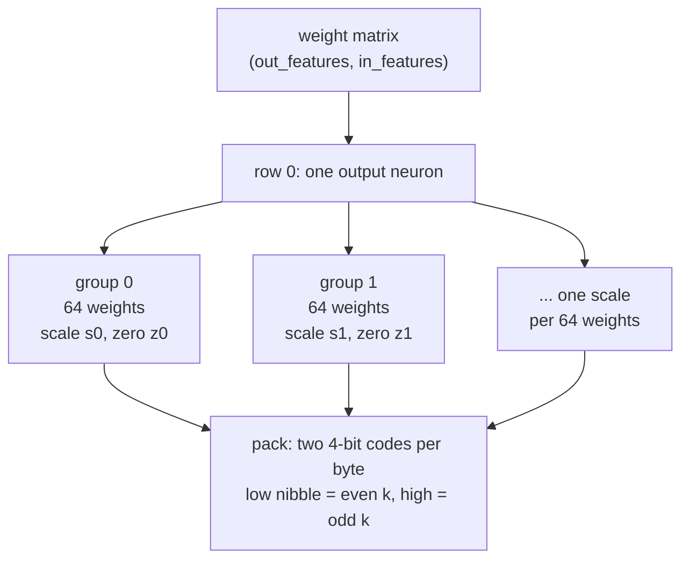
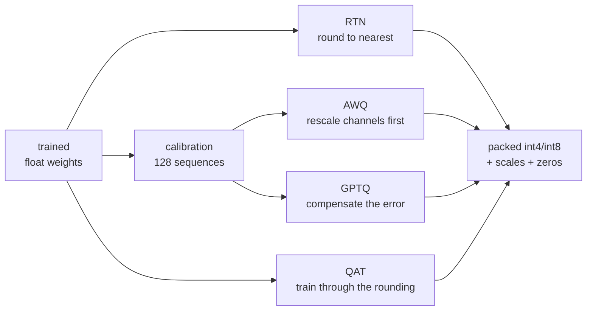
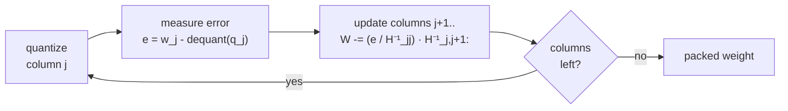

# 10. Quantization: making a trained model four times smaller

A trained model is a few hundred million numbers. We stored each one in 16 bits because
that is what it was trained in. This chapter is about storing them in 4 or 8 instead, why
that works at all, and what it costs — measured on our own models, not quoted.

Everything here is post-training except the last method: the model is already finished and
we are re-encoding it. Nothing is retrained (until QAT), no architecture changes.

## The one observation everything rests on

Take any small run of consecutive weights from a trained matrix and look at them:

```
0.0231  -0.0198   0.0304  -0.0112   0.0267  ...
```

They are tightly clustered. Nothing in that group needs 16 bits of range — it needs 16
bits of *precision within a narrow range*, which is a completely different requirement.
So: store one full-precision **scale** for the group, and store each weight as a small
integer multiple of it.

```
w  ≈  s · (q - z)
```

`q` is the small integer — 4 bits gives 16 possible values, 8 bits gives 256. `s` is the
scale and `z` is the zero-point, both stored once per **group** of consecutive weights.

That amortisation is the whole trick. At 4 bits with groups of 64, the true cost is

```
4 bits (the weight) + 16 bits (fp16 scale) / 64 + 8 bits (uint8 zero) / 64  =  4.375 bits
```

not 4. Always quote the honest number — `QuantScheme.bits_per_weight()` computes it.

### Why one scale per matrix is not enough

The alternative is a single scale for the entire weight matrix. It fails badly, and the
reason is worth internalising: **the scale is set by the largest magnitude it has to
cover**. One outlier weight in two million forces a scale big enough to represent it, and
then every ordinary weight — clustered around a hundredth of that outlier — gets crushed
into the two or three integer levels nearest zero.

Smaller groups mean each scale covers a narrower range. Measured on our 13.8M model at
4 bits, perplexity above the bf16 baseline of 4.338:

| group size | scales per row (in=1024) | Δ perplexity |
|---|---|---|
| 64 | 16 | **+0.089** |
| 128 | 8 | +0.107 |
| per-channel (one per row) | 1 | +0.156 |

Monotone, and the cost of finer groups is a few hundredths of a bit per weight.

## Which axis do we group along?

`nn.Linear` stores weight as `(out_features, in_features)` and computes `x @ W.T`, so each
output is a dot product along `in_features`. We group along **in_features** — the axis the
matmul reduces over.

That is not arbitrary. A group's scale is a constant factor over a contiguous stretch of
one dot product, so it factors straight out of the partial sum:

```
sum over k in group g of  x[k] · s[g] · (q[k] - z[g])
    =   s[g] · sum over k in group g of  x[k] · (q[k] - z[g])
                ^^^^^^^^^^^^^^^^^^^^^^^^^^^^^^^^^^^^^^^^^^^^
                one scale multiply per group, not per weight
```

which is exactly what lets the fused kernel accumulate cheaply and scale once per group
instead of once per element.



## Symmetric or asymmetric

**Symmetric** stores only a scale and assumes the group is centred on zero. The integer
range gives up one negative level (−7…7 rather than −8…7) so the grid is genuinely
symmetric and `q = 0` means `w = 0` exactly.

**Asymmetric** fits the group's true range using a zero-point, so all 16 levels land where
the weights actually are. At 4 bits that matters — you cannot afford to spend half your
levels on a range the weights never visit. Defaults: **asymmetric at 4 bits, symmetric at
8**.

### The bug that hides here

The zero-point is the integer code standing for 0.0, so it has to *be* a code — inside
`[qmin, qmax]`. Fit the raw `[min, max]` of a group that never crosses zero — weights all
in `[1, 2]`, say — and the arithmetic wants `z = −15`, which then gets clamped to 0, after
which every weight in the group saturates to the same code. The group collapses to a
constant.

The fix is to always stretch the range to include zero:

```python
wmin = wf.amin(dim=-1, keepdim=True).clamp(max=0.0)
wmax = wf.amax(dim=-1, keepdim=True).clamp(min=0.0)
```

Then `-wmin/s` lands in `[0, qmax-qmin]` by construction and no clamp is needed.

This is worth dwelling on because of *how* it was found. It does not raise, does not
produce NaN, and on real trained weights it almost never fires — weight distributions are
roughly zero-centred, so nearly every group straddles zero. Re-running the full benchmark
after fixing it produced **identical numbers**. It was caught only by a test asserting that
asymmetric must beat symmetric on a deliberately skewed group, and by another asserting a
constant group round-trips. Latent, real, and invisible to measurement on this data.

## The tied-embedding trap

Our models set `tie_embeddings: true`, so `lm_head.weight` **is** `tok_emb.weight` — one
matrix, two names. Therefore:

> Quantizing a tied `lm_head` saves nothing.

The embedding table must stay float for the input lookup — you cannot index into a packed
4-bit matrix to fetch row 8,421 — so the bytes remain either way. You would pay the full
accuracy cost of quantizing the single most sensitive matrix in the model for zero
benefit. On the 300M config that matrix is 32768 × 1024 = 33.5M weights, 11% of the model.

So `lm_head` is **skipped by default when embeddings are tied**, and reported as skipped
rather than quietly omitted. `--quantize-head` overrides it.

This also means the headline compression ratio is always below the nominal 4×: the
embedding never shrinks. Our 300M model goes 599 MB → 213 MB at int4, which is **2.8×**,
not 4×. Quote the number that includes everything.

## The four methods



### RTN — round to nearest

Divide by the scale, round, clamp. No data, no search, seconds to run. At 8 bits it is
essentially free and there is nothing more to say. At 4 bits it answers "which of the 16
levels?" with "the nearest one", which is only right if every weight matters equally.

The other three methods are three different ways of saying that they do not.

### Calibration — what the layers actually see

To know which weights matter you have to know what multiplies them. So run a few hundred
real sequences through the model and record, per Linear layer, statistics of its input:

- **Hessian** `H = E[x xᵀ]`, an `in × in` matrix — what GPTQ needs. At `d_ff = 2752` that
  is 30 MB in fp32 per layer, which is why GPTQ frees each one as it finishes.
- **channel energy** `E[x_j²]`, just the diagonal — all AWQ needs, and vastly cheaper.

128 sequences is plenty; these are second moments of a distribution the model has seen
millions of times. Calibrate on data resembling what the model will *do* — calibrating a
code model purely on prose measures the wrong activations.

### GPTQ — push the error into the columns you have not done yet

A layer is not a bag of independent weights, it is a linear map, and what matters is that
`x @ W.T` barely changes — not that each weight barely changes.

So quantize column by column. After rounding column *j*, measure the error you just made
and **adjust the not-yet-quantized columns to cancel its effect on the output**. Those
columns are still full precision, so they are free to move. By the last column it has
absorbed the accumulated debt of every column before it.



How much each later column should move depends on how correlated its input is with column
*j*'s — which is exactly what `H` records. Two numerical points:

- **Damping.** `H` is positive *semi*-definite and frequently singular: a channel that is
  dead over the calibration set gives an all-zero row and column, and Cholesky fails. Add
  1% of the mean diagonal as a ridge. Too little and the inverse amplifies noise in rarely
  used channels; too much and it throttles back towards RTN.
- **Cholesky of the inverse, not the inverse.** The update only ever needs the upper
  triangle of `H⁻¹` — column *j* only talks to later columns — so factorising once up
  front turns a per-column linear solve into a row lookup.

One subtlety that is easy to get wrong: **group scales must be fitted to the weights as
they stand when the algorithm reaches that group**, not to the original matrix. By then
earlier columns' error has already been pushed into them. Our implementation aligns each
block with exactly one group so this falls out naturally.

*Simplification vs the paper:* the published method runs sequentially, calibrating each
block on activations that already passed through the quantized blocks before it. We
collect statistics once, from the float model. Simpler, one pass, and gives up a little
quality at 4 bits.

### AWQ — scale the important channels up before rounding

For any positive per-channel `s`:

```
x @ W.T   ==   (x / s) @ (W * s).T
```

(`W * s` scaling each input-channel column, `x / s` dividing the matching activation.)
Same function, different numbers. Quantize `W diag(s)` instead of `W`: channels carrying
large activations get scaled up, so they occupy more of their group's range and are
resolved more finely; unimportant channels absorb the rounding instead.

The `1/s` is folded into whatever produced `x`, so it costs nothing at runtime. Our
architecture gives four such sites per block:

| fold `1/s` into | protects | why it works |
|---|---|---|
| `attn_norm` gain | `wq`, `wk`, `wv` | one RMSNorm feeds all three |
| `ffn_norm` gain | `w1`, `w3` | same |
| `w3` output rows | `w2` | `w2`'s input is `silu(w1 x) * (w3 x)`, elementwise |
| `wv` output rows | `wo` | `wo`'s input channel `j` comes from value head `j // head_dim` |

**The GQA constraint.** With `n_kv_heads < n_heads`, several query heads read the same
value head, so their scales are not independent — the fold happens once, in `wv`. We
average importance across the query heads sharing a kv head before searching. Miss this
and the fold *silently changes the function of the layer*: the model still runs, still
produces fluent text, and is quietly wrong. There is a test asserting the fold leaves
outputs bit-identical, under both GQA and plain MHA.

`s` is not derived, it is searched over `s = importance^α` for α in a grid from 0 to 1.
α = 0 is in the grid deliberately, so AWQ can decide to do nothing rather than being
forced to pick a distortion.

### QAT — train the model to tolerate rounding

The only method here that is not post-training. Put the quantizer inside the forward pass,
so the loss the optimiser sees is the *quantized* model's loss and gradient descent moves
the weights somewhere that survives being rounded.

Rounding has zero gradient almost everywhere, so nothing would train. The **straight-
through estimator** is the standard dodge:

```python
w_q = w + (quantize_dequantize(w) - w).detach()
```

The value equals `quantize_dequantize(w)` exactly — the two `w` terms cancel numerically —
but `.detach()` hides the correction from autograd, so `d(w_q)/dw = 1`. Forward is
quantized, backward pretends it was not. It is not the true gradient of anything and it
works well.

Two things measured here:

**The learning rate window is narrow, and the curve is not monotone.** On the 13.8M model
at int4 per-channel, 800 steps, against RTN's +0.156:

| lr | Δ perplexity | |
|---|---|---|
| 1e-5 | +0.155 | recovers nothing; weights barely move |
| **5e-5** | **+0.096** | best — beats GPTQ's +0.100 |
| 2e-4 | +0.126 | too far; losing pretraining faster than it gains |

QAT is not "more training is better". It is a search for a nearby basin, and a large step
leaves the neighbourhood.

**Simulate the storage precision.** `QuantLinear` keeps scales in fp16. A QAT run computing
them in fp32 trains against slightly better numerics than it will ship with, and the model
shifts on conversion (~1e-4 on the logits). `fake_quantize(..., scale_dtype=torch.float16)`
closes it. Caught by a test asserting that the converted model computes exactly what the
last training forward pass computed.

## Results

Same evaluation batches throughout (`iter_eval_batches` takes a fixed seed, so a 0.01
difference is signal, not batch luck).

### 13.8M TinyStories model — bf16 perplexity 4.338

| scheme | size | ratio | perplexity | Δ | decode tok/s |
|---|---|---|---|---|---|
| bf16 baseline | 27.7 MB | 1.00× | 4.338 | — | 219 |
| rtn int8 g64 | 17.4 MB | 1.59× | 4.338 | **+0.000** | 128 |
| rtn int4 g64 | 12.2 MB | 2.26× | 4.427 | +0.089 | 78 |
| rtn int4 g128 | 12.0 MB | 2.31× | 4.445 | +0.107 | 77 |
| rtn int4 per-chan | 11.8 MB | 2.34× | 4.494 | +0.156 | 77 |
| **awq** int4 g64 | 12.2 MB | 2.26× | 4.416 | +0.078 | 77 |
| **gptq** int4 g64 | 12.2 MB | 2.26× | **4.397** | **+0.059** | 77 |
| gptq int4 per-chan | 11.8 MB | 2.34× | 4.439 | +0.100 | 77 |
| **qat** int4 per-chan | 11.8 MB | 2.34× | 4.434 | **+0.096** | — |

### 300M blended model at step 15,000 — bf16 perplexity 13.519

(That perplexity is measured on a fixed 80-sequence slice of `val.bin`, which is a smaller
sample than the trainer's own eval — so it is not the same number as `best_val` in the
training log. It is the same slice for every row below, which is what matters here.)

| scheme | size | ratio | perplexity | Δ |
|---|---|---|---|---|
| bf16 baseline | 599 MB | 1.00× | 13.519 | — |
| rtn int8 g64 | 342 MB | 1.75× | 13.519 | **+0.001** |
| rtn int4 g64 | 213 MB | 2.81× | 13.772 | +0.253 |
| rtn int4 g128 | 208 MB | 2.88× | 13.808 | +0.289 |
| rtn int4 per-chan | 201 MB | 2.98× | 14.064 | +0.545 |
| **awq** int4 g64 | 213 MB | 2.81× | 13.718 | +0.200 |
| **gptq** int4 g64 | 213 MB | 2.81× | **13.682** | **+0.163** |
| gptq int4 per-chan | 201 MB | 2.98× | 13.864 | +0.345 |

Read across: **int8 is free**, at both scales, to three decimal places. At int4 the
ordering RTN → AWQ → GPTQ holds at both scales, with GPTQ recovering about a third of the
degradation (36% at 300M). Coarser groups hurt more, and the methods help more where there
is more to fix.

## The fused kernel, and an honest performance story

Notice the `tok/s` column above: **every quantized model is slower than bf16**. That is not
a bug, and understanding why is the most useful thing in this chapter.

The `torch` backend stores 4-bit weights and then, on every forward pass, rebuilds the full
bf16 matrix and calls cuBLAS. It saves memory at rest but does strictly more work than not
quantizing — everything bf16 does, plus unpacking, plus writing and re-reading a temporary
the size of the original weight. Hence 0.35×.

The fix is to fuse: load packed bytes into registers, unpack and scale *there*, accumulate
straight into the output, so the 4-bit form is the only thing crossing the memory bus.
`aksharallm/quant/kernels.py` does this in Triton. On one 1024×1024 layer at batch 1 it
takes the matmul from **206 µs to 25 µs**. End to end, decode goes 19.3 → **31.7 tok/s**.

Two things that mattered more than the arithmetic:

- **Occupancy.** With `BLOCK_N=64` and N=1024 the grid is 16 programs on an 82-SM GPU.
  Dropping to `BLOCK_N=32` gives 32 programs and is 3.5× faster. `BLOCK_N=128` → 8
  programs → 5× slower than the best.
- **Scale traffic.** With `BLOCK_K=128` and groups of 64, the naive version loads 128 scale
  values per row when only 2 are distinct — *more* bytes in scales than in the 4-bit
  weights the kernel exists to avoid reading. Matching `BLOCK_K` to the group size makes
  that load `(BLOCK_N, 1)`.

### And then it stops, well short of bf16

31.7 tok/s against bf16's 55. The textbook says decode is memory-bandwidth bound — read
every weight, do two flops with each, so 4× fewer bytes should be ~4× faster. **That story
is false at this scale**, and the measurement says so plainly:

- 525 MB of Linear weights ÷ 936 GB/s = a step should take **0.56 ms**.
- Measured: **17.5 ms**. Thirty-one times off.

The giveaway is batch scaling:

```
bf16   B=1  17.5 ms/step    B=8  18.3 ms/step    B=32  17.9 ms/step
int4   B=1  30.7 ms/step    B=8  31.2 ms/step    B=32  42.8 ms/step
```

Thirty-two tokens for the price of one means the GPU is nowhere near saturated at B=1. The
time is going into per-operation dispatch — a step is ~170 Linear calls plus norms,
attention and sampling, each an individual eager-mode launch, and 17.5 ms over several
hundred launches is ~25 µs apiece. That is launch and Python overhead, not memory traffic.

So, honestly:

- quantization's win here is **memory footprint** — real and immediate (2.8×);
- the fused kernel's win is **real but capped** (1.6×) because it optimised something that
  was not the bottleneck;
- beating bf16 at batch 1 needs the launch overhead removed first — CUDA graphs or
  `torch.compile(mode="reduce-overhead")` — and only *then* does bandwidth start to bite;
- the bandwidth story becomes true as models grow: at 7B the weights are 20× larger while
  the launch count is only ~3×.

None of which is a reason not to write the kernel. It is a reason to measure before
believing a performance story, including this one.

`backend="auto"` sends decode (few rows) to the fused kernel and prefill (hundreds of rows,
genuinely compute bound) to dequantize + cuBLAS, which is the right answer for both.

## In the browser

The portal's **Quantize** tab does everything below without a terminal: pick a checkpoint,
pick a method, press Quantize, watch the job's output stream in, and read the results table
when it lands. **Compare all** runs the whole sweep.

It is a view over the CLI, not a second implementation — the button shells out to
`python -m aksharallm.quant ... --json logs/quant/<job>.json`, so a job started in the
browser and one typed into a terminal write the same files, and either can stop the other.
A job run by hand with `--json logs/quant/<name>.json` shows up in the panel's results too.

Two behaviours worth knowing:

- **It runs as a separate process.** GPTQ on the 300M model takes minutes and allocates
  over a gigabyte of Hessians; doing that inside the portal would put a heavy job in the
  same address space as the page and the scheduler that starts training at 22:00. A
  separate process fails alone.
- **It moves to the CPU while a run is training**, and says so. Unlike the playground —
  where the model is small and the worst case is a slow tab — a quantization job can
  allocate a lot, and the downside of getting it wrong is the *training run* dying at 3am.
  Choosing `cuda` explicitly overrides it, which is right when nothing is training.

One job at a time, for the same reason the trainer allows one run at a time.

## Running it

```bash
# the one to reach for first: every method, one table
python -m aksharallm.quant small-code/ckpt_best.pt --compare

# a single scheme, measured and saved
python -m aksharallm.quant small-code/ckpt_best.pt --bits 4 --group 64 --bench

# calibrated methods
python -m aksharallm.quant small-code/ckpt_best.pt --method gptq --bench
python -m aksharallm.quant small-code/ckpt_best.pt --method awq  --bench

# quantization-aware fine-tune (needs training data and GPU time)
python -m aksharallm.quant tiny/ckpt_best.pt --method qat --qat-steps 800 --bench

# force a backend to compare paths
python -m aksharallm.quant small-code/ckpt_best.pt --bits 4 --bench --backend torch
```

Output goes next to the source with the scheme in the name —
`ckpt_best-gptq-int4-g64-asym.pt`. The original stem comes first deliberately, so the
stage prefix (`ckpt_`/`sft_`/`dpo_`) still parses: quantizing does not change what a model
has been trained to do.

## Gotchas worth keeping

1. **`d_ff = 2752` is not divisible by 128.** `d_ff` is `8/3 · d_model` rounded up to a
   multiple of 64, and the SwiGLU down-projection reduces over it — so the group size most
   papers use breaks on exactly one layer per block. `resolve_group_size` falls back to the
   largest power-of-two divisor (64) and the report says which layers were regrouped.
   **Default group size here is 64, because it divides everything in both configs.**
2. **A quantized checkpoint must keep `config.data.tokenizer`.** The BPE vocabulary *is*
   the embedding index; a checkpoint that loses it decodes to fluent nonsense. `save_quantized`
   carries it forward and there is a test pinning that.
3. **Load the shapes before the weights.** `apply_quant_metadata` swaps in empty
   QuantLinears so `load_state_dict` fits. Skip it and loading fails loudly — which is the
   good case. The bad case would be silently keeping float weights and wondering why
   nothing got smaller.
4. **Do not quantize a quantized checkpoint.** The CLI refuses; compounding the error would
   look like a much worse method rather than a mistake.
5. **Quantized weights are buffers, not Parameters.** Registering them as Parameters would
   let an optimiser update bytes that are then reinterpreted as packed nibbles.
6. **Triton `BLOCK_M=16` costs ~100 seconds to compile** with the 3D broadcast reduce, on
   schemes that have nothing else in common. Capped at 4; decode is one row anyway.

## Where this sits

Quantization is the second item in the from-scratch backend sequence: GRPO ✅ → **quantization
✅** → LoRA/QLoRA → eval harness → diffusion → export/serving. QLoRA next is the natural
follow-on, since it is fine-tuning *on top of* the 4-bit weights this chapter produces —
`QuantLinear` is already the frozen base it needs.

Read next: [06-inference.md](06-inference.md) for the KV cache and generation loop the
kernel plugs into, and [03-model.md](03-model.md) for the Linear layers being replaced.
