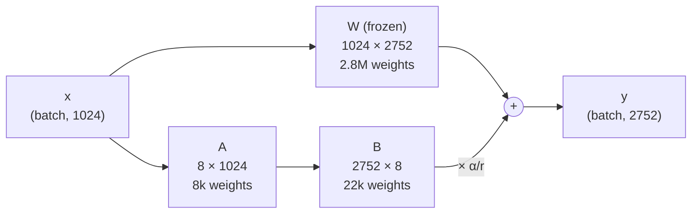
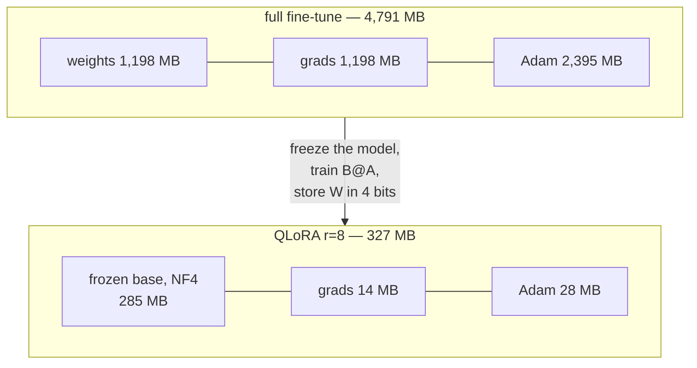
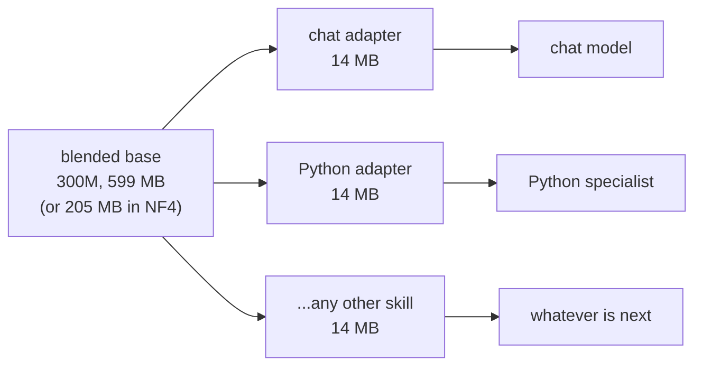

# 11. LoRA and QLoRA: fine-tuning without training the model

Chapter 10 made a finished model smaller. This chapter is about *changing* one — teaching
it to answer questions, or to write Python — without paying for a second copy of it.

The headline, measured on our own 300M checkpoint:

| | to fine-tune | adapter file |
|---|---|---|
| full fine-tune | 4,791 MB | — (a whole new 1.2 GB checkpoint) |
| LoRA r=8 | 1,253 MB | 14 MB |
| **QLoRA r=8** | **327 MB** | **14 MB** |

Same task, same data, and — as we will measure below — very nearly the same result.

## The problem is the optimiser, not the model

This is the thing most explanations skip, and it is the whole motivation.

Our 300M model in bf16 is 1.2 GB. That fits on a 3090 with room to spare. So why is
fine-tuning it awkward? Because training a parameter costs far more than storing it:

```
weights      299M × 4 bytes (fp32 master)   = 1,198 MB
gradients    299M × 4 bytes                 = 1,198 MB
Adam state   299M × 8 bytes (two moments)   = 2,395 MB
                                              --------
                                              4,791 MB   plus activations
```

**Adam is the largest single term.** It keeps two running averages per trainable
parameter, in fp32, for the entire run. Scale to the 1B model Phase 4 is aiming at and
this is 16 GB before a single activation — on a card that has 24 and needs room for the
forward pass too.

So the question is not "how do we store the model in less" (chapter 10 answered that). It
is: **how do we train far fewer parameters, while still changing what the model does?**

## The observation: the update is low rank

Fine-tuning takes a weight matrix `W` and moves it to `W + ΔW`. Full fine-tuning stores
and trains all of `ΔW`, which is exactly as big as `W`.

But `ΔW` is not an arbitrary matrix. It is the accumulated result of adapting to one
narrow task, and empirically it has very low **rank** — the number of independent
directions it actually moves in is in the tens, not the thousands.

So do not store `ΔW`. Store two thin matrices whose product is `ΔW`:

```
ΔW  =  B @ A          A is (r, in_features)      B is (out_features, r)
```

with `r` around 8 against an `in_features` of 1024. The forward pass becomes:

```
y  =  x @ W.T  +  (α/r) · (x @ A.T) @ B.T
      \________/     \____________________/
       frozen base        the adapter
```

For our `w1` projection (1024 → 2752), that replaces 2.8M trainable numbers with 30k —
about 1%.



Two skinny matmuls in that order matter: `(x @ A.T) @ B.T` costs `r·(in+out)` per token,
while building `B @ A` first and doing one big matmul costs `in·out` — the full-rank price
we are here to avoid. `LoRALinear.forward` never materialises `ΔW`.

### Why B starts at zero

`B = 0` makes the whole adapter term zero, so **at step 0 the adapted model computes
exactly what the base model computed**. Training starts from the pretrained model rather
than from a randomly perturbed one — and a random perturbation of a pretrained model is
much worse than the model, so the first few hundred steps would otherwise be spent undoing
it.

`A` cannot also be zero: `B @ A` would be zero, its gradient would be zero, and nothing
would ever move. One of them is random and the other is zero.

A consequence worth knowing, because it looks like a bug the first time you see it: **at
step 0, `A` receives no gradient at all.** `dL/dA` carries a factor of `B`, which is
exactly zero. `A` starts moving on the second step. There is a test pinning this
(`test_gradients_reach_the_adapters_through_a_four_bit_base`).

### What alpha is for

The update is scaled by `α/r`. The point: if you double the rank you want *more
directions*, not a bigger step. Dividing by `r` keeps the update's magnitude roughly
constant as you sweep the rank, so the learning rate you found at r=8 is still about right
at r=32. Convention, and our default, is `α = 2r` — a scaling of 2 at every rank.

## QLoRA: freeze it in 4 bits

Now combine this with chapter 10. The base model is **frozen** — it never receives a
gradient, never gets an optimiser state, and is only ever read. So there is no reason to
keep it in 16 bits.



The gradient still has to flow **through** the dequantization to reach the adapters below
each layer. It does: dequantizing is a differentiable function of buffers that require no
gradient, and `F.linear` is differentiable in `x`.

> **The one real trap.** Our fused Triton kernel (chapter 10) is a bare `triton.jit` call
> with **no `autograd.Function` behind it**, so it has no backward pass. Training through
> it would either error or — far worse — silently detach the base and train the adapters
> against a constant. `lora.inject.prepare_for_training` therefore pins
> `QuantLinear.backend = "torch"` before any step runs, and says so in the run header.
> Inference switches back freely.

### NF4: a better 4-bit grid

Chapter 10's int4 spaces its 16 levels **evenly** across each group's range. That is the
right assumption if you know nothing about the weights, and the wrong one if you know they
are roughly Gaussian — which trained weights are.

NF4 ("normal float") puts its 16 levels at the **quantiles of a normal distribution**:
closely spaced near zero where the mass is, widely spaced out in the tails. The levels are
fixed constants, so a group stores only an absmax scale and **no zero-point at all** —
which makes NF4 both more accurate *and* smaller than int4 at the same group size.

We derive the levels rather than pasting them in (`_derive_nf4_levels`), from evenly
spaced probabilities mapped through the inverse normal CDF via `erfinv`. The derivation
reproduces the published table to 1.2e-7, and there is a test asserting exactly that.

The asymmetry is deliberate and easy to get wrong: **7 negative levels, one zero, 8
positive**. Sixteen levels cannot be split evenly around a zero that must itself be
representable, so one side gets the spare. Zero being an exact level matters more than it
looks — padding, masked positions and genuinely dead weights all quantize to exactly 0.0.

### Double quantization

At group 64 the fp16 scales cost `16/64 = 0.25` bits per weight — about 6% of a 4-bit
model. Double quantization compresses the scales themselves: int8 codes with one fp32
scale and one fp32 mean per block of 256 scales, taking 0.25 down to 0.129 bits/weight.

One detail carries most of the benefit: **subtract the block mean first**. Scales are all
positive, so a symmetric int8 grid would waste its entire negative half — throwing away a
bit before it starts. Re-centring on zero uses both halves.

The padding detail matters too, and is the kind of thing only a boundary test catches: the
last block is padded up to 256 with the *last value*, not with zeros. Zeros would drag that
block's mean and absmax toward zero and cost precision on every real scale in it.

## What NF4 actually bought

Measured 2026-07-30 on `small-code/ckpt_best.pt` (300M, step 15,000), 40 evaluation
batches, `python -m aksharallm.quant <ckpt> --compare`:

| scheme | size | ratio | perplexity | Δ vs bf16 |
|---|---|---|---|---|
| bf16 (baseline) | 599.1 MB | 1.00x | 15.076 | — |
| rtn-int8-g64-sym | 341.6 MB | 1.75x | 15.077 | +0.001 |
| rtn-int4-g64-asym | 212.8 MB | 2.81x | 15.362 | +0.286 |
| **rtn-nf4-g64** | 208.7 MB | 2.87x | 15.310 | **+0.234** |
| **rtn-nf4-g64-dq** | **204.7 MB** | **2.93x** | 15.309 | **+0.234** |
| awq-int4-g64-asym | 212.8 MB | 2.81x | 15.296 | +0.221 |
| gptq-int4-g64-asym | 212.8 MB | 2.81x | 15.261 | +0.185 |
| **gptq-nf4-g64** | 208.7 MB | 2.87x | 15.249 | **+0.173** |
| rtn-int4-chan-asym | 201.0 MB | 2.98x | 15.675 | +0.600 |

Three things to take from this:

1. **NF4 beats int4 at the same group size, and is smaller.** RTN: +0.234 vs +0.286.
   GPTQ: +0.173 vs +0.185. The gain is free — it comes from where the levels sit, not from
   spending more bits. Dropping the zero-point pays for itself.
2. **Double quantization is genuinely free.** Perplexity 15.310 → 15.309 (i.e. noise), and
   4 MB smaller. It is a small win and a real one; anyone claiming it is significant at
   this scale is overselling it.
3. **The best 4-bit configuration is now GPTQ-NF4**: +0.173 at 2.87x. Grid choice and
   rounding algorithm are independent axes, and stacking them works.

## LoRA vs QLoRA vs full fine-tuning

The comparison you can only run at this scale — at 70B you cannot afford the full
fine-tune to compare against. Measured on the 13.8M TinyStories model, three epochs of the
synthetic SFT set, identical data and schedule:

| | final val loss | trainable | memory | wall clock |
|---|---|---|---|---|
| full fine-tune | **1.2364** | 13.8M (100%) | — | 4.7s |
| LoRA r=8 | 1.2425 | 0.35M (2.48%) | 61 MB | 6.9s |
| QLoRA r=8, NF4+dq | 1.2433 | 0.35M (2.48%) | 24 MB | 9.6s |

**LoRA lands within 0.5% of full fine-tuning while training 2.5% of the parameters, and
QLoRA adds essentially nothing on top of that** while cutting memory a further 2.5x.

And the honest part, which the table shows plainly: **LoRA is slower in wall-clock time,
not faster.** It saves *memory*, not compute. The forward pass still runs through every
layer at full width, and the adapter adds two extra matmuls per layer; QLoRA adds
dequantization on top. If your model already fits comfortably, full fine-tuning is the
faster choice. LoRA's argument begins exactly where the memory runs out.

> The 2.48% is inflated by the toy scale — at 13.8M with `d_model=384`, rank 8 is not small
> relative to the width. On the 300M model the same settings give **1.15%**, and the
> adapter is 14 MB against a 599 MB base.

## Which layers to adapt

The one hyperparameter that reliably matters more than the rank.

| preset | layers | when |
|---|---|---|
| `qv` | wq, wv | the original LoRA paper's setting; fewest parameters |
| `attn` | wq, wk, wv, wo | all four attention projections |
| `ffn` | w1, w2, w3 | the SwiGLU only — two thirds of the weights live here |
| **`all-linear`** | all seven | **the default**; the QLoRA paper's recommendation |

The QLoRA paper's ablation found that at a fixed parameter budget it is better to adapt
*every* linear layer at a low rank than a few at a high rank. `qv` is kept so you can
reproduce the original setting and measure the gap yourself.

**`lm_head` is never adapted**, and for the same reason chapter 10 does not quantize it:
with `tie_embeddings` it *is* the embedding table, so adapting it silently adapts the input
lookup too. That is a different and far less predictable intervention than adapting a
projection.

## Picking a rank

Trainable parameters are exactly linear in `r`. On the 300M model, `all-linear`:

| r | trainable | of the model | adapter file |
|---|---|---|---|
| 4 | 1.87M | 0.55% | 7.5 MB |
| **8** | **3.75M** | **1.10%** | **15.0 MB** |
| 16 | 7.50M | 2.18% | 30.0 MB |
| 32 | 14.99M | 4.27% | 60.0 MB |

Start at 8. Raise it if the training loss plateaus above where you want it (the adapter
lacks capacity); lower it if val loss climbs while train loss falls (it is overfitting a
small dataset). `python -m aksharallm.lora budget <ckpt>` prints the memory for each
without training anything.

## The learning rate is different, and it matters

LoRA wants a **much** higher learning rate than full fine-tuning — roughly 20x. Our
defaults:

| | full fine-tune | with `--lora` |
|---|---|---|
| SFT | 1e-5 | **2e-4** |
| DPO | 5e-7 | **5e-5** |

The reason is mechanical: the adapter starts at exactly zero and has ~1% of the
parameters, so a learning rate tuned for nudging a pretrained matrix barely moves it. Run
LoRA at 1e-5 and you get a loss curve that descends convincingly and a model that has
learned almost nothing. `train/sft.py` picks the right default automatically from whether
`--lora` was passed.

## The reference model becomes free

The nicest thing LoRA does for this project, and it is in `train/dpo.py`.

DPO needs a frozen **reference model** to measure the policy against — normally a second
complete copy of the weights, held for the whole run purely to answer "where did you
start?". At our size that is 1.2 GB doing nothing.

With LoRA it costs zero bytes: the policy *is* the base plus an adapter, so **switching the
adapter off turns the model you are already holding into the model you started from**.

```python
with disable_adapters(policy):
    ref_chosen = sequence_logprob(policy, ...)   # the frozen base, exactly
```

`as_reference()` in `train/dpo.py` yields either a second model or the policy with its
adapters off, so the DPO maths below it did not change by a line.

One subtlety the code handles: adapter dropout is forced to 0 under DPO. It would perturb
the policy pass but not the reference pass (which skips the adapter entirely), adding noise
to exactly the comparison DPO is made of.

## Merging, and when not to

`W' = W + (α/r)·B@A` and the adapter is gone — one matmul again, inference costs exactly
what the base cost.

```
unmerged:  two matmuls, ~1% more parameters, hot-swappable
merged:    one matmul, no adapter, cannot be turned off
```

Merging into a **quantized** base is a different matter. `W_q + BA` is not representable in
4 bits, so there are two options and neither is free:

1. **Merge into float.** Exact, and you get a bf16 checkpoint back — you have handed back
   the memory quantizing bought.
2. **Merge and re-quantize.** Small again, but re-quantizing rounds `W_q + BA` *afresh*.
   The result is not the model you evaluated, and the difference is of the same order as
   the adapter you just trained.

`merge_lora` does (1) and says so; (2) is `--requantize`, deliberately a separate explicit
flag, and the CLI prints a warning that the perplexity you measured no longer applies.

**The best option is usually not to merge at all.** Keep the 4-bit base and the 14 MB
adapter side by side — that is how QLoRA is normally deployed, and it is what makes one
base plus several skills possible.

## One base, many skills

This is the payoff that changes how the project is shaped. The plan has always been that
one expensive pretraining run yields two models:



Without adapters that is two 1.2 GB checkpoints and a decision about which to keep. With
them it is one base and a directory of small files, swapped at inference:

```bash
python -m aksharallm.infer.cli small-code/ckpt_best.pt \
    --adapter small-code/sft_best.lora.pt --mode chat
```

**An SFT adapter makes a base checkpoint a chat model**, and the playground knows it: the
chat mode gate reads the *pair*, not the checkpoint's filename. A `ckpt_` file with an SFT
adapter attached reports stage `sft` and chat works. Getting this wrong would refuse
exactly the thing adapters exist to produce.

## Adapter files, and the check that saves you

An adapter is a `.pt` holding the `lora_A`/`lora_B` pairs, their config, and the identity
of the base it was trained against. They are named `*.lora.pt` and live beside their base;
the suffix keeps them out of the checkpoint picker, where they would appear as models that
cannot load.

Loading checks three things and **refuses by default** on a mismatch:

| checked | why |
|---|---|
| `model_config` | shapes usually catch a mismatch, but two runs with the same width and different depth would not |
| tokenizer | an adapter trained through one BPE vocabulary is nonsense through another, and this is invisible in the shapes |
| rank / targets | taken from the file, so nothing has to be repeated at load time |

This is not bureaucracy. An adapter is a **delta**; applied to the wrong base it does not
raise — the model still runs, still emits fluent text, and is simply worse for no visible
reason. `--force` exists for deliberate experiments.

`dropout` is explicitly excluded from the architecture comparison: SFT raises it and
inference sets it to zero, so it differs on almost every legitimate load.

## In the browser

The portal's **Finetune** tab, which leads with the budget rather than the Run button —
because LoRA is the first thing in this project whose point is a *cost*, not a loss curve,
and you can learn the whole trade-off without spending any GPU time.

```
scripts/portal.sh          then the Finetune tab
```

- **What this does** — the explanation and a diagram of `y = Wx + BAx`.
- **What it would cost** — full / LoRA / QLoRA on the checkpoint you picked, built from
  the real shapes, with a bar so the 15x gap is visible rather than arithmetic.
- **Fine-tune** — start a job. It shells out to `python -m aksharallm.train.sft`, the same
  command you would type, so a job started here and one started in a terminal produce the
  same adapter in the same place.
- **Stop at…** — the same picker the dashboard uses: stop now, at a step, or in *n* minutes.
  However it stops, the job evaluates once more and writes `sft_last` and `sft_best`, so a
  fine-tune you cut short still leaves a usable adapter. The stop file is
  `logs/finetune/STOP`, deliberately **not** `checkpoints/<base>/STOP` — an adapter is
  written into its base model's run directory, and a file by that name in there belongs to
  the pretraining run. One fine-tune ending a six-day run is not a mistake worth leaving
  available.
- **Adapters you have** — everything under `checkpoints/`, with rank, size and val loss.
- The **Playground** gains an adapter picker beside the checkpoint picker. Same weights,
  same prompt, one small file different — the fastest way to hear what a fine-tune did.
  Only adapters whose architecture matches the selected checkpoint are offered.

Like the Quantize tab, when a pretraining run is live the default device drops to the CPU
and the panel says why. The irony is stated in the UI: QLoRA is precisely the technique
that *would* fit alongside a training run — the caution is a policy about this machine
having one card and one irreplaceable 40,000-step run on it, not a claim about the method.

## Running it

```bash
# what would this cost? (trains nothing)
python -m aksharallm.lora budget small-code/ckpt_best.pt --ranks 8 16

# the target presets and what they cover
python -m aksharallm.lora presets

# QLoRA fine-tune: frozen NF4 base + rank-8 adapters on every projection
python -m aksharallm.train.sft --base checkpoints/small-code/ckpt_best.pt \
    --data-dir data/sft --tokenizer data/blend/tokenizer.json \
    --out-dir checkpoints/small-code --qlora --qlora-double-quant --lora-r 8

# plain LoRA (float base) — a little more memory, a little faster
python -m aksharallm.train.sft ... --lora --lora-r 8 --lora-targets attn

# continue training an existing adapter
python -m aksharallm.train.sft ... --adapter checkpoints/small-code/sft_best.lora.pt

# DPO on top, with the reference model for free
python -m aksharallm.train.dpo --sft <ckpt> --data-dir data/dpo ... --lora

# what is in an adapter?
python -m aksharallm.lora show checkpoints/small-code/sft_best.lora.pt
python -m aksharallm.infer.cli --list-adapters

# talk to base + adapter
python -m aksharallm.infer.cli small-code/ckpt_best.pt \
    --adapter small-code/sft_best.lora.pt --mode chat

# fold it in permanently
python -m aksharallm.lora merge small-code/ckpt_best.pt \
    --adapter small-code/sft_best.lora.pt
```

No SFT data yet? The synthetic recipe needs no download and exercises the whole path:

```bash
python -m aksharallm.data.prepare_sft synthetic \
    --tokenizer data/tinystories/tokenizer.json \
    --out-dir data/sft-synthetic --seq-len 256
```

## Gotchas worth keeping

1. **The Triton kernel has no backward pass.** Training through it silently detaches the
   frozen base. `prepare_for_training` pins the torch backend; there is a test.
2. **Order matters: quantize, then inject.** Injecting adapters first and quantizing after
   replaces the very `nn.Linear` objects the adapters wrapped — you then train adapters
   attached to layers no longer in the model. It fails silently: the loss goes down and the
   adapter does nothing when reloaded. `lora/setup.py` enforces the order and explains it.
3. **Freeze before you count.** If the base is not frozen, the run trains fine, saves a
   small adapter, and has also moved weights that the adapter file does not contain.
4. **LoRA needs ~20x the learning rate.** At a full-fine-tuning LR the loss curve looks
   plausible and the model learns almost nothing.
5. **`A` has no gradient at step 0.** By construction, not by fault.
6. **LoRA saves memory, not time.** Measured: it is slower in wall clock at every size we
   have tried. Reach for it when the memory runs out, not to go faster.
7. **Activations are the term LoRA does not shrink.** The forward pass still runs full
   width through every layer, so batch size still has to be tuned. Every budget table in
   this project says so.

## Where this sits

```
GRPO ✅ → quantization ✅ → LoRA/QLoRA ✅ → eval harness ✅ (docs/12) → synthetic data +
distillation → MoE → diffusion → export/serving
```

Quantization made the model small; LoRA makes *changing* it cheap, and the two compose —
QLoRA is literally chapter 10's `QuantLinear` used as the frozen base. Next is a real
evaluation harness (GSM8K/MMLU plus an LLM judge), which is what will let a rank sweep or a
target-preset choice be settled with a number instead of a vibe.

The immediate practical use is Phase 3: the moment the 300M base finishes, a chat adapter
and a Python adapter can both be trained from it without ever holding two copies of the
model — which is the plan this project has had since the beginning, now affordable.
