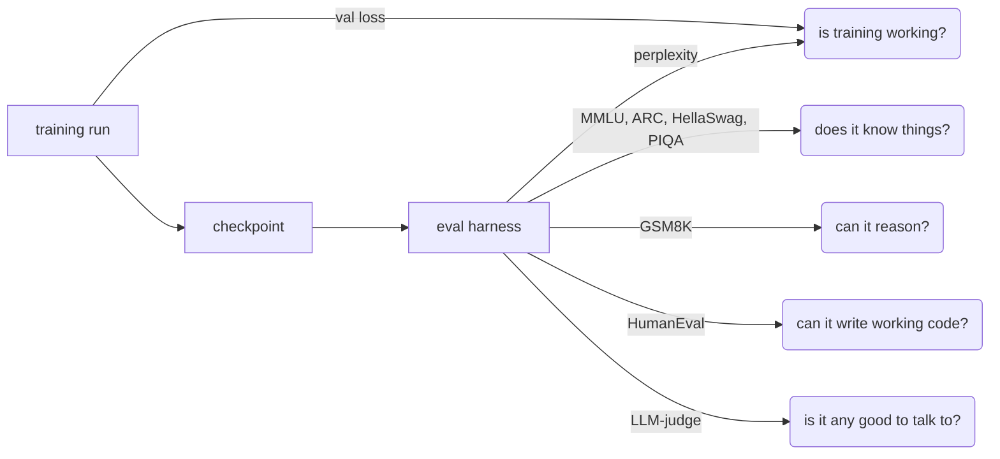
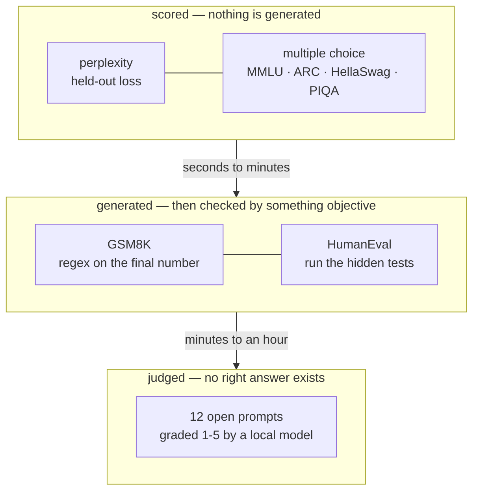
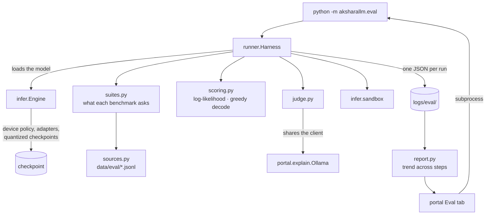
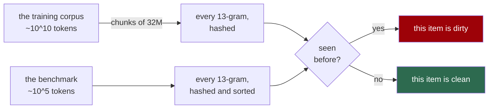
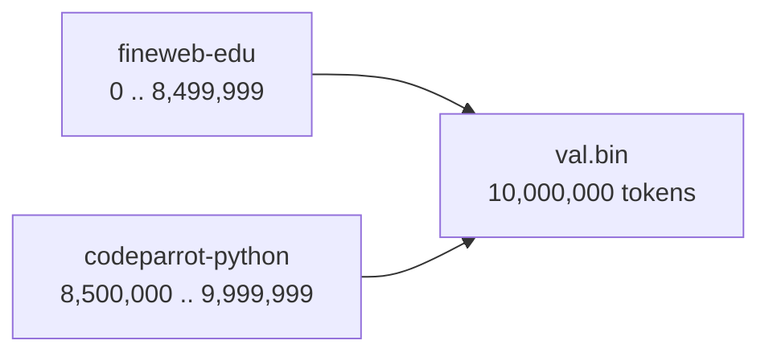
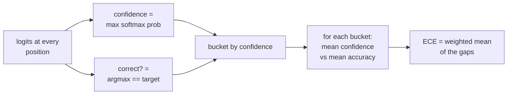

# 12. Evaluation: is the model actually any good?

Up to this point every number in this project has been a **loss**. Loss is the right thing
to watch while training — it is smooth, it is cheap, and it moves every hundred steps. It
is also the wrong thing to trust, for a reason that is easy to say and easy to forget:

> Cross-entropy measures how well the model predicts the *next token of a corpus*.
> Nothing you want the model to do is that.

The gap does not matter much while a model is getting better at everything at once. It
matters enormously the moment you start making trade-offs — and the next three things this
project builds are all trade-offs:

| what we are about to build | how loss misleads |
|---|---|
| **Mixture of experts** | more total parameters at the same active cost. Loss barely moves; capacity is the claim, and capacity shows up on knowledge benchmarks. |
| **Synthetic data** | training on generated text improves loss *and* degrades the model. This is the classic failure, and val loss reports it as progress. |
| **Distillation** | a smaller model matched to a bigger one's outputs. "Is 100M-distilled better than 300M-int4 at the same file size?" is not a question loss can be asked. |
| **Quantization** | int4 costs +0.17 perplexity. Is that 0.17 worth anything? Perplexity cannot say. MMLU can. |

That is why the harness was built **before** those four, not after. It is the instrument;
they are the experiments.



---

## Five kinds of measurement

They differ in what they can see and in what they cost. Roughly: the cheaper it is, the
less it tells you.



### 1. Perplexity

`exp(mean cross-entropy)` on held-out text. Kept because it is continuous with the
training curve, and because when it disagrees with everything else that is itself
information. **Not comparable across tokenizers** — a tokenizer that splits text into more,
easier pieces gets a better perplexity for free.

### 2. Multiple choice, scored by log-likelihood

This is the one worth understanding, because it is not what most people assume.

You do **not** ask the model "is the answer A, B, C or D?" and read what it says. A 300M
base model cannot follow that instruction; it has never been taught to. Instead you put
each candidate answer after the question, one at a time, and measure how surprised the
model is by it:

```
context:   "Question: What do plants need to make food?\nAnswer:"

           + " sunlight"     ->  sum log P(tokens)  =  -8.4     <- least surprised
           + " darkness"     ->                        -14.1
           + " metal"        ->                        -16.7
           + " silence"      ->                        -15.9
```

Argmax of those four numbers is the model's answer. Nothing is sampled, so the score is
exactly reproducible, and a model far too small to *write* an answer can still show a
signal.

Three accuracies come out of this and they disagree on purpose:

| number | what it is | when to read it |
|---|---|---|
| `acc` | argmax of the raw summed log-probability | biased toward **short** answers — every extra token can only make a sequence less likely |
| `acc_norm` | the same, divided by the answer's length **in characters** | the headline. HellaSwag's wrong endings are adversarially long, so raw `acc` is close to meaningless there |
| `acc_greedy` | how often the right answer is also what the model *would have generated* | much stricter; near zero for a small model even when `acc_norm` is respectable |

The reported `score` is `acc_norm`, which is what published figures quote.

### 3. Generative, checked by a regex — GSM8K

Grade-school maths word problems, five-shot with chain-of-thought examples drawn from the
**train** split (never the test split — showing the model a test question as a worked
example is contamination, and the two splits are one argument apart). Each shot ends with
GSM8K's own `#### 42` marker, so the model is taught the output format at the same time as
the reasoning style, and extraction is unambiguous rather than "the last number anywhere".

Decoding is **greedy**. A benchmark that samples gives a different score every run, and the
entire purpose here is comparing a checkpoint against its own earlier self.

### 4. Executed — HumanEval

164 Python functions with hidden tests. The model writes the body, the code is cut down by
the same `extract_code` the Playground uses, and then it is **actually run** in
`aksharallm/infer/sandbox.py` — a separate isolated interpreter with CPU-time and memory
limits and no access to this project. (That module's docstring is honest that this is a
limit, not a container. Read it before pointing this at a model you did not train.)

The dataset's test block ends with a `check(entry_point)` call that the runner has to add.
Forget it and every assert is *defined* and never *run*, and every model scores 100%.

### 5. Judged by another model

Everything above has an objective answer. That covers a lot and misses the thing you would
actually notice about a model: whether its answers are any good. Twelve fixed open-ended
prompts — explanation, instruction-following, summarisation, reasoning, code, honesty,
writing — are answered by our model and graded 1–5 by a local Ollama model against a
**written rubric** that ships with the prompt.

An LLM-judge is a **consistent** reader, not a correct one. It is biased toward long
answers, toward its own style, toward confident prose — in the same directions every time,
which is exactly what makes a comparison between two of *our* checkpoints meaningful even
though the absolute number is not. Three things hold it steady:

- **temperature 0** and a fixed prompt, so re-grading the same answers gives the same
  grades;
- **a rubric per prompt**, written when the prompt was, so the standard cannot drift;
- **the judge never learns which checkpoint produced the answer**, or sees any other
  answer to compare against.

A judge that fails to answer is recorded as **ungraded**, not as a 1. Scoring it 1 would
punish the model being tested for the judge's mistake.

---

## What a score means at our scale

This is the most important table in the chapter, and the reason every suite carries an
`expect` line that the CLI prints beside its result.

| suite | chance | what a 300M base should do | if it does not |
|---|---|---|---|
| **PIQA** | 50% | the first to move — it needs plausibility, not knowledge | something is wrong |
| **ARC-Easy** | 25% | clearly above chance by the end of Phase 2 | undertrained, or the prompt format broke |
| **HellaSwag** | 25% | a few points over chance, noisily | normal below ~1B |
| **MMLU** | 25% | **sits on 25%** | that *is* the result. Movement above ~27% is the first sign of world knowledge |
| **ARC-Challenge** | 25% | chance | expected until well past 1B |
| **GSM8K** | 0% | **0%** | correct. Multi-step arithmetic needs a model an order of magnitude bigger |
| **HumanEval** | 0% | **0/164** | correct, for a long time |

Two of those deserve saying out loud:

**25% on MMLU is not a failure, it is a coin flip.** Four-way multiple choice pays 25% for
guessing. A reader who does not know that concludes the model is broken; this is the single
commonest way to misread the table, which is why the chance line is drawn on every chart
and printed in every row.

**0% on GSM8K is still worth measuring.** Not for the number — for watching the *failure*
change. "No numbers at all" → "numbers, no method" → "right method, wrong arithmetic" is
real progress that the score never shows. The same argument as the code tasks in
`aksharallm/infer/tasks.py`, where the error type (`SyntaxError` → `NameError` →
`AssertionError`) is the progress meter.

### The error bar is part of the number

At n=500 the binomial standard error is about 2%. A two-point move between checkpoints is
noise. The harness reports `stderr` on every multiple-choice suite, the portal only colours
a score when it clears chance by more than its own error bar, and neither will let a coin
flip be dressed up as a result.

---

## First real measurement

Phase 2 at **step 18,000 of 40,000** (45%), on the CPU because a run owned the card:

| suite | tiny (13.8M, TinyStories) | small-code (299M, blend) | chance |
|---|---|---|---|
| perplexity | 4.337 | – | – |
| ARC-Easy | 20.0% (n=40) | **46.7%** ± 6.4 (n=60) | 25% |
| PIQA | 55.0% (n=40) | **65.0%** ± 6.2 (n=60) | 50% |

Both 300M numbers are clear of chance by more than their error bars, at 45% of the training
budget. The TinyStories model sits at chance on ARC-Easy, which is exactly right — it was
trained on children's stories and has never seen a science question.

The perplexity of 4.337 on `tiny` is worth noting for a different reason: **it matches the
4.36 recorded from the training run itself**. The harness and the training curve agree,
which is the cheapest possible check that the scoring path is not quietly wrong.

---

## How it is put together



Four decisions in there are load-bearing.

**The harness loads models through `infer.Engine`, not itself.** That inherits, for free
and without a second copy: the device policy (the CPU whenever a run is training, with the
reason stated — which matters more here than in the Playground because an evaluation is
*minutes* of sustained work), LoRA adapters, and quantized checkpoints. So "what did int4
cost on MMLU?" and "did the fine-tune help?" are both one flag.

**Data is downloaded once into `data/eval/`, never streamed.** Streaming breaks
reproducibility twice over: the Hub's copy can change, and "the first 500 rows of a stream"
is not reliably the same 500 rows twice. Each fetch writes a `.meta.json` recording repo,
config, split, row count and date — the answer to "which MMLU is this?", worth being able
to give three model generations later. Only the columns a scorer reads are kept.

**Results are a folder of JSON files, not a database.** Same decision as the quantization
panel and the Playground's history: a result is a few hundred kilobytes, `grep` works on
it, a job started in a terminal shows up in the browser, and there is no schema to migrate
the day a suite is added.

**The portal shells out to the CLI.** The Eval tab never evaluates anything itself — it
runs the command you would have typed. So the browser and the terminal cannot disagree
about what was measured or where it ran.

---

## Two things in the scoring that are easy to get wrong

**The continuation is tokenized separately from the context.** `encode(ctx + cont)` is not
`encode(ctx) + encode(cont)`, because BPE merges across the join. Counting continuation
tokens backwards off the joined string is off by one wherever a merge crosses the boundary
— which is most of the time. Every choice in a question is affected equally, so it is
*invisible in the accuracy* and wrong in the numbers.

**Sequences are right-padded, with no attention mask.** Under a causal mask a position can
only attend to positions before it, so padding after the real tokens cannot influence any
real position. Left-padding would need a mask, and getting that subtly wrong gives you a
harness that scores every model a little too low and never says so. There is a test that
scores a mixed-length batch against the same pairs one at a time.

Batches are sized by a **token budget**, not a row count: the logits tensor is
`(batch, tokens, 32768)` and that is where all the memory goes. 2,048 tokens per forward is
~270 MB in float32 whether that is 32 short MMLU prompts or 2 long HellaSwag ones. Lower
`--batch-tokens` if scoring runs out of memory.

`Transformer.forward` gained one keyword for this: **`full_logits=True`** returns every
position's logits with no loss. Passing `targets` just to get the full tensor would make
the model compute a mean cross-entropy the harness throws away, at the cost of a second
float32 copy of a quarter-gigabyte tensor — on a device that is usually the CPU. There is a
test that `full_logits` returns exactly what the training path returns, because if those
ever diverge every benchmark number is computed on different logits from the ones the model
trains with, and nothing would say so.

---

## Running it

```bash
# what can be measured, and what to expect at this scale — start here
python -m aksharallm.eval suites

# download the benchmarks. Once, ~19 MB, then it works offline forever
python -m aksharallm.eval fetch --all
python -m aksharallm.eval fetch --list

# the default set on a run's best checkpoint
python -m aksharallm.eval small-code

# everything, whole splits, no caps — hours on the CPU
python -m aksharallm.eval small-code --suite all --limit 0

# one suite, more items, a name that goes in the filename
python -m aksharallm.eval small-code --suite mmlu --limit 2000 --label mid-phase2

# a LoRA adapter against its own base — "did the fine-tune actually help?"
python -m aksharallm.eval small-code --adapter small-code/sft_best.lora.pt --suite default

# what int4 cost on a benchmark rather than on perplexity
python -m aksharallm.eval small-code/ckpt_best-gptq-nf4-g64.pt --suite mmlu,arc-easy

# open-ended, graded by a local model
python -m aksharallm.eval small-code --suite judge --judge-model gemma4:31b

# every evaluation so far, and one suite across every step
python -m aksharallm.eval report
python -m aksharallm.eval report --suite arc-easy
```

Or the portal's **Eval** tab (`scripts/portal.sh`, then `#evals`), which is a view over
exactly those commands: pick a checkpoint, tick suites, press Evaluate. It leads with the
trend chart rather than the Run button, for the same reason the Finetune tab leads with the
memory budget — one benchmark score in isolation is close to meaningless.

### A job typed in a terminal shows up in the browser

Both directions, and *while it is running* — not only once it has finished.

That distinction was a real gap. Results always appeared in both places, because both write
into `logs/eval/`, but only the portal's own launcher wrote `eval.pid` and `current.json`.
So a `python -m aksharallm.eval` in a terminal left the tab reporting "nothing running",
with a Start button beside it, no progress bar, and no log — which reads as "the portal has
not noticed my work" and is exactly the disagreement between browser and terminal this
project is built to avoid.

`eval/jobs.py` is `pretrain.claim_pid_file` for evaluation, and for the same reason: **the
claim belongs to the directory, not to a command line**, so whoever started the job the
readers get one answer. A terminal job now publishes its pid, what it is working on, and a
`source: "terminal"` marker, and it tees its own stdout to `logs/eval/<job>.log` so the
tab's progress bar and log tail work — a portal job gets that for free from `Popen`.

Three things it is careful about, each of which would otherwise make the tab lie:

- **It never takes a live job's slot.** A second evaluation runs unannounced and says so,
  rather than overwriting the first's state and making the portal show progress for one job
  under the description of another.
- **It records its own ending.** For an abandoned job the portal infers done-vs-failed by
  looking for the artifact, which only works when the job name matches the artifact name —
  and a terminal job does not control that. It writes `done` or `failed` itself, so the
  guess is never needed.
- **A stale pid does not wedge it.** A `kill -9` leaves the file behind, so readers check
  liveness. The recycled-pid guard is the recorded command line rather than a substring
  match on the module name, which also means a job started by a wrapper or a notebook is
  still visible.

## Configuration

The judge reads `judge:` in `configs/portal.yaml`, which is the Code tab's `explain:`
config with a different section name and different defaults. They share one client and one
set of error messages, and must not share a model: the explainer wants something small
enough to run beside a training run, the judge wants the best model on the machine and does
not mind waiting.

```yaml
judge:
  model: qwen3.5:27b     # the biggest thing you have; quality matters more than speed here
  temperature: 0.0       # a judge that samples is not a judge
  think: false           # same trap as the explainer — see docs/07
  num_predict: 400
  timeout_s: 600
```

`AKSHARALLM_JUDGE_MODEL` and `AKSHARALLM_JUDGE_NUM_GPU` override it for one session;
`AKSHARALLM_OLLAMA_HOST` is shared with the explainer.

## Gotchas worth keeping

1. **Never change a prompt format without renaming the suite.** A base model's MMLU score
   moves several points on whether the options are `A.` or `(A)`. The formats here are the
   ones the standard harnesses use; changing one makes every number measured before the
   change a different benchmark, silently.
2. **The few-shot examples must not come from the split being scored.** GSM8K's shots come
   from `train`, MMLU's from `dev`. Both are one argument away from the test split.
3. **HellaSwag's test split ships unlabelled.** Scoring it would count every item wrong and
   report a plausible-looking low number. The builder skips unlabelled rows; validation is
   what everyone scores.
4. **`ybisk/piqa` stopped loading on `datasets` >= 5** — it is a dataset *script*, and
   those were removed. Every source can list fallback repositories for exactly this reason.
5. **A stopped evaluation writes nothing, deliberately.** Half a benchmark looks like a
   whole one in a table. To spend less time, lower `--limit`; do not stop early.
6. **`logs/eval/current.json` is job state, not a result.** It sits beside the results
   because the portal writes it there; the reader excludes it by name. Without that the
   running job appears in the table as an empty evaluation.

7. **That folder holds two different shapes, and telling them apart by *name* does not
   work.** The audits live there too — contamination, calibration, dedup — deliberately, so
   the Eval tab reads one directory. But a **contamination report uses the key `suites` for
   a list** of per-suite overlap records, where a result uses it for a `{name: score}` dict.
   `Results.rows()` called `.items()` on the list, which raised inside `/api/eval`, which
   made the API answer `{"ok": false}`, which made the browser build an empty suite list —
   so the whole tab arrived with **nothing selectable and Evaluate disabled**, three layers
   from the cause. Calibration and dedup carry no `suites` key at all, never crashed, and
   quietly became rows with no score and no step. `report.is_result()` now decides by
   **shape**: `suites` must be a dict. The lesson generalises past this file — a folder that
   several producers write into needs a structural check, because a name-based one only ever
   excludes the filenames whoever wrote it had already thought of.

8. **`--label` names the comparison, not the model.** The step, the checkpoint and the run
   are already recorded beside it, so repeating them in the label wastes the one free-text
   field. Use it for what you will later want to line rows up by — the stage (`base`, `sft`,
   `dpo`), the variant under test (`nf4-g64`, `yarn4x`, `pre-dedup`), or the point in a long
   run (`mid-phase2`). Two rows that belong in the same comparison should differ in exactly
   one thing, and the label is how you find them again in a table of thirty.

## Is the benchmark trustworthy? (contamination, and the number hiding two)

Every score above assumes two things nobody had checked. This section checks them.

### 1. Did the test leak into the training data?

If a question and its answer already sit somewhere in the ten billion tokens the model was
trained on, a right answer means nothing — the model may simply be remembering. In the
chapter's own words from earlier: **a benchmark number nobody has checked for leakage is a
rumour.**

The published method is **n-gram overlap**. An item is *dirty* if any run of 13 consecutive
tokens from it also appears anywhere in the training corpus. Thirteen is the standard choice
and it is a Goldilocks number: at 8, ordinary English shares n-grams by accident and
everything looks contaminated; at 25, a reformatted whitespace run or a one-word paraphrase
breaks the streak and nothing does.



The asymmetry is what makes it tractable: build the tiny side into a sorted array, then
stream the huge side past it once. Both sides are hashed with the same rolling polynomial
computed over whole chunks in numpy — a Python loop over ten billion positions is not a
program that finishes — and membership is a vectorised binary search.

**The one distinction the report exists to draw** is between the question and the answer:

| part | what it means | how worried to be |
|---|---|---|
| `question` | the question text appears in training | usually **not at all**. Benchmark questions are public text; a web crawl is expected to contain them |
| `answered` | the question **with its correct answer attached** appears | **this is the one.** It is what a contaminated corpus memorises, and what makes a score meaningless |

Getting that distinction right took a second attempt, and the mistake is instructive.
"Question plus answer" contains every n-gram of the question, so the first version lit up
`answered` for any corpus that merely held the public question — the two columns were the
same column, and the more alarming one was the useless one. The fix is to keep only the
n-grams that **reach into the answer**: the last 12 tokens of the question and everything
after it. A test plants a question-only corpus and requires `answered` to stay at zero.

### What our own blend actually contains

A full pass over all 10B tokens, all five multiple-choice suites, every hit verified against
the real token stream (**1457/1457 confirmed** — no collisions, as the arithmetic above
predicts):

| suite | items | question leaked | with its answer |
|---|---|---|---|
| MMLU | 14,042 | **1,095 (7.8%)** | **0 (0.0%)** |
| HellaSwag | 10,042 | 151 (1.5%) | **128 (1.3%)** |
| ARC-Easy | 2,371 | 42 (1.9%) | 2 (0.1%) |
| ARC-Challenge | 1,167 | 13 (1.2%) | 4 (0.3%) |
| PIQA | 1,777 | 0 (0.0%) | 22 (1.2%) |
| **total** | | **1,301** | **156** |

**Read the MMLU row, because it is the entire argument for splitting the columns.** Nearly
eight percent of MMLU's questions are somewhere in our training data — and *not one of them*
appears with its answer. A checker that collapsed the two would have reported MMLU as 7.8%
contaminated, which is alarming, prominent, and means nothing: those questions are public
text and a web crawl containing them tells you nothing about whether the model can answer
them. Across all five suites the difference is **1,301 versus 156** — collapsing them
over-reports by more than eight times.

HellaSwag is the one genuinely worth watching at **1.3%**, and the reason is structural: its
"answers" are real sentence continuations taken from web text, so unlike a multiple-choice
answer key they plausibly occur in a crawl on their own. PIQA inverts the pattern — 0% on
questions and 1.2% on answers — because most PIQA goals are shorter than thirteen tokens and
are therefore **unchecked, not clean** (784 of them). That is exactly the distinction the
`too_short` column exists to keep visible.

And the number that decides whether any of this matters:

```
re-scoring 20260731-173740-small-code-mc.json without the 156 answer-leaked items:
        arc-easy  reported 0.467  clean 0.467  (+0.000, 0 dropped, 60 kept)
            piqa  reported 0.650  clean 0.650  (+0.000, 0 dropped, 60 kept)
```

**The Phase-2 scores stand.** Not one of the sampled items was contaminated, so ARC-Easy
46.7% and PIQA 65.0% mean what they said they meant. That is the outcome you want and it is
worth exactly as much as the check that produced it.

**The output that matters is not the percentage, it is the clean score.** Re-read a
benchmark result, drop the contaminated items, and see whether the number moves:

```bash
python -m aksharallm.eval contaminate --suite mc --verify     --against logs/eval/20260806-small-code-eval.json
```

A suite that is 8% dirty and scores the same either way is fine. One that is 3% dirty and
gains four points on exactly those three percent is telling you something. This needs the
run's per-item verdicts, so it does not work on a result recorded with `--no-items` — and
it says so rather than inventing a number.

Three things the implementation is careful about, all of which would otherwise make the
report **quietly optimistic**, which is the wrong direction for a contamination check to be
wrong in:

- **Chunks overlap by n-1 tokens.** An n-gram straddling a chunk boundary is still an n-gram
  in the corpus; forget the overlap and you silently lose one window per chunk.
- **Items shorter than 13 tokens are counted as *unchecked*, not as clean.** A suite of
  one-line questions must not report 0% dirty when the truth is 0% checked.
- **Hash collisions are acknowledged and can be removed.** Two different 13-grams can share
  a 64-bit hash; with ~10⁶ probe hashes and ~10¹⁰ lookups that is about one spurious hit per
  two thousand full scans. Small enough to ignore in a summary, too large to leave unstated
  in a finding somebody will quote — so `--verify` re-reads the actual tokens behind every
  hit and drops the ones that do not hold up.
- **A partial scan says so.** Every report carries a `coverage` block, and both ways of
  going faster set `partial: true`. See below.

#### Going faster, and why only one of the two knobs is in the portal

There are two ways to make the check finish sooner, and they are not interchangeable.

| flag | shrinks | what it costs you |
|---|---|---|
| `--max-tokens N` | the **scan** — less corpus read | leaks in the unread part are invisible, but every benchmark item is still checked, so it degrades *evenly* |
| `--limit N` | the **probe** — fewer benchmark items | most of the benchmark is never checked at all, and the loader takes the **first** N rows rather than a sample, so what is left out is not a random remainder |

The asymmetry is because of where the cost is. The scan is `O(training tokens)` — ten
billion of them, about half an hour — while the probe is a sorted hash array searched with
`np.searchsorted`. Measured on this project's `mc` suites: the full probe is **58,940 texts
and 2.14M distinct 13-grams, built in 19 seconds**, against `--limit 50`'s 500 texts and
7,980 n-grams in 0.1s. So `--limit` saves about nineteen seconds off a thirty-minute run
and stops checking 99% of the benchmark.

That is why the portal's panel offers **scan depth and not item count**: whole corpus (the
default and the real answer), first 500M tokens, first 2B. `--limit` remains on the CLI,
where you are more likely to be deliberately probing one suite.

**Either way the report records what it looked at**, because until it did, a partial scan
was byte-indistinguishable from a complete one — same fields, same shape, a smaller dirty
count that reads as good news:

```json
"coverage": { "scanned_tokens": 80000000, "total_tokens": 10000000000,
              "items_per_suite": 40, "texts": 80, "verified": true, "partial": true }
```

The Eval tab keys on `partial` and puts **"Partial scan — these are lower bounds"** directly
above the table, not in a log that has scrolled away. "No contamination found" read off 0.8%
of the corpus is not a finding.

### 2. One validation number is hiding two

`configs/small-code.yaml` trains on **85% prose and 15% Python** and reports a single val
loss. That average is 85% prose by construction, so the model's Python ability is nearly
invisible in it, and either half can move without the total saying so.

Split it and the two halves are not remotely alike:

| source | tokens | weight | loss | perplexity |
|---|---|---|---|---|
| fineweb-edu (prose) | 8,500,000 | 0.85 | **2.7696** | 15.95 |
| codeparrot-python | 1,500,000 | 0.15 | **1.2558** | **3.51** |
| *weight-blended* | | | *2.5425* | |

**Python is more than twice as predictable as prose** — perplexity 3.5 against 16.0. That is
not the model being good at code so much as code being repetitive, but either way it is a
fact the single number 2.54 completely conceals, and it is the number to watch when the
Python specialist of Phase 4 starts training.

The blended figure is also the check. The run's own best val loss at this step was **2.5552**
and blending the parts gives **2.5425** — agreement to 0.013, which is what says the split
was taken in the right place.

**Where the boundaries come from, and why they are verified.** `prepare_blend` writes
`val.bin` by concatenating one part per source, each capped at `val_tokens × weight`:



Nothing recorded those offsets, so for the existing blend they are **derived** from the
weights — and a derived number nobody checks is how a report becomes confidently wrong. So
each span's content is read back and asked whether it matches the source it claims to be: a
span called `codeparrot-python` had better look like code, and one called `fineweb-edu` had
better not. A span that fails prints **MISMATCH** and the split is declared meaningless
rather than used, because a prose/Python split with the split in the wrong place produces
two plausible numbers that are both averages of the same mixture. A source name the check
has no opinion about prints *unverified*, never *ok*.

Going forward there is nothing to derive: `prepare_blend` now writes `val.manifest.json`
beside the bin, and the manifest always wins.

```bash
python -m aksharallm.eval domains small-code --device cpu
python -m aksharallm.eval contaminate --suite mc --verify
```

Both are also buttons in the portal's **Eval** tab, under "Is the benchmark trustworthy?",
and they share that tab's one-job-at-a-time lock — a contamination scan streams ten billion
tokens and a per-domain split runs the model, and neither wants to be doing that while an
evaluation is trying to produce a number.

### 3. Is the model's confidence honest?

Everything above asks whether the model is **right**. This asks something different, and for
anything that has to be *trusted* rather than benchmarked it is the more useful question:
when it says it is 80% sure, is it right 80% of the time?



A model can be accurate and badly calibrated — right often, and wildly overconfident about
the cases it gets wrong — or inaccurate and well calibrated, which is far more useful in a
system that can defer, retry or ask a human. Accuracy cannot tell those apart.

```bash
python -m aksharallm.eval calibrate small-code --device cpu
```

**Measured on our own models.** Both are well calibrated, which was not a foregone
conclusion — nothing in the training objective asks for it:

| model | positions | accuracy | confidence | gap | ECE (10 bins) | fitted T |
|---|---|---|---|---|---|---|
| 13.8M TinyStories | 6,000 | 0.6327 | 0.6354 | +0.0027 | **0.0135** | 0.986 |
| 300M blend, step 37.8k | 9,996 | 0.4548 | 0.4607 | +0.0060 | **0.0104** | 1.004 |

Both are barely overconfident, and the worst single bucket on the 300M is out by 0.026 —
which for a model nobody asked to be calibrated is a better result than it had any right to
be. On the 300M, temperature scaling still helps a little (0.0104 → 0.0087); on the 13.8M it
does not, for the reason in the note below.

**Four ways this measurement lies, all handled:**

1. **The bin count changes the answer**, and there is no canonical choice. So it is reported
   at 10, 15 and 30 bins, and every number carries the count that produced it. An ECE quoted
   without its bin count is not reproducible.
2. **Equal-width bins are nearly empty at the top.** Over a 32k vocabulary most predictions
   sit below 0.5 confidence, so the high-confidence buckets — the ones that matter for
   trusting an answer — can hold a handful of samples whose accuracy is noise. Equal-mass
   (quantile) bins are reported beside them.
3. **A degenerate model scores beautifully.** Something that always predicts the base rate
   with the base rate's confidence has an ECE near zero and is useless. ECE is a *companion*
   to accuracy, never a substitute, and `tests/test_calibration.py` asserts exactly this so
   that it cannot be quietly forgotten.
4. **The temperature must be fitted on data it is not scored on.** `report()` splits its
   positions in half; fitting and scoring on the same tokens measures a model that has seen
   the answers.

**Temperature scaling** is the standard fix: divide the logits by one scalar before the
softmax. It **cannot change accuracy at all** — dividing by a positive constant does not move
the argmax — so it is free of the usual trade-off.

> **And on an already-calibrated model it can make ECE slightly worse.** Measured here: the
> 13.8M starts at ECE 0.0135, the fit returns T = 0.986, and ECE moves to 0.0149. That is not
> a bug in either number. The fit minimises *negative log likelihood*, not ECE, and when the
> gap being corrected is smaller than the noise in the estimate, fitting to one objective
> chases the noise in the other. If ECE is what you care about, fit ECE.

**A cross-check that caught a real mistake while writing this.** The command also reports
perplexity on the same positions, precisely so it can be compared with the run's own val
loss. The first 300M attempt used 8 windows and reported perplexity **15.994** — almost
exactly the *prose-only* number from the per-domain split (15.95) rather than the blended one
(≈12.7). `val.bin` is 85% prose followed by 15% Python, and eight 1,024-token windows drawn
uniformly from it have a **27% chance of containing no Python at all**. Its ECE came out at
0.0190; with 48 windows the same model scores **0.0104**.

The number was not wrong. It was measuring something narrower than it claimed, and only the
cross-check said so — which is the argument for reporting a familiar quantity beside every
unfamiliar one, even when nothing depends on it.

### All four in the portal

The Eval tab's **"Is the benchmark trustworthy?"** panel now holds four cards, and they share
the tab's one-job-at-a-time lock on purpose — a contamination scan streams ten billion tokens
and a calibration pass keeps full logit vectors; neither wants to be doing that while an
evaluation is trying to produce a number.

| card | asks |
|---|---|
| contamination | did the test leak into the training data? |
| per-domain loss | is one validation number hiding two? |
| **calibration** | when it says 80%, is it right 80% of the time? |
| **duplicates** | how much of the corpus is the same thing twice? |

Every one of them renders **from the JSON the CLI wrote**, never recomputed in the browser —
the terminal and the portal have to be reading the same measurement or one of them is lying.
Each carries its own caveat in the panel rather than in a tooltip: the ECE table prints one
row per bin count because the count changes the answer, and the duplicates card prints the
whole LSH detection curve because its misses are otherwise invisible.

One rendering detail that is not a detail: **a clean corpus is a result, not an empty state.**
Scanning TinyStories finds *no* near-duplicates in 20,000 documents, and the card says so in
those words. The first version read `largest_clusters[0]` on an empty list and printed the
word `undefined` — exactly where a reader most needs to trust the number.

## The code, in reading order

| # | file | what to look for |
|---|---|---|
| 1 | [`eval/suites.py`](../aksharallm/eval/suites.py) | **start here.** `Suite` and the `SUITES` table — every benchmark's chance line, its `expect` sentence and its builder. Then `build_mmlu` / `build_hellaswag` / `build_gsm8k` / `build_humaneval` to see exactly what the model is shown |
| 2 | [`eval/sources.py`](../aksharallm/eval/sources.py) | `Source` and `fetch` — downloaded once into `data/eval/`, with a `.meta.json` recording which copy of the dataset this is. Note the fallback repositories |
| 3 | [`eval/scoring.py`](../aksharallm/eval/scoring.py) | `_encode_pair` (the continuation tokenized *with* the context — the subtle one), `loglikelihood`, `score_mc` (`acc` vs `acc_norm` vs `acc_greedy`), `generate_until`, `perplexity`. `_batches` is the token-budget batcher |
| 4 | [`eval/runner.py`](../aksharallm/eval/runner.py) | `Harness` — one suite at a time, loading the model through `infer.Engine` rather than itself, which is where the device policy, adapters and quantized checkpoints come from free |
| 5 | [`eval/judge.py`](../aksharallm/eval/judge.py) | `build_messages` / `parse_grade` / `run` — temperature 0, a rubric per prompt, and `Grade` with ungraded distinct from 1 |
| 6 | [`eval/report.py`](../aksharallm/eval/report.py) | `Results` → `summary_table` / `compare_table` — a folder of JSON, no database, and the trend across steps |
| 7 | [`eval/__main__.py`](../aksharallm/eval/__main__.py) | `cmd_suites` / `cmd_fetch` / `cmd_run` / `cmd_report` — thin, by design |
| 8 | [`aksharallm/infer/sandbox.py`](../aksharallm/infer/sandbox.py) | HumanEval's scorer is the same sandbox the Playground and GRPO use. Note who adds the `check(entry_point)` call |
| 9 | [`eval/contamination.py`](../aksharallm/eval/contamination.py) | `ngram_hashes` (the Horner trick that makes ten billion tokens tractable), `build_probe` (and the trim that makes `answered` mean something), `scan_bin`'s chunk overlap, `clean_score` |
| 10 | [`eval/domains.py`](../aksharallm/eval/domains.py) | `derive_spans` then `verify_spans` — the derivation and the check on it. `blended()` is the end-to-end test: it has to agree with the run's own val loss |
| 11 | [`eval/calibration.py`](../aksharallm/eval/calibration.py) | the docstring's four ways ECE lies, then `collect` — where the memory goes, and why positions are subsampled. `fit_temperature` last, and read why NLL-optimal is not ECE-optimal |
| 12 | [`eval/jobs.py`](../aksharallm/eval/jobs.py) | `announced` — how a job typed in a terminal becomes visible in the browser. Read the refusal first (it must never take a live job's slot), then `_Tee`, which is what makes the progress bar work for a job the portal did not launch |
| 13 | [`aksharallm/portal/evals.py`](../aksharallm/portal/evals.py) | `EvalJobs` — the tab runs the CLI in a subprocess and reads the same result files; `start_audit` adds the two checks above to the same job lock. `_pid` is the other half of `jobs.py`: liveness, then the recorded command line rather than a substring match |

What pins it: `tests/test_contamination.py` leads with a **positive control** — a known item
planted in a fake corpus that the scanner must find — because a checker that reports 0%
because it is broken looks exactly like a clean corpus, and it is the more comfortable of the
two answers. `tests/test_calibration.py` is built the same way: models constructed to be miscalibrated by a *known* amount, so the metric has to report that amount — plus `test_a_degenerate_model_scores_perfectly`, which exists so the caveat can never be quietly dropped. Then `tests/test_eval.py` — the mixed-length batch scored against the same pairs
one at a time (right-padding under a causal mask), `full_logits` returning exactly what the
training path returns, and the BPE-boundary test written *for*
[lesson 11](lessons/11-eval.md) after the original one turned out to be unable to fail.

## Where this sits

```
prepare-data -> pretrain -> SFT -> DPO/GRPO -> quantize -> serve
                    |         |        |          |
                    +---------+--------+----------+---> EVALUATE, at every stage
```

Evaluation is not a phase. It is the thing you do after each of the others, which is why
the harness takes any checkpoint, any adapter, quantized or not, and keeps every result
forever in the same folder.

Next in the build order are the synthetic-data pipeline and mixture of experts. Both are
changes to model *quality* rather than to model *cost*, and neither could have been judged
before this chapter existed — which is why they were deliberately scheduled after it.
