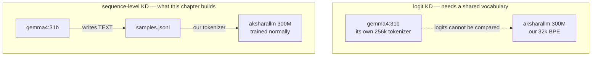
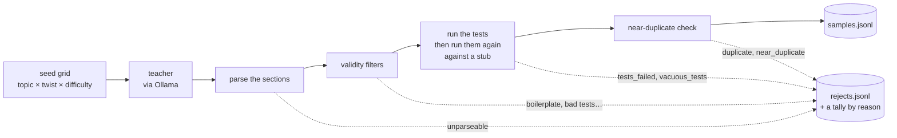
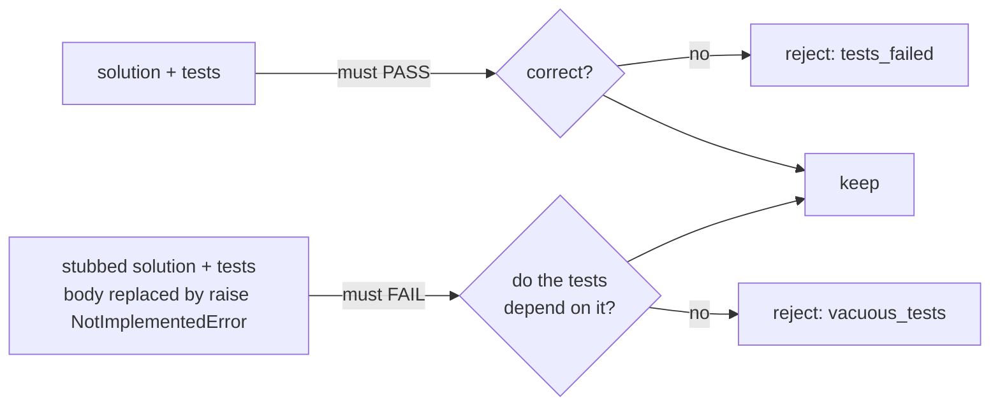

# 13. Synthetic data: making the training set instead of downloading it

Every dataset in this project so far was written by people and downloaded: FineWeb-Edu for
prose, Python from The Stack for code, SmolTalk for chat. That is the right default, and it
runs out in two places.

* **Nobody published the dataset you need.** "Python exercises that come with tests, at the
  level a 300M model can learn from" is not a file on the Hub.
* **The model has never seen an instruction.** Phase 2 produces a base model that continues
  text. Something has to show it what a question and an answer look like before it can be
  asked anything, and the cheapest something is a bigger model that already knows.

So this chapter is about getting a **teacher** — a model already running on this machine
through Ollama — to write the data, and then about the much longer half of the job: proving
the data is worth training on.

---

## The name is wrong, and the reason matters

The usual name for this is *distillation*: a 31B teacher, a 300M student. But classic
distillation matches the teacher's **logit distribution** —

```
L = KL( student(x) || teacher(x) )
```

— and a KL between two distributions requires both to be over **the same vocabulary**. Our
tokenizer is a 32k byte-level BPE trained on our blend (docs/02). gemma4:31b has its own,
qwen3.5:27b another, starcoder2:3b another. Token 5,142 means a different piece of text in
each. Aligning probability mass across two tokenizations is a research problem, not a
weekend's build.



**Sequence-level distillation** is what is left: the teacher writes text, we tokenize it
our way and train on it with the loops we already have. Which is exactly what a synthetic
data pipeline is — the two things are one thing here. True logit KD is honest only between
two of *our own* models, and that is `train/distil.py`'s job, not this chapter's.

---

## The failure this whole package is built around

> **Synthetic data is the easiest way to make a model worse while its training loss
> improves.**

Duplicate-heavy, low-diversity or subtly wrong data trains *beautifully*. The loss curve is
smooth, the validation loss falls, and the model that comes out is fluent and useless.
Nothing in the training run can see it happen, which is precisely why the eval harness
(docs/12) was built before this and why the `judge` suite is the one to run afterwards.

Everything in `aksharallm/synth/` follows from taking that sentence seriously:



Four ideas do the work, and each one exists because the obvious version fails.

---

## 1. Diversity comes from the prompt grid, not from the temperature

The obvious way to make 5,000 samples is to send one prompt 5,000 times at a high
temperature. It does not work, and the failure is quiet: a model asked "write a Python
exercise" writes FizzBuzz, palindromes and string reversal, over and over. Raising the
temperature changes the variable names and the docstring, not the *task*. You get a large
dataset whose effective size is a few dozen distinct problems.

So a prompt is assembled from a grid, and the grid is walked in a shuffled order rather
than sampled independently:

| recipe | axes | cells |
|---|---|---|
| `python` | 20 topics × 12 twists × 2 difficulties | **480** |
| `chat` / `preference` | 18 subjects × 12 request forms × 6 constraints | **1,296** |

200 samples use 200 different cells. That is a coverage guarantee; a temperature is not. The
twists are the interesting axis — "it must handle the empty input", "it must raise
ValueError on invalid input, and the tests must check that" — because they force edge cases
into the tests, which is where a generated dataset is otherwise thinnest.

Past the grid the walk wraps to a new shuffle rather than stopping. The same cell asked
twice at temperature 0.9 does give two different problems; it is only the *sole* source of
variety that fails.

---

## 2. The tests are executed. Then they are executed again.

This is the reason the Python recipe was built first: **correctness is checked, not
assumed.** The teacher writes a problem, a solution and a set of asserts; the sandbox from
docs/06 — subprocess, `-I` isolated, `RLIMIT_CPU`, throwaway working directory — runs them.
If they fail, the sample is dropped.

That is worth a lot and it is weaker than it sounds. Ask a model for a function and some
tests and it will sometimes write

```python
assert callable(dedupe)
assert dedupe.__name__ == "dedupe"
```

which passes, mentions the function by name (all a static check can confirm), and would pass
against a function with no body at all. The exit code is 0 either way.

So every sample is run **twice**:



The stub is built through the AST, not with a regex — a regex that finds the end of a
function has to understand indentation, decorators, nested defs and strings containing
`def`, and getting it wrong produces a "stub" that is still the original function, which
passes step 2 and silently disables the entire check.

**Where the check stops**, stated plainly, because a check believed to be stronger than it is
does more harm than none:

* it catches tests that never call the function, or that swallow its exception in a
  `try/except`;
* it does **not** catch a weak-but-real assertion — `assert isinstance(dedupe(xs), list)`
  fails against the stub, so the sample is kept, even though it would hold for a function
  that always returns `[]`. The two-assert floor is the only guard there;
* it does **not** catch tests that are wrong in the same direction as the solution — a model
  that believes `is_prime(1)` is True and writes both to match. Nothing that treats the
  teacher as the oracle can. That is what the eval harness is for.

---

## 3. Near-duplicates, not just duplicates

An exact-duplicate check is trivially satisfied: two samples differing by a variable name
are not equal. Meanwhile the dataset quietly becomes fifty paraphrases of four problems.

The check is on **content shingles** — overlapping runs of five words, compared by Jaccard
similarity:

```
J(A, B) = |A ∩ B| / |A ∪ B|
```

Five is a trade. At k=3 two different list problems share "return a new list" and look
similar; at k=8 a paraphrase that changes a word every seven shares nothing and looks new.
The default threshold is 0.6, which is aggressive on purpose: the cost of dropping a real
sample is one more call to the teacher, and the cost of keeping a paraphrase is a permanent
bias in the data.

Compared against every kept sample, which is quadratic done naively and would be the slowest
thing in the pipeline at 10,000 samples. An inverted index from shingle → sample makes it
linear in practice: only samples sharing at least one five-word run are candidates, and two
unrelated problems share none.

The comparison is on the **problem statement**, not the code — two teachers asked for "count
word frequency" write the same exercise with different identifiers, and the identifiers are
exactly what a code-level comparison would latch onto.

---

## 4. The tally by reason *is* the quality signal

A pass rate on its own tells you nothing about what to change. These three runs all report
30%:

| the rest was lost to | what it means | what to change |
|---|---|---|
| `tests_failed` | the teacher wrote wrong exercises | the prompt, or a better teacher |
| `near_duplicate` | the teacher keeps writing the same exercise | a wider grid, or a different `--seed` |
| `unparseable` | the teacher ignored the output format | the template — retrying will not help |

So every drop is counted by reason, the rejected text is kept (capped) beside the counts, and
the portal's funnel draws them as proportional bars with the biggest one explained. Reading
three rejects is usually enough to know which of the three runs above you are in.

**This is not theoretical.** The first real batch on this machine — qwen2.5:14b, 8 asks —
kept 25%, and every single loss was `tests_failed`. Reading them took a minute: the
solutions were mostly *right* and the expected values in the tests were wrong. A
`sorted(key=len)` example that looks plausible and simply is not what the function returns.
One rule added to the template —

> EVERY expected value must be one you have worked out by executing your own code line by
> line on that input. If you are not certain, use a simpler input.

— and the same teacher on the same grid kept **60%**, then held around 58% over a 120-sample
run. That is the loop this package exists to make possible; the template version is bumped
to v2 and recorded in every dataset that used it.

### What the first real batches measured

On this machine (RTX 3090, nothing training, teachers on the card):

| dataset | recipe | teacher | asked → kept | survival | per sample | lost to |
|---|---|---|---|---|---|---|
| `py-v1` | python | qwen2.5:14b | 212 → 120 | **57%** | 6.6 s | `tests_failed` ×92 |
| `chat-v1` | chat | gemma4:31b | 62 → 60 | **97%** | 8.6 s | `duplicate` ×2 |
| `pref-v1` | preference | gemma4:31b | 12 → 12 | **100%** | 17.3 s | — |

**A 97% pass rate is not a better result than 57% — it is a weaker check.** The Python
recipe drops 43% of what a competent 14B model writes, because the tests are *run*. The chat
and preference recipes drop almost nothing, because all they can check is shape: a fluent,
well-formatted, confidently-wrong answer passes every filter they have. That asymmetry is
the honest summary of this whole chapter: the only recipe whose output you can trust without
reading it is the one that executes something. For the other two, the funnel tells you the
data is *well-formed*, and the eval harness's judge is what tells you it is any good.

---

## Provenance, because the question is always asked later

Generated data lives in its own tree and is never mixed silently into an existing set:

```
data/synth/py-v1/
  samples.jsonl   one kept sample per line
  rejects.jsonl   what was thrown away and why (capped; the tally in meta is exact)
  meta.json       teacher(s), host, template version(s), every sampling parameter,
                  the funnel counts, and one record per generation session
```

Six weeks after a fine-tune goes strange, "what was in the data" has to be answerable from a
file rather than from a memory of which model was running that evening. `meta.json` is
written after every sample, not at the end, so a stopped run still describes itself — and
`teachers` and `template_versions` are **lists**, because a dataset appended to over several
evenings can legitimately span two of each, and a single field would quietly report only the
last one.

---

## The three recipes

| recipe | produces | checked by | feeds |
|---|---|---|---|
| `python` | problem + solution + tests | **executing the tests, twice** | SFT |
| `chat` | one instruction, one answer | format, length, boilerplate, dedup | SFT |
| `preference` | one prompt, a good and a deliberately flawed answer | both parse, differ, one named flaw | DPO |

`preference` is the only one that asks for something *bad* on purpose. DPO learns the
difference **within** a pair, so the rejected answer must be plausible and worse in exactly
one named way — `verbose`, `ignores_format`, `hedged`, `overconfident_wrong`, `off_target`,
`robotic`. A rejected answer that is worse in six ways at once teaches "prefer the first
style", which is a formatting habit, not a preference. The flaw's name is kept on every
sample, so the dataset can be audited by flaw type later: *did it learn to stop hedging, or
only to stop rambling?*

### The output format is headers, not JSON

```
### PROBLEM
…
### SOLUTION
```python
…
```
```

Asking a model for JSON containing code is asking it to escape newlines and quotes inside a
Python function by hand, and a 14B model gets that wrong often enough to matter. Worse, the
failures **correlate with long, interesting functions** — the worst possible bias to
introduce. Headers and fences are what a model writes naturally.

### The teacher is per recipe

`starcoder2:3b` writes a plausible Python function in two seconds and cannot hold a
conversation; `gemma4:31b` writes good instruction data and takes half a minute a sample.
Quality-per-hour differs by an order of magnitude *in opposite directions depending on the
recipe*, so a single global `model:` would be wrong for at least one recipe at all times.
`configs/portal.yaml` → `synth.recipes.<name>.model`.

---

## Sharing the machine with a training run

Every other panel in the portal solves GPU contention by quietly falling back to the CPU.
**This one cannot.** The teacher is loaded by Ollama, in another process; the only levers are
which model is asked for and `synth.num_gpu`. A Phase-2 run holds ~21 GB of the 24, so:

| teacher | VRAM | beside a live run |
|---|---|---|
| gemma4:31b | ~19 GB | **no** — the run dies |
| qwen2.5:14b | ~9 GB | no |
| starcoder2:3b | ~1.7 GB | yes, and it is the reason it is offered |
| any, with `num_gpu: 0` | 0 | yes, slowly |

So the CLI and the panel **report** the contention and leave the choice to the person who
can see the whole machine.

---

## Using it

```bash
python -m aksharallm.synth recipes                      # what can be generated, and how it is checked
python -m aksharallm.synth gen python --name py-v1 --n 200
python -m aksharallm.synth gen chat --name chat-v1 --n 500 --teacher gemma4:31b
python -m aksharallm.synth gen python --name py-v1 --n 2000 --stop-in 45m
python -m aksharallm.synth show py-v1 --samples 2 --rejects 3
python -m aksharallm.synth list
python -m aksharallm.synth export py-v1
```

…or the portal's **Synth** tab, which shells out to exactly those commands.

A generation run is a long job, so it obeys the **same STOP contract as the trainers**
(docs/09): an empty file means stop now, a number means stop at that many kept samples, and
`@<epoch>` means stop at a wall-clock time — with *kept samples* standing in for training
steps. Stopping is how these runs are meant to end: every sample already written is filtered,
verified, deduplicated and recorded, so a stopped run leaves a complete smaller dataset and
the next run appends to it, walking new cells of the grid.

### Reaching a trainer

The export writes the shape the existing data pipeline already reads, and nothing new
tokenizes anything:

```bash
python -m aksharallm.synth export py-v1
#   wrote 120 rows to data/synth/py-v1/sft.jsonl

python -m aksharallm.data.prepare_sft jsonl --file data/synth/py-v1/sft.jsonl \
    --tokenizer data/blend/tokenizer.json --out-dir data/sft-synth
```

Measured on `py-v1`: 120 samples → **15 blocks × 1024, 41% trainable tokens** — inside the
30–50% band a real chat corpus produces, which is the cheapest check that the mask and the
packing are behaving. `pref-v1` gave 12 pairs, chosen 58 tokens against rejected 78 — the
`verbose` flaw, visible in a summary statistic.

`prepare_sft` and `prepare_dpo` gained one recipe each — `jsonl` — and that is the entire
integration. Packing, the assistant-only loss mask, the DPO triples: all of it is the code
from docs/05, untouched. The only thing that differs about generated data is where the rows
came from, and that is recorded in `meta.json` rather than in the trainer.

---

## What to do after training on it

Run the harness, and run the **judge** suite specifically:

```bash
python -m aksharallm.eval <ckpt> --suite judge
```

Perplexity and multiple choice cannot see the thing synthetic data damages first —
diversity of expression, instruction-following, not looping. The judge can, and comparing
the judge score before and after is the only honest answer to "did this data help?".

The other measurement worth doing, once Phase 2 is finished, is the one docs/10 left open:
**at a matched file size, is a distilled small dense model better than a 4-bit large one?**
A ~100M student trained on this pipeline's output against `gptq-nf4-g64` of the 300M, both
around 205 MB, on the same harness. Either answer is interesting.

---

## Where the code is

| file | what it holds |
|---|---|
| `synth/teacher.py` | the Ollama client (shared with docs/07's Code tab and docs/12's judge), per-recipe model choice, contention reporting |
| `synth/prompts.py` | the seed grid, and `TEMPLATE_VERSION` |
| `synth/recipes.py` | the three recipes: prompt, parser, dedup key, export |
| `synth/filters.py` | validity checks, the shingle deduper, `REJECT_REASONS` |
| `synth/verify.py` | run the tests, stub the entry point, run them again |
| `synth/dataset.py` | `data/synth/<name>/`, provenance, the exports |
| `synth/run.py` | the loop, its budgets and the STOP file |
| `portal/synth.py` | the Synth tab's job runner — starts the CLI above, never generates itself |
