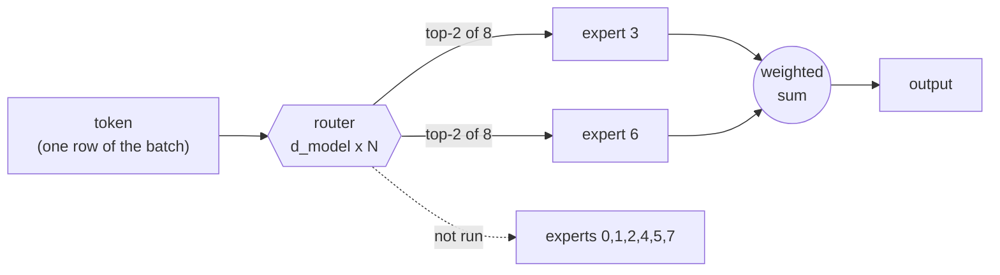
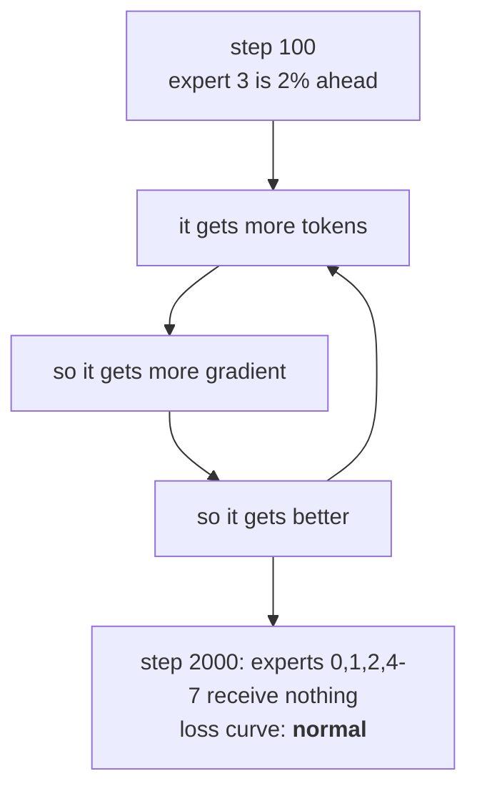
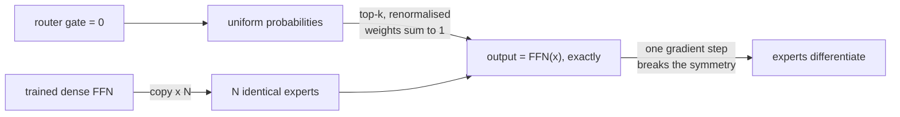
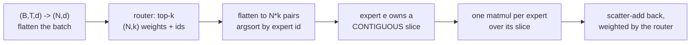

# 14. Mixture of experts: more parameters than you compute with

Every model in this project so far spends the same arithmetic on every token. Doubling its
knowledge means doubling what each token costs. A **mixture of experts** breaks that link:
the feed-forward network in each block becomes N of them plus a small **router**, and each
token is sent to only the top-k. Parameters go up by roughly N/k; compute per token does
not move.

The reason it fits *this* project is where the parameters already are:

|                  | 300M blended base | 13.8M TinyStories |
|------------------|-------------------|-------------------|
| embedding (tied) | 33.6M (11%)       | —                 |
| attention        | 62.9M (21%)       | —                 |
| **FFN**          | **202.9M (68%)**  | **7.1M (51%)**    |

Two thirds of the real model is the thing MoE replaces.



---

## The one thing that actually goes wrong

Nothing in the training objective wants the experts to be *used*. A few of them win
slightly early, get more gradient, get better, and win more. The rest never train.

The model quietly becomes a smaller dense one carrying dead weight — **and the loss curve
looks fine while it happens.** It is a little worse than it should be, which is
indistinguishable from a model that is simply a little worse. That is the whole reason this
chapter has an auxiliary loss and a chart.



Two things prevent it, and both are in `model/moe.py`:

### The load-balancing loss

```
L_aux = alpha * N * sum_i  f_i * P_i
```

* `f_i` — the **fraction of tokens dispatched** to expert i. Discrete, so no gradient flows
  through it.
* `P_i` — the **mean router probability** for expert i. This is where the gradient lives.

The product is minimised when both are uniform, and the `N` factor makes the value
scale-free: it is 1.0 at perfect balance whether you have 4 experts or 64, so `alpha` means
the same thing everywhere. Using `f` alone would have no gradient at all; using `P` alone
lets the router keep a flat *average* while still sending every individual token to one
expert.

### The z-loss

Softmax is shift-invariant, so nothing in the main loss stops the router's logits growing
without bound — and once they do, one probability saturates at 1 and the router stops being
trainable at all. `z_alpha * mean(logsumexp(logits)^2)` pins the scale. It is a leash, not
an objective: 1e-3.

### And the chart

Per-expert token counts are computed **every step** — it costs a `bincount` — printed on the
step line and written to `train_log.jsonl`, so the portal draws one line per expert:

```
experts 0.96 bal (12-13%)
```

`balance` is `(1/N) / max_share`: **1.0** when every expert gets an equal share, **1/N** when
one takes everything. If a line peels away from the others on that chart, stop the run.

---

## Two shapes, answering different questions

### 1. Matched *active* parameters — the honest experiment

Each expert is `d_ff / k` wide, so routing to k of them costs exactly what the dense FFN
cost. Identical FLOPs per token, more total capacity. **This is the claim MoE actually
makes**, so it is the thing to test; a config with 8 full-width experts would be a bigger
model winning by being bigger, which proves nothing.

| N | k | expert d_ff | FFN total | FFN active | model total |
|---|---|---|---|---|---|
| dense | — | 1024 | 7.1M | 7.1M | 13.8M |
| 4 | 2 | 512 | 14.2M | 7.1M | 20.8M |
| **8** | **2** | **512** | **28.3M** | **7.1M** | **35.0M** |
| 16 | 2 | 512 | 56.6M | 7.1M | 63.3M |

`configs/tiny-moe.yaml` is the 8/2 row, and it is identical to `configs/tiny.yaml` in every
other field — same data, same depth and width, same optimiser, same batch, same steps, same
seed — because the dense run of that config already exists and reached **val 1.472**.

### 2. Sparse upcycling — the affordable one

Clone a *trained* FFN into N experts, add a router, continue pretraining for a fraction of
the original budget.

**This is the only affordable route to an MoE at 300M**, and the constraint that decides it
is tokens, not memory: Chinchilla-optimal for the resulting 1.7B model is ~34B tokens, the
blend is 10B, and Phase 2 has spent half of them. A fresh MoE pretrain would produce a badly
undertrained model *and* burn the run in progress.

**Upcycling is identity-at-init, exactly like LoRA's `B = 0`** (docs/11). If every expert is
a copy of the trained FFN, the router's gate is zeros, and the top-k weights are renormalised
to sum to 1, then the upcycled model computes *exactly* what the dense model computed on
step 0:



There is a test that asserts `torch.equal`, not `allclose` — an approximate identity would
mean the copy is subtly wrong, and you would never find out.

> **A trap this exposes:** a zero router is *only* safe when the experts are identical. With
> a zero gate every probability is equal, `topk` breaks the exact ties by index, and every
> token picks the same k experts — so a *from-scratch* MoE initialised that way would train
> k experts and leave the rest dead. From scratch the gate gets the normal 0.02 init.

---

## What it measured

Both runs: 13.8M-scale TinyStories, 8,000 steps, same data, seed, batch, optimiser and
schedule. The only difference is the six MoE lines. **37m27s** on a 3090.

| step | dense val | MoE val | delta |
|---|---|---|---|
| 1,000 | 1.9083 | 1.8547 | −0.054 |
| 3,000 | 1.6532 | 1.5940 | −0.059 |
| 5,000 | 1.5470 | 1.4830 | −0.064 |
| 7,000 | 1.4847 | 1.4165 | −0.068 |
| **7,500 (best)** | **1.4764** | **1.4081** | **−0.068 (−4.6%)** |

**The mixture of experts wins by 0.068 validation loss at identical FLOPs per token**, and
the gap *widens* monotonically rather than closing — the extra capacity keeps paying as the
dense model starts to saturate. On the harness, same 200 items:

| | dense | MoE |
|---|---|---|
| perplexity | 4.364 | **4.071** (−6.7%) |
| ARC-Easy | 24.0% ±3.0 | 27.0% ±3.1 |
| PIQA | 54.5% ±3.5 | 57.5% ±3.5 |

Perplexity confirms the val-loss result. **The two multiple-choice numbers do not mean
anything here** — chance is 25% and 50%, the error bars are ±3, and a 13.8M model trained on
children's stories has no business answering either. They are listed because leaving them
out would be picking the flattering half.

What it cost: **MFU 52% against the dense run's ~57%**, and 35.0M parameters stored to
compute with 7.1M of them. That is the trade in one line — *memory for quality at fixed
compute*, which is the opposite of the trade quantization makes (docs/10) and the same shape
as the one LoRA makes (docs/11).

The router stayed balanced the whole run — `experts 0.97 bal (12-13%)`, against a perfect
12.5% — which is what the auxiliary loss is for and is not something to take for granted.

---

## Why the dispatch is a sort

The obvious implementation runs every expert on every token and multiplies by a 0/1 mask.
It is trivially correct and it throws away the entire point — you pay N experts' compute per
token.

What `MoEFeedForward.forward` does instead:



The Python loop is over **experts** (8 of them), not over tokens, and each iteration is one
real matmul. No token is dropped — there is no capacity factor, so an expert that receives
90% of a batch still processes all of it.

The honest cost: **MFU falls**. A sort plus N smaller matmuls uses the card less well than
one big matmul. Measured on the 13.8M model: the dense run does ~57% MFU, this does **~52%**,
and `torch.compile` is *off* in `configs/tiny-moe.yaml` because dynamo recompiles on the
changing slice shapes and costs more than it saves at this size. The expert weights are also
stacked `nn.Parameter`s rather than `nn.Linear`s — that is what makes the grouped matmul
possible, and it has consequences below.

---

## What MoE breaks

| area | what happens | what the code does |
|---|---|---|
| **quantization** | experts are `nn.Parameter`, so `linear_layers()` never sees them: 68% of the 300M would stay float while the report claims 2.8x. And the router's gate *is* an `nn.Linear`, so it would be quantized — the one layer that must never be, because a wrong route sends the token to a **different expert**, not to a slightly wrong number. | `quantize_model` **refuses** an MoE checkpoint with that explanation |
| **LoRA** | `apply_lora` would silently adapt attention only | allowed, but the report lists the experts and the router as skipped, with the reason |
| **eval** | reporting one parameter count is misleading | `num_params()` and `num_active_params()` are both available; quote both |
| **inference** | nothing. Routing is per token, the KV cache is untouched | a test drives prefill *and* a single-token decode step |

---

## Reading a run

```bash
scripts/experiment.sh tiny-moe          # or the portal's Start button
tail -f train_tiny-moe.log
```

The step line grows one field:

```
step 760 | loss 1.9901 (ema 2.0265) | ppl 7.6 | ... | experts 0.93 bal (12-13%)
```

and the portal's dashboard grows one chart — **Expert routing**, one line per expert with a
rule at the even share — which appears only for MoE runs.

Two things to know when reading the numbers:

* **The training loss of an MoE run includes the auxiliary term** (~0.01 with the default
  alpha). The *validation* loss does not: `Transformer.forward` adds the aux only while
  `self.training`, precisely so val stays a plain cross-entropy and stays comparable with the
  dense baseline's 1.472. Compare val, not train.
* **`experts 0.96 bal (12-13%)` is healthy.** `0.5 bal` with half the experts near zero is
  collapse, and it is worth stopping for.

---

## Where the code is

| file | what it holds |
|---|---|
| `model/moe.py` | `Router` (top-k + both aux losses), `MoEFeedForward` (sorted dispatch), `upcycle_state_dict`, `moe_stats` |
| `config.py` | `n_experts`, `moe_top_k`, `moe_expert_d_ff`, `moe_aux_alpha`, `moe_z_alpha`, `moe_every` |
| `model/transformer.py` | one line in `Block.__init__`, plus `num_active_params()` and the training-only aux term |
| `train/pretrain.py` | the `experts` field on the step line and `moe` in the jsonl |
| `configs/tiny-moe.yaml` | the matched-active-parameter experiment |
| `scripts/experiment.sh` | the launcher for Phase-1-scale experiments, same contract as `phase2.sh` |
| `tests/test_moe.py` | 25 tests, including the exact-identity upcycling one and a check of the sorted dispatch against a naive masked implementation |
