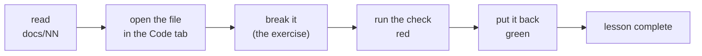

# 15. The learning path: the repo as a course

Everything needed to teach this project already existed. `docs/00–14` explain the why, the
skill playbooks explain the how, seven hundred tests say what is true, the Playground runs a
real checkpoint and the Code tab explains any line back to you with a local model.

What was missing was **ordering, and something to do.**

A learning path that is only a reading order would add nothing — the docs are already
numbered. So every lesson here is a **triple**:



The third step is the point. Reading that a causal mask stops a model seeing the future is
not the same as deleting `is_causal=True`, watching `test_causality` fail, and seeing which
assertion catches it.

---

## Red, then green — or it does not count

A lesson completes only after its check has been seen **failing and then passing**.

Not "the test passes". The test passes on a clean checkout, so that rule would complete the
entire path for somebody who never opened a file. **The exercise is breaking the code**, and
requiring the red run is the only evidence this design can actually collect that it happened.

```
run 1: green   ->  attempted        "you have not broken it yet — that is the exercise"
run 2: RED     ->  the exercise happened
run 3: green   ->  complete         "you broke it and put it back"
```

It fails in the safe direction: someone who did the work and reverted before pressing the
button simply presses it once more. And red is deliberately *not* styled as an error — it is
the middle of the exercise, and the panel says so.

## The nineteen lessons

Filename order is the curriculum; the prereq graph is the constraint.

| | lesson | what it teaches | the exercise |
|---|---|---|---|
| 1 | **data** | tokens on disk, and `x`/`y` one position apart | break the shift |
| 2 | **tokenizer** | BPE, and why the tokenizer fixes the embedding index forever | break the round trip |
| 3 | **attention** | queries, keys, values, and the causal mask | let the model see the future |
| 4 | **kv-cache** | why generation is linear, not quadratic | the real `is_causal` decode bug |
| 5 | **training-loop** | forward/backward, accumulation, LR warmup | remove the warmup |
| 6 | **stop-resume** | the STOP file contract | make an ambiguous stop not stop |
| 7 | **sampling** | temperature, top-k, top-p, and why repetition penalty is off | move the nucleus boundary |
| 8 | **sft-mask** | assistant-only loss | train on the question too |
| 9 | **quantization** | group scales, and a zero-point that must exist | fit the raw range |
| 10 | **lora** | why `B` starts at exactly zero | make it random |
| 11 | **eval** | scoring by log-likelihood, chance lines, error bars | tokenize the continuation with the context |
| 12 | **synthetic-data** | generating data, and checking it twice | accept a vacuous test |
| 13 | **moe** | routers, collapse, and upcycling as an identity | break identity-at-init |
| 14 | **flash-attention** | the online softmax, and why the routing decision matters more than the kernel | take the `usable()` guard off |
| 15 | **long-context** | position is an *angle*; RoPE scaling is training-free | turn NTK back into linear |
| 16 | **speculative** | guessing ahead, and the acceptance rule that keeps it exact | accept every draft token |
| 17 | **serving** | paged KV blocks and continuous batching | write the keys one slot along |
| 18 | **interp** | the logit lens, patching, and pinning a picture to an identity | drop RoPE from the recomputed map |
| 19 | **diffusion** | the other paradigm: fill in blanks, unmask by confidence | drop the `1/t` weight |

Most of the exercises are **real bugs from this repo** — they are in `PLAN.md`'s "Bugs found
and fixed" list. `is_causal` during single-token decode masks away the entire KV cache: the
model trains perfectly and generates garbage. Nobody would invent that.

## The rot problem, and the two rules that solve it

A lesson is a second description of the code, and second descriptions drift. A stale lesson
is worse than stale prose: it sends someone to break a line that has moved, and they conclude
they have misunderstood.

1. **Lessons reference files, never line numbers.** A renamed file fails loudly; line 47
   silently becomes something else. There is a test that greps the lesson bodies for "line
   N" and fails.
2. **Every `verify` is a real pytest node id**, and `tests/test_lessons.py` collects every
   one of them. Rename a test out from under a lesson and the *suite* goes red — which is the
   earliest anyone could find out.

Plus `validate()`, which checks that every referenced doc and file exists, ids are unique,
prereqs resolve, and the graph has no cycle. The Learn tab shows its output at the top of
the list, because a drifted lesson is the one failure that tab must never hide.

---

## What writing the lessons found

Both worth recording, because they are the argument for this whole approach.

**Two of the first thirteen exercises did not work.** Every lesson promises a red check, so
every break was actually performed against the suite. Eleven went red. Two did not:

* **eval** — the existing test asserts the right property, but against a `FakeTokenizer` that
  is one byte per token. It has no merges, so both the correct and the buggy implementation
  look identical to it. A test that cannot fail is not a test. The fix was a new one that
  trains a real BPE tokenizer, picks a pair that provably merges across the boundary, and
  asserts *that* first.
* **quantization** — removing the "stretch the range to include zero" adjustment broke
  **nothing at all**. That invariant had a paragraph of comment explaining why it was
  load-bearing and not one test holding it in place. Now it has
  `test_the_zero_point_is_always_a_representable_code`.

Trying to break your own code on purpose is a better audit than reading it. The learning path
found two holes in a suite of seven hundred tests before a single reader used it.

## Using it

```bash
python -m aksharallm.learn                  # where you are, what is open next
python -m aksharallm.learn show kv-cache    # read one
python -m aksharallm.learn check kv-cache   # run its check, record the result
python -m aksharallm.learn validate         # would any lesson lie to a reader?
python -m aksharallm.learn reset [id]       # do one properly again
```

…or the portal's **Learn** tab, which is a view over exactly those functions and writes the
same `learning/progress.json`, so the terminal and the browser never disagree about what you
have done.

The tab opens on the first unfinished unlocked lesson rather than a list of nineteen, locked
lessons say what is missing rather than being merely greyed out, and three buttons hand off to
the rest of the portal: **read the doc** (Docs tab), **open the file** (Code tab, where a
local model will explain the lines before you break them), and **try it** (Playground, on the
probe the lesson is about).

## The code, in reading order

| # | file | what to look for |
|---|---|---|
| 1 | [`docs/lessons/01-data.md`](lessons/01-data.md) | one lesson, and the shape of all nineteen: frontmatter (`doc`, `files`, `verify`, `prereqs`, `minutes`), explanation, exercise. The `files:` list is this chapter's version of every other chapter's reading order |
| 2 | [`learn/lessons.py`](../aksharallm/learn/lessons.py) | `Lesson`, the frontmatter parser, the prereq graph, and `validate()` — every referenced doc and file exists, ids unique, no cycle |
| 3 | [`learn/progress.py`](../aksharallm/learn/progress.py) | `learning/progress.json`, and the red-then-green state machine: a lesson completes only after its check has been seen failing *and* then passing |
| 4 | [`learn/check.py`](../aksharallm/learn/check.py) | running one pytest node id and turning its output into something worth reading |
| 5 | [`learn/__main__.py`](../aksharallm/learn/__main__.py) | the terminal front end — `show`, `check`, `validate`, `reset` |
| 6 | [`portal/learn.py`](../aksharallm/portal/learn.py) | the tab's server side. Thin, because a check is inline rather than a job — the only panel in the portal that does not shell out |
| 7 | [`tests/test_lessons.py`](../tests/test_lessons.py) | the drift detector: every `verify` is collected as a real node, and lesson bodies are grepped for "line N" |
