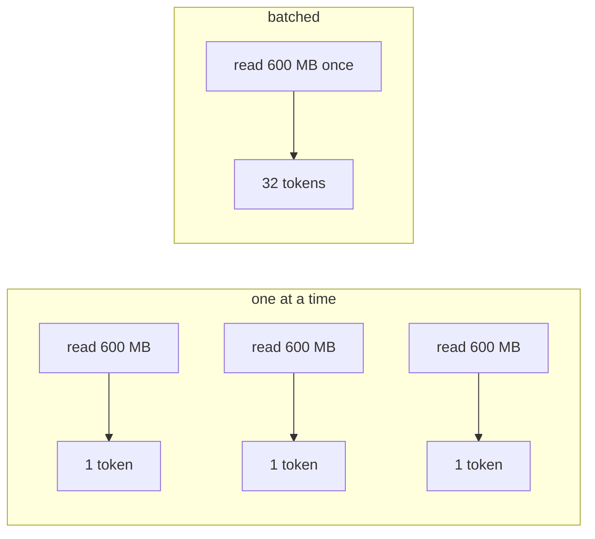
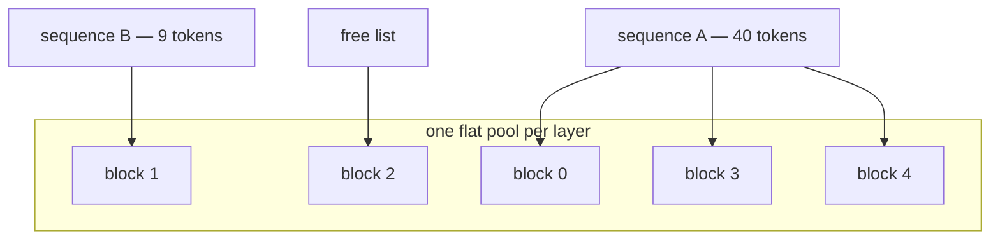

# 16. Serving it — many conversations at once

Everything up to here produces *a checkpoint*. This chapter turns it into *a thing you use*:
an HTTP server that several clients can talk to at the same time, on one GPU, without any of
them noticing the others.

```bash
python -m aksharallm.serve small-code            # http://127.0.0.1:8770/v1
curl -s http://127.0.0.1:8770/v1/completions \
  -d '{"prompt": "def quicksort(arr):", "max_tokens": 64}'
```

The interesting part is not the HTTP. It is that **decoding is memory-bound**, and a server
is the only place you can do anything about it.

## Why a batch is nearly free

A forward pass through a 300M model reads 600 MB of weights out of VRAM and does about 0.6
GFLOPs with them. On a 3090 — 936 GB/s of bandwidth, 71 TFLOPs of arithmetic — the reading
takes ~0.6 ms and the arithmetic ~0.01 ms. The card spends 98% of a decode step *waiting for
memory*.

Now run thirty sequences through the same pass. The weights are read **once**. The arithmetic
is thirty times as much, and it was never the bottleneck.



Measured on `small-code` (300M, step 36,000) on an idle 3090, 64 tokens per request, greedy:

| how | total throughput | per request |
|---|---|---|
| one at a time | 50 tok/s | 50 tok/s |
| batch of 8 | **134 tok/s** | 17 tok/s |
| batch of 32 | **236 tok/s** | 7 tok/s |
| batch of 64 | **272 tok/s** | 4 tok/s |

Read the second column too: batching does not make any single reply faster — it makes *all*
of them fit in the time one used to take. That is the trade a server makes, and it is the
right one for thirty clients and the wrong one for you alone at a terminal, which is why the
Playground does not use it.

The curve flattens past 32 because the batch stops being memory-bound and starts being
limited by the parts that scale with *batch*: attention itself, and the gather described
below.

## The memory problem, and pages

`infer/generate.py` gives its one sequence a cache sized for the whole context window and
never thinks about it again. A server cannot: thirty conversations, each reserved a full
1,024-token window, is 30 windows of memory to hold what is usually thirty *questions* of
eight tokens each.

So keys and values live in fixed-size **blocks** (16 tokens) drawn from one pool, and a
sequence holds a *block table* — the list of blocks it owns, in order:



    token i of a sequence  ->  block = blocks[i // 16], offset = i % 16

That one line is the whole of paging. What it buys:

* **Waste is bounded by one block per sequence** — at most 15 unused token slots — instead of
  by the context window. Thirty short sequences cost 30 blocks, not 30 windows.
* **Blocks can be shared.** Every request in a real deployment carries the same system prompt,
  so the blocks holding it are computed once and pointed at by every conversation, with a
  reference count so the last holder frees them. Only *whole* blocks are shared: a
  partly-filled block is still being written into, and sharing one would let two conversations
  write to the same memory.

**The honest caveat.** Attention wants a dense `(batch, heads, seq, dim)` tensor, and the
blocks are scattered, so this implementation *gathers* them into one — a copy, in PyTorch,
once per layer per step. Real serving stacks write a custom kernel that reads block tables in
place. Building that here would be the FlashAttention project, not this one; what matters is
that the bookkeeping is correct and legible, and that the cost is stated rather than hidden.

That cost is not theoretical: the first version gathered *per sequence*, which at 24 layers
and 32 sequences meant 768 separate indexing operations per step and spent more time in
Python than the model spent in matmuls — a batch of 8 was barely faster than no batch at all.
Building the whole address table once per step and indexing once per layer is what produced
the numbers above.

## Continuous batching

The naive server runs a batch to completion: thirty requests start together, twenty-nine
finish, and twenty-nine slots sit idle while the longest reply finishes alone. *Continuous*
batching lets a finished sequence leave on the step it finishes and a waiting one join on the
next.

```
step 1   A B C            step 4   A   C D      (B finished, D admitted)
step 2   A B C            step 5   A   C D
step 3   A B C            step 6   A     D      (C finished)
```

Two rules, both about not disturbing work in flight:

1. **Admission is checked against free blocks**, not hope. If the pool cannot hold a prompt
   *now*, the request waits in the queue. A server that admits optimistically has to evict
   something mid-answer — and that answer is one somebody is already reading.
2. **Prefill and decode share a step.** A newly admitted sequence owes its whole prompt while
   everyone else owes one token, so every step is ragged: each row contributes what it owes,
   padded to the widest, with a mask that hides the padding. Splitting the two phases is
   simpler and leaves the card idle during every prefill.

## Drafting inside the batch

The two speedups compose. Batching gets more *sequences* out of one pass over the weights;
[speculative decoding](06-inference.md) gets more *tokens* out of one pass per sequence.
Running both means each row proposes its own few tokens — by looking them up in **its own**
text, since a batch is unrelated conversations — and the ragged step verifies every row's
guesses in the same forward it was already doing.

The ragged step is why this costs almost nothing to add: a row that owes four guesses looks
exactly like a row that owes four prompt tokens, which the scheduler already handles. And
paging is why rejects are free: the rejected guesses' keys and values sit past `cached`, where
`gather` never looks, and the next step overwrites them. No rewind, no copy, one integer.

| | batch 8 | batch 32 |
|---|---|---|
| no drafting | 134 tok/s (8.0 tokens/step) | 238 tok/s (32.0 tokens/step) |
| `--speculate 4` | **148 tok/s** (8.8/step, 13% accepted) | **372 tok/s** (52.5/step, 39% accepted) |

That is 7.4x one-at-a-time decoding, and the output is still exactly the model's — the
acceptance rule is the one `infer/speculative.py` proves, and the test compares a drafting
batch against a non-drafting one token for token.

Two endings have to be honoured *inside* a round, because a round can emit several tokens at
once: everything after an EOS is dropped, and so is anything past the caller's budget. Without
that, a request for 16 tokens gets 17 whenever the last round accepted two — correct text, one
token too long, and exactly the sort of bug a diff finds and a reader does not.

## When a client hangs up

A connection that closes mid-answer used to leave its sequence running to its full
`max_tokens` into a socket nobody was reading — safe, and a quiet way to halve a busy server's
throughput. `BatchEngine.cancel` now stops it and frees its blocks on the spot, from the batch
*or* from the queue: a request abandoned while waiting should never be admitted at all.

## The three things that make a batch wrong

All of them produce fluent, plausible, *different* text — never an error — which is why the
tests compare against single-sequence generation rather than eyeballing output.

| trap | what happens |
|---|---|
| **RoPE positions are per row** | A batch is unrelated conversations, one on its 12th token and another on its 400th. `apply_rope` had to learn a `(B, T, D)` shape; with a shared window every sequence is rotated by somebody else's position, and still answers fluently. |
| **The mask has two jobs** | It must stop a query seeing the future *and* stop it seeing past the end of its own (shorter) row into another sequence's keys. |
| **Padding rows need somewhere to look** | A row with no real tokens this step gets an all-False mask row, and `softmax` of all `-inf` is NaN — which propagates through the shared weights into every other sequence in the batch. Padded rows are pointed at key 0 instead. |

There was a fourth, and it is the best bug of the build: the pool was allocated as
`(n_blocks, n_kv_heads, block, dim)` and viewed with `transpose(0, 1).reshape(...)`.
**`reshape` on a transposed tensor returns a copy**, so every write landed in a temporary and
the pool stayed full of zeros. The model then attended to nothing but the token it had just
been handed, and repeated it forever — which reads exactly like an undertrained model. The
pool is now one flat slot axis per layer, and blocks are purely an addressing convention.

## The API

Three endpoints in the OpenAI shape, because that is what every client library, editor plugin
and script already speaks. `/v1/models`, `/v1/completions`, `/v1/chat/completions`, with
`stream: true` producing server-sent events that end in `[DONE]`. Plus `/health`, which is the
server's dashboard: device, why that device, how many sequences are running and waiting, and
the state of the KV pool.

```bash
python -m aksharallm.serve small-code --max-batch 32       # loopback, port 8770
python -m aksharallm.serve small-code --host 0.0.0.0       # a decision, not a default
python -m aksharallm.serve small-code --pool-blocks 512    # cap the KV memory
curl -s http://127.0.0.1:8770/health | python -m json.tool
```

**The training run still owns the card.** Device selection goes through the same
`plan_device` policy as the Playground ([doc 6](06-inference.md)): if a run is training, the
server loads on the CPU and `/health` says so. A serving process must never be the reason a
six-day run dies — the same argument that keeps the Code tab's explainer off the GPU.

**In the portal**: the dashboard's **Serve** panel starts and stops it and shows what
`/health` reports — sequences in flight, the queue, the KV pool, tokens per model pass. It
runs `scripts/serve.sh`, the same command you would type, so a server started in a terminal
appears in the panel and stopping the portal never stops the server. That is the same
contract `phase2.sh` and the training dashboard have always had.

## What is deliberately not here

* **Cancellation.** A client that hangs up mid-answer leaves its sequence running to
  completion. Stopping it mid-batch is a small change and an easy one to get subtly wrong.
* **A custom paged-attention kernel**, as above.
* **Speculative decoding inside the batch.** It works beautifully at batch 1
  ([doc 6](06-inference.md)) and interacts with batching in ways worth measuring before
  wiring: accepted-token counts differ per row, so a batch would have to be re-ragged every
  round.
* **Authentication.** Loopback is the boundary. Exposing this on a network is your decision,
  and it should be behind something that does auth properly.

## What a token cost

The server records every completed request to `logs/serve/usage.jsonl` — start, end, prompt
tokens, completion tokens — and the GPU sampler tags its power draw `serve`. Between them,
`python -m aksharallm.portal.cost` can answer the question a benchmark cannot:

```
serving: 318 requests, 54,586 completion tokens (1,626 prompt), 2m44s generating
         $0.0377 per million COMPLETION tokens
         14 Wh generating, 3 Wh idle-but-loaded (33% of the server's energy produced nothing)
         331.3 tok/s of card time (batched — not per-request throughput)
```

Three separations make that honest, and each one is a way the number goes wrong without it:

| separation | what collapses without it |
|---|---|
| prompt vs completion tokens | prefill and decode differ by orders of magnitude per token, and their mix changes per request — the sum is an average over two different things |
| generating vs idle-but-loaded | an under-used server looks like one whose *tokens* are expensive, which is a different problem with a different fix |
| merged vs summed busy spans | the server batches: 30 concurrent requests over 10 s are 10 s of card time, not 300 |

The idle share is usually the interesting number. A server left up overnight for occasional
use spends almost all of its electricity being available, and no amount of decode
optimisation touches that — the fix is to stop leaving it up, which is a decision the
per-token rate alone would never prompt.

See [doc 9](09-running-and-watching.md) § "What a run cost" for the training side of the same
ledger, and for the two bugs this uncovered.

## The code, in reading order

| # | file | what to look for |
|---|---|---|
| 1 | [`aksharallm/serve/paged.py`](../aksharallm/serve/paged.py) | `PagedCache._slots` — the one line of address translation — then `BlockPool` (allocate/release/share and the reference counts), `gather`, and `LayerView`, which makes a pool look like the `KVCache` the model expects |
| 2 | [`aksharallm/serve/batch.py`](../aksharallm/serve/batch.py) | `BatchEngine._forward` — positions, the two-job mask, the padded rows — then `step` (sampling and finishing), `_admit` (FIFO, checked against free blocks) and `_share_prefix` |
| 3 | [`aksharallm/serve/server.py`](../aksharallm/serve/server.py) | `ModelServer._loop` — one worker thread owns the model, HTTP threads only put requests in and take tokens out — then `Handler._generate` and `_stream` |
| 4 | [`scripts/serve.sh`](../scripts/serve.sh) · [`aksharallm/portal/serving.py`](../aksharallm/portal/serving.py) | the lifecycle: a pid file, a log, and a panel that shells out to the script rather than holding a second way to start a server |
| 5 | [`aksharallm/serve/usage.py`](../aksharallm/serve/usage.py) | `busy_intervals` — merged, not summed — and the docstring's three decisions. Then `portal/cost.py`'s `serving_report` |
| 6 | [`aksharallm/model/transformer.py`](../aksharallm/model/transformer.py) | `apply_rope`'s two shapes and the `positions` / `attn_mask` parameters of `forward`: the only changes serving needed in the model itself |

What pins it: `tests/test_serve.py`, and the one to read first is
`test_a_batch_gives_each_sequence_what_it_would_have_got_alone` — three prompts of different
lengths must produce exactly what each produced alone. Note `tiny()` in that file: the model
is **briefly trained**, because an untrained transformer's prediction barely depends on its
input and every one of these tests passed with the positions scrambled and the mask inverted
until it was.

---

Next: [inference](06-inference.md) for the single-sequence path this builds on, and
[quantization](10-quantization.md) for making the weights that get read 936 GB/s smaller.
