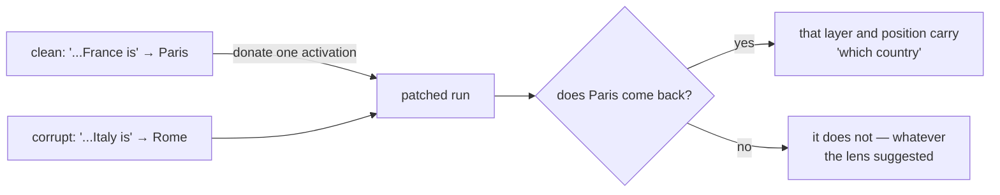

# 18. Looking inside — attention, the logit lens, patching, and a dictionary

Every other chapter asks the model *questions*: what token comes next, what loss, what score
on a benchmark. This one opens it up and asks **how** — which layer decided, which earlier
token the decision leaned on, and what the model was thinking halfway through.

```bash
python -m aksharallm.interp lens  small-code --prompt "The capital of France is"
python -m aksharallm.interp attn  small-code --prompt "def add(a, b):" --layer 12 --head 3
python -m aksharallm.interp patch small-code \
    --clean "The capital of France is" --corrupt "The capital of Italy is" \
    --answer " Paris" --other " Rome"
python -m aksharallm.interp sae   small-code --layer 12
```

…or the portal's **Interp** tab, which runs all four against the model the Playground already
has resident — and therefore inherits the device policy: if a run is training, this loads on
the CPU and says so.

**The failure mode to keep in mind the whole way through**: a picture that is wrong is still
a picture. An attention map recomputed with the wrong angles, a lens that forgets the final
norm, a patch hooked to the wrong module — each renders beautifully and tells you a story
about your model that is false. So every tool here is pinned to something that cannot be
argued with, and the tests say which.

## Attention: recomputed, because nothing stores it

`F.scaled_dot_product_attention` computes `softmax(QK^T/√d)V` in one fused kernel and never
materialises the matrix in the middle — that is exactly why it is fast and memory-light. So
the map is rebuilt from the layer's own inputs: hook the attention norm, apply that layer's
`wq`/`wk`, rotate by the same RoPE angles, mask, softmax.

Which is a claim, so it is tested: the recomputed weights multiplied by V, projected by `wo`,
must equal **what the layer actually returned** (2.4e-7 on the 300M).

Read a *row*: it is what one position looked at, and it sums to 1. The summary reduces each
head to two numbers, because scanning sixteen matrices by eye is not analysis: **distance**
(how far back it weights, separating a head reading its neighbour from one reaching to the
start) and **self weight** (how much of it is just "attend to me" — many heads mostly are,
which is worth knowing before reading anything into their maps).

## The logit lens: when did it decide?

A pre-norm transformer never rewrites its state; each block *adds* to a running total. So the
output head can be pointed at that total halfway through:

    prediction at layer n = lm_head(final_norm(residual_after_layer_n))

The `final_norm` is the part people leave out and then wonder why early layers look like
noise — the head was trained to read normalised vectors, and the stream's magnitude grows
with depth.

On `small-code` at step 36,000, `"The capital of France is"`:

| after | what it would have said |
|---|---|
| embedding | `' is'` 1.00 |
| block 7 | `' not'` 0.16, `' also'` 0.13 |
| block 15 | `' usually'` 0.15, `' not'` 0.14 |
| block 19 | `' the'` 0.22, `' also'` 0.08 |
| block 20 | **`' Paris'` 0.72** |
| block 23 | `' Paris'` 0.50 |

**It does not know the answer until block 20 of 24**, having changed its top token eleven
times on the way. That is a fact about your model that no benchmark reports.

Beside it, `layer_contributions` gives each block two numbers: how far it moved the stream,
and how much that movement raised the *final answer's* logit — so a block quietly arguing
**against** the eventual answer is visible.

**The honest caveat, and the reason the next section exists:** this is a reading, not a
measurement. Nothing says an intermediate residual is supposed to decode to anything; the
model may hold information in a form the head cannot read until later layers rotate it. A
clean lens story is a hypothesis.

## Activation patching: intervention, not observation

Run a **clean** prompt and a **corrupted** one that differs in one meaningful way. Then run
the corrupted one again, forcing a single activation back to its clean value. If the answer
returns, that activation *carries* the difference — regardless of what the lens showed.



The measurement is a **logit difference** (`logit(Paris) − logit(Rome)`), not a probability:
it is what the model computes with, and it is unaffected by the softmax normalising over
32,000 irrelevant tokens. Reported as a fraction restored — 1.0 means the patch fully
recovered the clean behaviour.

Run on `small-code`, the grid is unusually clean:

```
  block  'The'  ' capital'  ' of'  ' France'  ' is'
     10   0.00      0.00     0.00     1.01    0.02
     ...
     19   0.00      0.00     0.00     0.78    0.30
     20   0.00      0.00     0.00     0.01    0.96
     23   0.00      0.00     0.00     0.00    1.00
```

The country information sits **on the country token** through blocks 10–19, and at **block
20** it moves to the last position — where the lens said the answer appears. Two independent
methods agreeing is what turns a story into a finding: attention carries the fact forward,
then the final blocks read it out.

**The two prompts must tokenize to the same length**, or position 4 means different things in
the two runs and every cell compares unrelated activations. That is a refusal, not a warning.

### Narrowing it to a head

A position carries the sum of every head's work plus the MLP's, so "block 20, last position"
is a *place*, not a mechanism. Heads can be separated after the fact because `wo` is linear:
`wo(concat(h1..hn))` is the sum of `wo` applied to each head's slice with the others zeroed —
which makes swapping one head's contribution for the clean run's a single addition, exact
rather than approximate. (`test_head_outputs_sum_to_the_layers_output` asserts the identity.)

On the same prompt: **head 1 of block 20 alone restores 50%** of the clean logit difference —
the same block the lens and the position grid both pointed at, now attributed to one of
sixteen heads. Three methods agreeing is as close to a mechanism as this repo gets.

## A sparse autoencoder: pulling apart superposition

Looking at single dimensions of the residual stream does not work, and the reason has a name.
A 1,024-wide stream represents far more than 1,024 things, so features are stored as
overlapping directions — **superposition** — and one dimension participates in dozens of
unrelated concepts.

A sparse autoencoder attacks that: project up into a much wider space, force the result to be
almost all zeros, and reconstruct from what is left.

    f = relu(W_enc (x − b_dec) + b_enc)          # 8x wider, and sparse
    x̂ = W_dec f + b_dec
    loss = ‖x − x̂‖² + α‖f‖₁

Three details decide whether it learns anything, all cheap and all easy to omit:
**unit-norm decoder columns** (or the model buys sparsity by shrinking activations and
growing the dictionary), **subtracting `b_dec` before encoding** (the stream has a large mean
offset that is nobody's feature), and **counting dead features loudly** — a run where most of
the dictionary never fires has learned a small dictionary badly while its loss looked fine.

α is the one knob, and the trade is stark. Measured on layer 12 of `small-code`, 8,192
features over 250k–600k activations, a couple of minutes each on the 3090:

| α | variance explained | features per token (L0) | dead |
|---|---|---|---|
| 0.003 | 97.5% | 200 | 0% |
| **0.008** | **94.1%** | **13.7** | **3%** |
| 0.012 | 88.3% | 2.6 | 19% |
| 0.02 | 89.4% | 1.1 | 53% |

At 0.003 it reconstructs almost everything and is not a dictionary — 200 features per token
is the soup you started with. At 0.02 half the dictionary is dead. **0.008 is the one to
keep**: 94% explained with fourteen features firing per token.

What a feature *means* needs the tokens it fires on, which is a corpus pass and therefore a
terminal job:

```bash
python -m aksharallm.interp features small-code --layer 12 --feature 5537 --label
```

`--label` asks the local Ollama model what those snippets have in common. Feature 5537 of
layer 12 fires on `' the'` after a verb or preposition ("impacted by [the] condition", "how we
take [the] world"), and the model calls it *"the word 'the' follows a preceding word"* — which
is roughly right and not very illuminating, and that is exactly why it comes back the way it does: the
label is **marked as a hypothesis, with its evidence attached**, `confident` is false when the
model says "unclear", and nothing here stores a label without the contexts beside it. An
automatic name is genuinely useful for triaging eight thousand features and is also the
easiest way to convince yourself a feature means something it does not — the model is guessing
from ten snippets and will always produce *a* phrase.

## What this does not do

* **No MLP attribution.** Heads can now be separated (above); the MLP's contribution to a
  position is still lumped in with everything else.
* **No automatic circuit finding.** Every question here is one you have to pose — a pair of
  prompts, a layer, a feature. Searching for a circuit rather than checking one is a different
  project.
* **The lens is not a measurement**, as above. It is the cheapest hypothesis generator here
  and should always be checked with a patch.

## The code, in reading order

| # | file | what to look for |
|---|---|---|
| 1 | [`aksharallm/interp/capture.py`](../aksharallm/interp/capture.py) | `hooks_on` (a context manager, so hooks can never be left attached) then `attention_maps` — the three lines that rebuild what the fused kernel threw away |
| 2 | [`aksharallm/interp/lens.py`](../aksharallm/interp/lens.py) | `logit_lens` — and the `model.norm` inside it, which is the whole difference between signal and noise — then `lens_story` and `layer_contributions` |
| 3 | [`aksharallm/interp/patch.py`](../aksharallm/interp/patch.py) | `patch_grid`'s hook: replacing one row of a block's output *is* "make this position believe what the clean run believed". Then `check_pair`, which refuses rather than warns |
| 4 | [`aksharallm/interp/sae.py`](../aksharallm/interp/sae.py) | `SAE.loss` and `normalise_decoder` first (the constraint that makes sparsity mean anything), then `train_sae`'s dead-feature accounting and `feature_report` |
| 5 | [`aksharallm/portal/interp.py`](../aksharallm/portal/interp.py) | why this tab runs *inline* on the Playground's resident model instead of spawning a job, and the token ceilings that keep a click from holding the model for a minute |
| 6 | [`aksharallm/interp/__main__.py`](../aksharallm/interp/__main__.py) | last: it is argument parsing over the four modules above |

What pins it: `tests/test_interp.py`. The three tests to read are the ones that compare
against something unarguable — the attention map against the layer's own output, the last
lens row against the model's real prediction, and a final-layer patch restoring exactly 100%.

---

Next: [inference](07-inference.md) for the generation path these tools observe, and
[serving](17-serving.md) for what happens when other people start using the model.
