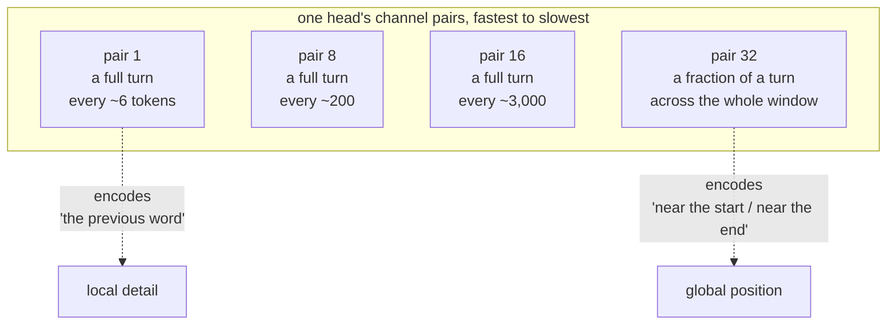
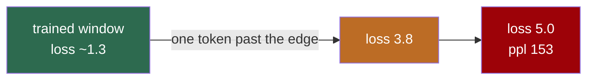
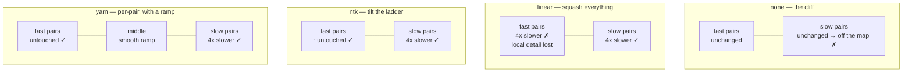
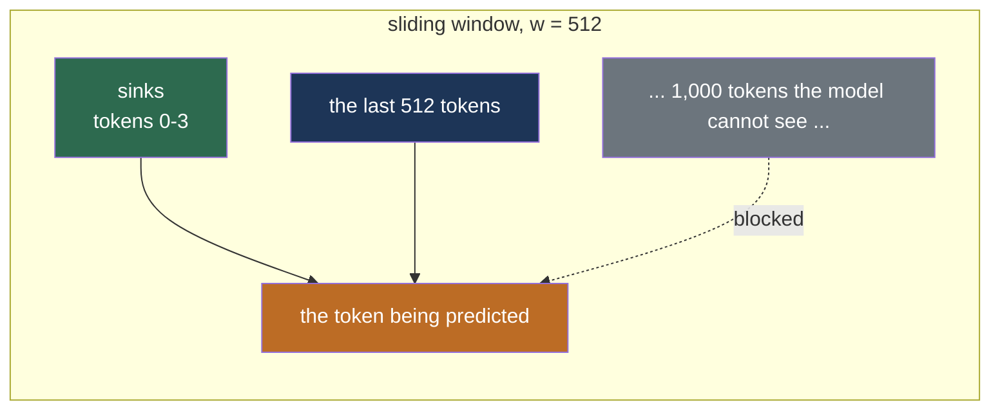
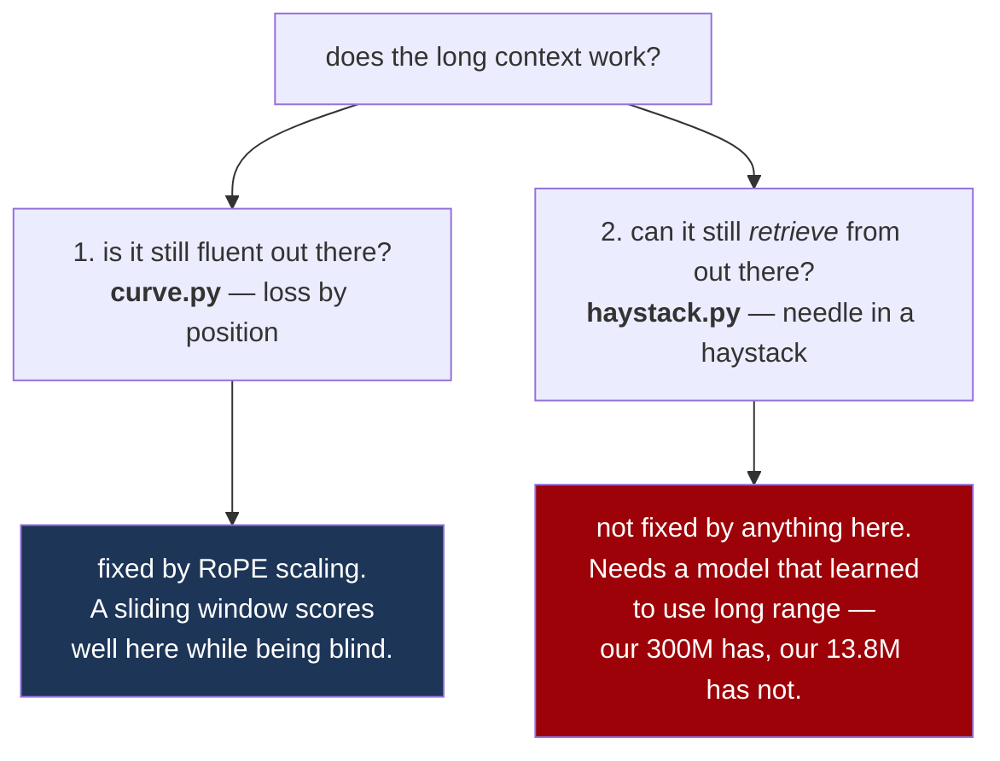

# 18. Long context — teaching a model to read further than it was trained to

> Our 300M model was trained on windows of **1,024 tokens** — about a page and a half. This
> chapter is about what happens when you show it eight pages instead, why it fails in a very
> specific way, the three one-line fixes for it, and how to tell which of them actually
> worked. Everything here is measured on our own checkpoints, and none of it required a
> single minute of retraining.
>
> The short version: **one config line takes it to 4,096 tokens**, where it still finds a fact
> hidden in the text **92.5% of the time** against a 25% chance line — and no weight changes.

---

## Start here: what "context" actually is

A language model does not have a memory. Every time it produces a token it re-reads the
entire conversation from the beginning. The **context window** is simply the largest number
of tokens it is able to re-read at once.

So "extending the context" is not about giving the model more storage. It is about fixing
something much narrower and stranger, and to see what, you need one idea about how the model
knows *where* a word is.

### Position is an angle

The model has no built-in notion of order — to the attention mechanism a sentence is a bag
of words. Order is added by **RoPE**, which encodes a token's position by *rotating* its
query and key vectors. Token 5 gets rotated a little, token 500 a lot.

Each head's channels are split into pairs, and each pair spins at its own speed:



Fast pairs tell the model about neighbours. Slow pairs tell it roughly where in the document
it is. Training on 1,024-token windows shows it every angle the *fast* pairs can make —
they go all the way round, many times — but only a **thin slice** of what the slow pairs can
make, because they never complete even one rotation in 1,024 steps.

### So the failure is not forgetting, it is nonsense

Ask that model about token 4,000 and the slow pairs are four times further round the circle
than anything in training. The model is not straining to remember. It is being handed
coordinates in a system it has never seen, and every attention score it computes from them is
meaningless.

This is what that looks like on our own 13.8M model, trained on 512 tokens and then simply
asked for 2,048 — nothing changed but the length:

| positions | loss | perplexity |
|---|---|---|
| 0–511 | 1.26 | 3.5 |
| 512–1023 | 3.78 | 43.8 |
| 1024–1535 | 5.03 | 153.4 |
| 1536–2047 | 4.98 | 144.8 |

Perplexity 3.5 → 153. That is not degradation, it is a **cliff**, and it is the single most
important picture in this chapter:



---

## The three fixes, and they are all one line

Here is the good news, and it is genuinely surprising the first time: **RoPE has no
parameters**. The rotation angles are computed from the position and a fixed frequency
ladder. So changing how a model addresses position changes *no weights at all* — it is
arithmetic, applied at load time.

All three methods change exactly one thing: the frequency ladder `inv_freq`. They differ
only in *which* pairs they slow down.



**`linear`** — *position interpolation*. Pretend token 4,000 is token 1,000; divide every
position by the factor. Every angle is now one the model has seen, which is why it works at
all. But it squashes the fast pairs too, and those were carrying "the previous word" — so it
buys range by throwing away local resolution.

**`ntk`** — instead of dividing positions, **raise `theta`**, the number the frequency ladder
is built from. Because the ladder is geometric, nudging its base tilts the whole thing: the
slowest pair ends up interpolated by almost exactly the factor while the fastest is barely
touched. One number, and it keeps what `linear` destroys.

**`yarn`** — does per-pair and explicitly what NTK does as a side effect. For each pair it
asks *how many full rotations does this complete inside the original window?* Many (≥32) means
the model has seen the whole circle, so leave it alone. Fewer than one means it has only ever
seen a sliver, so interpolate fully. In between, ramp smoothly. It also nudges the attention
temperature, because a longer context spreads attention thinner.

**`dynamic`** — NTK with the factor computed from the length actually being processed. Below
the original window the factor is 1 and the model is bit-for-bit unscaled, so short prompts
pay nothing. Reach for this when one checkpoint has to serve both.

---

## What they are actually worth (measured, our own models)

`python -m aksharallm.longctx sweep <ckpt>` runs every method over the same windows — same
weights, same data, one variable.

### The 300M, trained on 1,024

**At 2x** (measured over 2,048 tokens, 32 windows):

| method | overall loss | inside the window | past it | cliff |
|---|---|---|---|---|
| **none** | 3.264 | 2.356 | 4.173 | **at 1,280** |
| linear | 3.004 | **3.035** ← ruined | 2.974 | none |
| **ntk** | **2.323** | 2.365 | 2.282 | none |
| **yarn** | **2.310** | 2.376 | 2.245 | none |

The in-window baseline is **2.356**. NTK lands at 2.365 inside the window — **nine
thousandths of a nat**, which is nothing — and 2.282 *past* it. Doubling this model's context
cost effectively nothing: no fine-tune, no weights touched, one config line.

(Its *overall* loss of 2.323 sitting **below** the in-window baseline is not an error, and it
is worth understanding. Loss normally improves with position, because later tokens have more
context to condition on. A working extension keeps that slope going — which is what "it is
actually using the extra room" looks like as a number.)

Now read the `linear` row. It took the in-window loss from 2.356 to **3.035** to buy the same
range. That is the local-resolution cost, and it is not subtle.

**At 4x** (measured over 4,096 tokens, 24 windows) the methods separate hard:

| method | overall loss | inside the window | past it | cliff |
|---|---|---|---|---|
| none | 4.740 | 2.578 | 5.461 | at 1,536 |
| linear | 4.275 | **4.379** | 4.241 | none |
| ntk | 2.895 | 2.623 | 2.986 | **at 3,584** |
| **yarn** | **2.464** | 2.650 | **2.402** | none |

**NTK grows a cliff of its own at 3,584.** Its tilt buys roughly 3.5x and then runs out.
YaRN's per-pair ramp does not, and holds 2.402 all the way to the end.

### The 13.8M, trained on 512 — the same shape, one tenth the size

| | 2x (measured at 1,024) | 4x (measured at 2,048) |
|---|---|---|
| none | 2.558 | 3.744 |
| linear | 1.511 | 2.185 |
| ntk | 1.526 | 2.366 |
| **yarn** | **1.372** | **1.512** |

Same story at a scale that runs in a couple of minutes: everything works at 2x, and at 4x NTK
*loses* to linear while YaRN stays close to its baseline.

**Rule of thumb, now confirmed at both scales: NTK to 2x, YaRN beyond it.**

> **A methodology warning, from getting this wrong in this very chapter.** The first version
> of the 300M table was run on the CPU with **two** windows and reported an in-window baseline
> of 0.990 where 32 windows say **2.356**. Two windows of 2,048 tokens is four thousand tokens
> of one or two documents; land on something repetitive and the whole curve moves by more than
> a nat. Every *conclusion* survived the correction and not one *number* did. Use at least 16
> windows before quoting anything.

---

## The other approach: don't look so far back

Scaling makes distant positions legible. A **sliding window** sidesteps the problem entirely
— just refuse to attend more than *w* tokens back. Attention stops being O(T²) and the KV
cache stops growing.



On our 13.8M at 2,048 tokens, a 512-token window gives **loss 1.253** — flat all the way out,
no cliff, and *better than YaRN's 1.512*. With no scaling and no fine-tune.

Which sounds like it wins, and it does not, for a reason worth being precise about.

> **A sliding window buys perplexity by giving up the thing you wanted.** The model is now
> structurally incapable of using anything more than 512 tokens back. Its next-token
> prediction is excellent, because next-token prediction is mostly local. Its ability to
> answer a question about page one is exactly zero — by construction, not by accident.

This is the single most important trap in long context, and it is why the next section
exists.

### Attention sinks, and a finding of our own

The published wisdom (StreamingLLM) is that a sliding window needs **attention sinks** — keep
the first few tokens permanently visible. The reason is elegant: attention is a softmax, so
the weights must sum to one whether or not anything in the window deserves them. Models learn
to dump the remainder on the first few tokens, which every position can see. Slide the window
past them and that overflow lands on real tokens instead.

We measured it, and **on our model sinks made it worse**:

| configuration | loss at 2,048 |
|---|---|
| window 512, **no** sinks | **1.253** |
| window 512, 4 sinks | 1.778 |
| window 512, 4 sinks, **+ YaRN 4x** | 1.470 |

That third row is the explanation. Our sinks live at absolute positions 0–3, so a query at
position 1,500 reaching back to them is asking about a **relative distance of 1,500** — far
outside the trained window, and precisely the illegible angle the sliding window had just
finished eliminating. Sinks reintroduce the disease. Making those angles legible with YaRN
recovers most of the loss, which confirms the diagnosis.

The published implementations avoid this by assigning RoPE positions **by slot in the cache**
rather than by absolute position, so the maximum relative distance is bounded by the window.
**We do not do that**, because our KV cache rotates keys once when they are written and never
re-rotates them. Fixing it properly means position-at-read-time, which is a real change to
the cache. It is written down here rather than papered over: on this codebase today, use a
sliding window **without** sinks, or with sinks *and* a scaling method.

---

## Measuring it honestly: perplexity is not enough

Two questions hide inside "does the long context work?", and conflating them is the most
common mistake in this area.



**Loss by position** (`curve.py`) is the cheap one and it runs on any checkpoint, from the
run's own `val.bin`, with no download and no fine-tune. Its shape is the whole result: flat
is healthy, a cliff is a naive extension, a step-then-flat is a working scaling method. It is
the first thing to run before believing any long-context claim.

**Needle in a haystack** (`haystack.py`) is the honest one. Hide a sentence — *"The secret
code for Bengaluru is 7431."* — at a chosen depth in a lot of ordinary text, then ask for it
back, and sweep length × depth into the grid everyone recognises.

Two choices make it work on a model this small. Nothing is **generated**: the true code and
some distractors are each scored by log-probability and the trial is correct when the true one
wins — the same machinery as our ARC and PIQA suites, exactly reproducible, and it works on a
model far too small to answer out loud. And the filler is the model's **own validation data**,
so a failure means "could not retrieve", not "was confused by our noise".

### The 300M, extended to 4x with YaRN — and it works

6 trials per cell, four-way choice, chance 25%:

| needle depth | 512 | 1,024 | 2,048 | 4,096 |
|---|---|---|---|---|
| 0% (very front) | 100% | 100% | 83% | **33%** |
| 25% | 100% | 100% | 83% | 83% |
| 50% | 100% | 83% | 100% | 83% |
| 75% | 100% | 100% | 100% | 100% |
| 100% (very end) | 100% | 100% | 100% | 100% |

**Overall 92.5% ± 2.4% against a 25% chance line**, at lengths up to **four times the window
the weights were ever trained on**, with no fine-tune and no weights changed. This is the
result that justifies the whole chapter: the perplexity curve said the positions had become
legible, and this says the model can actually *use* them.

The grid also has a shape, and it is the published one. Read the last two rows: a needle near
the **end** is found every single time at every length. Read the first row: a needle at the
very **front** of a 4,096-token context drops to 33%, barely above chance. Information nearest
the question is easiest, information furthest from it is hardest, and the gap opens up exactly
as the context gets long. Nothing here was tuned to produce that.

### The 13.8M, for contrast — at chance

The same test on the 13.8M scores **16.7% ± 10.8% against 25%** — i.e. nothing, at every
length and depth, and the CLI says "NOT distinguishable from chance" rather than printing a
number that reads like partial credit.

That is not a broken test, it is the answer, and the contrast with the 300M is the lesson.
Both models have legible positions after scaling. Only one of them ever learned to retrieve
from far away. **Scaling makes the positions legible; using them is a capability, and
capabilities come from training** — which is why both numbers are published rather than only
the good one.

---

## Doing it

```bash
# 1. where does this model actually stop working?
python -m aksharallm.longctx curve small-code --len 2048 --device cpu

# 2. which fix is best for it? (same windows, one variable)
python -m aksharallm.longctx sweep small-code --len 2048 --factor 2 --device cpu

# 3. bake the winner into a checkpoint — weights untouched
python -m aksharallm.longctx extend small-code --method ntk --factor 2 \
    --out checkpoints/small-code/ckpt_ntk2x.pt

# 4. and be honest about what it can do with the room
python -m aksharallm.longctx needle small-code --lengths 512 1024 2048 --device cpu
```

Or press the buttons in the portal's **Context** tab, which drives exactly these functions
and draws the curve, the method comparison and the needle grid.

In a config:

```yaml
model:
  max_seq_len: 4096
  rope_scaling: {type: yarn, factor: 4.0, original_max_seq_len: 1024}
  attn_window: 1024        # optional; sliding window
  attn_sinks: 0            # see the finding above before setting this
```

### Three things that will bite

1. **`original_max_seq_len` is the whole bookkeeping.** Once `max_seq_len` is 4,096 nothing
   else in the config remembers the weights were trained on 1,024, and every method needs
   that number. `extend` records it, which is what makes an extended checkpoint
   self-describing — it reloads correctly in the Playground, the harness and the server with
   no flags. Extending a second time compounds against the *original*, not against 4,096.
2. **`dynamic` is stateful.** After one 8k sequence, a later 1k sequence is served by the 8k
   factor. Every published implementation behaves this way. Worse, if it grows *during*
   generation the keys already in the KV cache were rotated with the old factor and disagree
   with the new queries — call `model.pin_rope(max_len)` before a generation loop.
3. **`--device cuda` is refused while a run is training.** These are long forward passes;
   4,096 tokens of logits is half a gigabyte before the loss is computed, and the training
   run has about 3 GB spare. Use `--device cpu`, or `--force-gpu` if you know there is room.

---

## What we did not do

**No fine-tune.** Every number here is a training-free extension, which is the interesting
regime and the one that fits an evening. A short fine-tune at the extended length is the
standard next step; on this model the place it would show is the top-left of the needle grid,
where a needle at the very front of a 4,096-token context is still only found a third of the
time.

**No block-skipping for the sliding window in the Triton kernel.** Our own
[FlashAttention kernel](03-model.md) understands `window` and `sinks` — passed as two
integers rather than as a mask, which matters because the equivalent bool tensor is 64 MB at
T=8192. But it still *walks* the skipped key blocks and masks them, rather than never loading
them, so the window costs no memory and saves no time. The causal diagonal already does the
real thing; extending it to a window is bounded work and is the obvious next optimisation.

---

## The code, in reading order

| # | file | what to look for |
|---|---|---|
| 1 | [`aksharallm/model/rope.py`](../aksharallm/model/rope.py) | **start here.** The module docstring is the derivation; then `plan()`, which is the whole chapter in forty lines — one branch per method, each changing only `inv_freq` |
| 2 | `_yarn_ramp` | rotations-per-original-window as the thing being thresholded. This is what makes YaRN per-channel rather than global |
| 3 | [`aksharallm/config.py`](../aksharallm/config.py) → `RopeScaling`, `attn_window`, `attn_sinks` | the three config surfaces, and the `__post_init__` coercion that lets ten `ModelConfig(**ckpt[...])` call sites keep working |
| 4 | [`transformer.py`](../aksharallm/model/transformer.py) → `sliding_window_mask` | the three-clause rule, and the docstring on why the sink clause exists |
| 5 | `Transformer._rope` · `pin_rope` | the only stateful thing in the model, and the two traps that come with it |
| 6 | [`longctx/extend.py`](../aksharallm/longctx/extend.py) | `plan_extension` — a pure function, so the portal can show what *would* change without writing 1.2 GB to find out |
| 7 | [`longctx/curve.py`](../aksharallm/longctx/curve.py) | `reduction="none"` is the point of the file; then `cliff()`, and why it anchors to the in-window mean rather than position 0 |
| 8 | [`longctx/haystack.py`](../aksharallm/longctx/haystack.py) | `build_context` (the needle goes in at a *token* boundary) and `_score_candidates` (the off-by-one that would score every candidate on the wrong tokens) |
| 9 | [`longctx/__main__.py`](../aksharallm/longctx/__main__.py) | `sweep` is the command the chapter exists for; `_check_device` is the courtesy that stops a measurement killing a run |
| 10 | [`aksharallm/portal/longctx.py`](../aksharallm/portal/longctx.py) | the Context tab's server side — same functions, one job at a time |

What pins it: `tests/test_longctx.py`. The four worth reading are
`test_none_is_bit_for_bit_the_old_cache` (every existing checkpoint depends on the default
not moving a single angle), `test_a_window_wider_than_the_sequence_changes_nothing` and
`test_changing_a_token_outside_the_window_cannot_reach_the_last_position` (the window does
nothing when it should and something when it should), and `test_extending_twice_compounds`.

---

Next: [3. The model →](03-model.md) for the attention kernel this builds on.
