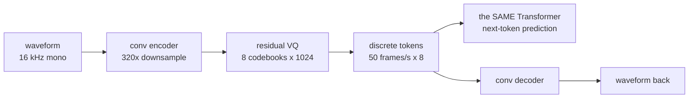
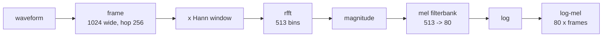
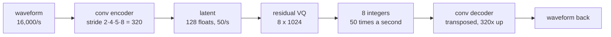
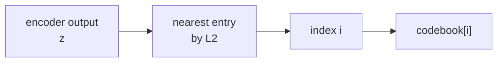
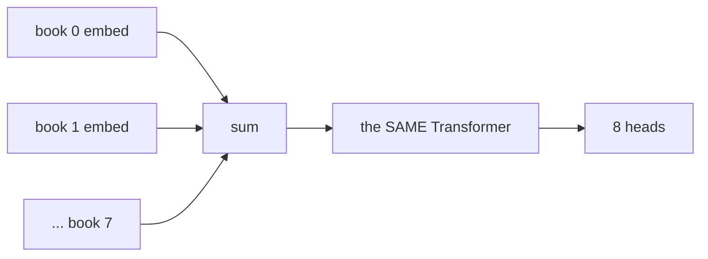
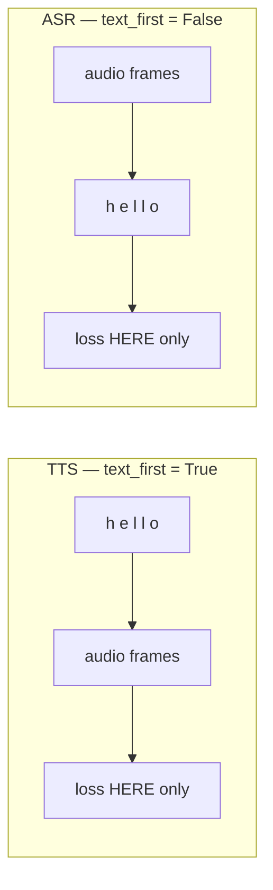

# 20 — Audio: the same transformer, on sound

> **The claim this chapter exists to test:** the transformer does not care what its tokens
> mean. Nothing in [`model/transformer.py`](../aksharallm/model/transformer.py) knows about
> words — it knows about integers and their order. So if something can turn a waveform into
> integers and back, the entire stack already built here works on sound without being told.

That something is a **codec**, and it is the only genuinely new piece of machinery in the
phase. Everything else — the pretraining loop, RoPE, GQA, the KV cache, the sampler, the
quantizer, LoRA, the portal — arrives unchanged.



Four pieces, strictly ordered because each needs the one before it:

| # | module | what it is | cost |
|---|---|---|---|
| 1 | `io.py`, `features.py` | waveform → log-mel, and Griffin-Lim back to sound | CPU, instant |
| 2 | `vq.py`, `codec.py` | the RVQ-VAE. The one new training loop | hours on the 3090 |
| 3 | `delay.py`, `lm.py` | the existing transformer over codec tokens | hours |
| 4 | `text.py`, `speech.py` | TTS and ASR, as one model in two orders | hours |

---

## Part 1 — the front end

A waveform at 16 kHz is 16,000 numbers a second and almost none of them mean anything alone.
What means something is **which frequencies are present, and when**.



Three steps there are worth a sentence each.

**Why a window.** Cutting a frame out of a signal multiplies it by a rectangle, whose
Fourier transform is full of side-lobes — so one pure tone smears across every bin
(*spectral leakage*). A Hann window tapers to zero at both ends, trading a slightly wider
main lobe for side-lobes ~30 dB lower. It is also what makes the transform **invertible**:
at a hop of `n_fft/4` the overlapping Hann windows sum to a constant (the COLA condition),
so overlap-add reconstructs the original exactly. `tests/test_audio.py` asserts that to
1e-5, because if it is not true then every reconstruction number in the codec is partly a
measurement of the window.

**Why mel.** 513 linear bins spend most of their resolution above 4 kHz, where hearing
barely distinguishes anything. The mel scale is roughly linear below 1 kHz and logarithmic
above it. Collapsing onto 80 triangular filters throws away what we cannot hear.

**Why log.** Loudness is perceived logarithmically and raw magnitudes span six orders of
magnitude; a network trained on linear magnitudes spends its capacity on the loudest frames.

**Griffin-Lim** then guesses the phase back — start from random phase, invert, re-transform,
keep the original magnitudes with the new phase, repeat. The reason to build it is not
quality; it is that **you can listen to what the model sees**:

```
.venv/bin/python -m aksharallm.audio tone --out /tmp/tone.wav
.venv/bin/python -m aksharallm.audio spec /tmp/tone.wav
.venv/bin/python -m aksharallm.audio roundtrip /tmp/tone.wav --mel
```

Measured here: momentum earns its name. At 30 iterations, spectral convergence is **0.137**
with `momentum=0` and **0.040** with `momentum=0.99` — 30 fast iterations beat 100 plain
ones. The `momentum/(1+momentum)` denominator in the update is not decoration; feeding the
raw momentum in overshoots and converges *worse* than no momentum at all.

### Resampling, from scratch

LJSpeech is 22,050 Hz and LibriSpeech is 16,000, and the codec must see one number or its
token rate means two different things in one dataset. Resampling is not "take every other
sample" — that folds every frequency above the new Nyquist rate down into the audible band
as a tone that was never there, and it cannot be undone. `io.resample` reconstructs the
band-limited signal with a Kaiser-windowed sinc and reads it at the new times, with the
sinc **stretched** when going down so its cutoff drops to the lower Nyquist rate. That one
factor is the whole of anti-aliasing.

Measured: a 10 kHz tone resampled 22,050 → 16,000 comes out **700× quieter**, not folded to
6 kHz. Round-tripping 16k → 22.05k → 16k is accurate to **1e-5**.

> **A bug worth keeping.** The polyphase kernel table is indexed by the *residue*
> `(j·down) mod up`, not by `j`. Indexing a table built in `j`-order by that residue is
> still a valid resampler and merely time-warps by up to one sample — inaudible on a low
> tone, and it destroyed a 6 kHz one (round-trip error 3e-5 → 0.77).

---

## Part 2 — the codec



**The arithmetic that decides everything.** 16,000 samples a second downsampled by 320 is
**50 frames a second**. Eight codebooks of 1,024 entries is 10 bits each, so 80 bits a frame
= **4 kbps**, against 256 kbps for the 16-bit PCM it came from — a **64× compression**. And
50 × 8 is the sequence length the transformer downstairs pays for: ten seconds of speech is
4,000 tokens. The frame rate is the single most consequential number in the phase.

### Vector quantization, and its three problems



1. **There is no gradient.** `argmin` differentiates to zero everywhere, so the encoder
   would never learn. The **straight-through estimator** outputs the codebook entry forward
   and pretends the quantizer was the identity backward: `z + (q − z).detach()`. Detach the
   wrong side and it trains smoothly and reconstructs noise.
2. **The codebook has to learn too**, and straight-through gives it nothing. We use an
   **EMA** — the same k-means step, without the optimizer, which is far less sensitive to
   the learning rate. A codebook is not really a parameter being descended; it is a set of
   centroids being tracked. It is a `buffer`, not a `Parameter`, so weight decay cannot
   quietly shrink every entry towards the origin between updates.
3. **Codebook collapse is [router collapse](14-moe.md) again.** A handful of entries win
   early, receive all the assignments, and the rest never train — so a 1,024-entry codebook
   is quietly a 40-entry one, reconstruction plateaus, *and the loss curve looks fine*. Same
   countermeasures: usage counted every step, plus **dead-code restart** — an entry nobody
   has chosen for `restart_after` steps is reinitialised to a random encoder output, which
   is a place we know data actually lives.

**Residual VQ** is one idea on top: quantize `z`, quantize what the first codebook got
*wrong*, and repeat. Two properties fall out, and both are used:

- **the prefix is a valid code**, so bitrate becomes a decode-time dial rather than a
  property of the checkpoint. That is the demo of the phase;
- **the codebooks are ordered by importance**, which is what the delay pattern exploits.

### The reconstruction loss

**Not L2 on the waveform.** That is phase-sensitive: shift a signal by one sample — 60
microseconds, inaudible — and the loss is enormous. The loss that works is on **STFT
magnitudes at several window sizes**: short windows catch transients (the burst of a /t/),
long ones catch pitch. Each scale contributes two pieces, doing opposite jobs:

| term | dominated by | fixes |
|---|---|---|
| spectral convergence, on linear bins | the **loud** parts | the formants |
| L1 on **log-mel** bands | the **quiet** parts | the noise floor, the breath |

> **Why the log term is on mel bands and not FFT bins — measured, not assumed.** One
> 2,048-point frame of a harmonic signal has magnitudes spanning **6e-6 to 211**, and more
> than half the bins sit at or below any sane floor. An L1 on *their* logs is mostly a
> measurement of FFT numerical noise: a one-sample circular shift scored **0.66**. A mel
> band sums dozens of bins and is never at the numerical floor. The fix is structural, not
> a better-chosen epsilon.

An adversarial term on top is what takes a codec from "clearly the same words" to "hard to
tell apart", and it is deliberately **not** here: a GAN that fails to converge is
indistinguishable from a codec that fails to converge.

### Running it

```bash
# no download, ~30 s, 13 minutes of synthetic vowel babble
.venv/bin/python -m aksharallm.audio corpus --out data/audio/synth --clips 400
scripts/audio.sh codec-synth

# the real thing: 24 h of one reader, 2.6 GB download
.venv/bin/python -m aksharallm.audio fetch ljspeech
.venv/bin/python -m aksharallm.audio pack data/audio/ljspeech/LJSpeech-1.1/wavs --out data/audio/lj
scripts/audio.sh codec-lj
```

Measured on the synthetic corpus, 1,500 steps, ~4 minutes on the 3090 at **168 audio-seconds
reconstructed per wall-clock second**: loss 20.6 → 6.0, val 7.10 → **5.48**, codebook usage
climbing from 1.5% to 38% as dead-code restart does its work. The bitrate ladder at that
point:

| codebooks | kbps | vs PCM | convergence | MCD dB |
|---|---|---|---|---|
| 1 | 0.45 | 569× | 0.714 | 13.66 |
| 2 | 0.90 | 284× | 0.694 | 11.89 |
| 4 | 1.80 | 142× | 0.685 | 11.83 |
| 8 | 3.60 | 71× | 0.676 | 12.11 |

That is a **bad codec** — 1,500 steps is a smoke test, and the numbers are here to show the
machinery works and the ladder is monotone, not to claim quality. `configs/codec-lj.yaml`
budgets 150,000 steps.

---

## Part 3 — the delay pattern

The codec hands the language model **eight integers per frame**, and they are not
independent: codebook 2 quantizes the error codebook 1 left behind. Three ways to handle
that:

```
flatten     →   [c⁰₀ c¹₀ … c⁷₀ c⁰₁ …]     8x the positions. 10 s becomes 4,000 tokens.

parallel    →   predict all 8 of frame t at once from frames < t.
                Fast, and WRONG: it assumes the eight are independent given the past,
                and the whole point of a residual is that they are not.

delay       →   book 0:  c⁰₀  c⁰₁  c⁰₂  c⁰₃
                book 1:   ·   c¹₀  c¹₁  c¹₂
                book 2:   ·    ·   c²₀  c²₁
                book 3:   ·    ·    ·   c³₀
```

Codebook *k* shifted right by *k* frames. Now everything in one column can be predicted at
once, because by the time `c¹₀` is predicted, `c⁰₀` is already in the past and visible. The
sequence grows from `T` to `T + N − 1` — eight extra positions on five hundred — instead of
to `8T`, and the dependency chain is preserved rather than assumed away.

**Trap 4 lives here**, and it is gotcha #2's family: an off-by-one trains perfectly and
generates garbage, because the decoder is handed codebook 1 of frame 5 alongside codebook 0
of frame 4 and reconstructs an interleaving of two moments. The defence is that
`undelay(delay(x)) == x` is asserted exactly, and the padding is a **distinct token id**
rather than a zero that could be mistaken for code 0.

### What the model changes

Almost nothing, and that is the point. `Transformer.forward` gained two optional arguments,
both exact no-ops on every existing path:

- `inputs_embeds` — the audio LM sums eight embeddings per position, one per codebook, so it
  supplies them itself. Concatenating instead would make `d_model` depend on `n_codebooks`;
  summing works because the tables are separate, so code 5 of book 0 and code 5 of book 3
  are different vectors.
- `return_hidden` — it needs **eight heads**, because the eight codebooks have eight
  unrelated vocabularies and a single head over `8 × 1024` would let the model put mass on a
  book-3 code while predicting book 0.



**The number to watch is `ln(codebook_size)`.** At step 0 a uniform distribution over 512
codes costs exactly `ln 512 = 6.238` nats. Measured on the first line of the smoke run:
**6.3145**. That is the cheapest possible check that the delay pattern, the target masking
and the eight heads are all wired correctly — the same argument as the DPO loop's
`ln 2 = 0.6931`.

**And the loss is not what says it is working.** A codec LM's loss falls smoothly while it
generates plausible gibberish, because most of the entropy lives in the high codebooks,
which are nearly noise and cannot be predicted by anyone. Sample audio and listen.

---

## Part 4 — TTS and ASR

Both directions are one idea already implemented in [`train/sft.py`](05-posttraining.md):
**put two things in one sequence and take the loss on only one of them.**



That is the assistant-only mask with audio in the assistant's role. The only thing audio
changes is *what* is on each side.

**Text is character level**, not the repo's BPE, for one reason: **TTS needs a spelling, not
a meaning.** A BPE merge turns "nation" into one token, which is what a language model wants
and what a text-to-speech model cannot use — it has to know the sequence is n-a-t-i-o-n to
make those sounds in that order.

**Decoding follows the task, not the codebase.** `speak` samples (greedy TTS is a flat
monotone, because the most likely continuation of any prosody is the average of all
prosody); `transcribe` is greedy (transcription has a right answer and sampling can only
move away from it).

### The honest-measurement problem

**TTS cannot be scored by a number.** Mean opinion score needs humans. What we report:

| number | what it sees | what it misses |
|---|---|---|
| spectral convergence | whether the loud spectrum is in the right place | phase — robotic but correct |
| **MCD** | the spectral *envelope* — formants, i.e. which vowel | pitch, timing, noise |
| **WER** (ASR) | whether the words came out | everything about how they sound |
| intelligibility | our ASR's WER on our TTS output | quality. **It is not quality.** |

Two traps here, both guarded:

- **MCD assumes frame-for-frame alignment.** True for a codec, where the output is the input
  reconstructed. False for TTS, where the model may say the right words at a different rate
  — that is *correct* and scores terribly. Reporting an unaligned MCD as if it meant
  something is the mistake `speech.py`'s docstring exists to prevent.
- **Intelligibility is self-referential.** A bad ASR model makes a good TTS model look bad,
  so the ASR model's own WER on real speech has to be reported beside it.

> **MCD needed rescuing, and the story is the lesson.** With an *absolute* log floor it
> scored a clip against itself-plus-inaudible-noise (amplitude 1e-4, 77 dB down) at **86 dB**
> — the metric was not measuring the signal at all, because a mel band 120 dB down is
> numerically far from one 160 dB down and *perceptually identical to it*. With a **relative**
> floor 40 dB below the clip's own peak, the same comparison scores **0.23 dB**, noise 34 dB
> down scores **4.2 dB** (the published "very close" band), and it rises monotonically with
> distortion. The constant is calibrated, not guessed — and because it is calibrated on
> constructed distortions rather than against a published toolchain, it is a number to
> compare *our* checkpoints with, not one to put beside a paper's.

### The corpus that makes this measurable

`synth_corpus` writes **its own transcripts**, because we chose the vowel sequence and
therefore know it exactly. That is what makes TTS and ASR trainable and — more to the point
— *measurable*, with a real word error rate, before anyone has downloaded 2.6 GB. It is
source-filter synthesis: a pulse train at `f0` (the vocal folds) through three resonators at
the formant frequencies (the throat and mouth). Which vowel you hear is set entirely by
where F1 and F2 sit.

---

## What goes wrong

Seven traps, written down before building, and how each one landed:

1. **Codebook collapse is router collapse.** Same countermeasures as [MoE](14-moe.md): EMA
   updates, dead-code restart, the commitment term, per-codebook usage logged every step.
   *Hit immediately* — the first run collapsed to perplexity 1.0 by step 50, and the fix was
   **seeding the codebook from the first batch's encoder outputs** rather than from
   `randn·0.02`. A codebook whose scale does not match the encoder's is a codebook where one
   entry is nearest to everything.
2. **L2 on the waveform is nearly useless** — phase-sensitive. Multi-scale STFT instead, and
   the log term on *mel* bands (see above).
3. **The straight-through estimator.** Detach the wrong side and it trains smoothly and
   reconstructs noise. Pinned by a test that the gradient through the quantizer is exactly 1.
4. **The delay-pattern off-by-one.** Pinned by `undelay(delay(x)) == x`.
5. **Sample rate, channels and normalisation are asserted, not silently fixed.** `load_audio`
   records what it changed; `pack` refuses a corpus that mixes sample rates; the codec
   trainer refuses a corpus whose rate differs from its config.
6. **Audio tokens are a different vocabulary** — a separate checkpoint family. `load_codec`
   refuses a text checkpoint by name rather than failing on mismatched keys.
7. **TTS cannot be scored honestly by a number.** Handled above.

An eighth, found here: **the codebook must not run in bf16.** Under autocast the encoder
output is bf16, so the EMA ran in bf16 too — and bf16 has eight bits of mantissa, while an
EMA with decay 0.99 adds one percent of a centroid per step. One percent is below the
dtype's own resolution, so the codebook would have quietly stopped moving. The quantizer now
forces float32 internally and casts the straight-through output back, so the decoder keeps
its fast dtype.

---

## What it buys

The bitrate ladder, **audible in a browser**:

```bash
.venv/bin/python -m aksharallm.audio reconstruct checkpoints/codec-synth/ckpt_best.pt \
    data/audio/synth/wavs/synth-0399.wav --codebooks 1,2,4,8
```

Four files plus the original. The trade becomes something you hear rather than something you
read — and it is the same trade [quantization](10-quantization.md) makes silently in the
weights.

## The code, in reading order

Read [doc 3](03-model.md) and [doc 4](04-pretraining.md) first if you have not: parts 3 and 4
are that chapter's model, unchanged, over different integers.

| # | file | what to look for |
|---|---|---|
| 1 | [`audio/io.py`](../aksharallm/audio/io.py) | `read_wav` (8-bit WAV is *unsigned*), then `resample` — the phase table, and why the residue is the index |
| 2 | [`audio/features.py`](../aksharallm/audio/features.py) | `stft`/`istft` and the COLA argument; `mel_filterbank`'s unit-area normalisation; `griffin_lim`'s `momentum/(1+momentum)` |
| 3 | [`audio/dataset.py`](../aksharallm/audio/dataset.py) | `pack` and the assertion rule, then the clip-boundary rule in `AudioDataset`. `synth_corpus` last — it is a voice, written out |
| 4 | [`audio/vq.py`](../aksharallm/audio/vq.py) | `VectorQuantizer.forward` (the float32 line, the straight-through line), then `_seed` and `_update`'s restart. Then `ResidualVQ` — six lines that make bitrate a dial |
| 5 | [`audio/codec.py`](../aksharallm/audio/codec.py) | `Snake`, `Down`/`Up`'s asymmetric padding, then `ReconstructionLoss` — the two terms and what each fixes |
| 6 | [`audio/config.py`](../aksharallm/audio/config.py) · [`configs/codec-synth.yaml`](../configs/codec-synth.yaml) | diff it against [`codec-lj.yaml`](../configs/codec-lj.yaml); that diff is what scaling to real speech costs |
| 7 | [`audio/train_codec.py`](../aksharallm/audio/train_codec.py) | the module docstring's "what to watch, in order of how badly it goes wrong". Then the shared STOP/pid/jsonl contract |
| 8 | [`audio/measure.py`](../aksharallm/audio/measure.py) | the table at the top — what each metric cannot see — then `cepstrum`'s relative floor |
| 9 | [`audio/delay.py`](../aksharallm/audio/delay.py) | the ASCII diagram, then `delay` and `undelay`. Twelve lines, and trap 4 |
| 10 | [`audio/lm.py`](../aksharallm/audio/lm.py) | `AudioLM.__init__` (why the body's own head is unused), then `forward`'s shift — it happens on the *delayed* sequence, which is the whole trick |
| 11 | [`audio/text.py`](../aksharallm/audio/text.py) · [`audio/speech.py`](../aksharallm/audio/speech.py) | why character level; then `tts_batch` against `asr_batch` — one flag apart |
| 12 | [`aksharallm/audio/__main__.py`](../aksharallm/audio/__main__.py) · [`portal/audio.py`](../aksharallm/portal/audio.py) | the two front ends, over one set of functions |

What pins it: [`tests/test_audio.py`](../tests/test_audio.py) and
[`tests/test_codec.py`](../tests/test_codec.py) — including the three regressions above
(bf16 codebooks, `spectral_convergence`'s argument order, MCD's absolute floor), the exact
`undelay(delay(x))` round trip, and that a stage with an **odd** stride downsamples by
exactly that stride.
