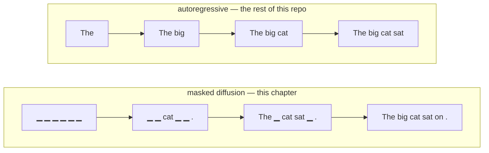
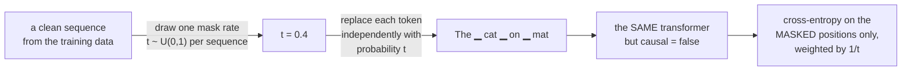
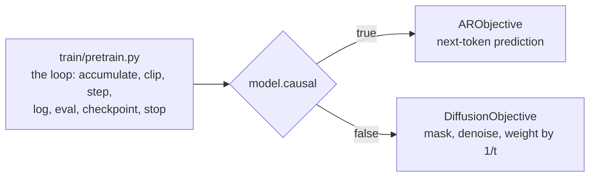
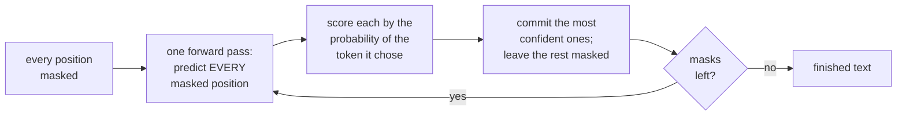
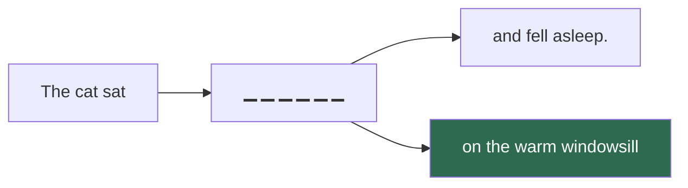

# 20. Diffusion: writing a sentence in the order you are sure of

Every model in this project so far writes strictly left to right. Token 5 is chosen knowing
tokens 1–4 and nothing else, and once chosen it is never revisited. That constraint is not a
law of language modelling — it is a *design*, and it buys one specific thing: because a
causal model may never look right, it can be trained on every position of every sequence at
once, and it can cache its own past when generating.

A **masked diffusion language model** gives that up and gets something else. It is trained
to fill in blanks, with every position able to see every other one, and it generates by
filling the blanks it is most confident about first — in whatever order that turns out to
be.



Read the bottom row twice. The model committed `cat` and the full stop *first*, because they
were the positions it was surest about, and then filled in around them. Nothing forced it to
decide the beginning of the sentence before the end.

That single change gives two capabilities autoregression structurally cannot offer, and
costs one thing it structurally cannot avoid. This chapter is those three facts and the
~500 lines that implement them.

---

## Part 1 — the training objective, in full

Here it is, complete. There is no second half.



In code that is four lines (`diffusion/corrupt.py`):

```python
t      = t_min + (1 - t_min) * rand(B)          # one rate per sequence
masked = rand(B, T) < t[:, None]                # independent coin per position
x_t    = where(masked, MASK, x)                 # the corrupted input
loss   = (ce(model(x_t), x) * masked).sum(1) / (t * T)      # then .mean()
```

Compare that with pretraining's objective, which is also four lines and also the whole
story. **The only thing that changed is what the loss is computed on.** Everything else — the
optimiser, the schedule, gradient accumulation, mixed precision, checkpointing, the stop
file, the throughput counter — is machinery for surviving days of wall-clock, and none of it
knows or cares. That is why there is no `train/diffusion.py` in this repo: `train/pretrain.py`
asks an **objective** for a batch and a loss, and there are two objectives.



### Why the `1/t`

This is the one part of the formula that is not obvious, and it is worth getting right in
your head rather than accepting.

Suppose two sequences in a batch: one masked at 10%, one at 90%. Without the weight, the
second contributes nine times as much loss simply for having nine times as many terms in its
sum. The model would spend most of its capacity on near-blank sequences — the hardest and
least informative corruptions — and almost none on the light ones.

Dividing by `t` cancels that exactly, because `t` is the *expected* fraction masked. Every
mask rate then contributes the same expected weight, and the model learns to denoise at
every difficulty. This is also, not coincidentally, exactly the weight that makes the whole
expression a **variational bound** (an ELBO) on the log-likelihood of the clean sequence —
so the number you are minimising is a real bound on a real quantity, not a heuristic.

`t_min` exists because `1/t` is unbounded. The estimator is fine in expectation as `t → 0`
(nothing is masked, so the sum is empty), but a single sequence that draws `t = 1e-9` *and*
happens to mask one token multiplies that token's cross-entropy by a billion. The optimiser
sees one enormous gradient, the clip swallows the entire step, and you have wasted a batch.
Clamping the draw to `[1e-3, 1)` makes this an exact ELBO for `t ~ U(1e-3, 1)` and gives up
a tenth of a percent of the range.

### One thing deliberately *not* done

A sequence whose draw happens to mask zero tokens contributes exactly zero. It would be tidy
to force "at least one mask per sequence" — and it would bias the estimator, because zero is
the correct value of an empty sum. Tidy and biased loses to untidy and correct.

---

## Part 2 — generation, which is the forward process run backwards

Training corrupts. Generation uncorrupts. Start from a sequence that is *entirely* mask and
walk back.



Run with `--show-trace` and you can watch it. This is a real trace from our own 13.8M model
after **1,360 steps** — twelve steps over forty-eight positions, abridged:

```
[  0] 'Once upon a time▁▁▁▁▁▁▁▁▁▁▁▁▁▁▁▁▁▁▁▁▁▁▁▁▁▁▁▁▁▁▁▁▁▁▁▁▁▁▁▁▁▁▁▁'
[  1] 'Once upon a time,▁ a a▁▁▁▁.▁▁▁▁▁▁▁▁▁▁▁▁▁▁▁▁▁▁▁▁▁▁▁▁▁▁▁▁▁▁▁▁▁'
[  2] 'Once upon a time,▁ a a▁ girl named Lily.▁ loved▁▁▁▁▁▁▁▁▁▁▁▁▁▁▁▁▁▁▁▁▁'
[  3] 'Once upon a time, there a a little girl named Lily. She loved to▁▁▁▁▁▁▁▁▁▁▁▁▁▁'
[  5] '... She loved to play▁ her toys▁▁▁. One day,▁▁▁▁▁▁ a▁▁▁▁▁'
[  8] '... play with her toys with her friends. One day, Lily▁s to▁▁ in a big▁. The▁ was▁'
[ 12] '... One day, Lily went to the park in a big tree. The tree was very tall'
```

Look at step 1: the model committed a comma, two `a`s and a full stop before it had decided
anything about the content. Those are the positions it was surest about. By step 2 it has
`girl named Lily.` and the sentence has a skeleton; everything after that is filling in
around a structure it already committed to.

**Why confidence, and not left-to-right?** Because the easy positions constrain the hard
ones. Punctuation, the second half of a word, a name that already appeared — those are
nearly free, and once committed they are context for everything else. Committing in
confidence order lets the sequence resolve from its skeleton outwards. The alternative is
implemented (`--remask random`) precisely so you can watch it be worse.

**How many to commit** follows a linear schedule: after step *i* of *N*, `n·(N−i)/N`
positions remain masked. Nothing is ever un-committed, which makes this equivalent to the
"remask the least confident" formulation in the papers with the bookkeeping done once.

### The capability that has no autoregressive equivalent: infilling

Look again at what generation does. It fills positions that are masked, using everything
that is not. There is nothing in that sentence about *where* the unmasked positions are.



Give the model a prefix *and* a suffix and it writes the middle, conditioning on both. An
autoregressive model cannot do this at all without being retrained on a fill-in-the-middle
objective, because it has no mechanism for conditioning on text that comes *after* what it
is writing. Here it is not a feature — it is the same code path with the fixed positions in
a different place. That is `infill()`, and it is nine lines.

### The other one: choosing how much compute to spend

An autoregressive model generating 64 tokens does 64 forward passes. That number is not
negotiable. A diffusion model doing the same 64 tokens in 8 steps does **8** forward passes,
committing 8 positions per pass. In 64 steps it does 64 and commits one at a time, which is
the highest-quality end of the same dial.

So `steps` is a quality/latency knob with no equivalent on the other side. The catch is in
the next section.

---

## Part 3 — what it costs

### There is no KV cache, and there cannot be

A KV cache is the memo an autoregressive model keeps because **position *n*'s keys are
settled the moment it is generated** — nothing later can change them, so they are computed
once and reused for every subsequent token. That is the entire reason AR generation is
`O(T)` cached passes rather than `O(T²)`.

In a diffusion model, every position can change on every step. A cached key would belong to
a token that no longer exists.

|  | autoregressive | masked diffusion |
|---|---|---|
| forward passes for T tokens | T (each cheap, cached) | `steps` (each over the whole T) |
| cost per pass | O(T) with a cache | O(T²), always |
| `infer/generate.py` | this is it | does not transfer |
| `KVCache`, `IncrementalDecoder` | load-bearing | meaningless |

`Transformer.forward` raises if it is handed a cache with `causal: false`, rather than
computing something that looks like an answer. Getting this wrong is the classic failure of
this area — it trains fine and generates fluent nonsense.

### It is less data-efficient, by a lot

Next-token prediction gets a training signal at **every position of every sequence**. Masked
diffusion gets one only at the masked positions — at `t ~ U(0,1)`, half of them on average,
and that half is weighted so it is worth about one position's information. Published scaling
comparisons put the gap at roughly **3–16x the compute** for equal quality, depending on the
task.

This is why the diffusion run in this repo is at **13.8M on TinyStories** and will never be
the main model. It is here to be understood.

### And the number you must not compare

An autoregressive run's val loss is the exact per-token cross-entropy of held-out text.
`exp()` of it is a genuine perplexity.

A diffusion run's val loss is a Monte-Carlo estimate of an **upper bound**.

|  | AR val loss | diffusion val loss |
|---|---|---|
| what it is | exact NLL per token | an ELBO — an upper bound on it |
| `exp()` of it | perplexity | an upper bound on perplexity |
| lower is better | yes | yes |
| comparable with the other column | **no** | **no** |

If the baseline reads 1.472 and the diffusion run reads 1.9, the diffusion model is **not**
"0.43 worse". It is "at most this bad, by an unknown margin". The trainer prints `ppl <=`
rather than `ppl` for exactly this reason, and `elbo()` returns the key
`ppl_upper_bound` rather than `ppl` so that nothing downstream can quietly put the two in
one table.

The comparison that *is* honest is the text, plus the two capabilities: can the model infill,
and what does quality do as you turn `steps`.

### The diagnostic with no AR equivalent

`loss_by_t` plots cross-entropy against how much of the sequence was masked. Measured on our
own 13.8M model at step 1,360:

```
mask rate    ce (nats)
       5%       1.29   #######
      15%       1.40   ########
      25%       1.68   ##########
      35%       1.87   ###########
      45%       2.17   #############
      55%       2.56   ###############
      65%       2.88   #################
      75%       3.50   ####################
      85%       4.24   #########################
      95%       5.23   ###############################
```

At 5% the model is doing a cloze test with almost all the context; at 95% it is nearly
writing from scratch, and it costs four times as many nats. That whole spread averages into
the **one** number the val curve shows. A model that is good only at the left of this chart
will produce excellent infills and poor unconditional samples — and the single val number
will not say so. Read this before concluding anything about a diffusion checkpoint.

---

## Part 4 — what had to change in the repo

Remarkably little, which is the point of having built the pieces separately.

| Piece | Change |
|---|---|
| `config.py` | two keys: `model.causal` and `model.mask_token_id`, plus a `diffusion:` section. `is_diffusion` makes a **checkpoint self-describing** — every loader already round-trips `model_config` |
| `model/transformer.py` | `self.causal` threaded to the SDPA call and to our Triton kernel (which already took the flag); a refusal when handed a KV cache. RoPE is fine bidirectionally and needed nothing |
| tokenizer | **untouched.** The same `tokenizer.json` the baseline used, so both runs see identical text |
| vocabulary | +1 id for `[MASK]`, at `vocab_size`, past anything the tokenizer can emit. This is what breaks checkpoint compatibility: the embedding matrices are different shapes |
| `train/pretrain.py` | the loss became an object. `ARObjective` is what was already there, extracted |
| `diffusion/` | corrupt + loss (~120 lines), generation (~200), evaluation (~120), objective (~120) |
| `infer/` | **nothing.** It does not transfer, and it is not made to |

### Two traps, both already paid for

**The model must never write `[MASK]` into its own output.** It has seen that id in its
*input* on every training step, so it does assign it probability. A committed mask token is
a position that can never be filled, and the sequence comes back with a hole in it. One
line: `logits[:, mask_id] = -inf` before sampling.

**Confidence is the probability of the token actually chosen, not the maximum.** With
temperature above zero those differ. Using the maximum would rank a position the model is
sure about — but which we just sampled *against* — as though it were settled, and commit a
token nothing supports.

And one that is not a trap but a rule: the validation masking uses a **fixed seed**. With a
fresh draw every evaluation, "best val" would be partly a record of which corruption was
kindest, and a curve that jitters by more than it improves teaches nothing.

---

## Part 5 — running it

```bash
scripts/experiment.sh tiny-diffusion         # ~8,000 steps, same budget as the baseline
```

Same launcher, same stop/resume, same portal Start button, same log format as every other
run — because it *is* the same trainer. Watch two things on the step line:

* **`ce`** — the unweighted cross-entropy on masked positions. The loss itself is
  `1/t`-weighted and has no intuitive scale; `ce` does. It is "how surprised was it by a
  token it could not see", in nats.
* **`masked`** — the realised mask rate. It should hover near 50%, which is the mean of
  `U(0,1)`. If it does not, the Bernoulli draw is not using the `t` the weight divides by.

### What five minutes of it looks like

The build was verified with a **1,360-step** run (5 minutes on the 3090, at 240k tok/s and
26% MFU — `compile: false`, so there is headroom). It is far too short to compare with
anything, and it is enough to see the machinery work:

| | at step 1,360 |
|---|---|
| val NELBO | 2.850 (⩽ ppl 17.3) — an upper bound, see above |
| `ce` on masked positions | 3.65 nats, from ln(8193) = 9.01 at initialisation |
| realised mask rate | 46–56%, i.e. the mean of `U(0,1)` |
| sample | *"Once upon a time, there was a little girl named Lily. She loved to play with her toys and her dolls. One day, Lily went to a walk when she saw a big dog."* |

Grammatical TinyStories in five minutes, from a model that has never once been asked what
comes next. The full 8,000-step run against the baseline is a couple of hours.

Then, on the finished checkpoint:

```bash
python -m aksharallm.diffusion tiny-diffusion generate --show-trace --steps 32
python -m aksharallm.diffusion tiny-diffusion infill \
    --prefix "The cat sat" --suffix "and fell asleep." --length 12
python -m aksharallm.diffusion tiny-diffusion elbo
python -m aksharallm.diffusion tiny-diffusion by-t
```

or open the portal's **Diffusion** tab, which drives exactly these and animates the trace —
the sequence resolving from all-masked to text is the thing to look at, not the final string.

## The code, in reading order

Read [doc 5](05-pretraining.md) first if you have not: this chapter replaces exactly one
component of it, and the diff is the lesson.

| # | file | what to look for |
|---|---|---|
| 1 | [`configs/tiny-diffusion.yaml`](../configs/tiny-diffusion.yaml) | four fields different from `configs/tiny.yaml`. Diff them — that is the whole experiment |
| 2 | [`diffusion/corrupt.py`](../aksharallm/diffusion/corrupt.py) | `corrupt`, then `diffusion_loss`. Four lines of arithmetic; the docstring is why each one is that way. Note what `stats` separates: the weighted loss and the interpretable `ce_masked` |
| 3 | [`aksharallm/config.py`](../aksharallm/config.py) | `causal`, `mask_token_id`, `is_diffusion`, `DiffusionConfig` — and the `__post_init__` refusals (a sliding window, or `causal: false` with no mask id) |
| 4 | [`model/transformer.py`](../aksharallm/model/transformer.py) | `self.causal` in `Attention.__init__`, the three places it reaches (`flash_attention(causal=)`, `is_causal=`, the cache refusal in `forward`). That is the entire architectural change |
| 5 | [`train/pretrain.py`](../aksharallm/train/pretrain.py) → `ARObjective`, `objective_for` | the seam. Then find the four call sites in `main()` and confirm the loop never asks which objective it has |
| 6 | [`diffusion/objective.py`](../aksharallm/diffusion/objective.py) | the other implementation of that seam, including `check()` — the vocabulary rule that makes the two paradigms' checkpoints incompatible |
| 7 | [`diffusion/generate.py`](../aksharallm/diffusion/generate.py) → `diffusion_generate` | the loop. The `-inf` on the mask id, confidence as the chosen token's probability, the linear schedule, and `trace` — then `infill`, which is the same call with the fixed positions moved |
| 8 | [`diffusion/evaluate.py`](../aksharallm/diffusion/evaluate.py) | `elbo` (and why it seeds its own generator) and `loss_by_t` (and why it evaluates at fixed `t` rather than binning draws) |
| 9 | [`aksharallm/diffusion/__main__.py`](../aksharallm/diffusion/__main__.py) · [`portal/diffusion.py`](../aksharallm/portal/diffusion.py) | the two front ends, over one set of functions and one results directory |

What pins it: `tests/test_diffusion.py` — including the test that the model's prediction at
position 0 *changes* when the last token changes (bidirectional attention, asserted rather
than assumed), that a KV cache is refused, and that no `[MASK]` survives generation.
