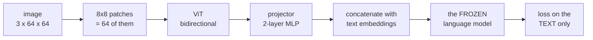

# 21 — Vision: a picture, into a model that has never seen one

> [Doc 20](20-audio.md) needed a codec to turn a waveform into integers. An image needs
> nothing of the sort: it is **already** a grid of numbers, so cutting it into patches
> produces a sequence directly. What is left is a bridge — and the bridge is two matrices.



**That is LLaVA, and its contribution was not an architecture.** It was noticing that a
*frozen* language model will accept vectors from a vision encoder if you train a small MLP
to put them in the right place. The language model's input space is not a code to be cracked
— it is a space the model has already learned to read, and anything placed usefully inside
it gets read.

Measured here on the 13.8M TinyStories model: **0.82M trainable parameters against 13.77M
frozen ones**, and the run is minutes.

---

## The corpus, and why it is synthetic

```
"three red circles"     "one blue square"     "four yellow triangles"
```

Rendered from a description we chose, so the caption is **known exactly**. That is what makes
this measurable rather than merely demonstrable: a caption model trained on COCO can only be
judged by reading its output, while this one can be *scored* — did it get the count, the
colour, the shape? — by anyone, in seconds, with no download and no human.

```bash
.venv/bin/python -m aksharallm.vision corpus --out data/vision/shapes --images 8000
.venv/bin/python -m aksharallm.vision show data/vision/shapes --out /tmp/grid.png
```

Three decisions in the renderer are load-bearing:

- **positions are jittered.** With fixed positions, "three circles" becomes "the pattern with
  ink at these coordinates" — a lookup, not a count, and it generalises to nothing;
- **shapes never overlap**, because a corpus whose labels are ambiguous cannot be scored;
- **one (colour, shape) pair is held out** — purple triangles. Both attributes are common
  everywhere else, so a model that has merely memorised pairs fails while a model that has
  learned to compose them does not. It costs one tuple and it is the only question here that
  memorisation cannot answer.

---

## The tower

**Patches are a convolution.** Cutting a 64×64 image into 8×8 patches and projecting each is
*exactly* `Conv2d(3, d, kernel_size=8, stride=8)` — same arithmetic, one kernel call.
`patchify` writes it as an explicit reshape because the shape is worth seeing once, and
`test_vision.py` asserts the two are equal.

**Position embeddings are learned and absolute, not RoPE.** RoPE encodes *relative* position
along one axis and an image has two; there is no ordering of patches for which "the patch
before this one" means anything consistent. This is the one place the vision tower
deliberately does not reuse the language model's machinery.

**Attention is bidirectional.** A patch at the top-left should see the bottom-right — there is
nothing to predict left to right. That is the same `causal: false` idea [doc 19](19-diffusion.md)
introduced, reused unchanged.

**And `n_tokens` is the trade worth understanding.** 64 patches is 64 positions of the
language model's context spent on one picture — 6% of a 1,024-token window. Pooling to 16
costs detail and buys context, and it is one config field.

---

## What the model changed

**Nothing.** `Transformer` is imported and frozen. The seam it goes through — `inputs_embeds`
— was added for [audio](20-audio.md) and is unchanged here, which is the strongest form of
the claim both phases exist to make.

The two mistakes the code is shaped to prevent:

**Unfreezing by accident.** `requires_grad = False` is not enough on its own. An optimizer
built over `model.parameters()` still holds the frozen weights, and **weight decay moves them
without consulting the gradient**. So `trainable_parameters()` is the single place that
decides, and a test asserts the language model is bit-identical after a training step.

**Counting image tokens wrong.** The loss offset, the first caption position and the
generation prompt all depend on exactly how many vectors the image became. That number is
`VisionTower.n_image_tokens` and nothing recomputes it.

---

## Results

```bash
.venv/bin/python -m aksharallm.vision.train configs/vision-shapes.yaml
```

2,000 steps, minutes on a 3090, scored on held-out images:

| step | count | colour | shape | **all three** | held-out *combination* |
|---|---|---|---|---|---|
| 400 | 78% | 100% | 59% | 47% | 0% |
| 800 | 97% | 100% | 84% | 84% | 0% |
| 1,200 | 100% | 100% | 97% | 97% | 38% |
| 1,600 | 100% | 100% | 100% | **100%** | 31% |

Colour is learned almost immediately, shape takes longer, and counting — which needs the
attention to aggregate across patches rather than read one — comes last. That ordering is
the interesting part of the table.

**The held-out column is the one to look at.** The model never saw a purple triangle and
describes one correctly about a third of the time. Not solved, and not zero: it has partly
learned to compose an attribute with a shape rather than memorise the pair. With five
colours and three shapes there is not much pressure to generalise, and that number is the
obvious thing to try to move.

---

## The bug, because it is the one this phase is about

At 2,000 steps the first version reached a training loss of **0.0027** — essentially perfect
— and captioned every image as `'w green'`.

Two shifts had stacked. `VisionLanguageModel.forward` slices the text hidden states starting
one position *early*, so the last image token is what predicts caption token 0 — that slice
**is** the shift. The batch builder then also shifted the targets, in the ordinary
`targets = r[1:]` way every other trainer in this repo uses. The model learned, perfectly, to
emit the token *after* next; generation reads the last position expecting the next one.

It is gotcha #2's family — **trains fine, generates garbage** — and nothing about the loss
curve could have said so. What caught it was `score_batch`: three booleans per caption, asked
every 400 steps, which said `count 0% colour 50% shape 44%` while the loss said 0.003.

> The general rule, now for the fourth time in this repo: **when a model's output has a right
> answer, check the output.** A loss is a proxy, and a proxy that is being optimised is the
> last place a misalignment will show up.

---

## What is not here

- **Real images.** `read_image` handles any file Pillow can open, and the tower does not care,
  but nothing has been trained on a real caption set. That is a download and a longer run.
- **Stage two.** LLaVA's second stage unfreezes the language model and fine-tunes on
  instruction data. `freeze_language_model: false` exists and is untested at scale.
- **The 300M.** Everything above is against the 13.8M. The seam is identical; the run is not.

## The code, in reading order

Read [doc 3](03-model.md) first if you have not, and [doc 20](20-audio.md) for the seam this
reuses.

| # | file | what to look for |
|---|---|---|
| 1 | [`vision/image.py`](../aksharallm/vision/image.py) | `render` and `caption_of` — a corpus whose ground truth is a dict we chose. Then `synth_corpus`'s `hold_out`, which is the compositional test in one tuple |
| 2 | [`vision/encoder.py`](../aksharallm/vision/encoder.py) | `patchify` (and that it equals a strided conv), then `Projector` — two matrices, and the whole of LLaVA |
| 3 | [`vision/lm.py`](../aksharallm/vision/lm.py) | `trainable_parameters` (why `requires_grad` alone is not "frozen"), then `forward` — and read the comment on the `n_img - 1` slice twice |
| 4 | [`vision/train.py`](../aksharallm/vision/train.py) | `make_batch` — the unshifted targets, and why. Then the docstring's "what to watch", which is `all_three` and not the loss |
| 5 | [`configs/vision-shapes.yaml`](../configs/vision-shapes.yaml) | `n_tokens`: how much of the language model's context one picture costs |
| 6 | [`aksharallm/vision/__main__.py`](../aksharallm/vision/__main__.py) | `caption` — the three attributes scored separately, because a model that never counts is a specific failure a single accuracy would average away |

What pins it: [`tests/test_vision.py`](../tests/test_vision.py) — `patchify` against the
convolution, the frozen language model asserted bit-identical after an optimizer step, and
the shift regression that produced `'w green'`.
