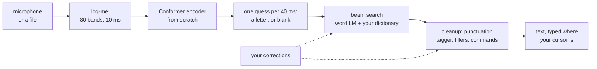
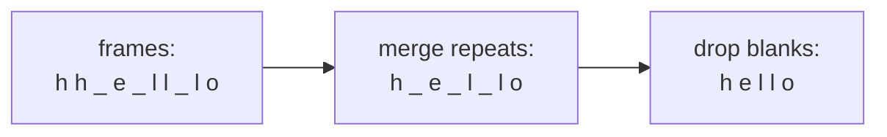
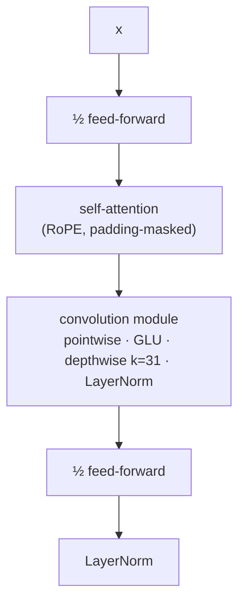
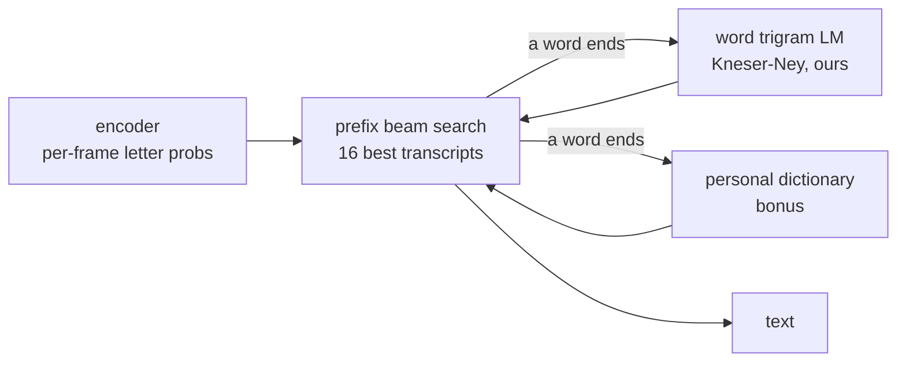
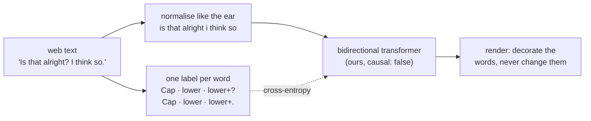
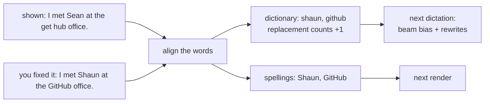
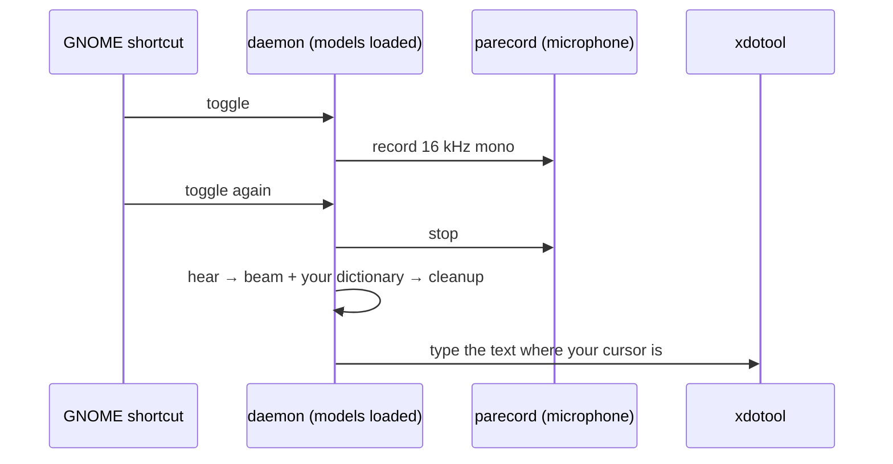
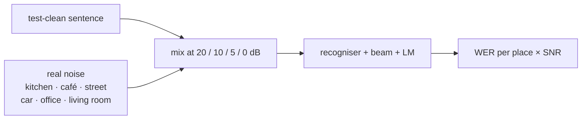
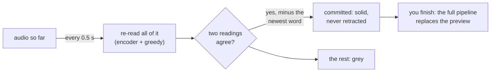

# 23. Speech recognition: dictation that is still right on day two

> [Doc 21](21-audio.md) taught the transformer to *make* sound. This chapter goes the other
> way: sound in, text out — and then finished, punctuated text, typed into whatever window
> your cursor is in. It is Phase 7 — a dictation system — and it is built around a list a dictation company published of what goes wrong with a weekend clone
> **once someone actually uses it.** Every item on that list is a failure you can measure, so
> the chapter is the recogniser *and* the measurements.



**Route A: the ear is ours.** There is a cheaper road — put a "day-two layer" (dictionary,
corrections, cleanup) on top of an existing recogniser — and it was declined, because it
would be the one place in this repo where the core model is not hand-written. A local Whisper
is allowed in exactly one role: a **baseline row** in a results table. Being an order of
magnitude behind it is the expected, honest outcome of training on one card, and it gets
written down rather than hidden.

---

## The day-two list

| # | What goes wrong | What we do about it | The number |
|---|---|---|---|
| 1 | It writes words nobody said ("thank you for watching") | CTC instead of a text decoder, **and** training on clips with nothing to say | characters written on five no-speech clips — **must be 0** |
| 2 | Accents | multi-speaker data; never report only the mean | WER **per speaker**, the worst beside the median |
| 3 | Switching language mid-sentence | per-segment language id | WER on a mixed set — *not built yet* |
| 4 | Names (Shaun or Sean?) | beam search biased by a personal dictionary | words the LM has never seen: **5% → 50%** recalled with a dictionary on test-clean, 13 written where not said |
| 5 | Never learns from a correction | a correction → dictionary word + spelling at once, → replacement rule when seen twice | a replay over test-clean's repeated unseen words: **8% right on first hearing → 54% after one correction**, 0 false insertions |
| + | Cleanup puts words in your mouth | a punctuation **tagger** that labels words and cannot write one | words in the cleaned text the recogniser did not write: **0** over 52,583 |

All but 3 are measured, together, by `python -m aksharallm.asr daytwo` (§ The day-two suite).
3 is not built: the recogniser is English-only.

---

## From sound to a picture (reused)

The front end is [doc 21](21-audio.md)'s, pointed at a different job: an STFT, a mel
filterbank we built, a log. Two numbers change, to the speech-recognition standard — a
**25 ms window every 10 ms** (`n_fft: 400, hop: 160`) rather than the codec's 64/16 —
because a recogniser cares about *when* a sound starts more than about its exact pitch.

One detail is new and worth knowing: **the end of each clip is zero-padded, not reflected.**
`stft(center=True)` reflects both edges, which is right for one clip on its own. In a
*batch*, a short clip sits next to a long one and its tail is the batch's zero padding — so
a reflected tail would make its last frame depend on who it was batched with. The start is
still reflected (a hard edge is a click), the end is zeros either way, and a test asserts an
utterance gives the same output alone and in a batch.

---

## CTC: learning to transcribe without knowing *when* anything was said

A transcript says "hello". The audio says it over 0.6 seconds — fifteen encoder frames.
Nobody labelled which frame is the `h`. **Connectionist Temporal Classification** solves
this by not choosing: the model emits one distribution per frame over the alphabet **plus a
blank**, and the loss is the probability of *every* frame-level path that collapses to the
transcript.



The blank does two jobs. It means "nothing new on this frame", which is most frames. And it
is the only thing that can keep a double letter apart — `l l` merges into one `l`, so
"hello" needs `l _ l`. That is also why a transcript of *L* letters needs at least
*L + (doubled pairs)* frames, and an utterance with fewer is **impossible**: its loss is
infinite. The data loader filters those out and **counts** them by reason, and the trainer
logs `skipped` in case the filter and the encoder ever disagree about the frame rate.

**Summing over every path is a dynamic programme.** Interleave blanks into the label,
`_ h _ e _ l _ l _ o _`, and let `alpha[t, s]` be the probability of all paths that have
used *t + 1* frames and are on position *s*. A path at *s* came from *s* (stayed), *s − 1*
(advanced), or *s − 2* (skipped a blank — legal only between two *different* letters).
That is the whole of [`asr/ctc.py`](../aksharallm/asr/ctc.py)'s forward pass.

**It is written from scratch and pinned to PyTorch.** `ctc_loss` matches `F.ctc_loss`
**bit for bit in float64** at LibriSpeech lengths (500 frames, 200 letters), with mixed
lengths, an empty target and an impossible alignment in one batch, and the gradient matches to
1e-9. The backward pass is *not* autograd through a 500-step Python loop — it runs the same
recursion backwards (`beta`) and uses the identity that `alpha + beta` is the posterior of
each frame being each position. Memory is one table. Two choices matter more than they look:
"unreachable" is `-1e30`, not `-inf` (a `logsumexp` of all `-inf` has a `nan` gradient), and
everything runs in float32 whatever the model's dtype — gotcha 14's family.

**It is the reference, not the default — measured.** A Python loop over frames is
thousands of tiny kernel launches, and on the card that costs far more than the arithmetic:

| | CPU | RTX 3090 |
|---|---|---|
| CTC forward+backward, ours | 196 ms | **195 ms** |
| CTC forward+backward, `F.ctc_loss` | 45 ms | **1.3 ms** |
| whole step, 20M Conformer, 80 s of audio, ours | – | 169 ms = 475 audio-s/s |
| whole step, same, `F.ctc_loss` | – | **52 ms = 1,544 audio-s/s** |

(CTC rows at 400 frames × 25 utterances × 240 letters; CPU row at 32 × 200.) So
`train.ctc_impl` defaults to `torch`, exactly as `model.attn_impl` defaults to `sdpa` — and it
is the FlashAttention story again ([doc 4](04-model.md)): the hand-written version is how you
learn it and what the fast one is checked against, and the bit-for-bit test is what makes the
swap safe. `asr-synth.yaml` keeps `ours`, so it still trains for real. A fused Triton CTC
would close the gap; it is not written.

---

## The encoder: a Conformer

Speech has structure at two scales at once. A phoneme is **local** — 50 to 100 ms of formant
movement, exactly what a convolution sees. A word's identity often is **not**: "two" or "too"
depends on the sentence. Attention gets the second and convolution the first, and a
Conformer block interleaves them:



Before the blocks, two stride-2 convolutions cut 100 frames a second to **25** — enough for
English's ~15 letters a second with room to spare, and 16× cheaper attention than 100 would be.

**Pre-norm, not the paper's layout — and this one was learned the hard way.** The paper ends
every block with a LayerNorm. On LibriSpeech that pinned the residual stream at |x| ≈ 16
while the sub-layers learned to emit vectors of norm 100–500 that did not change over time;
add one to the other and normalise, and the constant wins. By **block 4** two different
utterances had identical hidden states, so for 11,737 steps (two hours) the model gave every
input the same transcript — `"e e a a i"` for both "the twenties" and "to pickle eggs" — at
~100% WER, with a loss that had stalled at the letter-frequency guess (~2.5 per letter). The
loss curve looked like a slow run, not a broken one. Pre-norm — no per-block norm, one after
subsampling (whose output measured |x| = 584) and one before the head, the layout
`model/transformer.py` uses — fixed it. Same seed, same 2,000 steps:

| | val loss at 500 / 1,000 / 1,500 | CER | transcripts | silence |
|---|---|---|---|---|
| per-block LayerNorm (paper) | 2.94 / 2.86 / 2.72 | 100 → 83 → 73% | identical for every input | up to 100 chars |
| **pre-norm** | 2.51 / 2.05 / **1.69** | 64 → 53 → **43%** | follow the audio | **0** |

How it was found, because it is the reusable part: two different inputs, the same output, so
measure the *difference between two utterances' hidden states* layer by layer — 0.52 at block
1, 0.09 at block 2, 0.000 at block 4 — then each sub-layer's norm and its variation over
time. `asr.block_norm: true` still exists, only so checkpoints trained before the fix load.

Reused, not rewritten: RoPE is `model/rope.py`'s (the language model's own positions — the
Conformer paper used Transformer-XL relative positions, and RoPE is relative too). The
attention is **bidirectional**: the encoder hears the whole utterance before committing.
Streaming dictation would want chunked attention; that is a later piece.

**A batch of speech is mostly padding**, so three things guard it:

1. **No BatchNorm.** The paper's convolution module uses it; its statistics would average real
   frames with padding, and differently in training (batch statistics) than at inference
   (running ones). LayerNorm is per frame and cannot see the padding.
2. **Padding is zeroed before every depthwise convolution.** A 31-frame kernel reaches 15 frames
   (600 ms) past the end of an utterance.
3. **Normalisation statistics use valid frames only.**

`tests/test_asr.py` mutation-checks all three: remove any one and a test goes red.

---

## The finding: our own model invented words on silence

The plan said CTC makes day-two problem 1 structurally impossible, and it was half right. CTC
**cannot** do what a text decoder does — write a fluent sentence with no audio under it,
because it emits exactly one symbol per frame. But it **can** label a frame of noise as a
letter if nothing ever told it otherwise.

The first smoke run (synthetic vowels, 300 steps) wrote something on **every** no-speech clip,
digital silence included: `'aa aa'` on silence, `'ee e eh e ee ee ehe'` on −50 dBFS hiss. Two
causes, separated by a four-way experiment (same seed, 300 steps):

| | normalisation | no-speech training clips | WER at step 200 | characters on silence |
|---|---|---|---|---|
| A | per utterance | none | 30.4% | **44** |
| B | global + random gain | none | 24.8% | 23 |
| C | per utterance | 10% of rows | 24.8% | **0** |
| D | global + random gain | 10% of rows | 33.5% | **0** |

* **Training on clips with an empty transcript is the fix** — 44 → 0 whatever the
  normalisation. A recogniser trained only on speech has correctly learned that *there is
  always something to say*. CTC handles an empty target natively (one path: blank everywhere),
  so it costs nothing. The clips come from [`asr/noise.py`](../aksharallm/asr/noise.py):
  coloured noise, tone stacks, clicks, at −70 to −15 dBFS.
* **Per-utterance normalisation hides loudness.** In the log domain a gain is an additive
  offset, so subtracting each clip's own mean removes its level, and dividing by its own
  spread scales faint hiss up to exactly the variance of speech. Global statistics (measured on
  the training corpus and saved in the checkpoint) plus a random ±dB gain keep "this is nearly
  silent" visible while still teaching "microphones differ". Alone it only halved the problem.
* **The WER column means nothing here** — ±3.5 points on ~160 words. It is printed because
  leaving it out would be choosing the flattering half.

**The fix had a trap of its own, found on the first LibriSpeech batch.** PyTorch's CTC `mean`
divides each row by its transcript length, and a no-speech row's length is zero — clamped to
one, a 16-second silent row is ~400 frames × 3.4 nats in a single term. Step 0 read **621**
with a gradient norm of **29,000**, and a batch like that learns "always blank" before
anything else (the easy way for CTC to fail). An empty row is now divided by its *frame*
count — per frame is the same scale as per letter — and step 0 reads **5.5**. A test pins it.

Two honesty notes. The training noise and the check's five clips come from **different
generators** (a test asserts the trainer never produces a check clip), but they are related
families — a hum is a tone stack. The honest test is **real recorded noise** (the MUSAN
corpus), which is a later download. And `global` is the default on this evidence, which is
thin: the LibriSpeech run is where it gets decided.

---

## Data: LibriSpeech, and the one tool we did not write

| corpus | size | used for |
|---|---|---|
| `data/audio/synth-asr` | 13 min, generated | smoke tests — transcripts exact, no download |
| LibriSpeech `train-clean-100` | 100 h, 251 speakers, 6.3 GB | the first real run |
| LibriSpeech `dev-clean` | 5.4 h, 2,703 utterances | validation (WER at every eval) |
| LibriSpeech `test-clean` | 5.4 h, 2,620 utterances | the number everyone publishes |

LibriSpeech ships as FLAC. **`ffmpeg` decodes it, and only decodes it.** Writing a FLAC
decoder is a week spent on a file format — plumbing, by this repo's own rule. But `ffmpeg` will
also silently resample or downmix, and *that* is a change to the data. So
[`asr/data.py`](../aksharallm/asr/data.py) reads the sample rate, channels and sample count
from the file's own STREAMINFO header (forty lines), refuses anything that is not 16 kHz mono
16-bit, and refuses a decode whose length disagrees with the header.

Packed, a split is the codec's format — `audio.bin` (int16) + `manifest.json` — plus
`transcripts.json`. Batches are **length-bucketed** under a *padded-seconds* budget
(`data.max_batch_seconds`), because utterances run 1–35 s and a random batch of 32 is mostly
padding; the buckets are then drawn at random, so the model never trains in length order.

---

## Measuring it

**Word error rate** is substitutions + deletions + insertions over the words actually said.
5% is one word in a twenty-word sentence. Three rules in
[`asr/measure.py`](../aksharallm/asr/measure.py):

* **Corpus WER, not a mean of per-utterance rates.** Averaging rates weights a two-word
  utterance with one error (50%) the same as a forty-word one (2.5%). A test pins it.
* **Per speaker, with the worst named** (day-two problem 2). An average is exactly where an
  accent problem hides — the same argument as [doc 13](13-eval.md)'s per-domain loss.
* **The silence check runs at every eval**, so `silence_chars` is a curve beside `val_wer`,
  not a one-off.

**`val_wer` chooses `ckpt_best.pt`, not `val_loss`.** CTC loss keeps falling long after greedy
WER has stopped improving — the model grows more confident about paths it already gets right.
`session_start` records `metric: "wer"` so nothing downstream reads `best_val` as a loss.

What to expect: an untrained CTC model writes **nothing** (the blank is in every path, so it
wins every frame). Then spaces and common letters, then words. A small Conformer-CTC on 100 h
lands around **6–10% WER on test-clean** with greedy decoding and no language model.

---

## Spelling: beam search with a word list

The first LibriSpeech run reached **12.77% WER on test-clean, greedy — but only 3.98% CER**.
One wrong letter costs a whole word, and the wrong letters were *spelling*, not hearing:
"stew" → "stoo", "carrots" → "karots", "counselled" → "countlled". The model hears the sounds
and spells them phonetically, because a decoder that picks one character per frame has no idea
which words exist. Two pieces fix that, both from scratch:



**A word language model** ([`asr/ngram.py`](../aksharallm/asr/ngram.py)): interpolated
Kneser-Ney trigrams, counted with numpy over LibriSpeech's own LM corpus — **803M words of
public-domain books, 204M distinct trigrams, built in 8 minutes**, perplexity **172 on
dev-clean, 179 on test-clean**. Kneser-Ney's idea in one example: "francisco" is common, but
only after "san", so its *backoff* estimate counts how many different words it follows, not how
often it occurs. Every count is an `np.unique` over three word ids packed into one int64; a
lookup is `np.searchsorted`. Two things about the corpus that cost thought:

* **It is sorted alphabetically** (line 20M is "JULIA PERSISTED"), so "the first N words" is a
  sample made entirely of sentences starting with "a". `--every N` takes one line in N across
  the whole file instead; `--max-words` is a prefix and says so.
* **Its authors excluded the books the test audio comes from — checked rather than trusted.**
  23 of test-clean's 2,535 sentences (0.91%) occur verbatim in it: mostly stock phrases ("he
  could wait no longer"), and a few genuine lines from other editions of the same fairy tales.
  Small, and on the record.

**CTC prefix beam search** ([`asr/decode.py`](../aksharallm/asr/decode.py)) keeps the best 16
transcripts so far and sums the frame paths into each one; when a word ends it adds `α · log
P(word | previous two)` and a per-word bonus `β`. Words the LM has never seen score as `<unk>`
plus a penalty — the dial between "karots" (should lose to "carrots") and "quilter" (a real
name, which should still be writable). The penalty is charged **the moment the letters stop
being the start of any known word**, not at the word's end: the LM only speaks at word
boundaries, so an unfinished misspelling otherwise looks free beside finished words that have
paid, and a strong α fills the beam with them (α = 1.0 took dev WER from 14% to 46% before this).

**Tuned on dev-clean only** (`asr tune`: the encoder runs once, each grid point is only a
search). Three grids, 60 points, because the first two put their best on an edge. Then
test-clean was scored **once**, with what dev chose — α 0.8, β 2.0, `<unk>` −24:

| decoder | test-clean WER | CER | worst speaker | unseen words right | written where not said |
|---|---|---|---|---|---|
| greedy | 12.77% | 3.98% | 23.3% | – | – |
| beam + word LM | **7.88%** | 3.09% | 15.5% | 5% | 0 |
| beam + LM + dictionary | **7.68%** | 3.03% | 15.5% | **50%** | 13 |

A **38% relative cut**, at ~1,800× real time (encoder 6.5 s, search 4.4 s for 5.4 hours of
audio on 12 processes). The worst speaker improved more than the median, which is the shape
you want. "karots" and "countlled" are fixed; "stoo" is not — it occurs in the books.

**The `<unk>` penalty is a trade, and the names column is what it costs.** On dev-clean:
−12 gives 8.08% WER and 12% of unseen words right; −24 gives 7.52% and 7%. A harsher penalty
fixes more misspellings by refusing to write any word the LM does not know — which is
day-two problem 4 exactly: the name becomes the nearest word it does know (a test pins
"shaun" → "san", from "san francisco").

**The personal dictionary** is that mechanism with a bonus: a word in it gets `word_bonus`
when it completes, no `<unk>` penalty, a score floor of a rare word (a small LM gives `<unk>`
log P ≈ −50 and no bonus recovers that), and `prefix_bonus` per letter while it is being
spelt — refunded if the letters turn out to spell something else, so the words it merely
starts like are not nudged. **One bug here is worth knowing**: the early `<unk>` charge first
fired *while a dictionary word was being spelt* — "ambrosch" paid ~−19 the moment it left the
LM's vocabulary, fell out of the beam, and never reached the end where the refund was. Right
on paper, fatal in a search. Fixed, dictionary recall on dev went **20% → 51%**. The test
above gives the dictionary exactly the test set's unseen words — the scenario of a user who has
added their contacts — and counts the price: 13 dictionary words written where nobody said them.

---

## From words to writing: the cleanup

The recogniser writes what LibriSpeech transcripts look like — `is that alright i think so`.
Dictation has to hand back `Is that alright? I think so.` Punctuation is not audible frame by
frame; it is a property of the sentence, so it is a second model's job.

**That model is a tagger, not a rewriter, and that is the whole design.** The obvious tool is
a language model asked to "tidy this transcript", and a language model asked that will
sometimes *improve* a word, drop one, or finish your sentence for you — day-two problem 1
coming back one layer up. A tagger cannot. For each word it picks one of **twelve labels**:
what follows the word (nothing , . ?) times how it is cased (lower, Capitalised, UPPER). It
never emits a word, so `render` can only *decorate* the recogniser's words, and a property
test feeds it 300 random label sequences and checks that every word comes back unchanged.



**The training data is free**: any punctuated text, with the punctuation and capitals deleted,
is a training pair. [`dictate/punct.py`](../aksharallm/dictate/punct.py) does that to
FineWeb-Edu on the fly, and its rules are the part worth reading, because each one decides
what the tagger is taught:

* the text is normalised to **exactly the recogniser's alphabet** (`a-z` and `'`) — a model
  trained on input the ear never produces is trained for a different job;
* a sentence holding anything the ear cannot write (a digit, `e.g.`, a URL) is **dropped
  whole**, not cleaned — deleting "1984" from "In 1984, he left." teaches a comma after "in";
* a line that does not end in `.`, `?` or `!` is a heading or a list item, and is dropped;
* four punctuation classes, not eight: `!` and `;` are taught as `.`, `:` and dashes as `,`.

About 42% of FineWeb's words survive those rules, which is plenty.

**There is no `train/punct.py`.** It is the pretraining loop with a **third objective**
([`dictate/tagger.py`](../aksharallm/dictate/tagger.py) `TaggerObjective`), beside
next-token prediction and masked diffusion ([doc 20](20-diffusion.md) made the seam). So it
stops, resumes, logs, reports and appears on the Dashboard like every other run. The
classifier is the embedding matrix: `model.tag_classes: 12` adds twelve rows to the
vocabulary that the tokenizer can never emit, and the logit for label *k* is the hidden state
dotted with row `tag_base + k` — nothing about the transformer changes, the same trick masked
diffusion uses for `[MASK]`. The label sits on the **last BPE piece of each word**, the
position that has seen the whole word. One thing cost a measurement: building a batch is CPU
work (decode, normalise, re-encode), and reading four 256-token windows per row from a 17 GB
file was half of it — one 1,024-token window per row plus a worker pool took a step from 0.28
to 0.16 s. The windows are still *drawn* by the dataset's own generator, so a resume reads
what an unbroken run would have.

**How it is judged: per-class F1, never accuracy.** About 85% of words take no punctuation,
so a tagger that never punctuates scores 85% accuracy. `dictate punct-eval` scores `,` `.` `?`
and capitals on held-out passages, beside a **rules-only baseline** (capital first, full stop
last). Measured on the full run (`scripts/experiment.sh punct`: 20,000 steps, 61 minutes on
the 3090), 300 held-out passages, 32,538 words, beside the 2,000-step verification run that
came first:

| | tagger P / R / F1 (20k steps) | F1 at 2k steps | rules only F1 |
|---|---|---|---|
| comma | 73% / 65% / **69%** | 59% | 0% |
| full stop | 85% / 82% / **83%** | 72% | 7% |
| question mark | 87% / 73% / **80%** | 64% | 0% |
| capital | 89% / 87% / **88%** | 79% | 16% |

The comma is the hard one, and it should be: whether a clause takes a comma is often a matter
of style, and the held-out text's own writers disagree with each other.

Its mid-run sample at step 1,500 reads *"Hello Mary. How was your trip to Paris? Did you see
the Eiffel tower? I hope the weather was good. We had rain, snow and wind all week, but
tomorrow should be better."* — from `hello mary how was your trip to paris did you see…`

**The rest of cleanup is rules, and every removal is listed** in the result
([`dictate/cleanup.py`](../aksharallm/dictate/cleanup.py)): fillers from a closed list (`um`,
`uh`, `erm`… — not `like` or `you know`, which are sometimes meant); **new line** and **new
paragraph**; and **scratch that**, which deletes back to the start of the sentence you are in,
as the tagger sees it. Spoken punctuation ("comma", "full stop") is deliberately not a
command: every one of them is also a word. Three rules sit on top of the tagger because a rule
that is always right beats a model that is usually right: the first word and every word after
`.`/`?` are capitalised, `i` is always `I`, and the text ends with a full stop.

---

## Learning from corrections (day-two 5)

A dictation app that writes "Sean" every time you say "Shaun", however often you fix it, is
the one that gets uninstalled. [`dictate/personal.py`](../aksharallm/dictate/personal.py)
compares what was shown with what you changed it to (word alignment with `difflib`) and keeps
three kinds of memory, each with its own threshold because each does different damage when it
is wrong:

| memory | example | learned after | what it does |
|---|---|---|---|
| dictionary word | `shaun` | 1 correction | the beam search leans towards it (§ Spelling) |
| spelling | `github` → `GitHub` | 1 correction | casing at render time |
| replacement | heard `sean` → `shaun` | **2** identical corrections | rewrites the words before cleanup |



Two refusals keep it honest. **A fix between two words the LM already knows teaches nothing**:
"their" → "there" is a grammar fix in one sentence, not a rule for every "their" from now on
(and not a word to bias the decoder towards either). **A changed span longer than three words
is a rewrite** — you changed your mind — and is logged but not learned from. Everything is in
`logs/dictate/`: `personal.json` and `corrections.jsonl` (every correction and what was
learned from it).

---

## The day-two suite

`python -m aksharallm.asr daytwo asr-libri100` runs every check on one corpus in one pass and
writes `logs/asr/daytwo-*.json` ([`asr/daytwo.py`](../aksharallm/asr/daytwo.py)). **Measured
on test-clean (2,620 utterances, 30 s on the CPU after the encoder):**

| # | failure | result |
|---|---|---|
| 1 | words on silence | **0 characters** on 5 no-speech clips |
| 2 | some voices much worse | WER 7.88%; best speaker 3.4%, median 7.6%, **worst 15.5%** |
| 3 | language switching | **not built** — the recogniser is English-only |
| 4 | names | 132 unseen words: **5% → 50%** recalled with them in a dictionary, 13 written where not said |
| 5 | never learns | **8% → 54% → 38% → 54% → 62% → 60%** (see below), 0 false insertions |
| + | cleanup invents words | **0 invented, 0 dropped** over 52,583 words |

**Check 5 is a replay, and it is the one worth reading.** For each of the 13 words the LM has
never seen that occur in four or more test utterances ("montfichet", "boolooroo",
"servadac"…), the utterances holding it are dictated **in order**, each with whatever a fresh
memory has learned so far, and after each one the transcript is corrected to the reference,
exactly as a person would fix it. A system that learns has a rising curve; one that only says
it learns has a flat one. Ours goes from **8% on first hearing to 54% after one correction** and
holds around 60%. It does not reach 100% because a dictionary can only *favour* a word whose
letters the ear already roughly heard — "servadac" heard as two words is not rescued by a
bias on one — which is what sound-alike matching (below) is for. **Beside the curve, the cost:
0 of the 17 learned words were written into any of 200 utterances that never say them.**

---

## On the desktop: dictate into any app

The pipeline above is one class, `Dictator`
([`dictate/pipeline.py`](../aksharallm/dictate/pipeline.py)), and three things drive it: the
CLI, the portal, and a **background daemon** that a keyboard shortcut talks to.



**Why a daemon**: loading the recogniser, the 3.6 GB word LM and the tagger takes seconds, and
the beam search's word-prefix table another nine (measured: the first dictation after a cold
start took 9.1 s, the second **181 ms for 9.6 s of speech**). A hotkey that took seconds to
start listening would lose the first words of every sentence, so the daemon loads everything
once — including that table — and the shortcut runs a tiny client that only talks to its
socket. **Why toggle, not hold-to-talk**: a GNOME custom shortcut runs a command on press and
has no release event. The desktop pieces are other programs on purpose — `parecord` for the
microphone, `xdotool` to type, `xclip` for the clipboard, `notify-send` to say what is
happening — and `dictate status` lists any that are missing with the line that installs them.
X11 only: Wayland does not let one program type into another's window this way.

### Using it, step by step

1. **Once:** `sudo apt install xdotool xclip` — without them the text cannot be typed into
   another app, and lands in a notification and the portal's history instead.
2. **Once:** `python -m aksharallm.dictate install-shortcut` (or **Install** in the portal).
   It appears in Settings → Keyboard → View and Customise Shortcuts → Custom Shortcuts as
   *aksharallm dictation*. Other keys: `--binding '<Ctrl><Alt>space'` — `--binding` needs a
   value; on its own it is an error.
3. **After every reboot:** `python -m aksharallm.dictate daemon --bg` (or **Start it** in the
   portal). It takes ~10 s to load; until then a key press says "still loading".
4. Click into any text box, press **Super+Alt+D**, wait for "Listening…", speak, press it
   again. The text is typed where your cursor is.

`python -m aksharallm.dictate status` says which of these is missing.

### What runs from the portal

Everything except the two that cannot: installing system packages needs your password, which
a web page must not ask for, and the portal cannot restart itself from its own page (after
updating the code, `scripts/portal.sh --restart`).

| command | in the portal |
|---|---|
| `scripts/experiment.sh punct` | Dashboard: pick **punct** in the run picker, Start |
| `dictate punct-eval` | Dictation → **Score the punctuation** |
| `asr daytwo` | Dictation → **Run all the checks** |
| `dictate daemon --bg` / `--stop` | On your desktop → **Start it** / **Stop it** |
| `dictate install-shortcut` / `uninstall-shortcut` | On your desktop → **Install** (with a keys box) / **Remove** |
| `dictate status` | the On your desktop panel |
| `dictate file`, `correct`, `dictionary`, `history` | the Dictate panel: file picker, **Teach it**, word chips and Add, Recent dictations |
| `dictate clean` | Dictate → *Try the cleanup without speaking* |
| `asr fetch` / `pack` (test-other, train-clean-360) | Run it from here → Speech data |
| `asr noise fetch`, `asr robust` | How noise hurts it → **Download the noise** / **Run the noise test** |
| `asr myvoice record` / `clear` | Your voice, as a test set → **Record this sentence** (one sentence per take); **Delete this take** / **Delete all my recordings…**; **Score my voice** runs `asr eval` on it |
| `dictate stream-eval` | How noise hurts it → The live preview, measured → **Measure it** |
| `scripts/audio.sh asr-libri460` | Dashboard: pick **asr-libri460**, Start |
| `sudo apt install xdotool xclip` | not runnable — shown beside each missing tool |

**The shortcut installer reads back every value it writes, and this is why.** The first
version reported `installed` and GNOME's Custom Shortcuts list stayed empty. With conda's
`base` environment active, `/opt/anaconda3/bin/gsettings` comes first on PATH, and conda's
copy is built without the dconf backend: it falls back to an in-memory store, so every `set`
succeeds and is forgotten when the process exits. No error, exit code 0. The installer now
calls the system `/usr/bin/gsettings` and reads each key back, and a value GNOME did not keep
is an error, not a success message.

Settings live under `dictate:` in `configs/portal.yaml` (recogniser, tagger, output mode —
`type`, `paste`, `clipboard` — and the recording limit). The beam weights are not copied
there: they are read from the best `asr tune` result, because α and β belong to a model + LM
pair and a hand-copied number goes stale the day either is retrained. Every dictation is
appended to `logs/dictate/history.jsonl` — what was heard, what was written and every step in
between — which is also what the portal's *fix* button corrects against.

---

## Harder tests: noisier speech, real noise, your voice

Every number above is on test-clean: audiobooks, good microphones, quiet rooms. That is the
most forgiving speech a recogniser will ever hear, so three harder tests sit beside it.

**test-other** is LibriSpeech's own hard half: the speakers the corpus authors' reference
system did *worst* on, so more accents, worse microphones and noisier rooms. Same model, same
LM, same weights:

| | test-clean | test-other |
|---|---|---|
| greedy | 12.77% | **32.46%** |
| beam + word LM | 7.88% | **24.63%** |
| worst speaker (beam) | 15.5% | **53.7%** |
| characters on silence | 0 | 0 |
| unseen words recalled (no dictionary) | 5% | 1% |

WER roughly triples. That is the normal gap for a model trained on 100 h of *clean* speech,
and it is the case for § More speech.

**Real recorded noise** ([`asr/robust.py`](../aksharallm/asr/robust.py),
`asr noise fetch` + `asr robust`). Six places from **DEMAND** (Thiemann, Ito & Vincent 2013,
CC BY 4.0; one microphone channel of each, 0.65 GB) — sounds the recogniser never heard in
training, which only ever saw the synthetic families in `asr/noise.py`. Each test-clean
utterance is mixed with a random stretch of each, at an exact **signal-to-noise ratio**: 20 dB
is a quiet room, 10 dB a busy café, 0 dB noise as loud as the voice. Speech power is measured
over the *voiced* frames only, because averaging LibriSpeech's pauses in would call a clip
quieter than it is and drown it in more noise than the label says. The noise segment is seeded
per utterance, so two checkpoints hear identical mixtures.



Measured on the first 400 test-clean utterances, beam + LM (clean: 5.7% on these 400):

| place | 20 dB | 10 dB | 5 dB | 0 dB |
|---|---|---|---|---|
| café | 6.6% | 15.1% | 33.6% | **64.1%** |
| street | 5.9% | 8.7% | 15.3% | 33.6% |
| living room | 6.4% | 10.3% | 16.8% | 32.8% |
| kitchen | 6.6% | 8.8% | 11.4% | 16.9% |
| office | 5.8% | 6.1% | 6.9% | 8.7% |
| car | 5.8% | 5.8% | 5.8% | **5.9%** |
| mean | 6.2% | 9.1% | 15.0% | 27.0% |

Two findings. **Other people talking is the worst noise there is**: café babble is made of the
same sounds the model is listening for. And **SNR alone does not predict damage**: the car is
as loud as the voice at 0 dB and costs nothing, because its energy is a rumble below the
frequencies speech uses. "How loud is the noise" is the wrong question; "where is it" is the
right one.

**Your own voice** ([`asr/myvoice.py`](../aksharallm/asr/myvoice.py)). Thirty fixed sentences
written for dictation — emails, plans, names, questions — each read once and stored as an
ordinary packed corpus, `data/asr/my-voice/`, speaker `me`. So `asr eval`, `asr daytwo` and
`asr robust` all work on it unchanged and its WER sits in the same table as test-clean's.
The prompts are versioned (`PROMPTS_VERSION`) for the same reason a benchmark's prompt format
is: a WER on different sentences is a different test. They are written in the recogniser's
alphabet (numbers as words), because the reference must be what a perfect transcript says. A
second take of a sentence *replaces* the first.

**One sentence per recording, and the code enforces it.** The first real session read six or
seven sentences into each take until the 30 s limit stopped it — the natural thing to do, and
fatal to the measurement: each take was stored against *one* sentence's reference, so every
other sentence in it would have scored as inserted words and made the recogniser look terrible
on that voice. A take longer than `4 s + words / 1.3` (a slow reader plus pauses; ~12 s for a
ten-word sentence) is now refused with the reason, the recorder stops itself at that limit, and
takes can be deleted one at a time or all at once (portal buttons, `asr myvoice clear [--id]`). Record them in the portal (*Your voice, as a
test set*) or with `python -m aksharallm.asr myvoice record`; recordings stay in `data/`, which
is never committed.

---

## More speech: train-clean-360

`configs/asr-libri460.yaml` is `asr-libri100.yaml` with **one change: the data** —
train-clean-100 + train-clean-360, 460 h and 1,172 speakers instead of 100 h and 251 — plus a
step budget sized to it (120,000 steps, ~29 passes, against asr-libri100's ~66 passes over its
100 h; ~9–10 h on the 3090 over several evenings). Same model, same augmentation, same
schedule shape, so the difference between the two checkpoints is what 4.6× more speech buys,
measured on test-clean, test-other, the noise table and your voice.

**Measured (2026-10-03).** 120,000 steps, 2 h 56 min of training on the 3090 (0.148 s/step,
2,650 audio-seconds per second — faster per step than the estimate). The beam was re-tuned on
dev-clean for this model, and the optimum moved: **α 0.8 → 0.5, β 2.0 → 1.0** — a better ear
needs less of the language model's opinion. Then each test set was scored once:

| | asr-libri100 (100 h) | **asr-libri460 (460 h)** |
|---|---|---|
| dev-clean, greedy (best during training) | 14.4% | **8.9%** |
| test-clean, greedy | 12.77% | **8.35%** |
| test-clean, beam + LM | 7.88% | **5.25%** |
| test-clean, + dictionary | 7.68% | **4.95%** |
| test-clean, worst speaker (beam) | 15.5% | **11.0%** |
| test-other, greedy | 32.46% | **23.37%** |
| test-other, beam + LM | 24.63% | **16.86%** |
| test-other, worst speaker (beam) | 53.7% | **41.2%** |
| real noise, mean at 0 dB | 27.0% | **21.4%** |
| café at 0 dB | 64.1% | **56.4%** |
| unseen words, with dictionary | 50% | **71%** |
| corrections replay, 1st → 2nd → 6th time | 8 → 54 → 60% | **0 → 69 → 100%** |
| live preview, settled words re-spelt | 3.7% | **1.85%** |
| characters on silence · words invented by cleanup | 0 · 0 | 0 · 0 |

Every row improved, and one of them settles an argument this chapter made earlier: the
corrections curve plateaued near 60% *because a dictionary can only favour a word whose
letters the ear roughly heard*. A better ear moved it to ~90% with no change to the dictionary
code. test-other is still three times test-clean: 460 h of *clean* speech helps everywhere and
does not close that gap — noisy training audio is the lever for that.

**A bug the second tuned model exposed.** Tuned weights were looked up as "the best dev
result for this LM", without asking which recogniser had been tuned. Harmless with one tuned
model; with two, the 100 h model would have decoded with the 460 h model's weights. The
lookup (`dictate/pipeline.py` `best_tuning`) now requires the run, and an untuned run says
"untuned" instead of borrowing. `configs/portal.yaml`'s `dictate.recognizer` is now
`asr-libri460`.

Getting the data costs disk, so the order matters: the archive is 23 GB, extracted FLAC another
23 GB, and the packed corpus ~42 GB (16-bit, like train-clean-100's 11 GB for 100 h). Delete the
archive once extracted and the FLAC once packed, and the peak is ~64 GB and the end state
+42 GB.

---

## Streaming: text while you talk

Dictation without a preview feels broken — twenty seconds of talking into silence. There are
two ways to show text early: a **streaming encoder** (attention limited to chunks,
convolutions that never look ahead, a bounded cost per 40 ms — a different, retrained model),
or **re-read the whole buffer every tick** with the model you have. This repo does the second
([`dictate/stream.py`](../aksharallm/dictate/stream.py)) because the measurement says it is
affordable: the encoder reads 5 s of audio in 36 ms on the CPU, 30 s in 154 ms and 60 s in
357 ms, so twice a second costs a fraction of real time for any sentence a person dictates.

The problem it then has to solve is **flicker**: each re-reading can change words the last one
showed. The rule is *local agreement* (Whisper-streaming's LocalAgreement-2): a word is
**committed** once two consecutive readings agree on it and everything before it, and the
newest word is never committed — the audio may end in the middle of it. Committed words are
shown solid and never retracted while you speak; the rest is shown grey. When you finish, the
full pipeline (beam, your dictionary, cleanup) runs once and replaces the preview.



Measured (`dictate stream-eval`), 200 test-clean utterances, a tick every 0.5 s. A word's
spoken end is read from the final reading's CTC alignment (40 ms resolution):

| rule | settles after (median / p90) | settled, then re-spelt by the final reading |
|---|---|---|
| **2 readings agree, hold back 1 word** (default) | **0.85 s** / 1.56 s | **3.7%** |
| 3 readings agree | 1.34 s / 2.18 s | 3.1% |
| hold back 2 / 3 words | 0.95 / 1.20 s | 3.8% |
| + 0.8 s guard at the audio's edge | 1.10 s | 3.6% |

A re-reading costs **18 ms** on the card and the cost grows with length (above). **The first
version of this table was wrong, and how is the lesson**: revisions were counted *by position*,
so one word inserted early made every later word look revised (5.3%); aligned properly it is
3.7%. And the guard was added on a hunch that the revisions were words cut off at the edge of
the audio — it barely moved them. Reading the cases showed why: "qushioned" → "cushioned",
"ardor" → "ardour". The encoder is bidirectional, so *later* audio legitimately re-spells
*earlier* words, and waiting longer buys little. So the default is the fastest row, and the
final pass replaces the preview anyway.

Where it shows: the portal's Dictate panel (solid + grey text as you talk), and the desktop
daemon's "Listening…" notification, which updates with the words so far. **The preview is
never typed into your app** — the final text differs from it by design, and typed text would
have to be deleted and retyped.

---

## Running it

```bash
# no download, a few minutes on a CPU
.venv/bin/python -m aksharallm.audio corpus --out data/audio/synth-asr --clips 400
scripts/audio.sh asr-synth

# the real one (~7 GB download; then hours on the card, stop/resume like any run)
.venv/bin/python -m aksharallm.asr fetch train-clean-100
.venv/bin/python -m aksharallm.asr pack train-clean-100      # likewise dev-clean, test-clean
scripts/audio.sh asr-libri100

.venv/bin/python -m aksharallm.asr eval asr-libri100 --corpus data/asr/test-clean
.venv/bin/python -m aksharallm.asr silence asr-libri100
.venv/bin/python -m aksharallm.asr transcribe asr-libri100 me.wav

# spelling: the word LM (OpenSLR 11, 1.5 GB) and the beam search
.venv/bin/python -m aksharallm.asr lm fetch                                # resumes if cut off
.venv/bin/python -m aksharallm.asr lm build --check data/asr/dev-clean data/asr/test-clean --overlap
.venv/bin/python -m aksharallm.asr tune asr-libri100                       # dev-clean only
.venv/bin/python -m aksharallm.asr eval asr-libri100 --corpus data/asr/test-clean \
    --decoder beam --lm data/asr/lm/trigram.npz --alpha 0.8 --beta 2.0 --unk-penalty -24 \
    --dict my-names.txt

# writing: the punctuation tagger (a GPU run like any other, ~1 h) and the day-two suite
scripts/experiment.sh punct
.venv/bin/python -m aksharallm.dictate punct-eval checkpoints/punct/ckpt_best.pt
.venv/bin/python -m aksharallm.asr daytwo asr-libri100

# dictation on the desktop (X11): load once, then a shortcut toggles it
sudo apt install xdotool xclip                       # typing and the clipboard
.venv/bin/python -m aksharallm.dictate status          # what is missing, running, learned
.venv/bin/python -m aksharallm.dictate daemon --bg
.venv/bin/python -m aksharallm.dictate install-shortcut   # <Super><Alt>d runs `toggle`
.venv/bin/python -m aksharallm.dictate file me.wav        # the same pipeline on a file
.venv/bin/python -m aksharallm.dictate correct --shown "I met Sean." --corrected "I met Shaun."

# harder tests, more data, streaming
.venv/bin/python -m aksharallm.asr fetch test-other && .venv/bin/python -m aksharallm.asr pack test-other
.venv/bin/python -m aksharallm.asr eval asr-libri100 --corpus data/asr/test-other --decoder beam \
    --lm data/asr/lm/trigram.npz --alpha 0.8 --beta 2.0 --unk-penalty -24
.venv/bin/python -m aksharallm.asr noise fetch             # DEMAND, 0.65 GB, CC BY 4.0
.venv/bin/python -m aksharallm.asr robust asr-libri100     # WER by place x SNR
.venv/bin/python -m aksharallm.asr myvoice record          # read 30 sentences; then eval --corpus data/asr/my-voice
.venv/bin/python -m aksharallm.asr fetch train-clean-360 && .venv/bin/python -m aksharallm.asr pack train-clean-360
scripts/audio.sh asr-libri460                              # 460 h, ~9-10 h on the card
.venv/bin/python -m aksharallm.dictate stream-eval asr-libri100   # the live preview, measured
```

In the browser: the portal's **Dictation** tab. It leads with **Dictate** — press, talk,
press again, and the finished text comes back in an editable box; fix a word and **Teach it
this correction** sends the edit to the same `personal.py` the hotkey uses. *Try the cleanup
without speaking* runs `dictate clean` on words you type — the quickest way to see what the
tagger and the commands do. Then **What it has
learned from you** shows the dictionary, spellings and replacements (with which are automatic
yet), and **On your desktop** starts and stops the daemon, installs the shortcut and lists the
tools it needs. The day-two table fills from the latest `asr daytwo` result, with check 5 drawn
as a curve, and *Run all the checks* / *Score the punctuation* run those two commands as jobs.

Below that is the **Recogniser lab** — the raw ear before cleanup. Hold the button and talk, or drop a file;
it shows what the recogniser wrote, the level it heard you at, and the sample-rate conversion
it did (a microphone is 48 kHz; the model hears 16, converted by our own resampler). Under
that, the day-two checks and every `asr eval` result with the worst speaker beside the median.
The **Decoder** picker switches to beam + word LM (with the weights `asr tune` chose, and it
says which) using your personal dictionary, and the result shows what greedy alone would have
written beside it.

**Every command above also runs from the tab** — *Run it from here*: download and pack a
LibriSpeech split, download the LM text and build the LM, tune the beam on dev, evaluate
(greedy or beam, with or without your dictionary). Each button runs **the same
`python -m aksharallm.asr …` command** and prints it, so there is one implementation and the
terminal and the browser cannot disagree; results land in the same `logs/asr/` files. One job
at a time, detached (closing the page does not stop it), with its log live and a Stop button.
A job is judged **by the CLI's exit code**, not by "an output file appeared" — the check that
once reported every Eval audit as failed on success (gotcha 20). Training stays on the
Dashboard's Start, like every other run. ([`portal/dictate.py`](../aksharallm/portal/dictate.py)
`AsrJobs`.)

---

## What is not built yet

* **Corrections into the weights.** A correction becomes a dictionary entry, a spelling and
  (twice seen) a replacement — built and measured above. A LoRA adapter on the encoder, once
  there are enough corrected recordings, is not built.
* **Sound-alike dictionary matching.** The dictionary only helps when the letters already start
  the right way; half the unseen names are still missed because they are *heard* differently
  ("bennydeck" as two words). Phonetic matching is the obvious next step.
* **A smaller LM.** It is 3.6 GB on disk and in memory; pruning singleton trigrams would cut it
  several-fold, at a cost to measure.
* **Language id per segment** (day-two 3), and a code-switched test set.
* **Self-corrections mid-sentence** ("at five, no wait, six"). `scratch that` deletes the
  whole current sentence; guessing *which phrase* a speaker meant to replace is a model's job,
  and an unmeasured guess would put words in your mouth.
* **A streaming encoder** (chunked attention, causal convolutions): built when re-reading
  everything stops being affordable — hour-long audio, a phone CPU. § Streaming says why not
  yet.
* **Noise in training.** The noise table is a test; training on real noise (MUSAN, or
  DEMAND's other twelve places, kept apart from the six tested here) is the fix it points at.
* **An accented-English test set** with consent-cleared speakers. test-other's worst speaker
  at 53.7% is the nearest thing measured so far.
* The first real run (test-clean 12.77% greedy, 7.68% beam) trained on 100 h;
  it started 2026-10-02, after the pre-norm fix. Two launcher bugs surfaced on the way and are fixed: every *resume* crashed
  on start (the augment generator's saved state came back on the GPU — a CPU-only resume test
  could not see it; there is a GPU one now), and the launcher declared success after 5 s while
  the crash came ~30 s in, behind an empty log (stdout was buffered). A full-size step
  (400 s of audio, 25 × 16 s) measured **110 ms = 3,622 audio-seconds per second at a 4.6 GB
  peak**, so 60,000 steps is ~**1.8 h of compute** — plus data loading and evals, which that
  timing excludes. It does not fit beside a resident 18 GB Ollama model; unload it first.
* **A fused CTC kernel**, so the hand-written loss is also the fast one.

---

## The code, in reading order

Read [doc 21](21-audio.md) first for the front end this reuses.

| # | file | what to look for |
|---|---|---|
| 1 | [`asr/vocab.py`](../aksharallm/asr/vocab.py) | the 29 symbols, why the alphabet is fixed rather than built from a corpus, and `normalise` — applied to training text *and* references |
| 2 | [`asr/ctc.py`](../aksharallm/asr/ctc.py) | `extend_targets` (the blank interleave and the skip rule), `ctc_forward`, then `_CTC.backward` — the alpha-beta posterior instead of autograd |
| 3 | [`asr/model.py`](../aksharallm/asr/model.py) | `Recognizer.features` (the zero-padded end), `normalise`'s docstring (the measured reason for `global`), `ConvModule` (LayerNorm, and the padding zeroed before the depthwise conv) |
| 4 | [`asr/data.py`](../aksharallm/asr/data.py) | `flac_info` and `decode_flac` (read the header, refuse a conversion), `Utterances.dropped`, `buckets` |
| 5 | [`asr/noise.py`](../aksharallm/asr/noise.py) | `no_speech` — the fix for day-two 1 — and why its families differ from the check's |
| 6 | [`asr/measure.py`](../aksharallm/asr/measure.py) | `score` (corpus WER, per speaker) and `silence_check` |
| 7 | [`asr/ngram.py`](../aksharallm/asr/ngram.py) | `_statistics` — every Kneser-Ney count as one `np.unique` — then `logprob`, which is the formula in the docstring line for line, and `_lines` on why the corpus is sampled with `every` |
| 8 | [`asr/decode.py`](../aksharallm/asr/decode.py) | `decode` (two probabilities per prefix, and why), then `_extend` and `_word`: where the LM, β, the early `<unk>` charge and the dictionary's bonus and refund each happen |
| 9 | [`asr/config.py`](../aksharallm/asr/config.py) | `max_batch_seconds` — the batch size, in seconds |
| 10 | [`asr/train.py`](../aksharallm/asr/train.py) | `compute_loss` (drop and count), `evaluate`, and the docstring's "what to watch": `val_wer`, then `silence_chars` |
| 11 | [`aksharallm/asr/__main__.py`](../aksharallm/asr/__main__.py) | `eval` — writes `logs/asr/`, never `logs/eval/` (gotcha 18); `tune`, which refuses a test corpus |
| 12 | [`portal/dictate.py`](../aksharallm/portal/dictate.py) | `transcribe` — the browser's 48 kHz resampled by our own resampler, and said so; `tuned`, which picks the best dev result rather than the newest file; `AsrJobs.command`, where every browser argument is checked against what exists before it reaches the CLI |
| 13 | [`configs/asr-libri100.yaml`](../configs/asr-libri100.yaml) | the real run's shape, against `asr-synth.yaml` for what real speech costs |
| 14 | [`dictate/punct.py`](../aksharallm/dictate/punct.py) | `examples_from_text` and `sentences` — every rule that decides what the tagger is taught — then `render`, which can only decorate |
| 15 | [`dictate/tagger.py`](../aksharallm/dictate/tagger.py) | `tag_logits` (the classifier is the embedding), `TaggerObjective._rows` (labels on word ends; windows drawn by the dataset's generator), `Punctuator.labels` (windowing), `score_labels` (F1, never accuracy) |
| 16 | [`dictate/cleanup.py`](../aksharallm/dictate/cleanup.py) | `clean` — the order of the steps, and every removal listed |
| 17 | [`dictate/personal.py`](../aksharallm/dictate/personal.py) | `learn` — the three memories and the two refusals |
| 18 | [`dictate/pipeline.py`](../aksharallm/dictate/pipeline.py) | `Dictator.dictate`, the one path every surface uses; `split_points`; `best_tuning` |
| 19 | [`dictate/daemon.py`](../aksharallm/dictate/daemon.py) | `Daemon.load` (why the prefix table is built up front), `deliver`, `install_shortcut` |
| 20 | [`aksharallm/dictate/__main__.py`](../aksharallm/dictate/__main__.py) | the CLI: `status`, `daemon`, `toggle`, `file`, `correct`, `punct-eval` |
| 21 | [`asr/daytwo.py`](../aksharallm/asr/daytwo.py) | `correction_replay` — check 5 as a curve, with its false insertions |
| 22 | [`configs/punct.yaml`](../configs/punct.yaml) | the tagger: `tag_classes`, `causal: false`, prose only |
| 23 | [`asr/robust.py`](../aksharallm/asr/robust.py) | `speech_power` (voiced frames only), `mix` (exact SNR, clip-safe), the per-utterance seed |
| 24 | [`asr/myvoice.py`](../aksharallm/asr/myvoice.py) | `PROMPTS` and their version, `save` (a second take replaces the first) |
| 25 | [`dictate/stream.py`](../aksharallm/dictate/stream.py) | `LocalAgreement.update` (never retract), `simulate` (latency from the CTC alignment, revisions by alignment, not position) |
| 26 | [`configs/asr-libri460.yaml`](../configs/asr-libri460.yaml) | asr-libri100 with one change: the data |

What pins it: [`tests/test_asr.py`](../tests/test_asr.py) — CTC against `F.ctc_loss` (value,
gradient, gradcheck, empty and impossible targets), an utterance alone versus padded into a
batch in both normalisation modes, corpus WER against a mean of rates, every drop counted by
reason, the FLAC header read and refused, the trainer end to end through stop and resume; and
for piece 5, Kneser-Ney summing to one in every context, chunked counting equal to one pass, a
hand-built "karrots" the LM corrects, "shaun" lost to "san" without the dictionary and kept
with it, and the `<unk>` penalty charged exactly once — every one of the four bookkeeping
rules mutation-checked red. And [`tests/test_dictate.py`](../tests/test_dictate.py) for the
writing layer: `render` never changes a word (300 random label sequences), cleanup never adds
one, labels sit on word ends, a sentence holding a digit is dropped whole, a fix between two
ordinary words teaches nothing, and the replay's curve rises on a hand-built "zorc" → "zork"
— seven of its rules mutation-checked red.
